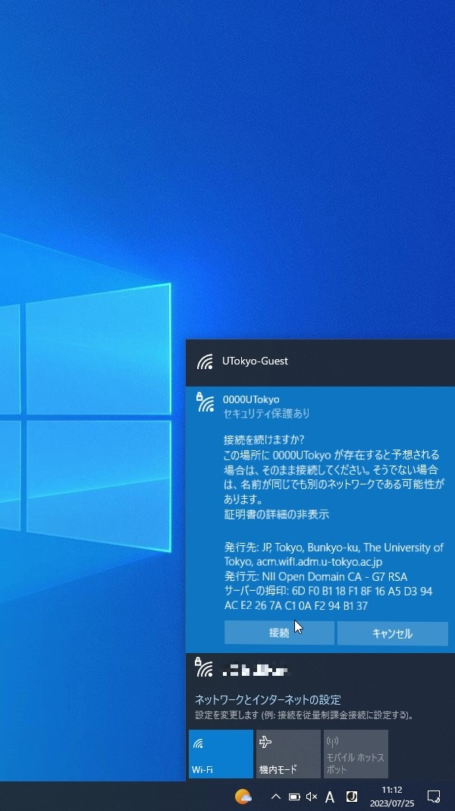

import TroubleConnect from "./_TroubleConnect.mdx"

UTokyo Wi-Fiでは定期的に認証サーバの証明書を更新します．更新の作業が行われている間や，作業後に初めてUTokyo Wi-Fiに接続する際には，注意点があるため，このページで詳しくお知らせします．

なお，作業のタイミングは，[「障害・メンテナンス情報」ページ](https://univtokyo.sharepoint.com/sites/utokyoaccount/SitePages/service-status.aspx)等でお知らせします．

## 更新作業中
{:#in_progress}

「UTokyo Wi-Fiアカウントメニュー」へ正常にアクセスできない可能性があります．時間をおいて試してください．

## 更新作業後
{:#after}

* 接続しようとすると，証明書を信頼するかどうか尋ねる画面が表示される場合があります．証明書が正しいものであるか確認するため，表示された証明書の指紋について，「[接続の詳細な設定](/utokyo_wifi/#connect-configuration)」に掲載されている指紋と比較してください．両者が一致していれば，証明書を信頼してください．
    * 「[接続の詳細な設定](/utokyo_wifi/#connect-configuration)」には，SHA-1とSHA-256の2種類の指紋が掲載されていますが，どちらかが一致すれば結構です．
* なお，OSや機器等により，表示される画面やふるまいが多少異なります．
    {:.medium.center.border}
    <figure class="gallery">{:.medium.center.border}{:.medium.center.border}</figure>

## うまくいかないときは
{:#trouble-connect}

{/* ### Androidで
eduroamCATも試してみてください．0000UTokyoのWi-Fi設定情報画面で，「CA証明書」の項目を「システム証明書を使用」，「証明書のオンライン検証」の項目を「検証しない」に変更するとうまくいくこともあるようです．*/}

<TroubleConnect />

