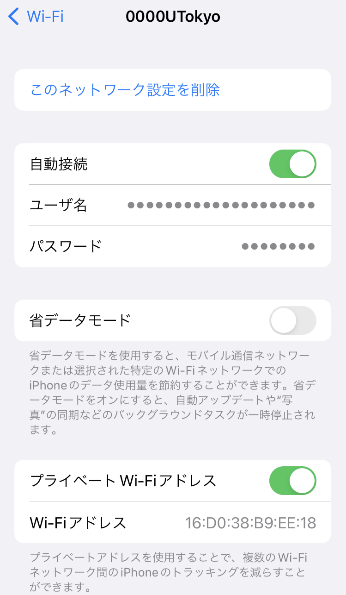
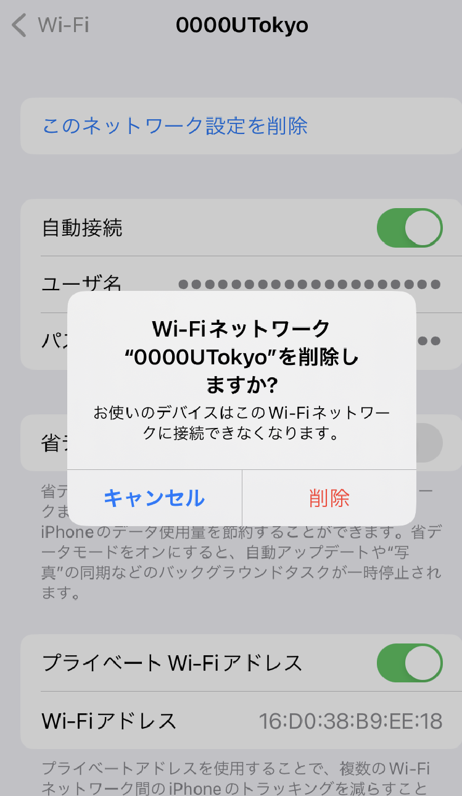
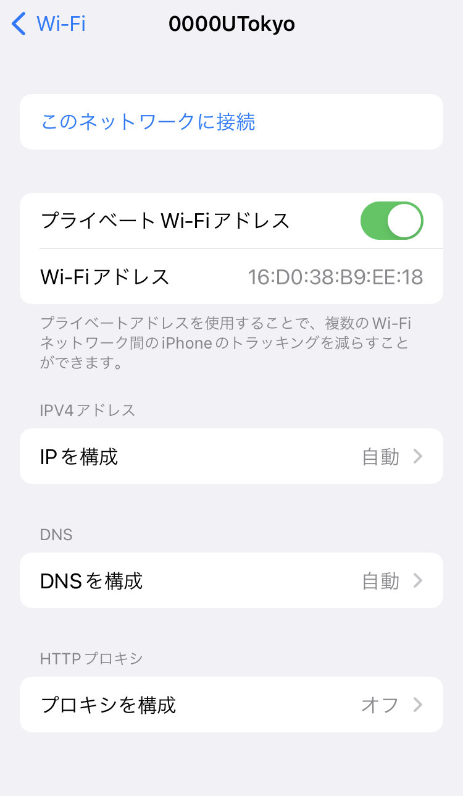
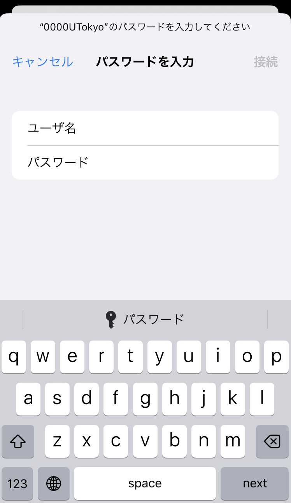
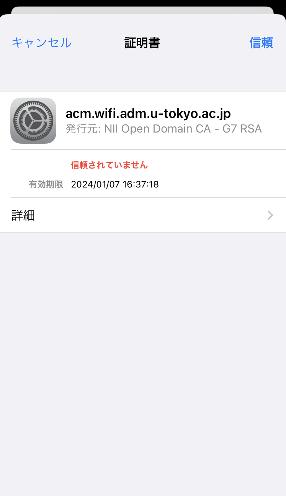

import Intro from "./Intro.astro"
import IssueAccount from "./_IssueAccount.mdx"
import SelectSsid from "./_SelectSsid.astro"
import DeleteProfile from "./_DeleteProfile.astro"
import TroubleConnect from "./_TroubleConnect.mdx"

<Intro kindOfTerminal="iPhoneやiPad" confirmedTerminal="（iOS 16.5が搭載されたiPhoneSE（第2世代））"/>

## 準備：UTokyo Wi-Fiアカウントの発行を申請する
{:#issue-account}
<IssueAccount />

## iPhoneやiPadでの手順
{:#procedure}
### 手順1：端末の「設定」アプリでWi-Fi機能をオンにする
{:#turn-on}
設定アプリで「Wi-Fi」という設定項目を選択し，Wi-Fi機能のトグルスイッチをオンにしてください．

### 手順2：SSIDの一覧から接続先のSSIDを選択する
{:#select-ssid}
<SelectSsid  userIdField="ユーザ名"/>

### 手順3：既存のWi-Fiの設定情報を削除する
{:#delete-profile}
<DeleteProfile  userIdField="ユーザ名"/>
手順2で見つけたSSIDをタップし，「このネットワーク設定を削除」を選択してください．「Wi‑Fiネットワーク“0000UTokyo”を削除しますか?」という画面が出てくるので，「削除」を選択してください．
<figure class="gallery">{:.medium.center.border}{:.medium.center.border}</figure>

### 手順4：必要な設定情報を入力し接続する
{:#create-profile}
SSIDの一覧の中から，`0000UTokyo`というSSIDを再度選択してください．
SSIDを選択すると，Wi-Fiの設定情報を入力する画面が表示されます．下記の説明に沿って，必要な設定情報を各欄に入力してください．下で説明されているのに入力画面に表示されなかった項目は，特に設定しなくてかまいません．設定情報を入力したら，接続ボタンを選択してください．

| 設定欄の名称      | 設定内容     |
| :-----------: | :------------------- |
| ユーザ名       | UTokyo Wi-FiのユーザーID（`u`から始まり`@wifi.u-tokyo.ac.jp`で終わるもの）を入力してください |
| パスワード       | UTokyo Wi-Fiのパスワードを入力してください      |

<figure class="gallery">{:.medium.center.border}{:.medium.center.border}</figure>

#### 補足
{:#create-profile-notes}
* 「ユーザ名」欄と「パスワード」欄には、UTokyo Wi-FiアカウントのユーザーIDとパスワードをそれぞれ入力してください．UTokyo Accountの共通ID・パスワードではありません．ユーザーIDとパスワードは，「**準備**」の手順で受け取った通知メールから確認できるほか，申請直後であればアカウントメニューの申請完了画面にも表示されています．
* 上の表に掲げた以外の設定項目は，必要に応じて設定してください．特にお好みがなければ，初期設定のままでかまいません．
* 接続操作の途中で，証明書を信頼するかどうか尋ねる画面が表示される場合があります．証明書が正しいものであるか確認するため，表示された証明書の指紋について，「[接続の詳細な設定](/utokyo_wifi/#connect-configuration)」に掲載されている指紋と比較してください．両者が一致していれば，証明書を信頼してください．
    * なお，「[接続の詳細な設定](/utokyo_wifi/#connect-configuration)」には，SHA-1とSHA-256の2種類の指紋が掲載されていますが，どちらかが一致すれば結構です．{:.medium.center.border}

## うまくいかないときは
{:#trouble-connect}
<TroubleConnect />