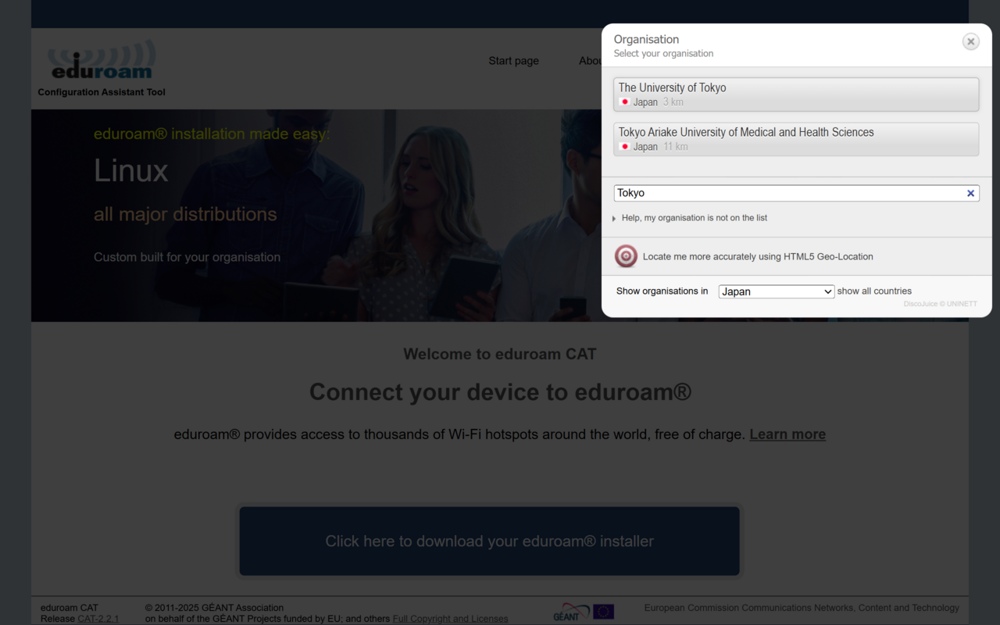
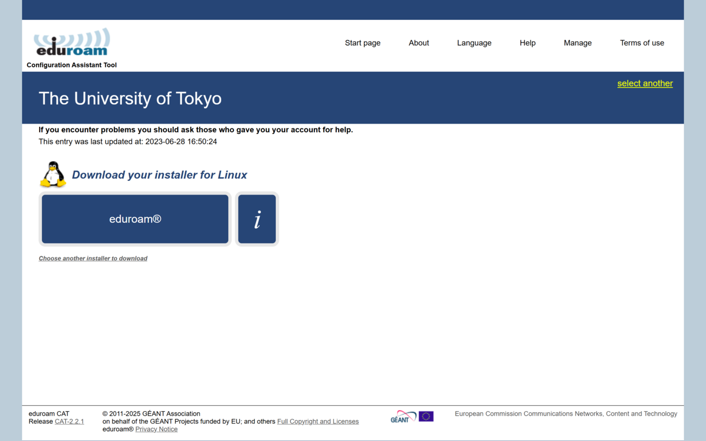
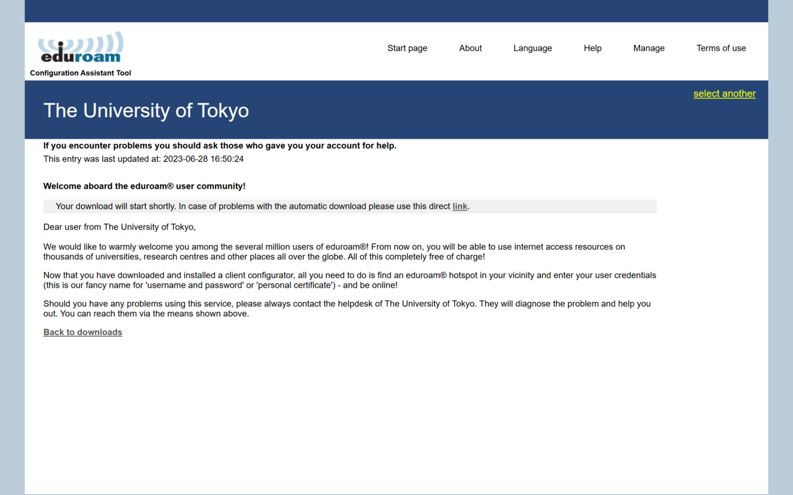
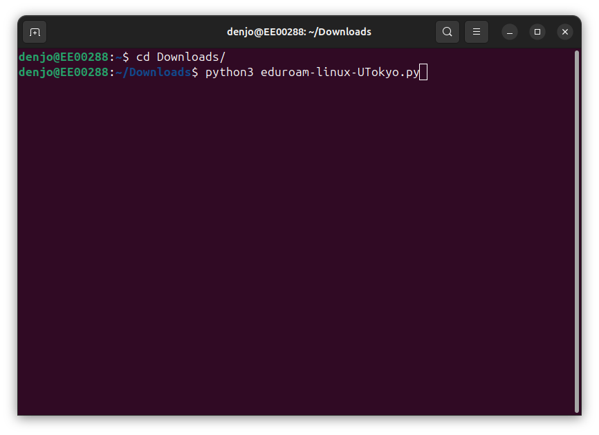
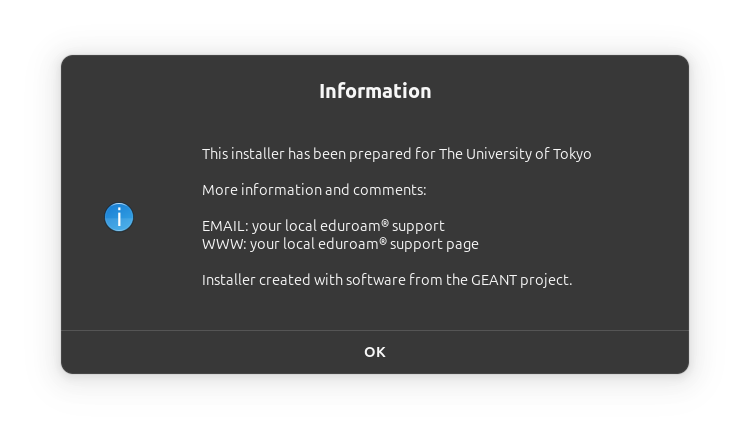
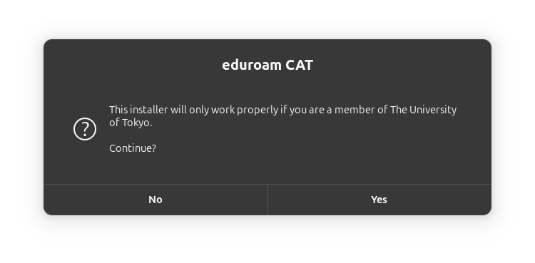
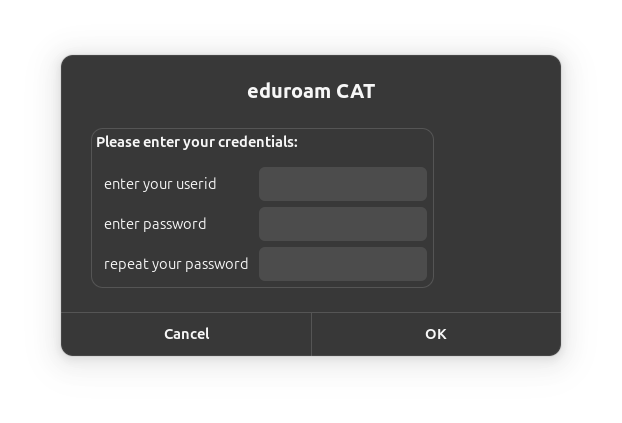
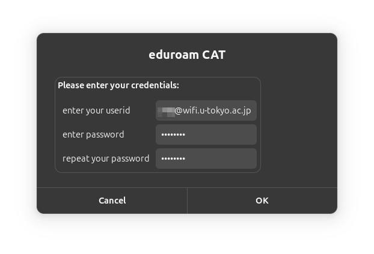
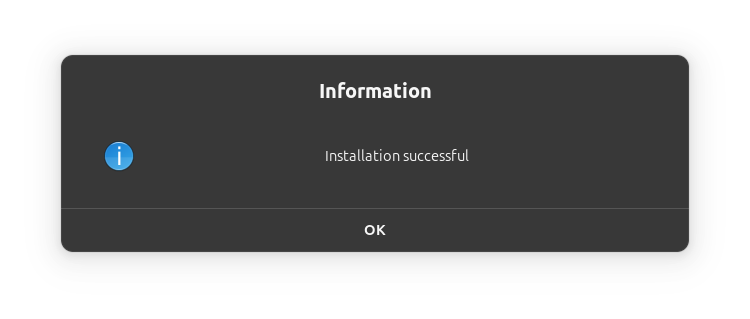
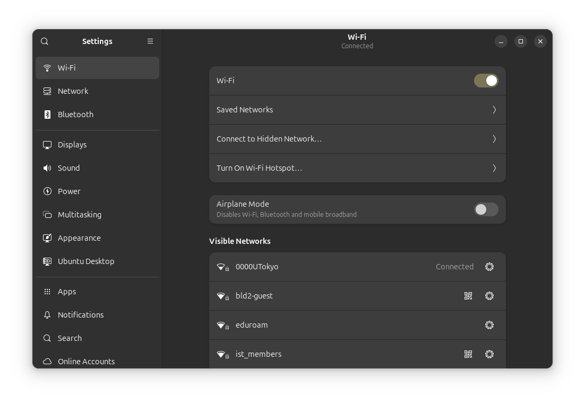

Linuxでeduroam CATというツールを用いて，UTokyo Wi-Fiおよびeduroamに接続するための設定手順を説明します．

UTokyo Wi-Fiおよびeduroamは，ユーザー認証が必要であるためLinuxでは設定が複雑です．eduroam CATを使うことで，設定が半自動的に行われ簡単に接続できるようになります．

なお，UTokyo Wi-Fiの利用に関する全般的な説明は，[UTokyo Wi-Fi全般の説明ページ](/utokyo_wifi/)に記載されていますので，あらかじめそちらも確認してください．

## 前提条件

eduroam CATでは，Pythonスクリプトを用いてNetworkManagerの設定を行います．
NetworkManagerを利用しているLinuxディストリビューションであり，かつ，Python 3がインストールされている必要があります．

紹介する手順の動作やスクリーンショットは，Ubuntu 24.04 LTSで確認しています．

## 事前の準備

実際に接続して利用する前に，UTokyo Wi-Fiアカウントの発行が必要です．アカウントの発行は，UTokyo Wi-Fiを利用する現地（大学の教室など）でなくても行うことができますので，別途通信環境がある場所で行ってください．

初めて接続する場合や，アカウントの再発行が必要な場合は，UTokyo Wi-Fi全般の説明ページの，利用開始までの手順の「[準備編](/utokyo_wifi/#apply)」の説明に沿ってアカウントの発行を申請してください．

発行されたUTokyo Wi-Fiアカウントは，複数の端末で利用可能です．2台目以降の端末をUTokyo Wi-Fiに接続する際も，同じアカウントをご利用いただけます．

## eduroam CATを用いて設定する

### 手順1：eduroam CAT 設定スクリプトのダウンロード

ステップ1およびステップ2は「[東京大学用の設定ファイル配布ページ](https://cat.eduroam.org/?idp=7323)」にたどり着くための手順です．上記リンクを直接開ける場合は，ステップ3から始めてください．

1. ブラウザで[eduroam CAT のウェブサイト (cat.eduroam.org)](https://cat.eduroam.org/)にアクセスし，画面中央のダウンロードボタンを押します．

   {:.medium}

2. 所属機関を検索する画面が表示されます．検索窓に「Tokyo」などと入力し，リストから「The University of Tokyo」を選択します．

   {:.medium}

3. [東京大学用の設定ファイル配布ページ](https://cat.eduroam.org/?idp=7323)に移動します．お使いのOSがLinuxとして自動判別されますので，表示されているダウンロードボタンを押して設定スクリプトを取得します．もしOSが正しく判別されない場合は，「Choose another installer to download」と書かれたリンクを押し，Linux用の設定スクリプトを選択してください．

   {:.medium}

4. 自動でダウンロードが開始されます．`eduroam-linux-UTokyo.py`ファイルが端末の「ダウンロード」フォルダ等に保存されたことを確認してください．

   {:.medium}


### 手順2：設定スクリプトの実行

1. ターミナルを起動します．
2. 設定スクリプトをダウンロードしたディレクトリに移動し，`python3`コマンドでスクリプトを実行します．
   ```bash
   cd Downloads/
   python3 eduroam-linux-UTokyo.py
   ```

   {:.medium}

### 手順3：画面の指示に従って認証情報を設定

1. 設定スクリプトの画面が立ち上がります．東京大学向けである旨の案内が表示されるので，「OK」を押して先へ進みます．

   {:.medium}

2. 続いて，利用者が東京大学の構成員であることの確認画面が表示されます．「Yes」を選択して設定を続行します．

   {:.medium}

3. 認証情報の入力フォームが表示されます．

   {:.medium}

4. UTokyo Wi-Fiアカウントの情報を入力し，「OK」を押します．
   * 1段目：UTokyo Wi-FiアカウントのユーザーID（末尾の `@wifi.u-tokyo.ac.jp` まで省略せずに入力してください）
   * 2段目：UTokyo Wi-Fiアカウントのパスワード
   * 3段目：同じパスワードをもう一度入力

   {:.medium}

5. 設定完了のメッセージが表示されたら，「OK」を押してスクリプトを終了します．

   {:.medium}

6. 間違った認証情報を入力したり，アカウントの有効期限が切れて新しいアカウントを発行したりした場合は，もう一度スクリプトを実行して正しい情報を入力してください．既存の設定が上書きされ，誤った情報を修正できます．

## 実際に接続する

キャンパス内のUTokyo Wi-Fiまたはeduroamの電波が届く場所で，ネットワークの設定から`0000UTokyo`もしくは`eduroam`を選択すると，自動的に認証が行われインターネットに接続されます．

{:.medium}

## うまくいかないときは

「[UTokyo Wi-Fiのトラブルシューティング](/utokyo_wifi/trouble_shooting/)」のページを参照してください．
