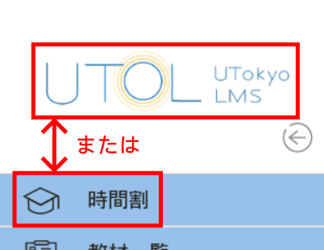
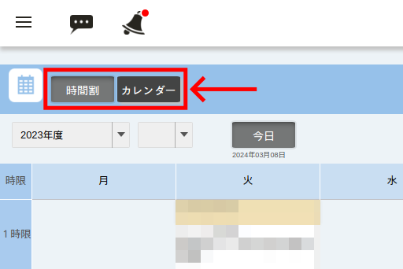
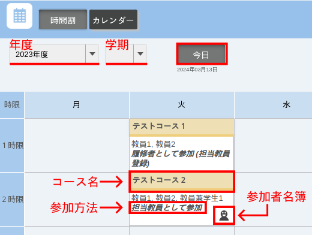
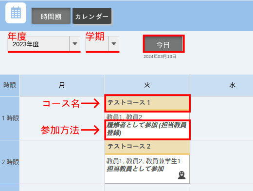
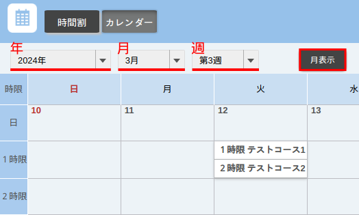

import If from "@components/utils/If.astro"

{/**
  * @typedef {object} Props
  * @property {"lecturer" | "student"} variant
  */}

担当教員，TA，または履修者として登録しているコースは，UTOLにログインした後のトップページで確認できます．

この画面には，左メニュー（画面左上の{:.logo}を押すと左側に表示されるメニュー）のUTOLのロゴか，「時間割」ボタンを押しても移ることができます．

コースは時間割形式またはカレンダーとして表示でき，画面上部のボタンで切り替えられます．

<If cond={props.variant !== "lecturer"}>

なお，コンテンツ利用を履修登録・担当教員登録に限る設定がされているコースは，受講登録していても，コンテンツ利用の条件を満たさなければ表示されません．このため，履修登録期限を過ぎたり，設定が変更されたりして条件が変わると，今まで表示されていたコースが表示されなくなることがあります．

コンテンツを利用するための条件については，「[受講登録をする際の注意事項](/utol/students/course_registration/#caution){/*TODO: リンク先確認*/}」を参照してください．

</If>

### 時間割表示
{:#timetable}

<If cond={props.variant === "lecturer"}>

</If>
<If cond={props.variant !== "lecturer"}>

</If>

- 表示する学期
  - 画面上部の「年度」「学期」を切り替えると，前の年度・学期の科目を見られます．
  - 「今日」ボタンを押すと，今学期の時間割が表示されます．
- 授業コマ：コース名を押すとコーストップ（コースの詳細画面）に移ります．
  <ul>
    <li>
      参加方法：担当教員・コース設計者・TA・履修者のどの権限をもっているかと，登録方法が表示されます．
    </li>
    <If cond={props.variant !== "student"}>
      <li>
        {:.logo}（参加者名簿）：教員として登録している場合に表示され，アイコンを押すと参加者名簿をダウンロードできます．
      </li>
    </If>
  </ul>
- 休講・補講・教室変更
    - UTASから連携された休講等の情報が表示されます．
    - UTASからの連携は1日ごとですので，当日の登録や取り消しは反映されません．

### カレンダー表示
{:#calendar}

- 表示する時期
  - 画面上部の「年」「月」「週」を切り替えると，表示する時期を変更できます．
    - 「週」は，週表示にしている場合のみ表示されます．
  - 2023年度Wタームより前のコースは表示されません．
- 週表示・月表示
  - 「週表示」ボタンまたは「月表示」ボタンを押すと，週単位または月単位での表示に切り替えられます．
- 授業コマ：コース名を押すとコーストップに移ります．
  - 休講・補講・教室変更
    - UTASから連携された休講等の情報が表示されます．
    - テキスト部分を押すとUTASの対応する画面に移り，詳細を見ることができます．
    - UTASからの連携は1日ごとですので，当日の登録や取り消しは反映されません．
