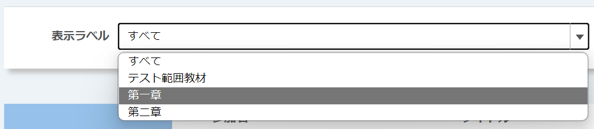
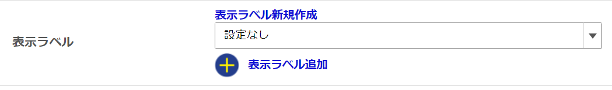

**表示ラベル**：分類用のラベルを付与できます．
- ラベルを付与すると，「コーストップ」画面で以下のようなドロップダウンリストが表示され，履修者・教員の双方がラベル毎にコンテンツを表示できます．
  
- ラベルを付与するには，ドロップダウンリストで付与するラベルを選択してください．
  
  - まだラベルを作成していない場合は「表示ラベル新規作成」を押して，ラベル名を入力してください．
  - 複数のラベルを付与する場合は「表示ラベル追加」を押すと表示される別のドロップダウンリストで選択してください．
