---
title: UTOLで課題機能を利用する（教員・TA向け）
redirect_from:
  - /lms_lecturers/assignments
  - /itc_lms/lecturers/assignments
breadcrumb:
  title: 課題
---

import DisplayLabel from '../_displaylabel/DisplayLabel.mdx';

## 概要

課題機能は，UTOL上で履修者に課題を課し，提出された課題を評価できる機能です．課題には期限日時を設定でき，提出日時も記録されます．また，期限後の提出の可否の設定や，提出物を履修者同士で閲覧できるようにする設定も可能です．

課題には「テキスト直接入力」と「ファイルアップロード」の二つの提出方法があります．

- テキスト直接入力
  - 履修者は，UTOL上でテキストを直接入力して課題を提出します．
  - 授業コメントやリアクションペーパーなど，短い文章の課題に適します．
- ファイルアップロード
  - 履修者は，自身の端末から成果物（PDFファイルなど）をアップロードして課題を提出します．
  - レポートや発表用スライドなど，一定以上の分量・構造をもつ課題，ないしテキスト以外の内容を含む課題に適します．
  - ファイルサイズの上限は100MBです．

以下では，「課題の管理」「課題の提出状況確認」「課題の評価」の三点に分けて説明します．このうち，「課題の提出状況確認」は二通りの確認方法（「すべての課題の提出状況を確認する」「個別の課題の提出状況を確認する」）に分かれます．

なお，担当教員・TA・コース設計者が課題を管理できます．ただし，課題の評価を行えるのは担当教員・TAのみです．

## 課題を管理する

ここでは，課題の管理（登録・編集・削除）の手順を説明します．

### 課題の設定項目
{:#setting-entries}

まず，以下で課題に対して行える設定項目の一覧を示します（二枚の画像に分けて説明します）．

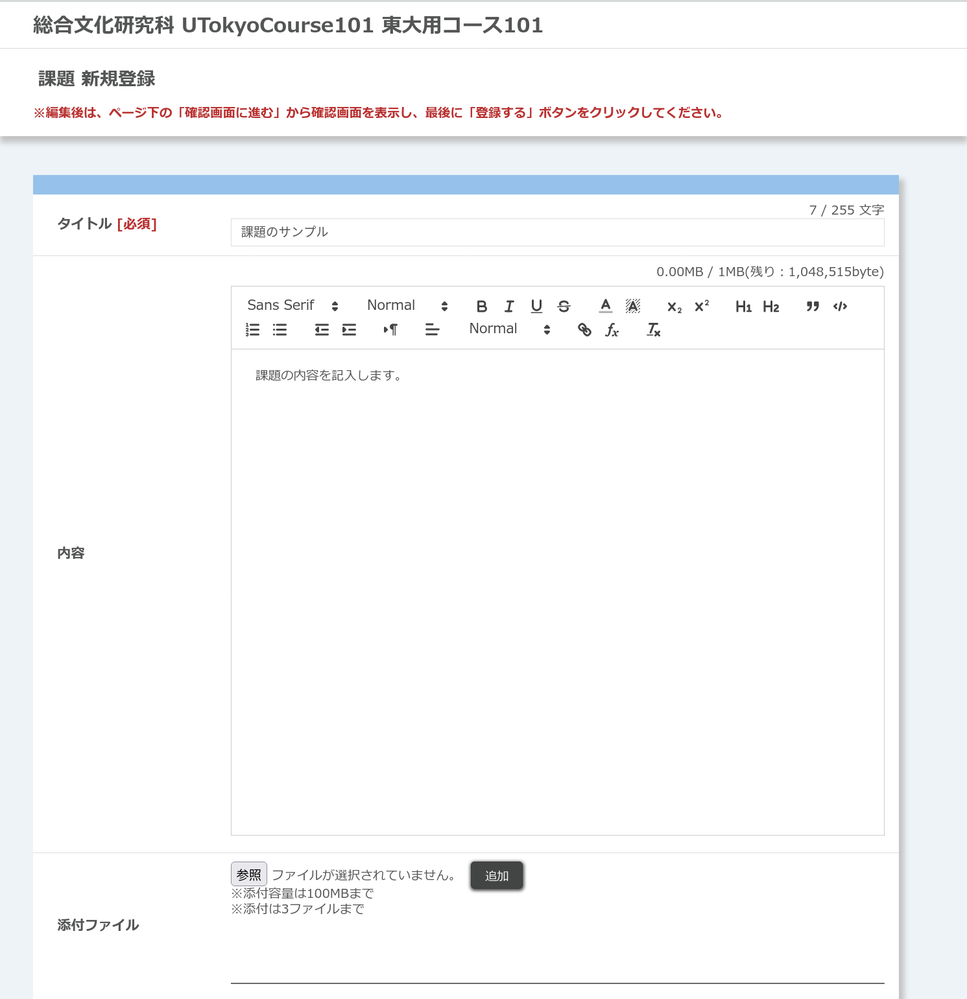{:.center}

- **タイトル**（記入必須）
  - 例：「第1回講義コメント」「期末レポート」
- **内容**
  - 課題の説明を記入してください．
- **添付ファイル**
  - 課題の参考になるファイルなどを添付してください．
  - 最大100MBのファイルを，3つまで添付できます．

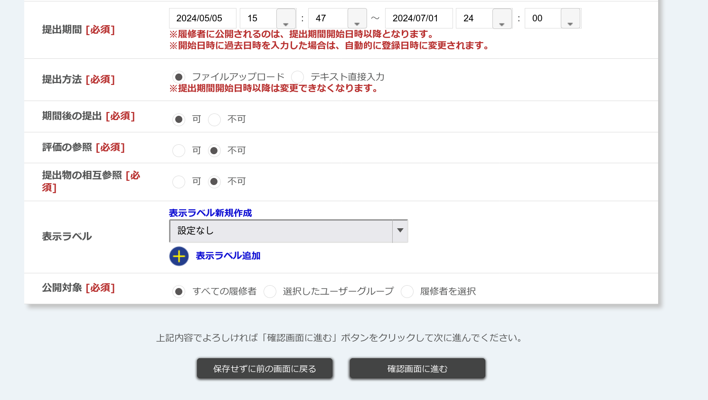{:.center}

- **提出期間**（設定必須）
  - 例：授業開始時から次回授業の開始時まで
  - いますぐ提出を開始させてよい場合，提出開始時間の設定は変更せず，そのままにしてください．
- **提出方法**（選択必須）
  - 課題の提出方法（「ファイルアップロード」，「テキスト直接入力」）を選択してください．
- **期間後の提出**（選択必須）
  - 履修者が提出期限後に課題を提出できるかどうかを指定してください．
  - 提出期限前後にUTOLに負荷が集中し，提出に失敗するなどのトラブルの可能性もあるため，「可」に設定したほうが安全です．
  - 期間内に提出されたかどうかは後から確認できるので，期間外提出の場合には受理しつつ減点する，などの対応を取ることもできます．
- **評価の参照**
  - 課題につけた評価を，履修者が閲覧できるかどうかを指定してください．
    - 関連：
      - [課題を評価する](#evaluate)
- **提出物の相互参照**
  - 「可」にすると，履修者同士が互いの提出物を参照できるようになります．
  - たとえば履修者が授業内で発表を行う場合，課題として提出されたレジュメやスライドを他の履修者が参照できたほうが，スムーズに授業を進められることもあります．
- <DisplayLabel />
  - 関連：
    - [UTOLでコース設定を行う（教員・TA向け） - ラベル](/utol/lecturers/settings/#label)
- **公開対象**
  - 課題の公開対象を選択してください．以下の三種類から選択できます．
    - 「すべての履修者」
    - 「選択したユーザグループ」
      - 事前に作成したユーザグループを対象に公開できます．
      - 関連：
        - [UTOLでユーザグループ機能を利用する（教員・TA向け）](/utol/lecturers/settings/user_groups/)
      - グループ名を押すと，グループに所属する履修者を確認できます．
    - 「履修者を選択」
      - 特定の履修者を選んで公開できます．
      - 履修者一覧が表示されるので，公開したい履修者にチェックを入れてください．

### 課題を登録する
{:#register}

1. 「コーストップ」画面を開き，「課題」欄の左下にある {:.icon} ボタンを押してください．
   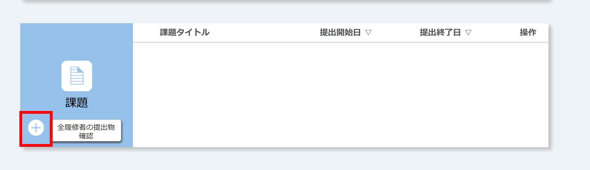{:.center}
2. 「課題 新規登録」のページが開くので，上記の[課題の設定項目](#setting-entries)を記入してください．
3. 記入を終えたら，「確認画面に進む」ボタンを押してください．
4. 「課題 登録内容確認」のページが開くので，内容を確認してください．
   - 「提出期間」「提出方法」「期間後の提出」の設定などは特に注意が必要です．
   - 「提出画面プレビュー」ボタンを押すと，履修者が課題を閲覧した際にどのように表示されるかを確認できます．
     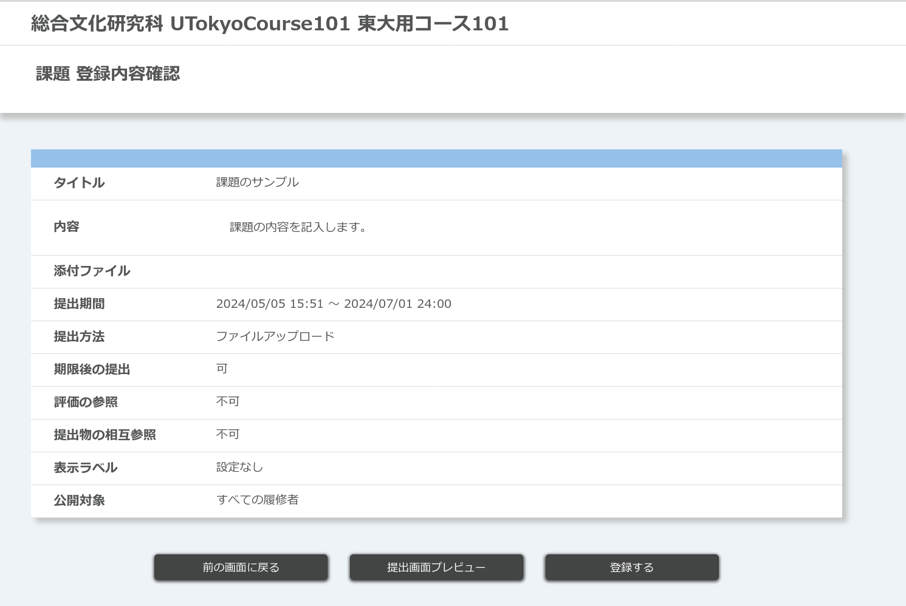{:.center}
5. 確認を終えたら，「登録する」ボタンを押してください．

### 課題を編集する

1. コーストップを開き，「課題」欄のうち，編集したい課題名を押してください．
   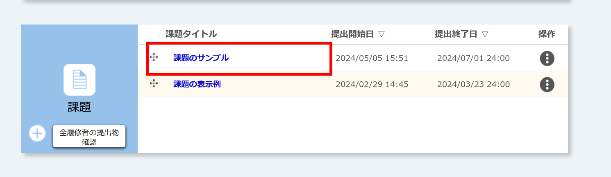{:.center}
2. 編集画面が開くので，[課題の登録手順](#register)と同様に内容を編集してください．

### 課題を削除する

1. コーストップを開き，「課題」欄のうち，削除したい課題名の右，「操作」の列にある {:.icon} ボタンを押してください．
   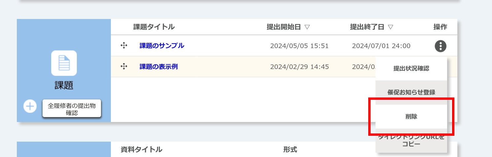{:.center}
2. 「削除」ボタンを押してください．
3. 「（課題名）を削除して宜しいですか？」と確認されるので，「削除」を押してください．

## すべての課題の提出状況を確認する
{:#submission-status-all}

ここでは，授業全体を通じた，すべての課題の提出状況を確認する手順を説明します．

1. コーストップを開き，「課題」の左下にある「全履修者の提出物確認」ボタンを押してください．
   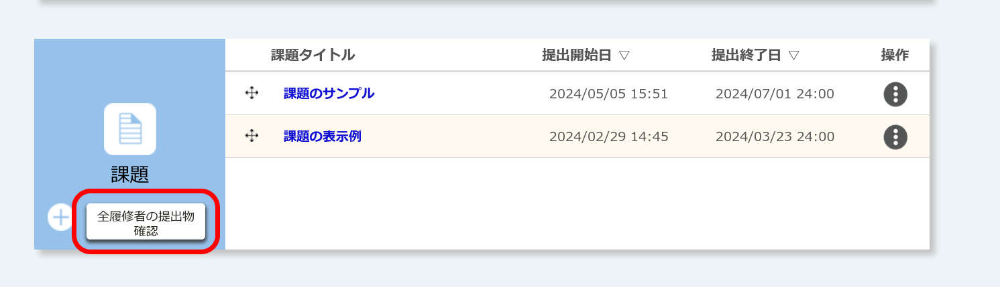{:.center}
2. 「課題 全体提出状況確認」の画面が開くので，以下の二通りの確認方法に応じて操作してください．
   - [すべての履修者について確認する](#submission-status-all-user)
   - [履修者ごとに確認する](#submission-status-per-user)

### すべての履修者について確認する
{:#submission-status-all-user}

「課題 全体提出状況確認」では，すべての課題の提出状況を，すべての履修者について示した一覧表が表示されます（以下，「一覧表」と呼称します）．

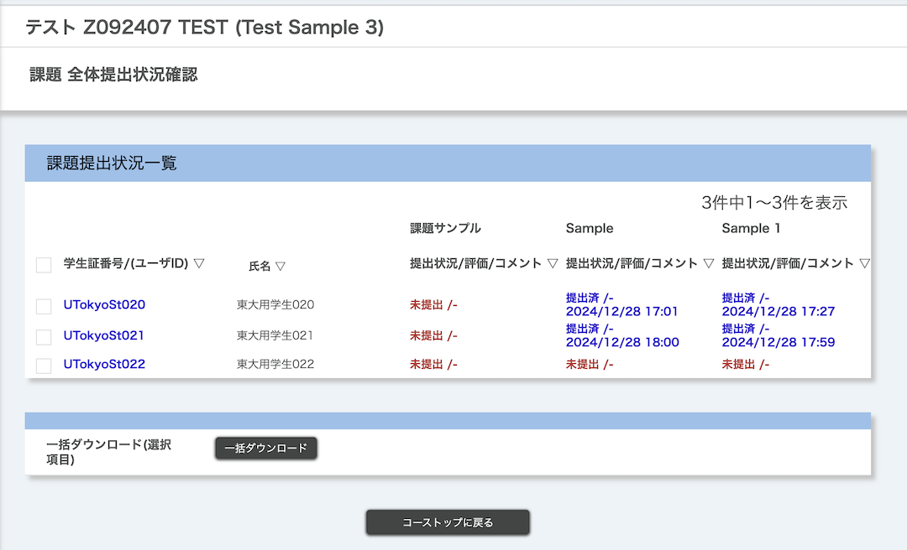{:.center}

#### 並べ替えて表示する

一覧表の列の見出し（「学生証番号/(ユーザID)」，「氏名」など）を押すと，それぞれの項目ごとに昇順・降順が切り替わります．

#### 提出状況をダウンロードする

提出状況をExcelファイル形式でダウンロードすることもできます（なお，ファイルにはパスワードの設定が必須です）．

1. 一覧表のうち，提出状況を知りたい履修者のチェックボックスを選択してください．
   - 全員選択：「学生証番号/(ユーザID)」という見出しの左にあるチェックボックス
   - 個別の履修者を選択：当該履修者の学生証番号の左にあるチェックボックス
2. 「一括ダウンロード」ボタンを押してください．
3. Excelファイルのパスワードを設定するよう求められるので，任意のパスワードを決めて入力し，もう一度「ダウンロード」ボタンを押してください．
4. Excelファイル（`.xlsx` 形式）を含むZIPファイル（`.zip` 形式）がダウンロードされます．

#### 課題の評価画面へ移動する
{:#go-to-evaluate-1}

「提出状況/評価」の列にて，それぞれの提出物（青字）を押すと，[UTOL上で課題を評価する](#evaluate-on-utol)画面へ遷移します．

### 履修者ごとに確認する
{:#submission-status-per-user}

さらに絞り込んで，すべての課題の提出状況を，履修者ごとに確認することもできます．

1. 「課題 全体提出状況確認」の画面で，対象の履修者の「学生証番号/(ユーザID)」（青文字）を押してください．
2. 「課題 提出状況確認」の画面が開き，履修者ごとの全課題の提出状況が表示されます．

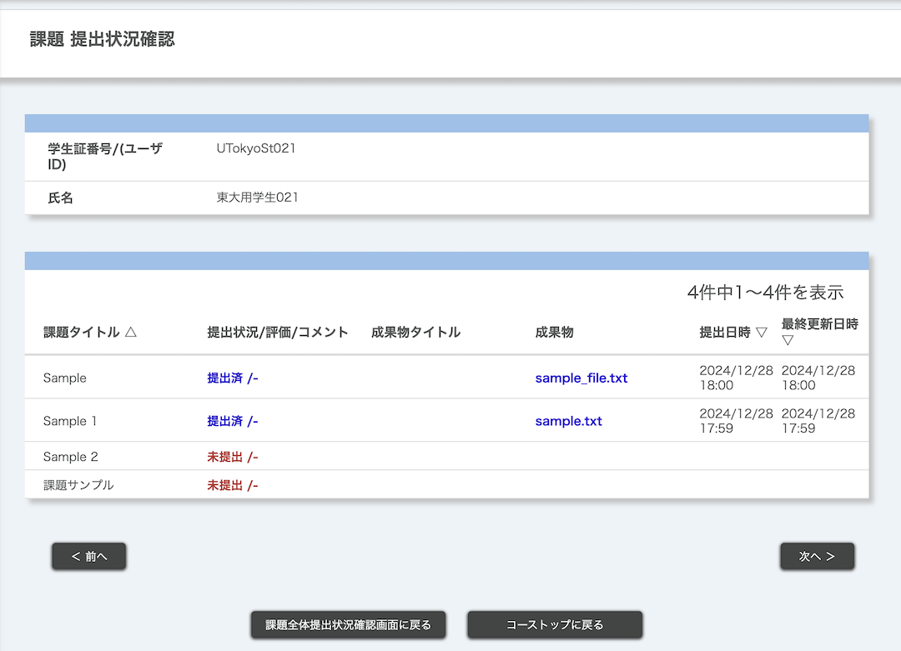{:.center}

#### 履修者間を移動する

画面左下の「前へ」ボタン，または右下の「次へ」ボタンを押すと，前／次の履修者に移動できます．

#### 課題の評価画面へ移動する
{:#go-to-evaluate-2}

「提出状況/評価」の列にて，それぞれの提出物（青字）を押すと，[UTOL上で課題を評価する](#evaluate-on-utol)画面へ遷移します．

## 個別の課題の提出状況を確認する
{:#submission-status-per-assignment}

ここでは，個別の課題について，全履修者の提出状況を確認する手順を説明します．

1. コーストップを開き，「課題」の欄のうち，確認したい課題名の右，「操作」の列にある {:.icon} ボタンを押してください．
   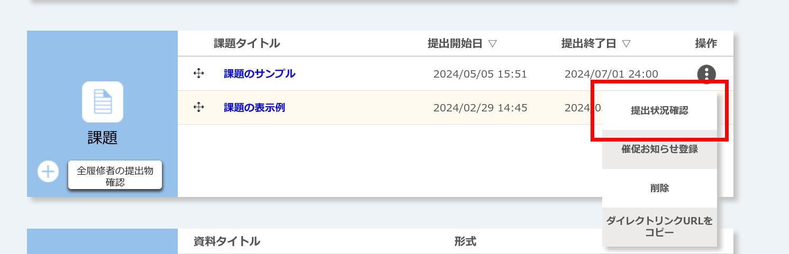{:.center}
2. 「提出状況確認」を選択してください．
3. 「課題 提出状況確認」の画面が開き，全員の提出状況の一覧が表示されます．

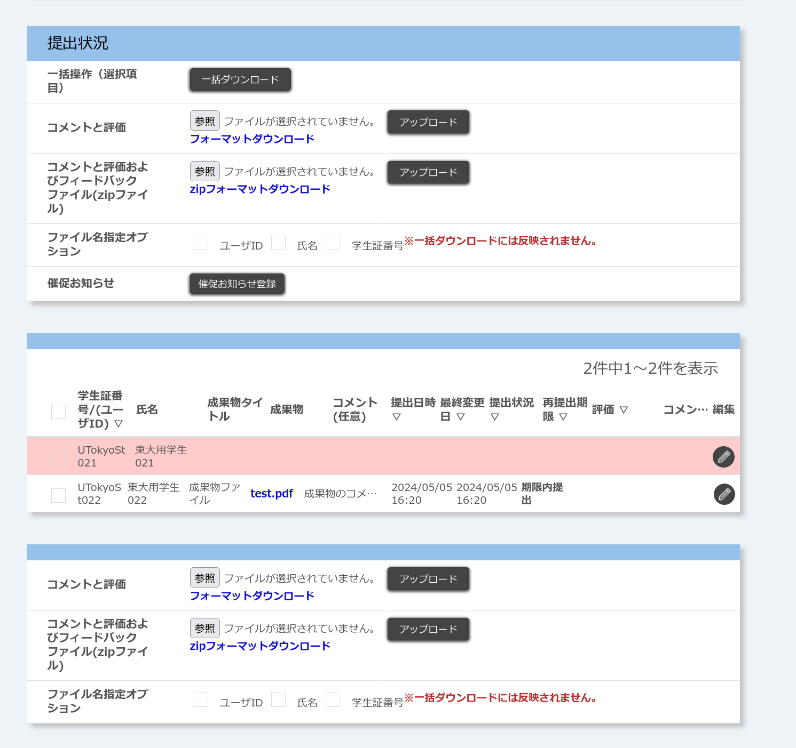{:.center}

### 提出状況をダウンロードする

提出状況をExcelファイル形式でダウンロードすることもできます（なお，ファイルにはパスワードの設定が必須です）．

1. 一覧表のうち，提出状況を知りたい履修者のチェックボックスを選択してください．
   - 全員選択：「学生証番号/(ユーザID)」という見出しの左にあるチェックボックス
   - 個別の履修者を選択：当該履修者の学生証番号の左にあるチェックボックス
2. 「提出状況」の欄のうち，「一括操作（選択項目）」の「一括ダウンロード」ボタンを押してください．
3. Excelファイルのパスワードを設定するよう求められるので，任意のパスワードを決めて入力し，もう一度「ダウンロード」ボタンを押してください．
4. Excelファイル（`.xlsx` 形式）を含むZIPファイル（`.zip` 形式）がダウンロードされます．

### 課題の評価画面へ移動する
{:#go-to-evaluate-3}

一覧表のうち，評価したい履修者の行の右端，「編集」の列にある {:.icon} ボタンを押すと，[UTOL上で課題を評価する](#evaluate-on-utol)画面へ遷移します．

## 課題を評価する
{:#evaluate}

ここでは，課題を評価する手順を説明します．

評価には以下の二種類があり，いずれの要素も任意です．

- 「評価」
  - 課題に対する簡潔な評価です．
  - テキスト形式で，最大255文字まで記載できます．
- 「フィードバックコメント」
  - 「コメント」および「フィードバックファイル」から構成されます．
  - 「コメント」
    - 課題に対する詳細なフィードバックです．
    - テキスト形式で，最大1300文字まで記載できます．
  - 「フィードバックファイル」
    - テキスト以外の形式でのフィードバックです．
      - 例：指摘点をまとめたPDFファイル

さらに，評価を行う方法として，「UTOL上で評価する」または「フォーマットをダウンロードして評価する」の二通りがあります．両者には以下のような違いがあります．

- [UTOL上で評価する](#evaluate-on-utol)
  - UTOL上の操作によって評価作業を行います．
  - ブラウザ上ですべての作業が完結するため，簡単です．ただし，履修者一人ごとに評価を行う必要があります．
- [フォーマットをダウンロードして評価する](#evaluate-with-format)
  - Excelファイル（`.xlsx` 形式）またはZIPファイル（`.zip` 形式）のフォーマットファイルをダウンロードし，そこに評価を記入します．記入後，ファイルをアップロードするとUTOLがそれを読み取り，評価が反映されます．
  - 全履修者を一括で評価できるため，履修者が多い場合などに便利です．ただし，作業に慣れが必要です．
  - なお，ダウンロードしたフォーマットファイルにはパスワードの設定が必須となります．

### UTOL上で評価する
{:#evaluate-on-utol}

1. 以下のいずれかの方法で，課題の評価画面に移動してください．
   - 「[すべての課題の提出状況を確認する](#submission-status-all)」のうち
     - [「課題 全体提出状況確認」画面（すべての履修者について確認）から遷移する](#go-to-evaluate-1)
     - [「課題 提出状況確認」画面（履修者ごとに確認）から遷移する](#go-to-evaluate-2)
   - 「[個別の課題の提出状況を確認する](#submission-status-per-assignment)」のうち
     - [「課題 提出状況確認」画面から遷移する](#go-to-evaluate-3)
2. 「課題 フィードバック登録/編集」の画面が開くので，「評価」「フィードバックコメント」「フィードバックファイル」を追加し，「登録する」を押してください．
   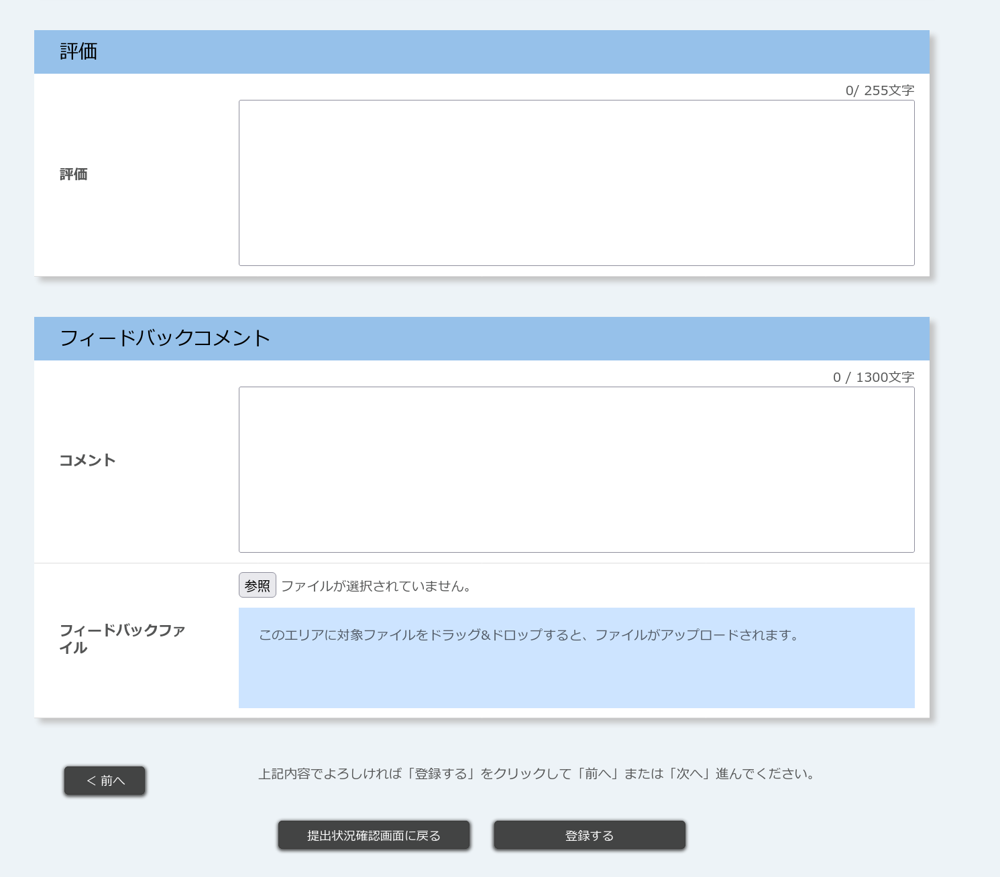{:.center}
3. 画面左下の「前へ」ボタン，または右下の「次へ」ボタンを押すと，前／次の履修者の評価に移れます．

### フォーマットをダウンロードして評価する
{:#evaluate-with-format}

1. [「個別の課題の提出状況を確認する」画面](#submission-status-per-assignment)を開きます．
2. 「提出状況」の欄からフォーマットをダウンロードしてください．「フィードバックファイル」の添付の有無に応じて，ダウンロードするファイルが異なります．

- 「フィードバックファイル」が不要の場合（「評価」と「フィードバックコメント」いずれもテキストのみでよい場合）
  1. 「コメントと評価」の行にある，「フォーマットダウンロード」ボタン（青字）を押してください．
  2. Excelファイルのパスワードを設定するよう求められるので，任意のパスワードを決めて入力し，もう一度「ダウンロード」ボタンを押してください．
  3. Excelファイル（`.xlsx` 形式）のフォーマットがダウンロードされます．
- 「フィードバックファイル」を添付したい場合
  1. 「コメントと評価およびフィードバックファイル(zipファイル)」の行にある，「zipフォーマットダウンロード」ボタン（青字）を押してください．
  2. ZIPファイルのパスワードを設定するよう求められるので，任意のパスワードを決めて入力し，もう一度「ダウンロード」ボタンを押してください．
  3. ZIPファイル（`.zip` 形式）のフォーマットがダウンロードされます．

ダウンロードしたフォーマットの形式に応じて，以下の手順で評価を記入・アップロードしてください．

#### Excelファイルの場合

1. ダウンロードしたExcelファイル（`.xlsx` 形式）を開いてください．
2. 「評価」「コメント」の項目を記入し，保存してください．
   - このとき，ファイル名は変更しないでください．
3. [「個別の課題の提出状況を確認する」画面](#submission-status-per-assignment)に戻ってください．
4. 「提出状況」の欄のうち，「コメントと評価」の行にある「参照」ボタンを押し，先ほど記入したExcelファイルを選択してください．
5. 「アップロード」ボタンを押してください．

#### ZIPファイルの場合

1. ダウンロードしたZIPファイル（`.zip` 形式）を解凍し，解凍先のフォルダ内にあるExcelファイル（`.xlsx` 形式）を開いてください．
2. 「評価」「コメント」の項目を記入し，保存してください．
   - このとき，ファイル名は変更しないでください．
3. フィードバックファイルを，解凍先のフォルダ内にある「フィードバック」フォルダの中に入れ，そのファイル名を「ファイル」の欄に記入してください．
   - 例：履修者Aへのフィードバックファイルが 「`フィードバック_A.pdf`」だった場合，「`フィードバック_A.pdf`」を「フィードバック」フォルダに入れ，履修者Aの行の「ファイル」欄に「`フィードバック_A.pdf`」と記入
4. すべての記入を終えたら，お使いのOSのファイルマネージャ（Windowsであれば「エクスプローラー」，Macであれば「Finder」）を開き，解凍先のフォルダ内にあるすべてのファイル・フォルダを選択してください．
5. 選択したファイルを再び圧縮し，ZIPファイルを作成してください．
   - 解凍・圧縮にあたっては，トラブルを避けるため，OSのファイルマネージャ付属の標準ツールを使うことをおすすめします．
6. [「個別の課題の提出状況を確認する」画面](#submission-status-per-assignment)に戻ってください．
7. 「提出状況」の欄のうち，「コメントと評価およびフィードバックファイル(zipファイル)」の行にある「参照」ボタンを押し，先ほど圧縮したZIPファイルを選択してください．
8. 「アップロード」ボタンを押してください．

## 参考情報

- [UTOLでコース設定を行う（教員・TA向け） - ラベル](/utol/lecturers/settings/#label)
- [UTOLでユーザグループ機能を利用する（教員・TA向け）](/utol/lecturers/settings/user_groups/)
