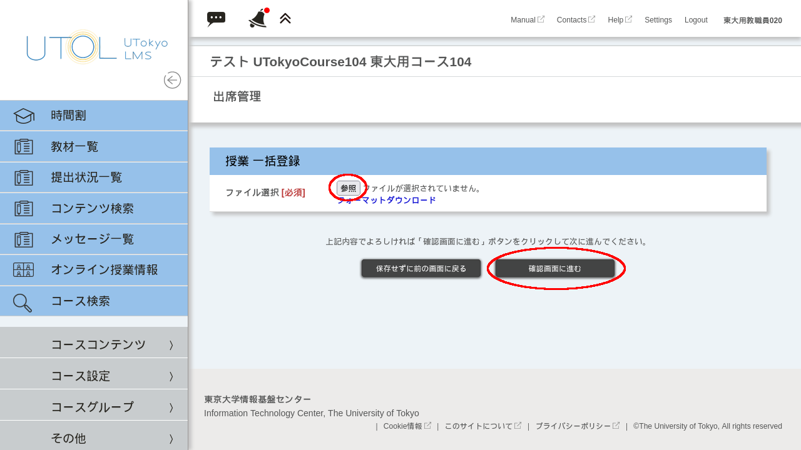
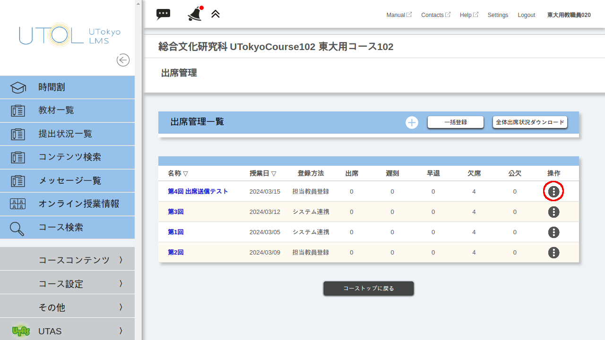

## はじめに
UTOLには，履修者が授業に出席したことを記録するための出席管理機能があります．

UTOLの出席管理機能は，各回の授業ついて設定を行ってから，履修者にワンタイムパスワードを送信させたり，担当教員が出席状況を登録したりすることで利用できます。

このページでは，以下の操作を行う方法についてそれぞれ解説します．
* [出席登録の準備をする](#prepare-attendance)
* [出席登録を行う](#register-attendance)
* [出席状況を確認・変更する](#check-attendance)

### 注意事項
* 講義内容の理解度も確かめたい場合には，[テスト機能](/utol/lecturers/quizzes/)を利用することを検討してください．
* 一部の部局では，小テストや出席点を成績評価に反映させることを避けるよう教員に案内しているため，事前に部局の方針を確認してください．
* ワンタイムパスワードを使って学生に出席送信させる場合には，特有の注意事項があります．詳しくは[学生にワンタイムパスワードで出席送信をさせる > 注意事項](#notes-otp)を参照してください．

## 出席登録の準備をする
{:#prepare-attendance}
UTOLの出席機能を利用するには，事前に各授業回の「出席管理」を設定する必要があります．「出席管理」の設定は，以下のいずれかの方法で行えます．

* (a)「授業コマ」に連動して自動登録される出席管理の設定を変更する．
    1. [(a-1) 自動登録された出席管理を履修者の画面に表示させる．](#set-auto-attendance)
    2. [(a-2) 各回の出席管理を手動で設定変更する．](#set-each-attendance-a)
* [(b) 各回の出席管理を手動で追加する．](#set-each-attendance-b)
* [(c) 出席管理を一括設定する．](#set-bulk-attendance)

複数看板科目の場合，看板となっている科目ごとに出席管理が自動登録されるため，(b)または(c)の方法で出席管理を設定してください．

以下，それぞれの手順について説明します．

### 授業コマ機能から自動で登録された出席管理を編集する
#### 自動登録された出席管理を履修者の画面に表示させる
{:#set-auto-attendance}

初期状態では，自動登録された出席管理は履修者に表示されません．

下記の手順で設定を行うと，出席送信を行う授業日や，出席送信できる時間帯，送信可能な時間帯のうちどこからが遅刻になるか，が履修者に表示されるようになります．

1. コース画面で画面左上の{:.icon}を押して，メニューを表示させてください．
2. メニューから「コース設定 ∨」を展開し，「コース設定」を押してください．
  
    
3. コース設定画面で，「授業コマから自動登録された出席情報を履修者に表示する」の項目にチェックを付けてください．
  
    
4. 「確認画面に進む」ボタンを押し，表示された確認画面で「登録する」を押してください．
なお，授業コマ機能を介さずに手動で登録した出席管理は，この設定にかかわらず履修者の画面に表示されます．

#### 各回の出席管理を手動で設定変更する
{:#set-each-attendance-a}
この項の手順は[出席管理を手動設定する > 各回の出席管理を手動で追加する](#set-each-attendance-b)と同様です．

各回の出席管理の追加・設定確認・設定変更は以下の手順で行えます．
1. コース画面で画面左上の{:.icon}を押して，メニューを表示させてください．
2. メニューから「コースコンテンツ ∨」を展開し，「出席管理」を押してください．
  
    
3. 「出席管理」の画面が表示されます．出席管理を追加する場合には「+」を，設定変更する場合には「名称」列のリンクを押してください．
  
    
4. 出席管理の設定を入力してください．
    * 「名称」は担当教員が集計を行う際に表示される名称です．日付等を入力すると区別がしやすくなります．
    * 「説明」は空のままで問題ありません．
    * 「授業日」にはその授業を行う日を入力してください．
    * 「学生による登録」は「登録可」としないと学生がワンタイムパスワードを入力することができません．「登録不可」はカードリーダーやその他サービスなど，UTOLの出席送信機能以外で取った出席情報を教員が登録する際に利用してください．
    * 「送信可能日時」には，学生がUTOL上で出席送信が可能な時間の範囲を，遅刻扱いになる範囲も含めて入力してください．「送信可能日時」を過ぎると遅刻扱いとして送信することもできなくなります．録画の視聴を出席として扱う場合には，送信可能日時の終了時刻を一週間後などに設定することや，代わりに課題機能やテスト機能を使うことを検討してください．
    * 「遅刻時間設定」には，「送信可能日時」の範囲内で「遅刻扱い」とする時刻を入力してください．遅刻となる境界の時刻は履修者に表示されます．
    * 「ワンタイムパスワード」には，その回で学生に入力させるパスワードを入力してください．この欄には各回で異なるパスワードを入力してください．「自動生成」ボタンを押すとパスワードをランダムに生成できます．
  
    

    ※自動登録された出席管理の場合は「名称」「説明」「授業日」「時限」が変更できないことがあります。
5. 最後に，「確認画面へ進む」ボタンを押し，表示された確認画面で「登録する」ボタンを押してください．

### 出席管理を手動設定する
#### 各回の出席管理を手動で追加・設定変更する
{:#set-each-attendance-b}
この項の手順は[授業コマ機能から自動で登録された出席管理を編集する > 各回の出席管理を手動で設定変更する](#set-each-attendance-a)と同様です．

各回の出席管理の追加・設定確認・設定変更は以下の手順で行えます．
1. コース画面で画面左上の{:.icon}を押して，メニューを表示させてください．
2. メニューから「コースコンテンツ ∨」を展開し，「出席管理」を押してください．
  
    
3. 「出席管理」の画面が表示されます．出席管理を追加する場合には「+」を，設定変更する場合には「名称」列のリンクを押してください．
  
    
4. 出席管理の設定を入力してください．
    * 「名称」は担当教員が集計を行う際に表示される名称です．日付等を入力すると区別がしやすくなります．
    * 「説明」は空のままで問題ありません．
    * 「授業日」にはその授業を行う日を入力してください．
    * 「学生による登録」は「登録可」としないと学生がワンタイムパスワードを入力することができません．「登録不可」はカードリーダーやその他サービスなど，UTOLの出席送信機能以外で取った出席情報を教員が登録する際に利用してください．
    * 「送信可能日時」には，学生がUTOL上で出席送信が可能な時間の範囲を，遅刻扱いになる範囲も含めて入力してください．「送信可能日時」を過ぎると遅刻扱いとして送信することもできなくなります．録画の視聴を出席として扱う場合には，送信可能日時の終了時刻を一週間後などに設定することや，代わりに課題機能やテスト機能を使うことを検討してください．
    * 「遅刻時間設定」には，「送信可能日時」の範囲内で「遅刻扱い」とする時刻を入力してください．遅刻となる境界の時刻は履修者に表示されます．
    * 「ワンタイムパスワード」には，その回で学生に入力させるパスワードを入力してください．この欄には各回で異なるパスワードを入力してください．「自動生成」ボタンを押すとパスワードをランダムに生成できます．
  
    

    ※自動登録された出席管理の場合は「名称」「説明」「授業日」「時限」が変更できないことがあります。
5. 最後に，「確認画面へ進む」ボタンを押し，表示された確認画面で「登録する」ボタンを押してください．

#### 出席管理を一括設定する
{:#set-bulk-attendance}

1. コース画面で画面左上の{:.icon}を押して，メニューを表示させてください． 
2. メニューから「コースコンテンツ ∨」を展開し，「出席管理」を押してください．
  
    
3. 「出席管理」の画面の「一括登録」ボタンを押してください．
  
    
4. 「フォーマットダウンロード」からひな形をダウンロードしてください．
  
    
5. Excelやテキストエディタなどのソフトウェアを用いてダウンロードしたファイルを開き，出席管理の設定を入力してください．各列の内容は「各回の出席管理を手動で追加・設定変更する」の項と同様です．Excelなどの表計算ソフトウェアで入力をする場合は，セルの書式設定を「文字列」にすることをおすすめします．
  
    
6. 「参照」ボタンを押して設定を入力したファイルを選択し，「確認画面へ進む」ボタンを押してファイルをアップロードします．
  
    

## 出席登録を行う
{:#register-attendance}
### 学生にワンタイムパスワードで出席送信をさせる
#### 注意事項
#### 手順
1. 事前に，「各回の出席管理を手動で追加・設定変更する」項の手順でその回の出席管理の設定画面を開き，ワンタイムパスワードを確認してください．
2. 授業中に履修者にワンタイムパスワードを提示してください．
    * ワンタイムパスワードを伝える方法として，オンライン授業ではパスワードを大きな字で書いたスライドを用意し，その他のスライドの隅にも書いておくこと，対面授業では黒板の空きスペースに大きく書いておくことが推奨されます．
    * Zoomのチャットでワンタイムパスワードを伝えるとコピー・ペーストが容易ですが，端末の再起動などの事情で入り直した参加者はそれ以前チャット履歴を確認できなくなるため注意が必要です．
    * また，ネットワークやサーバーの負荷・不具合でワンタイムパスワードを送信できないことや，授業に出席している履修者がワンタイムパスワードを送信し忘れてしまうことがあるため，出席送信が正しく行えたかどうか口頭でも確認するようにしてください．
3. 「送信可能日時」で入力した時間に履修者がコース画面を開くと，「出席送信」ボタンが表示されます．
  
    
    * このボタンは担当教員の画面には表示されません．
    * また，送信可能日時になる前からコーストップ画面を開いている場合は時間になっても表示されないため，履修者にはページを再読み込みするよう促してください．
4. 履修者が「出席送信」ボタンを押すと，ワンタイムパスワードの入力が求められますので，ワンタイムパスワードを入力し送信するよう履修者に指示してください．ここに正しいパスワードを入力して送信すると，UTOL上で出席が記録されます．
    

## 出席状況を確認・変更する
UTOL上で過去の授業の出席状況を確認する手順は以下の通りです．
1. コース画面で画面左上の{:.icon}を押して，メニューを表示させてください．
2. メニューから「コースコンテンツ ∨」を展開し，「出席管理」を押してください．
  
    
3. 「出席管理」の画面が表示されます．確認したい授業の行にある{:.icon}を押し，「出席登録」を押してください．
  
    
4. 「出席登録」画面では，その回の学生の出席状況・日時・入力されたコメントを確認できます．また，必要に応じて出席状況を変更することもできます．
  
    
