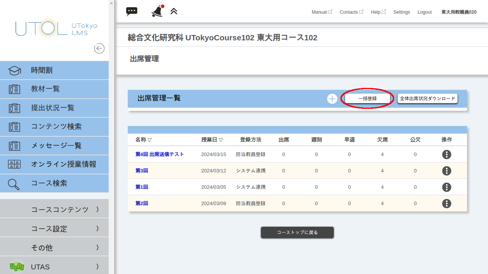
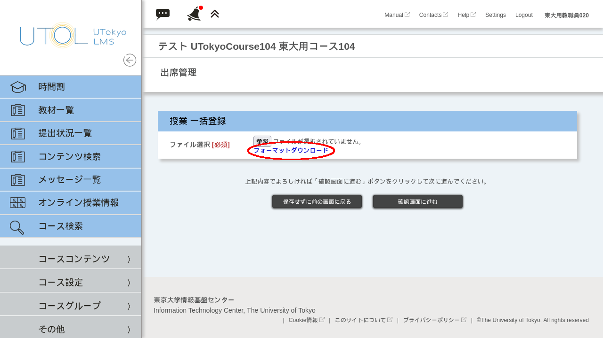
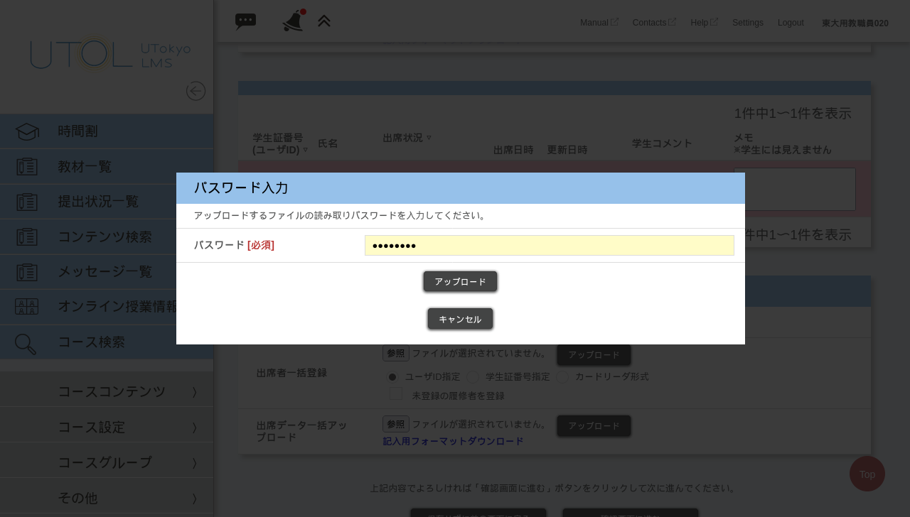

## はじめに
UTOLには，履修者が授業に出席したことを記録するための出席管理機能があります．

UTOLの出席管理機能は，各回の授業について設定を行ってから，履修者にワンタイムパスワードを送信させたり，担当教員が出席状況を登録したりすることで利用できます．

このページでは，出席管理機能を利用する上で必要となる，以下の操作を行う方法についてそれぞれ解説します．
* [出席登録の準備をする](#prepare-attendance)
* [出席登録を行う](#register-attendance)
* [出席状況を確認・変更する](#check-attendance)

### 注意事項・補足情報
* 講義内容の理解度も確かめたい場合には，[テスト機能](../quizzes/)を利用することを検討してください．
* 一部の部局では，小テストや出席点を成績評価に反映させることを避けるよう教員に案内しているため，事前に部局の方針を確認してください．
* ワンタイムパスワードを使って学生に出席送信させる場合には，特有の注意事項があります．詳しくは「[履修者にワンタイムパスワードで出席送信をさせる > 注意事項](#notes-otp)」を参照してください．

## 出席登録の準備をする
{:#prepare-attendance}
UTOLの出席機能を利用するには，事前に各授業回の「出席管理」を設定する必要があります．「出席管理」の設定は，以下のいずれかの方法で行えます．

* (a)「授業コマ」に連動して自動登録された出席管理の設定を変更する
    1. [自動登録された出席管理を履修者の画面に表示させる](#set-auto-attendance)
    2. [各回の出席管理を手動で設定変更する](#set-each-attendance-a)
* [(b) 各回の出席管理を手動で追加する](#set-each-attendance-b)
* [(c) 出席管理を一括設定する](#set-bulk-attendance)

複数看板科目の場合，看板となっている科目ごとに出席管理が自動登録されるため，(b)または(c)の方法で出席管理を設定してください．

以下，それぞれの手順について説明します．

### 授業コマ機能から自動で登録された出席管理を編集する
#### 自動登録された出席管理を履修者の画面に表示させる
{:#set-auto-attendance}

初期状態では，自動登録された出席管理は履修者に表示されません．

下記の手順で設定を行うと，出席送信を行う授業日や，出席送信できる時間帯，送信可能な時間帯のうちどこからが遅刻になるか，が履修者に表示されるようになります．

1. コーストップ画面で画面左上の{:.icon}を押して，メニューを表示させてください．
2. メニューから「コース設定 ∨」を展開し，「コース設定」を押してください．
  
    
3. コース設定画面で，「授業コマから自動登録された出席情報を履修者に表示する」の項目にチェックを付けてください．
  
    
4. 「確認画面に進む」ボタンを押し，表示された確認画面で「登録する」を押してください．
なお，授業コマ機能を介さずに手動で登録した出席管理は，この設定にかかわらず履修者の画面に表示されます．

#### 各回の出席管理を手動で設定変更する
{:#set-each-attendance-a}
この項の手順は「[出席管理を手動設定する > 各回の出席管理を手動で追加する](#set-each-attendance-b)」と同様です．

各回の出席管理の追加・設定確認・設定変更は以下の手順で行えます．
1. コーストップ画面で画面左上の{:.icon}を押して，メニューを表示させてください．
2. メニューから「コースコンテンツ >」を展開し，「出席管理」を押してください．
  
    
3. 「出席管理」の画面が表示されます．出席管理を追加する場合には「+」を，設定変更する場合には「名称」列のリンクを押してください．
  
    
4. 出席管理の設定を入力してください．
    * 「名称」は担当教員が集計を行う際に表示される名称です．日付等を入力すると区別がしやすくなります．
    * 「説明」は空のままで問題ありません．
    * 「授業日」にはその授業を行う日を入力してください．
    * 「学生による登録」は「登録可」としないと学生がワンタイムパスワードを入力することができません．「登録不可」はカードリーダーやその他サービスなど，UTOLの出席送信機能以外で取った出席情報を教員が登録する際に利用してください．
    * 「送信可能日時」には，学生がUTOL上で出席送信が可能な時間の範囲を，遅刻扱いになる範囲も含めて入力してください．「送信可能日時」を過ぎると遅刻扱いとして送信することもできなくなります．録画の視聴を出席として扱う場合には，送信可能日時の終了時刻を一週間後などに設定することや，代わりに課題機能やテスト機能を使うことを検討してください．
    * 「遅刻時間設定」には，「送信可能日時」の範囲内で「遅刻」と扱う時刻を入力してください．遅刻となる境界の時刻は履修者に表示されます．
    * 「ワンタイムパスワード」には，その回で学生に入力させるパスワードを入力してください．この欄には各回で異なるパスワードを入力してください．「自動生成」ボタンを押すとパスワードをランダムに生成できます．
  
    ※自動登録された出席管理の場合は「名称」「説明」「授業日」「時限」を変更できないことがあります．
    
    

5. 最後に，「確認画面へ進む」ボタンを押し，表示された確認画面で「登録する」ボタンを押してください．

### 出席管理を手動設定する
#### 各回の出席管理を手動で追加・設定変更する
{:#set-each-attendance-b}
この項の手順は「[授業コマ機能から自動で登録された出席管理を編集する > 各回の出席管理を手動で設定変更する](#set-each-attendance-a)」と同様です．

各回の出席管理の追加・設定確認・設定変更は以下の手順で行えます．
1. コーストップ画面で画面左上の{:.icon}を押して，メニューを表示させてください．
2. メニューから「コースコンテンツ >」を展開し，「出席管理」を押してください．
  
    
3. 「出席管理」の画面が表示されます．出席管理を追加する場合には「+」を，設定変更する場合には「名称」列のリンクを押してください．
  
    
4. 出席管理の設定を入力してください．
    * 「名称」は担当教員が集計を行う際に表示される名称です．日付等を入力すると区別がしやすくなります．
    * 「説明」は空のままで問題ありません．
    * 「授業日」にはその授業を行う日を入力してください．
    * 「学生による登録」は「登録可」としないと学生がワンタイムパスワードを入力することができません．「登録不可」はカードリーダーやその他サービスなど，UTOLの出席送信機能以外で取った出席情報を教員が登録する際に利用してください．
    * 「送信可能日時」には，学生がUTOL上で出席送信が可能な時間の範囲を，遅刻扱いになる範囲も含めて入力してください．「送信可能日時」を過ぎると遅刻扱いとして送信することもできなくなります．録画の視聴を出席として扱う場合には，送信可能日時の終了時刻を一週間後などに設定することや，代わりに課題機能やテスト機能を使うことを検討してください．
    * 「遅刻時間設定」には，「送信可能日時」の範囲内で「遅刻扱い」とする時刻を入力してください．遅刻となる境界の時刻は履修者に表示されます．
    * 「ワンタイムパスワード」には，その回で学生に送信させるパスワードを入力してください．「自動生成」ボタンを押すとパスワードをランダムに生成できます．その回の授業に出席していることを確認するためには，毎回異なるパスワードを使うことが望ましいです．
    
    ※自動登録された出席管理の場合は「名称」「説明」「授業日」「時限」が変更できないことがあります．
  
    

5. 最後に，「確認画面へ進む」ボタンを押し，表示された確認画面で「登録する」ボタンを押してください．

#### 出席管理を一括設定する
{:#set-bulk-attendance}

「一括登録」を用いると，以下の手順で各回の出席管理を一つのファイルに書き込んでまとめて設定することができます．

1. コーストップ画面で画面左上の{:.icon}を押して，メニューを表示させてください． 
2. メニューから「コースコンテンツ >」を展開し，「出席管理」を押してください．
  
    
3. 「出席管理」の画面の「一括登録」ボタンを押してください．
  
    
4. 「フォーマットダウンロード」からひな形をダウンロードしてください．
  
    
5. Excelやテキストエディタなどのソフトウェアを用いてダウンロードしたファイルを開き，出席管理の設定を入力してください．Excelなどの表計算ソフトウェアで入力をする場合は，セルの書式設定を「文字列」にすることをおすすめします．各列の内容は以下の通りです．（「[各回の出席管理を手動で追加・設定変更する](#set-each-attendance-b)」の項と同様です．）

    * 「名称」は担当教員が集計を行う際に表示される名称です．日付等を入力すると区別がしやすくなります．
    * 「授業日」にはその授業を行う日をYYYY/MM/DD形式（2024/04/01など）で入力してください．
    * 「時限」には，授業を行う時限が1限から8限の場合は10から80の数字を，その他の場合はZZを入力してください．
    * 「学生による登録」は「登録可」としないと学生がワンタイムパスワードを入力することができません．「登録不可」はカードリーダーやその他サービスなど，UTOLの出席送信機能以外で取った出席情報を教員が登録する際に利用してください．
    * 「送信可能日時」には，学生がUTOL上で出席送信が可能な時間の範囲を，遅刻扱いになる範囲も含めて入力してください．「送信可能日時」を過ぎると遅刻扱いとして送信することもできなくなります．録画の視聴を出席として扱う場合には，送信可能日時の終了時刻を一週間後などに設定することや，代わりに課題機能やテスト機能を使うことを検討してください．
        * 開始日・終了日の列には，YYYY/MM/DD形式（2024/04/01など）で入力してください．
        * 開始時刻・終了時刻の列には，HH:MM形式（15:45など）で入力してください．
    * 「遅刻時間設定」には，「送信可能日時」の範囲内で「遅刻扱い」とする時刻を,HH:MM形式（15:45など）で入力してください．遅刻となる境界の時刻は履修者に表示されます．
    * 「ワンタイムパスワード」には，その回で学生に送信させるパスワードを入力してください（空欄にすると自動生成されます）．その回の授業に出席していることを確認するためには，毎回異なるパスワードを使うことが望ましいです．
    * 「説明」は空のままで問題ありません．
  
    
6. 「参照」ボタンを押して設定を入力したファイルを選択し，「確認画面へ進む」ボタンを押してファイルをアップロードします．
    

## 出席登録を行う
{:#register-attendance}
### 履修者にワンタイムパスワードで出席送信をさせる
出席管理の設定項目のうち「学生による登録」を「登録可」にすると，履修者本人による出席登録ができるようになります．
#### 注意事項
{:#notes-otp}
ワンタイムパスワードを使って履修者に出席送信をさせる際は，以下の点に注意してください．
* ワンタイムパスワードを受講以外の手段で知った場合でも，UTOL上では出席送信することができてしまいます．
* 通信環境などの不具合でワンタイムパスワードの送信ができないことや，履修者が出席しているのに送信を失念してしまうことがあります．トラブル防止のため，正しく出席送信ができたか口頭などで確認してください．
* トラブルが起きた際に必ず申告するよう履修者に周知してください．ワンタイムパスワード以外の方法で出席を確認した場合，あとから[出席状況を変更する](#check-attendance)ことができます．
* 出席送信がうまくいかない場合は，「[困ったときは](#trouble-otp)」も合わせて参照してください．
#### 手順
1. 事前に，「[各回の出席管理を手動で追加・設定変更する](#set-each-attendance-b)」項の手順でその回の出席管理の設定画面を開き，ワンタイムパスワードを確認してください．
2. 授業中に履修者にワンタイムパスワードを提示してください．具体的な方法として，以下のようなものがあります．
    * 対面授業では，黒板の空きスペースに大きく書いておくと，履修者が焦らずに出席送信できます．
    * オンライン授業では，パスワードを大きな字で書いたスライドを1枚用意し，その他のスライドの隅にも書いておくと，うまく送信できなかった場合にも再度確認できます．
    * Zoomのチャットでワンタイムパスワードを伝えるとコピー・ペーストが容易ですが，通信環境の不具合などで履修者が入室し直した場合に，それ以前のチャット履歴を確認できなくなるため注意が必要です．
3. 履修者に，ワンタイムパスワードを送信するよう指示してください．また，正しく出席送信ができたか確認を取ってください．なお，履修者側の出席送信手順は以下の通りです．
    

    
履修者側の出席送信手順

    1. 履修者が,「送信可能日時」以降にコーストップ画面を開くかリロードをすると，「出席送信」ボタンが表示されます．
        * このボタンは担当教員の画面には表示されません．
        * 「送信可能日時」より前からコーストップ画面を開いている場合，時間になってもボタンは表示されません．その場合はコーストップ画面をリロードしてください．
        
        
    2. 履修者が「出席送信」ボタンを押すと，ワンタイムパスワードの入力が求められます．ここに正しいパスワードを入力して送信すると，UTOL上で出席が記録されます．

        
    

#### 困ったときは
{:#trouble-otp}

出席送信ボタンが表示されない

- 担当教員・TAの画面には，履修者の画面とは違い，「出席送信」ボタンが表示されません．
- 自動登録された出席管理を使う場合は「[出席管理を手動設定する > 自動登録された出席管理を履修者の画面に表示させる](#set-auto-attendance)」の設定を行ってください．

ワンタイムパスワードがわからない

- ワンタイムパスワードは，「[出席管理を手動設定する > 各回の出席管理を手動で追加する](#set-each-attendance-b)」の手順で出席確認画面を開くと確認できます．

### 教員が一括で出席登録を行う
「出席者一括登録」機能を使うと，教員が一括で出席登録を行うことができます．Zoomの参加者リストや紙に書かせた学籍番号，カードリーダーで取得した出席情報を使う際に便利です．

なお，この機能では「出席」以外（「欠席」「遅刻」など）の出席状況は登録できません．「出席」以外の出席状況を設定したい場合は，「[出席状況を変更する](#check-attendance)」の手順により変更してください．
1. 出席者のリストが記載されたテキストファイルを用意してください．利用できる記載形式は「ユーザーID指定」「学籍番号指定」「カードリーダー形式」の三通りです．
    * 「ユーザーID指定」の場合は，1行ごとに共通ID（10桁の数字）を記載してください．
    * 「学籍番号指定」の場合は，1行ごとに学籍番号を記載してください．
    * 「カードリーダー形式」の場合は，1行ごとに「10桁の共通id,2000/01/01 00:00:00」という形式で記載してください．貸与されたカードリーダーの出力するファイルはこの形式になっています．  

    
2. コーストップ画面で画面左上の{:.icon}を押して，メニューを表示させてください．
3. メニューから「コースコンテンツ >」を展開し，「出席管理」を押してください．
  
    
4. 「出席管理」の画面が表示されます．確認したい授業の行にある{:.icon}を押し，「出席登録」を押してください．
  
    
5. 「出席者一括登録」の欄からファイルをアップロードしてください．
    * 「ユーザーID指定」「学籍番号指定」「カードリーダー形式」のうち，アップロードするファイルの形式を選択してください．
    * 「未登録の履修者を登録」にチェックを入れると，受講登録されていない履修者の情報がファイルに含まれていた場合に，エラーとする代わりに受講登録を行います．
    * 「参照」ボタンを押してファイルを選択し，「アップロード」ボタンを押してください．

    
6. アップロード後，更新後の出席状況が表示されます．「確認画面へ進む」ボタンを押してください．
7. 内容を確認し，問題がなければ「登録する」ボタンを押してください．

## 出席状況を確認・変更する
{:#check-attendance}
### 出席登録ページで確認・変更する
過去の授業の出席状況の確認や変更は，出席登録ページから行うことができます．
1. コーストップ画面で画面左上の{:.icon}を押して，メニューを表示させてください．
2. メニューから「コースコンテンツ >」を展開し，「出席管理」を押してください．
  
    
3. 「出席管理」の画面が表示されます．確認したい授業の行にある{:.icon}を押し，「出席登録」を押してください．
  
    
4. 「出席登録」画面には，その回の学生の出席状況・日時・入力されたコメントが表示されます．必要に応じて出席状況の変更を入力してください．
  
    
5. 変更の入力が終わったら，「確認画面へ進む」ボタンを押してください．
6. 内容を確認し，問題がなければ「登録する」ボタンを押してください．

### 出席データを一括ダウンロードする
以下の手順で，出席状況のデータをExcelのパスワード付きブックとしてダウンロードできます．
1. コーストップ画面で画面左上の{:.icon}を押して，メニューを表示させてください．
2. メニューから「コースコンテンツ >」を展開し，「出席管理」を押してください．
  
    
3. 「出席管理」の画面が表示されます．確認したい授業の行にある{:.icon}を押し，「出席登録」を押してください．
  
    
4. 「出席管理」画面の中程にある「一括ダウンロード」の行の「ダウンロード」ボタンを押してください．
  
    
5. 「パスワード設定」ダイアログが表示されます．パスワードを設定して「ダウンロード」ボタンを押してください．
  
    
6. Excelで開くことのできるパスワード付きブックがダウンロードされます．

### 出席データを一括で編集する
以下の手順で，出席状況のデータをExcelで一括編集して反映させることができます．
1. コーストップ画面で画面左上の{:.icon}を押して，メニューを表示させてください．
2. メニューから「コースコンテンツ >」を展開し，「出席管理」を押してください．
  
    
3. 「出席管理」の画面が表示されます．確認したい授業の行にある{:.icon}を押し，「出席登録」を押してください．
  
    
4. 「出席管理」画面の中程にある「出席データ一括アップロード」の行にある，青文字の「記入用フォーマットダウンロード」ボタンを押してください．
  
    
5. 「パスワード設定」ダイアログが表示されます．パスワードを設定して「ダウンロード」ボタンを押してください．
  
    
6. Excelで開くことのできるパスワード付きブックがダウンロードされます．ダウンロードされたファイルを編集してください．  
    * 各行のE列（出席状況:出席）からI列（出席状況:公欠）が，各履修者の出席状況と対応します．出席状況を設定するには，該当する出席状況のセルに半角の「1」を入力し，それ以外のセルを空欄にしてください．
7. 「出席管理」画面の中程にある「出席データ一括アップロード」の行の「参照」ボタンを押して，編集したファイルを選択し，「アップロード」ボタンを押してください．
  
    
8. パスワードを入力して「アップロード」ボタンを押してください．

9. アップロード後，更新後の出席状況が表示されます．「確認画面へ進む」ボタンを押してください．
  
    
10. 内容を確認し，問題がなければ「登録する」ボタンを押してください．