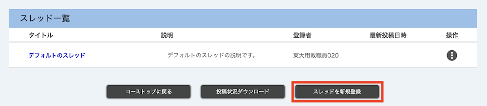
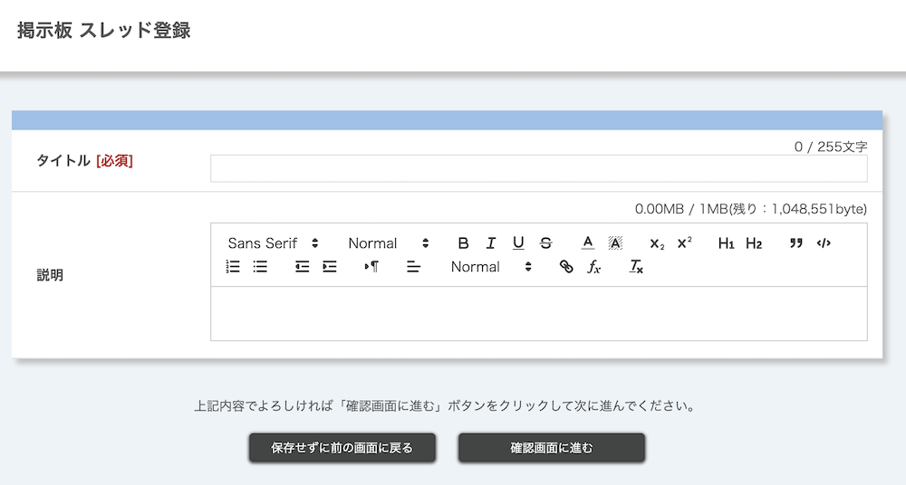

## 機能概要
{:#overview}

掲示板機能とは，UTOL上で授業を履修している学生同士や学生と教員間で，双方向のやり取りができる機能です．
一般的なメールよりもチャットに近い形式で，授業に関する質問のやりとりや，グループワークの議論、履修者同士での意見交換などに用いることができます．

### 利用のメリット

UTOLの掲示板機能を利用するメリットとして，以下のような点があります．

- UTOL上で完結するため，履修者全員が特別の設定をすることなく利用できます．
  - 他のツール（[UTokyo Slack](/slack/)など）に履修者を招待したり，履修者がツールの登録をしたりする必要がありません．
- [マークアップ機能](../../markup/)を利用でき，数式やリンクを含むメッセージを投稿することができます．
- グループワークの班ごとの話し合いに利用する場合などに，特定の掲示板を一部の履修者にのみ公開する設定も可能です．

### 「テーマ」「スレッド」「メッセージ」の関係

UTOLの掲示板機能では，「テーマ」「スレッド」「メッセージ」が階層構造となっています．

- **テーマ**：扱う話題の大枠となるものです．履修者は，新規登録や編集・削除ができません．
- **スレッド**：テーマに対して立てられる話題ごとの枠組みです．一つのテーマに対して複数のスレッドを登録できます．なおテーマを新規に登録すると，「デフォルトのスレッド」が生成されます．
- **メッセージ**：スレッド内の一つ一つの投稿のことです．メッセージには，タイトルや本文，添付ファイルを含めることができます．

### 使用の流れ

掲示板機能を用いてメッセージを投稿するまでの流れは，以下のようになります．

1. [テーマを登録する](#register-theme)
2. [スレッドを登録する](#register-thread)
3. [メッセージを投稿する](#post-messages)

また，投稿されたメッセージを確認する方法については，「[投稿を閲覧する](#view-messages)」を参照してください．

なお担当教員やTAは，[掲示板の閲覧状況を確認する](#check-view-status)こともできます．

## テーマを操作する
{:#theme}

### テーマを登録する
{:#register-theme}

操作が可能な権限：担当教員・コース設計者・TA

1. コーストップ画面を開き，「掲示板」の水色枠の左下にある{:.icon}アイコンを押してください．
   
2. テーマ登録画面に以下の情報を入力してください．
   
   - **タイトル**［必須］
   - **内容**
     - [マークアップ](../../markup/)を利用できます．
   - **添付ファイル**
   - **投稿期間**［必須］
     - デフォルトは空欄になっています．
     - 投稿期間終了後，公開対象に含まれる履修者は，閲覧のみが可能になります．
   - [**表示ラベル**](../settings/#label)
     - 新規登録するテーマに対して表示ラベルを設定したい場合は，ここで設定することができます．
       - 新しくラベルを作成する場合，「表示ラベル新規作成」ボタンを押してください．
       - すでに作成済みのラベルを使う場合，ドロップダウンメニューからラベルを選択してください．
       - 複数個の表示ラベルを設定したい場合は「表示ラベル追加」を押して，設定したい数の「表示ラベル」欄を追加してください．
     - 表示ラベルを設定しない場合は，「表示ラベル」欄で「設定なし」を選択してください．
   - **公開対象**［必須］
     - 登録するテーマを公開する対象を，「すべての履修者」「ユーザグループ」「履修者を選択」から選択することができます．
     - 「ユーザグループ」を対象とする場合，事前に作成した[ユーザグループ](../settings/user_groups/)を対象に公開できます．
     - 「履修者を選択」とする場合，履修者の一部を対象に公開できます．
       - 「履修者を選択」を選択すると，その下に「履修者一覧」が表示されるので，左側チェックボックスで公開対象とする履修者を選択してください．
       - 「履修者を選択」に設定した場合でも，担当教員・TA・コース設計者は全ての掲示板を閲覧することができます．
3. 画面下部の「確認画面に進む」を押してください．
   {:.medium}
4. 内容を確認した上で，「登録する」を押してください．
   

新たにテーマを登録すると，タイトルが「デフォルトのスレッド」であるスレッドが自動的に生成されます．スレッドのタイトルや説明を適切に設定することで，スレッドの目的をわかりやすく示すことが可能になるので，必要に応じて[スレッドを編集](#edit-delete-thread)してください．

### テーマを編集・削除する

操作が可能な権限：担当教員・コース設計者・TA

編集するには，コーストップ画面を開き，掲示板の「テーマタイトル」（青色のリンク）を押してください．テーマ編集画面に遷移します．

削除するには，コーストップ画面の「掲示板」欄右側にある{:.icon}アイコンを押してから，「削除」を選択してください．
{:.extra-small}

## スレッドを操作する
{:#thread}

### スレッドを登録する
{:#register-thread}

操作が可能な権限：担当教員・コース設計者・TA・履修者

1. コーストップ画面を開き，「掲示板」欄までスクロールしてください．
2. 「掲示板」欄内で，スレッドを登録したいテーマの右側にある{:.icon}アイコンを押してください．
   
3. 「参加する」を選択してください．
   {:.extra-small}
4. 画面下部の「スレッドを新規登録」ボタンを押してください．
   
5. 「スレッド登録」画面で，以下の情報を入力してください．
   
   - **タイトル**［必須］
   - **説明**
     - [マークアップ](../../markup/)を利用できます．
6. 画面下部の「確認画面に進む」ボタンを押してください．
   {:.medium}
7. 内容を確認の上，「登録する」ボタンを押してください．「登録が完了しました」と表示されれば，スレッドの登録が完了しています．
   

### スレッドを編集・削除する
{:#edit-delete-thread}

操作が可能な権限：担当教員・コース設計者・TA・履修者 
※ただし履修者は，自身で作ってかつ，メッセージが投稿されていないスレッドのみ削除することができます．

1. コーストップ画面を開き，「掲示板」欄までスクロールしてください．
2. 「掲示板」欄内で，編集・削除したいスレッドが属するテーマの右側にある{:.icon}アイコンを押してください．
   
3. 「参加する」を選択してください．
   {:.extra-small}
4. スレッド一覧右側の{:.icon}アイコンを押してください．
   
5. 「編集」または「削除」を選択してください．
   {:.extra-small}

## 投稿を閲覧する
{:#view-messages}

操作が可能な権限：担当教員・コース設計者・TA・履修者

1. コーストップ画面を開き，「掲示板」欄までスクロールしてください．
2. 「掲示板」欄内で，スレッドを編集・削除したいテーマの右側にある{:.icon}アイコンを押してください．
   
3. 「参加する」を選択してください．
   {:.extra-small}
4. 投稿を閲覧したいスレッドの「タイトル」（青色のリンク）を押してください．投稿内容がチャットのような形式で表示されます．
   

### 投稿をダウンロードする

掲示板機能では，投稿状況をダウンロードすることができます．ダウンロード機能には，以下の2種類があります．

- [**テーマ内の投稿を一括ダウンロードする**](#download-all-messages)：テーマ内の全スレッドの投稿をExcelファイル（`.xlsx`）として一括ダウンロードする機能です．担当教員のみ利用できます．
- [**スレッドごとに投稿をダウンロードする**](#download-thread-messages)：スレッドごとにメッセージを，エクセルファイル（`.xlsx`）とhtmlファイルが入ったzipファイルとしてダウンロードできる機能です．担当教員・TA・履修者が，投稿期間内にのみ利用できます．

なお，ダウンロードされるファイルには，添付した画像や数式は含まれていません．

#### テーマ内の投稿を一括ダウンロードする
{:#download-all-messages}

操作が可能な権限：担当教員

1. コーストップ画面を開き，「掲示板」欄までスクロールしてください．
2. 「掲示板」欄内で，スレッドを登録したいテーマの右側にある{:.icon}アイコンを押してください．
   
3. 「参加する」を選択してください．
   {:.extra-small}
4. 画面下部中央の「投稿状況ダウンロード」ボタンを押してください．
   
5. パスワード設定画面に遷移するので，「パスワード」をテキストフィールドに入力してください．
   - ダウンロードされたファイルを開くときに，ここで入力したパスワードが必要になります．
6. 「ダウンロード」ボタンを押してください．自動的に新しいタブが開き，エクセルファイル（`.xlsx`）がダウンロードされます．
   {:.medium}

#### スレッドごとに投稿をダウンロードする
{:#download-thread-messages}

操作が可能な権限：担当教員・TA・履修者

1. コーストップ画面を開き，「掲示板」欄までスクロールしてください．
2. 「掲示板」欄内で，スレッドを登録したいテーマの右側にある{:.icon}アイコンを押してください．
   
3. 「参加する」を選択してください．
   {:.extra-small}
4. スレッドのタイトル（青色のリンク）を押してください．
   
5. メッセージ投稿欄の左下にある「ダウンロード」ボタンを押してください．
   
6. パスワード設定画面に遷移するので，「パスワード」をテキストフィールドに入力してください．
   - ダウンロードされたファイルを開くときに，ここで入力したパスワードが必要になります．
7. 「ダウンロード」ボタンを押してください．自動的に新しいタブが開き，zip形式のファイルがダウンロードされます．
   {:.medium}

## 投稿する
{:#post-messages}

### 新規メッセージを投稿する

操作が可能な権限：担当教員・TA・履修者

1. コーストップ画面を開き，「掲示板」欄までスクロールしてください．
2. 「掲示板」欄内で，スレッドを登録したいテーマの右側にある{:.icon}アイコンを押してください．
   
3. 「参加する」を選択してください．
   {:.extra-small}
4. スレッドのタイトル（青色のリンク）を押してください．
   
5. 画面下部の投稿画面までスクロールし，メッセージを入力してください．
   
   - 入力する情報は以下の通りです．
     - **タイトル**
     - **投稿内容**
       - ここに，メッセージ本文を入力してください．
       - [マークアップ](../../markup/)を利用できます．
     - **添付ファイル**
   - 投稿内容，添付ファイル，画像のいずれかの入力が必要です．タイトルのみの投稿はできません．
6. 右下の「送信」ボタンを押してください．
   

### 投稿したメッセージを編集・削除する

操作が可能な権限：担当教員・TA・履修者 
※ただし履修者は，ユーザー自身が投稿したメッセージのみ，編集・削除が可能です．

1. コーストップ画面を開き，「掲示板」欄までスクロールしてください．
2. 「掲示板」欄内で，スレッドを登録したいテーマの右側にある{:.icon}アイコンを押してください．
   
3. 「参加する」を選択してください．
   {:.extra-small}
4. スレッドのタイトル（青色のリンク）を押してください．
   
5. 編集したいメッセージの下部にある「編集」または「削除」（青字のリンク）を選択してください．
   {:.small}
6. 編集を行う場合は，画面下部の投稿画面までスクロールし，メッセージを編集・送信してください．削除を行う場合は，確認画面が出るので「削除する」ボタンを押してください．

## 閲覧状況を確認する
{:#check-view-status}

操作が可能な権限：担当教員・TA

1. コーストップ画面を開き，「掲示板」欄までスクロールしてください．
2. 「掲示板」欄内で，スレッドを登録したいテーマの右側にある{:.icon}アイコンを押してください．
   
3. 「参加する」を選択してください．
   {:.extra-small}
4. スレッド一覧右側の{:.icon}アイコンを押してください．
   
5. 「閲覧状況」ボタンを押してください．
   {:.extra-small}
6. 閲覧状況ページに遷移するので，閲覧状況を確認してください．
   - 閲覧状況ページから，閲覧状況をダウンロードすることも可能です．なおダウンロードする際には，パスワードの設定が必要です．
