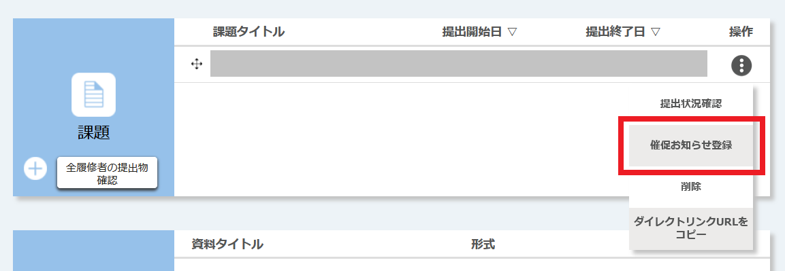
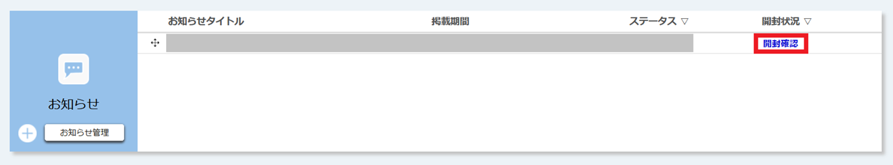

## お知らせとは
{:#about}
本ページでは，[UTOL](/utol/)における「お知らせ」機能の利用手順を説明します．お知らせとは，履修者の全員または一部に対して連絡事項等の文章を一方向に伝える機能です．個別の履修者と双方向的なやりとりを行う場合には，[メッセージ](/utol/lecturers/messages/)をお使いください．

お知らせ機能の特徴としては，以下が挙げられます．
- お知らせを登録した際，履修者に対してメール・LINEで自動的に通知を送信するよう設定することができます（設定方法の詳細は「[通知設定](/utol/notification/)」を参照してください）．
    - ただし，**通知が送信されるのは履修者が通知を受け取ることを希望するよう設定している場合に限られる**ので注意してください．
    - この通知には，お知らせの内容が直接掲載されます．
- UTOL上でお知らせを閲覧した履修者の一覧を確認できます．手順の詳細は後述する「[お知らせの開封確認をする](#check)」を参照してください．

### 催促お知らせ
{:#reminder}
お知らせには，通常のお知らせ以外に「催促お知らせ」というものがあります．催促お知らせとは，課題・テスト・アンケートの提出を催促する目的で利用できるお知らせです．
- 催促お知らせは未提出者に対してのみ表示されます．
- メール・LINEによる通知は自動的に有効にされています．ただし，**履修者が通知を受け取るよう設定していない場合，通知が送信されることはありません**．
- 催促お知らせは，通常のお知らせと同一の欄に表示されます．

#### 催促お知らせのテンプレート
{:#templates}
催促お知らせには，同一の文面を繰り返し使用する場面が多いと予想されるため，テンプレート機能が存在しています．これは，あらかじめ作成しておいた文面を複数の催促お知らせで使用することができる機能です．

テンプレートは同一コース内でも各参加者ごとに独立しています．たとえば，担当教員が複数存在するコースの場合，ある担当教員が作成したテンプレートを他の担当教員が**直接**利用することはできません．ただし，他のユーザーが作成したテンプレートを複製して自分自身のテンプレートを複製・改変し，それを自身のテンプレートとすることは可能です．

#### 催促お知らせを登録できる期間および条件
{:#condition}
催促お知らせを登録するには，以下の条件を満たしている必要があります．

- コンテンツの提出期間前または期間中であること．
    - ただし，**「期間外提出可」と設定されている課題については提出期間後にも催促お知らせを登録することができます**．
- （アンケートの場合）記名アンケートであること．
    - 記名アンケートから無記名アンケートに変更した場合，登録済みの催促お知らせは削除されます．

### コース参加者ごとの操作権限
{:#permissions}
ほとんどすべての操作は担当教員・TA・コース設計者の三者が実行可能です．ただし，コース設計者は[開封確認](#check)を行うことができません．

## お知らせを登録する
{:#register}

ここでは，お知らせ・催促お知らせを新規に登録する手順を説明します．

### お知らせを登録する
{:#register_information}
1. コーストップの「お知らせ」欄で「＋」ボタンを押すか，「お知らせ管理」で「新規のお知らせを登録」を押してください．
  
    コーストップ：
    
  「お知らせ管理」：
    
1. 以下を入力してください．
    - **タイトル**：お知らせのタイトルです．
    - **内容**：お知らせとして送信する文章です．
    - **掲示期間**：お知らせを公開する期間です．
        - 掲示期間開始日以降，すなわち**お知らせが公開されてからは，内容を含め掲示期間の終了日時以外の項目を編集することはできません．注意して登録してください**．
    - **メール・LINE通知**：お知らせを登録した際，履修者に対してメール・LINEで通知を送信するかどうかを選択します．
    - **表示ラベル**：お知らせにラベルを設定することができます（ラベル機能については，「[UTOLでコース設定を行う（教員・TA向け）](../settings/)」を参照してください）．
    - **公開対象**：お知らせの公開対象を選択することができます（ユーザグループ機能については，「[UTOLでユーザグループ機能を利用する（教員・TA向け）](../settings/user_groups/)」を参照してください）．

1. 「確認画面に進む」を押してください．
1. 入力したお知らせの内容が想定したとおりになっているか確認してください．履修者側の表示を再現する「表示画面プレビュー」を使うこともできます．
1. 「登録する」を押してください．「登録が完了しました。」と表示されれば完了です．

### 催促お知らせを登録する
{:#register_reminder}
ここでは，課題を例にとって説明をしますが，テストでもアンケートでも同様の手順で設定することが可能です．
1. 催促お知らせを登録したい課題について，コーストップの「課題」欄で「操作」列の {:.logo}マークを押し，表示されたメニューのうちの「催促お知らせ登録」を押してください．

    

    
「催促お知らせ」および「催促お知らせ登録」が表示されていない場合

    当該コンテンツが，<a href="#condition">催促お知らせを登録できる期間および条件</a>を満たしていない可能性があります．
    

1. 以下を入力してください．
    - **タイトル**：催促お知らせのタイトルです．既定のタイトルとして「Deadline （コンテンツの締切）【（コンテンツの種類）】（コンテンツのタイトル）」が入力されていますが，変更することが可能です．
    - **テンプレートから読み込む**：[催促お知らせテンプレート](#templates)を利用する場合に使用します．利用する場合は，まず[催促お知らせテンプレートを登録](#register_templates)してください．登録された催促お知らせテンプレートを利用するには，プルダウンメニューから希望の催促お知らせテンプレートのタイトルを選択したあと，「適用」を押してください．
    - **内容**：催促お知らせとして送信する文章です．
    - **掲示期間**：催促お知らせを公開する期間です．
        - 掲示期間開始日以降，すなわち**お知らせが公開されてからは，内容を含め掲示期間の終了日以外の項目を編集することはできません．注意して登録してください**．
        - 掲示開始日については，直接入力するほかに「掲示終了日の（プルダウンメニュー）日前」欄に日数を入力すると対応する日付を自動で指定することが可能です．
1. 「確認画面に進む」を押してください．
1. 入力した催促お知らせが想定したとおりになっているか確認してください．履修者側の表示を再現する「表示画面プレビュー」を使うこともできます．
1. 問題がなければ「登録する」を押してください．「登録が完了しました。」と表示されれば完了です．

#### 催促お知らせテンプレートを登録・編集する
{:#register_templates}

1. コーストップの「お知らせ」欄の「お知らせ管理」を押してください．

1. 「お知らせ管理」で「催促お知らせテンプレート一覧」を押してください

1. 新規登録する場合は「テンプレート新規登録」を，既存のものを編集する場合は該当するテンプレートタイトルを，他のユーザーのテンプレートを複製して作成する場合は該当するものの「マイテンプレート」欄の「登録」を押してください

1. 以下を入力してください．
    - **テンプレートタイトル**：催促お知らせテンプレートのタイトルです．テンプレートを区別するために使用します．
    - **内容**：テンプレートとして登録する文面です．
1. 「確認画面に進む」を押してください．
1. 入力したテンプレートが想定したとおりになっているか確認し，問題がなければ「登録する」を押してください．「登録が完了しました。」と表示されれば完了です．

### お知らせを確認・編集・削除する
{:#rud}
ここでは，お知らせ（催促お知らせを含む）を確認・編集・削除する手順を説明します．

1. コーストップの「お知らせ」欄か「お知らせ管理」でお知らせのタイトルを押してください．

    コーストップ：
    
    お知らせ管理：
    
1. [登録画面](#register)と同様の画面が表示されます．ここでお知らせの中身を確認できます．
1. 行いたいことに合わせて操作してください
    - **お知らせを編集する場合**
        1. お知らせの内容を編集してください．
            

            
編集できない項目がある場合

            掲示期間開始日以降，すなわち<strong>お知らせが公開されてからは，内容を含め掲示期間の終了日以外の項目を編集することはできません</strong>．
            

        1. 「確認画面に進む」を押してください．
        1. 編集したお知らせが想定したとおりになっているか確認してください．履修者側の表示を再現する「表示画面プレビュー」を使うこともできます．
        1. 「登録する」を押してください．「登録が完了しました。」と表示されれば完了です．
    - **お知らせを削除する場合**
        1. 「お知らせを削除する」を押してください．
        1. 確認画面が表示されるので，問題がなければ「削除」を押してください
        1. 完了するとお知らせ管理画面に移動します．当該お知らせが削除されていることを確認してください．

## お知らせの開封確認をする
{:#check}
ここでは，UTOL上でお知らせを開封した人の一覧を確認する方法を説明します．ただし，**履修者が[メール・LINEによる通知](#about)上のみでお知らせの内容を確認した場合には開封扱いとならないのでご注意ください**．
1. コーストップの「お知らせ」欄か「お知らせ管理」画面にて，該当するお知らせの「開封確認」を押してください

        

        
「開封確認」が無い場合

        あなたには<a href=#permissions>この操作を行う権限</a>がありません．
        

1. ユーザーと開封状況の対応表が表示されるので，確認してください．
