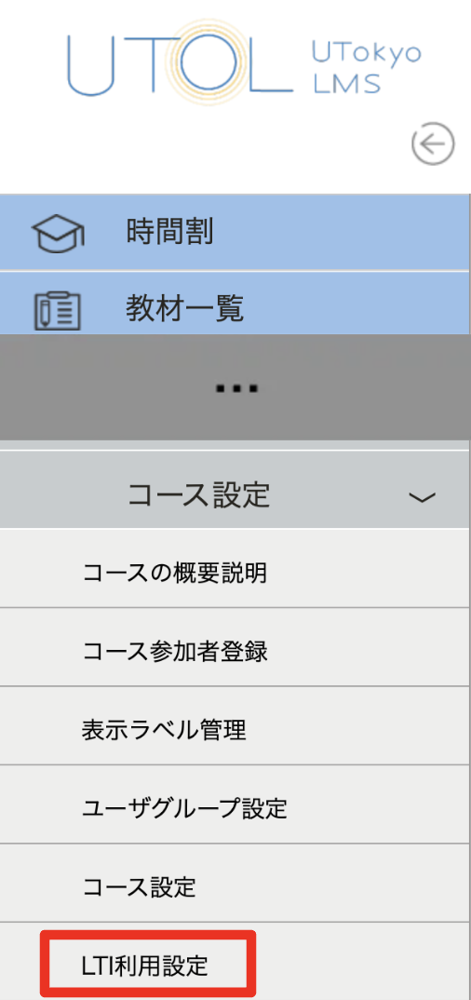
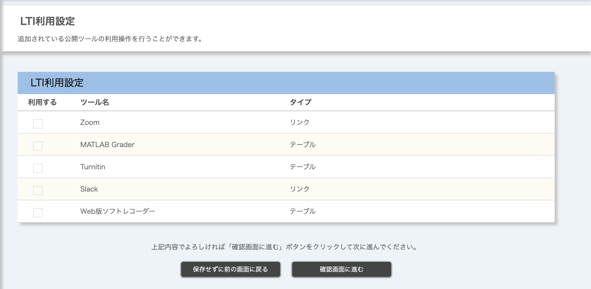

UTOLはLTIという規格によりSlackやZoom等の外部ツールと連携することができます．これら連携機能を利用することにより，授業を円滑に進めることができます．
なお，LINEやSlackを経由した通知は，「[UTOLからの通知を設定する](/notification/)」を参照してください．

## 利用可能な外部ツール
UTOLでは，以下の外部ツール連携を利用可能です．
- Zoom：コースの参加者とZoomミーティングとの連携などができます．詳しくは「[LTI連携機能でUTOLからのZoomミーティングを利用する](/lecturers/integrations/zoom/)」を参照してください．

- Slack：コースの参加者が参加するSlackワークスペースを作成できます．詳しくは「Slack連携機能でUTOLからUTokyo Slackのワークスペースを利用する（準備中）」を参照してください．

- MATLAB Grader：コースの履修者に対し，MATLAB Graderで作成した問題を出題できます．詳しくは「UTOLからMATLAB Graderを利用する（準備中）」を参照してください．

### 利用可能な外部ツールの確認方法
現在利用可能な外部ツールの一覧は，以下の手順で確認できます．
1. UTOLの左方の「コース設定」を開く．
2. 「LTI利用設定」を選択する．

## 外部ツールの追加を申請する
現在利用可能になっていない外部ツールのライセンスを持っていて，利用したい場合，UTOL担当に連絡してください．

その際には，当該ツール及びそのライセンス，利用を希望する範囲（特定の学部・コースのみでの利用か，全学での利用を希望か）等をお伝えください．
