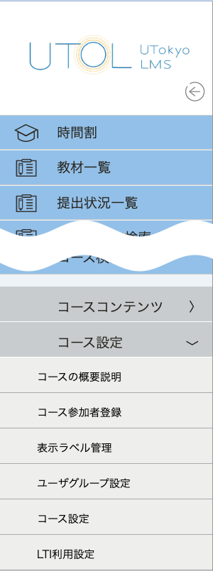
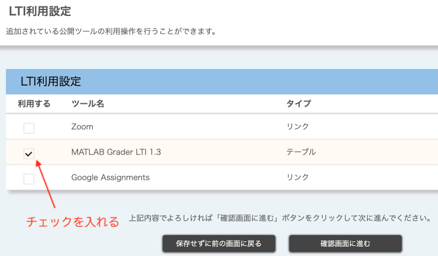
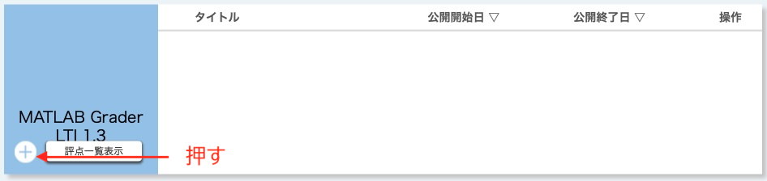
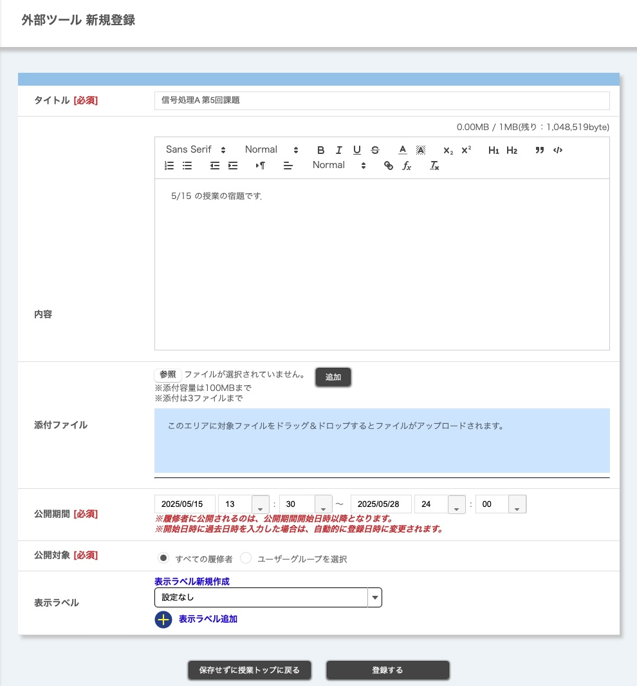
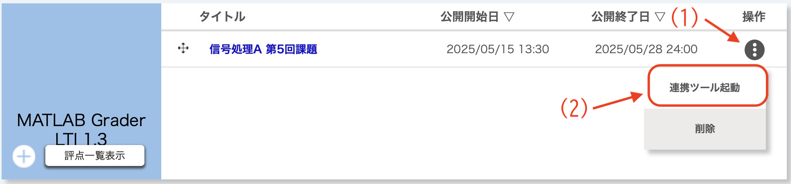
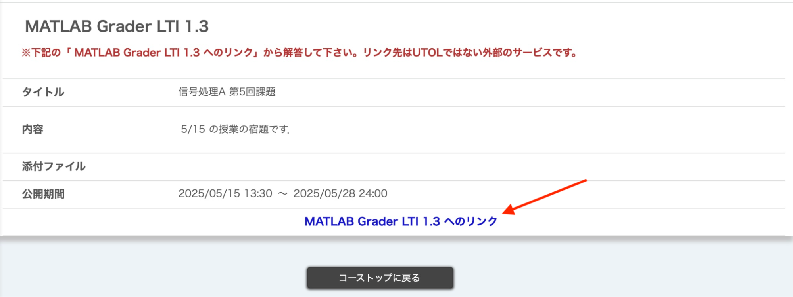
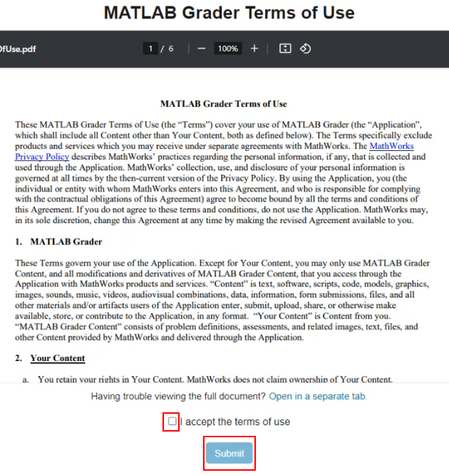
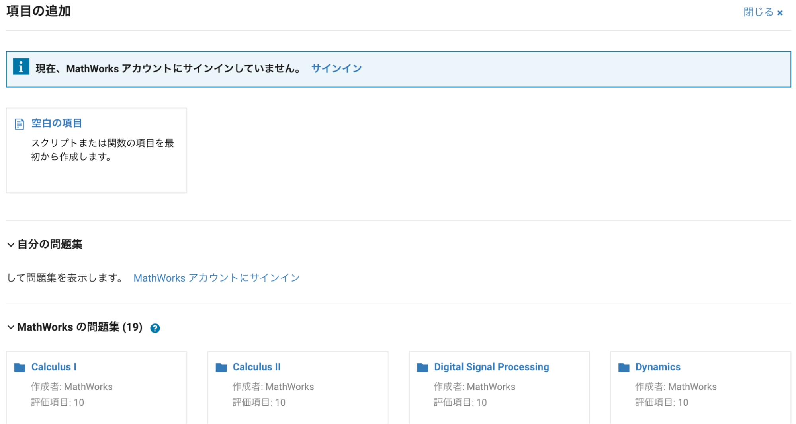
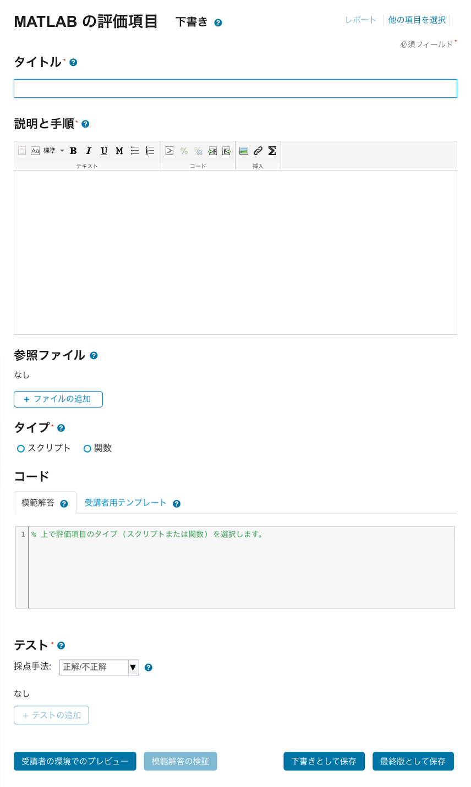
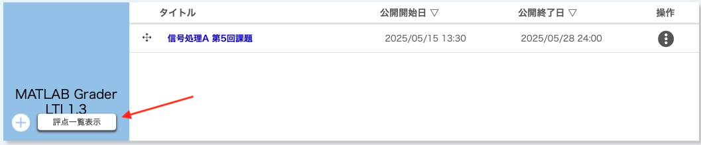

## 概要

UTOLからMATLAB Graderを利用する方法を示します．

## 事前準備
{:#preparation}

MATLAB Graderを利用するにあたっては，事前に準備が必要です．この事前準備の作業は，一つのコースにつき一度だけ行ってください．

1. コーストップ画面で，左メニューの「コース設定」の中にある「LTI利用設定」を押してください．

    

2. 「MATLAB Grader LTI 1.3」の「利用する」にチェックを入れて「確認画面に進む」ボタンを押し，次の画面の「登録する」ボタンを押してください．

    

3. コーストップ画面に「MATLAB Grader LTI 1.3」が現れます．

## 問題（項目）の作成
{:#create}

学生に対してMATLAB Graderで出題する問題を作成します．

### UTOL上の操作
{:#utol}

1. コーストップ画面の「MATLAB Grader LTI 1.3」の欄にある{:.icon}ボタンを押してください．

    

2. 作成するMATLAB Graderの問題のタイトル，公開期間，公開対象を設定してください．また，必要に応じて内容，添付ファイル，表示ラベルを設定してください．

    - 公開対象に含まれる「履修者」が，公開期間内にコーストップ画面にアクセスすると，作成したMATLAB Graderの問題へのリンクを押して，リンク先にあるMATLAB Grader上の問題を利用できます．

    - ここで設定する「公開期間」は，学生にとっての解答期限になります．公開期間が終了すると，学生はMATLAB Grader上の問題にアクセスすることができなくなります．「[補足事項](#appendix)」もご確認ください．

    

3. 「登録する」ボタンを押すと，確認画面が表示されます．問題が無ければ「登録する」ボタンを押してください．

4. コーストップ画面に戻ったら （1）「操作」の列にある{:.icon}ボタンを押して，（2）「連携ツール起動」を押してください．

    

5. 下記のような画面が表示されたら「MATLAB Grader LTI 1.3 へのリンク」を押してください．MATLAB Grader の画面が別のタブ（もしくはウィンドウ）で開きます．

    

## MATLAB Grader上の操作
{:#grader}

1. MATLAB Graderの初回利用時（および「MATLAB Grader Terms of Use」更新時）に，「MATLAB Grader Terms of Use」が表示されるので，確認の上「I accept the terms of use」にチェック（✓）を入れ「Submit」ボタンを押してください．

    

2. 下記のような画面が表示されたら「空白の項目」を押してください．

    ※MATLAB Graderでは，学生に出題するMATLABの問題のことを「項目」や「評価項目」と呼ぶようです．（2025年5月14日現在）

    

3. 下記のような新たな「項目」を作成する画面が表示されるので，「タイトル」や「コード」などの必要事項を入力してください．

    - このとき，登録済みの「MathWorksの問題集」をコピーすることもできます．またMathWorksアカウントにサインインして，過去に作成した問題を利用することもできます．

    

4. 「受講者の環境でのプレビュー」や「模範解答の検証」で問題がなければ「最終版として保存」ボタンを押してください．

## 解答状況の確認
{:#confirm}

点数はUTOLのコーストップ画面で「評点一覧表示」ボタンを押すと確認できます．

点数以外の項目など，解答の詳細はMATLAB Grader上で確認してください．MATLAB Graderの画面右上の「レポート」を押すと，「概要」や個々の「受講者の解答」を参照可能です．

## 補足事項
{:#appendix}

- 「[問題（項目）の作成 > UTOL上の操作](#utol)」で設定した公開期間が終了すると，**学生の画面では「MATLAB Grader LTI 1.3 へのリンク」が無効化**されて，MATLAB Grader上の問題を利用できなくなります．つまり**問題を復習することもできません**．これはMATLAB Grader上では作成する問題（項目）の解答期限を設定できないためです．

- お使いのコースでMATLAB Graderの利用を取りやめる際には，「[事前準備](#preparation)」の項に示した「コース設定」の中の「LTI利用設定」で「MATLAB Grader LTI 1.3」のチェックを外してください．
