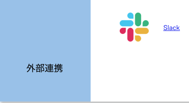
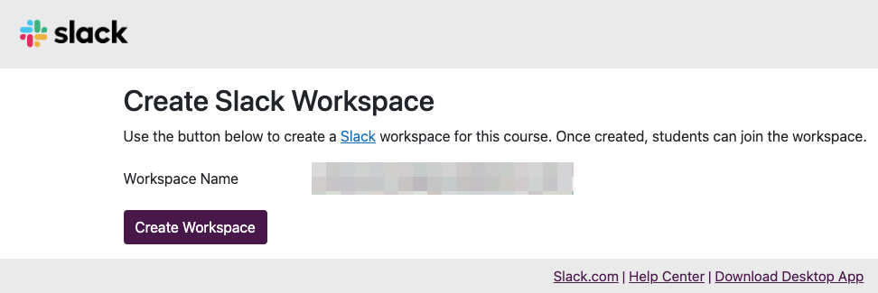
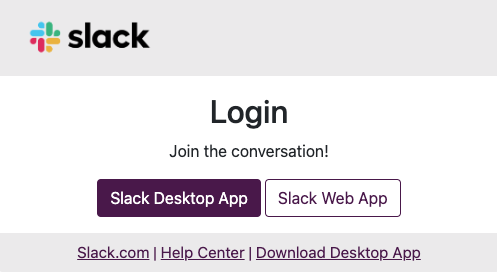

## 概要

UTOLのSlack連携機能を用いると，UTOL上のコースの担当教員や履修者などをメンバーとする専用のUTokyo Slackワークスペースを運用可能となります．授業に関する学生からの質問対応や，担当教員・TA同士の連絡などにご利用ください．

## 特徴

* UTOLのコースに登録されたコース参加者（担当教員・TA・履修者）が，連携したワークスペースのメンバーとして自動的に登録されます．従って，履修する学生が多い授業でSlack連携機能を使えば，ワークスペースのメンバー管理の手間を削減できます．
* コースの開講期間の終了と共に，連携したワークスペースはアーカイブ化され，「ワークスペースのオーナー」以外は閲覧できなくなります．
* 同じワークスペースを他の授業（コース）で利用することはできません．例えば，翌年度に同じ内容の授業を開講する場合でも，翌年度に当該授業用に作成されたコースと連携する新たなワークスペースを作成することになります．

## コースでSlack連携機能を利用開始する

1. [UTokyo Slack](/slack/)の利用に必須である，[情報セキュリティ教育](https://univtokyo.sharepoint.com/sites/Security/SitePages/Information_Security_Education.aspx)の受講や，[UTokyo Accountの多要素認証](/utokyo_account/mfa/)の有効化が完了していない場合は，それらを完了させてください．
2. [UTokyo Slackにおけるワークスペースの作成と運用](/slack/workspace/)を読み，ワークスペースの運用方法や運用における注意事項などをご確認ください．
   * Slack連携機能によるワークスペースは，UTOL経由で作成します．通常のUTokyo Slackの「新規ワークスペース作成申請」を行う必要はありません．
3. [\[UTOL\] Slack連携機能利用申請フォーム](https://forms.office.com/r/95dTmqB3ui)で，必要事項を入力してSlack連携機能の利用を申し込んでください．
   * 申し込みはコースごとに必要です．
   * 設定完了後，UTOL担当がメールでご連絡します．他の業務の都合によって数日を要する場合がありますが，ご了承ください．
   * 申し込みは当該コースの担当教員のみが可能です．TA等であっても，学生は申請できません．
4. 利用するコースのコーストップ画面で，左メニューの「コース設定」\>「LTI利用設定」を選択してください．
   * **これ以降の操作は，必ずワークスペースの管理・運用に責任を持つ「[代表責任者](/slack/workspace/#overview-and-preactions)」となる教職員が行ってください**．この操作を行ったユーザーに，作成されるワークスペースのオーナー権限が付与され，当該ユーザは代表責任者として扱われます．
5. 表の左側にある「利用する」のチェックボックスのうち，「Slack」にチェックを入れてください．
6. 「確認画面に進む」を押し，「登録する」を押してください．コース内で，UTokyo SlackをLTI連携として利用可能となります．
7. コーストップ画面に戻ったら「外部連携」の欄にある「Slack」を押してください．

    

8. "Create Slack Workspace"の画面に遷移したら「Create Workspace」ボタンを押してください．Slackワークスペースが作成され，自分自身はオーナー権限のメンバーとして登録されます．

    

## Slack連携機能を利用する

1. [UTokyo Slack](/slack/)の利用に必須である，[情報セキュリティ教育](https://univtokyo.sharepoint.com/sites/Security/SitePages/Information_Security_Education.aspx)の受講や，[UTokyo Accountの多要素認証](/utokyo_account/mfa/)の有効化が完了していない場合は，それらを完了させてください．
2. コーストップ画面の「外部連携」の欄にある「Slack」を押してください．
3. 下記の画面が現れたら，SlackアプリもしくはウェブブラウザからSlackを利用してください．

    

## 補足・注意事項

* ワークスペースを作成したユーザが「ワークスペースのオーナー」になり，そのワークスペースの管理・運用に責任を持つ「[代表責任者](/slack/workspace/#overview-and-preactions)」として扱われます．
* オーナー以外のコース参加者は，毎時1回実行される同期処理で，もしくは外部連携の「Slack」を押したタイミングで，当該コース専用のワークスペースのメンバーとして追加されます．
* オーナー以外のコース参加者は，すべて「通常メンバー」として登録されます．他の担当教員などにワークスペースの設定などを任せたい場合は，その方々のアカウント種別を「ワークスペースの管理者」に変更してください．
* コース参加者がUTokyo Slackを利用したことが無い場合は，[UTokyo Slack](/slack/)を読んで，適宜必要な設定を行うように案内してください．
* **コースの開講期間が終了して30日経過すると，アカウント種別がオーナー以外のメンバーは，ワークスペースから自動的に削除され，ワークスペースを閲覧できなくなります**．
  * なお，オーナー（最初に「準備」の手順4以降を行ったユーザ）は開講期間が終了しても閲覧できます．
  * 他の担当教員の方など，オーナー以外の方が学生との議論などを後日参照したい場合は，Slackの「データのエクスポート」をご利用ください．具体的な方法については[ワークスペースのデータをエクスポートする（Slack公式ヘルプページ）](https://slack.com/intl/ja-jp/help/articles/201658943)などをご覧ください．
* ワークスペースのメンバーには，コース参加者のほか「UTokyo Slack Primary Owner（アカウント種別：プライマリーワークスペースオーナー）」という特別なユーザが登録されています．UTokyo Slack Primary Ownerを削除することはできません．
