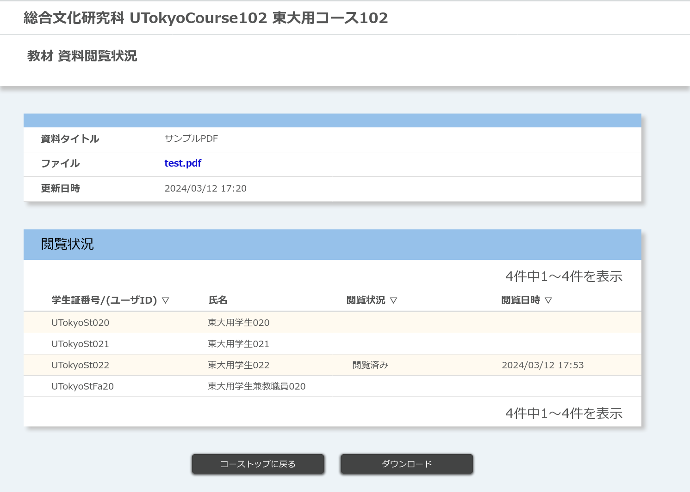

## 概要

教材機能は，UTOL上で授業に必要な資料を管理・公開できる機能です．資料には公開期間・公開対象を設定でき，どの履修者がいつ資料を閲覧したかを確認できます．

なお，担当教員・TA・コース設計者が教材を管理・閲覧できます．ただし，教材の閲覧状況を確認できるのは担当教員・TAのみです．

### 「教材」と「教材資料」

UTOL上では，資料はすべて「教材」という単位で管理されます．一つ一つの資料は「教材資料」と呼ばれ，それらを一定の区切りごとにまとめたものが「教材」です．公開期間・公開対象などの設定は，「教材」ごとに行います．

「教材」の区切りとしては，授業の各回ごと（例：「第1回講義資料(4/6)」）や，内容のまとまりごと（例：「刑事訴訟法関連資料集」）といったものが考えられます．さらに「[ラベル機能](/utol/lecturers/settings/#label)」を用いて，「教材」に課題やテストと共通のラベル（例：「1年生向け」）を付けて管理することもできます．

### 「ファイル」と「リンク」

「教材資料」には，「ファイル」と「リンク」の二種類があります．「ファイル」はUTOL内に直接アップロードされるファイル，「リンク」は外部サイトへのリンクです．

両者の使い分けは，主にファイルサイズを目安としてください．「ファイル」としてアップロードできるのは，**100MB以下**のサイズのもののみです．このため，サイズの大きいファイルは外部サイトにアップロードし，アップロード先へのリンクを「リンク」として掲載する必要があります．たとえば，授業スライドは「ファイル」として直接アップロードする一方，授業の録画はGoogle DriveやYouTubeなどにアップロードし，「リンク」として掲載する，といったやり方が考えられます．

なお，ファイルサイズの小さい資料であっても，「リンク」を利用して管理することもできます．資料を外部サイト（例：Google Slides）で管理している場合などがこれにあたります．

- 関連：
    - [Googleドライブ](/google/drive/)
    - [動画を作成・共有する](/articles/create_share_movie/)

## 教材の管理

ここでは，教材の管理（登録・更新・削除）の手順を説明します．

### 教材の登録手順

新しく教材を登録するには，「コーストップ」画面を開き，「教材」欄の左下にある {:.icon} ボタンを押します．

{:.center}

「教材 編集」のページが開くので，以下の内容を記入・選択してください．

{:.center}

- 「タイトル」（記入必須）
  - 例：第1回講義資料(4/ 6)
- 「教材内容」
  - 教材の説明を記入します．
- 「公開期間」（確認必須）

  - 例：授業開始前日から期末試験の日まで
  - 公開開始日時：授業開始直前のUTOLへの負荷集中を避け，履修者が事前に教材をダウンロードしておけるよう，少なくとも授業の前日までには公開開始するとよいでしょう．
  - 公開終了日時：履修者が試験日や最終課題の期限まで教材を閲覧できるよう，多少の余裕をもって設定するとよいでしょう．
    - 初期状態では，その学期の終期の日が設定されています．ただし，科目の**試験日や課題期限日がこれより後になることもあるため（特にAセメスター・A2ターム）**，日程をよく確認し，適宜設定してください．

{:.center}

- 「表示ラベル」
  - 新しくラベルを作成する場合，「表示ラベル新規作成」ボタンを押してください．
  - すでに作成済みのラベルを使う場合，ドロップダウンメニューからラベルを選択し，「表示ラベル追加」を押すと，追加できます．
  - 関連：
    - [UTOLでコース設定を行う（教員・TA向け）](/utol/lecturers/settings/)
- 「教材資料」
  - 「タイプ」
    - 教材資料の種類（ファイル，リンク）を選択します．
  - 「ファイル」または「リンク」（教材資料の種類に応じて）
    - 以下の手順に従って，教材資料を追加してください．
      - ファイルの場合
        - 「参照」ボタンを押してファイルを選択するか，指定のエリアにファイルをドラッグ&ドロップし，**必ず「ファイル追加」のボタンを押します**．
      - リンクの場合
        - リンクを入力し，「追加」のボタンを押します．
    - 画面下部に，上で追加した教材資料のファイル名やリンク名が表示されるので，その資料に付ける「資料タイトル」「コメント」を入力します．
  - 上の2つの操作を繰り返すと，複数の教材資料を追加できます．
    - なお，同時に追加可能なファイルは30個までです．
  - 一度追加した教材資料を削除したい場合は，画面下部の「操作」欄にあるボタンを押し，「削除」を選択します．
- 「公開対象」
  - 教材の公開対象を選択します．以下の三種類から選択できます．
  - 「すべての履修者」
  - 「ユーザグループ」
    - 事前に作成したユーザグループを対象に公開できます．
    - 関連：
      - [UTOLでユーザグループを使う（教員・TA向け）](/utol/lecturers/settings/user_groups/)
    - グループ名をクリックすると，グループに所属する履修者を確認できます．
  - 「履修者を選択」
    - 特定の履修者を選んで公開できます．
    - 履修者一覧が表示されるので，公開したい履修者にチェックを入れます．

記入を終えたら，「確認画面に進む」のボタンを押します．

「教材 登録内容確認」のページが開くので，内容を確認の上，「登録する」ボタンを押してください．

{:.center}

### 教材の更新・削除手順

1. 「コーストップ」画面を開き，「教材」欄のうち，教材名の右にある {:.icon} ボタンを押します．

{:.center}

2. 教材編集画面に移動するので，内容の更新・削除を行います．
    - 更新する場合：教材の登録手順と同様に編集します．
    - 削除する場合：編集画面右上の「教材を削除する」ボタンを押すと，教材を削除できます．

## 教材の閲覧

ここでは，登録済みの教材を閲覧する手順を説明します．

履修者だけでなく，教員・TA・コース設計者も登録済みの教材を閲覧できます．このため，実際の授業にあたって，お使いの端末からファイルを探し出さずとも，UTOL上で画像・スライド・レジュメなどを表示できます．また，登録した教材が履修者からどのように見えているかを確認する場合にも役立ちます．

なお，UTOLには一部のファイル形式の教材資料について，プレビュー表示を行う機能があります．以下の拡張子をもつファイルについては，わざわざ端末にダウンロードせずに，UTOL上でプレビュー表示して内容を確認できます．

- 拡張子: `.docx` / `.xlsx` / `.pptx`
- 拡張子: `.pdf`
- 拡張子: `.png` / `.gif` / `.jpg` / `.jpeg` / `.svg`

### 手順

1. コーストップを開き，画面上部の「閲覧ページ」ボタンをクリックします．

{:.center}

2. 閲覧ページに移るので，「教材」欄から閲覧したいファイル名を選んでクリックします．
3. 「ファイルをプレビュー表示もしくはダウンロードします」とポップアップが表示されるので，「表示」ボタンまたは「ダウンロード」ボタンを押します．
4. 閲覧を終えたら，画面上部の「編集ページ」ボタンをクリックし，編集ページに戻ります．

## 教材の閲覧状況確認

ここでは，教材の閲覧状況を確認する手順を説明します．

担当教員とTAは，どの履修者が・いつ教材を閲覧したかを確認できます．閲覧状況はUTOL上で確認できるほか，Excelファイル形式でもダウンロードできます（ファイルにはパスワードの設定が必須です）．

### 手順

1. 「コーストップ」を開き，「教材」欄のうち，閲覧状況を確認したいファイル名の右，「操作」の列にある {:.icon} ボタンを押します．

{:.center}

2. 「閲覧状況確認」リンクをクリックします．
3. 閲覧状況を示す表が表示されます．

{:.center}

4. Excelファイル形式でダウンロードする場合：
   1. 「ダウンロード」ボタンを押します．
   2. Excelファイルのパスワードを設定するよう求められるので，パスワードを入力し，もう一度「ダウンロード」ボタンを押してください．

## 参考情報

- 関連ページの一覧
  - [Googleドライブ](/google/drive/)
  - [UTOLでユーザグループを使う（教員・TA向け）](/utol/lecturers/settings/user_groups/)
  - [動画を作成・共有する](/articles/create_share_movie/)
