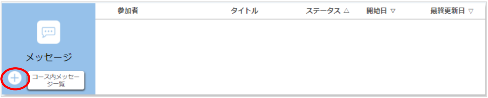
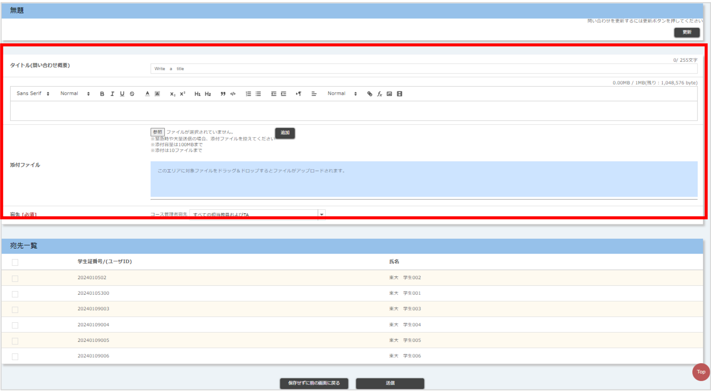
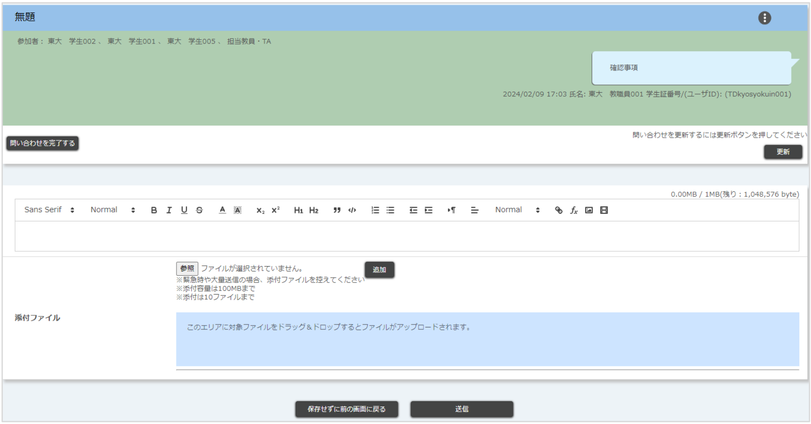

## 概要

教員・TAは履修者や他の教員・TAにメッセージを送ることができます．なお，メッセージ機能はデフォルトではオンですが，教員（TAは除く）によりオフにすることもできます．また，教員は履修者間のメッセージのやり取りを確認することはできますが，それに返信したり，そのメッセージを削除することはできません．

履修者からのメッセージ，他の担当教員およびTAが返信したメッセージについて，メールやLINEで通知を受信することができます．詳細は「[UTOLからの通知を設定する](https://utelecon.adm.u-tokyo.ac.jp/utol/notification/)」を参照してください．

## メッセージの送信

1.  コーストップ画面のメッセージ欄の[+]ボタンをクリックしてください．
    
2.  以下の画像のようなメッセージ投稿画面に，以下の必要事項を入力してください．なお，送信前に[更新]ボタンをクリックすると、入力した内容が消えてしまう可能性がありますのでご注意ください．
    
    * タイトル
    * 本文
      * マークアップ機能を利用できます．マークアップ機能の使い方についての詳細は「[UTOLでマークアップ機能を利用する](https://utelecon.adm.u-tokyo.ac.jp/utol/markup/)」を参照してください．
    * 添付ファイル
      * [参照]ボタンをクリックしてファイルを選択したあと，[追加]ボタンをクリックすることでファイルを添付できます．
      * 緊急時や大量送信の場合は，ファイルの添付を控えてください．
    * 宛先：メッセージを送りたい相手に応じて，教員・TA（コース管理者）の宛先と学生の宛先を別々に指定してください．
      * 教員・TA（コース管理者）の宛先を指定する
        * 「すべての担当教員およびTA」，「すべての担当教員」のどちらかを選択してください．
      * 学生の宛先を指定する
        * 宛先一覧から，左端のボックスにチェックを入れることで学生を選択してください。なお，一番上のボックスにチェックを入れると，すべての学生を選択することができます．
3.  画面下部の[送信]ボタンをクリックすると送信完了です．
4.  送信が完了すると，メッセージ投稿画面に遷移します．
    

## 自分宛のメッセージの確認・返信

