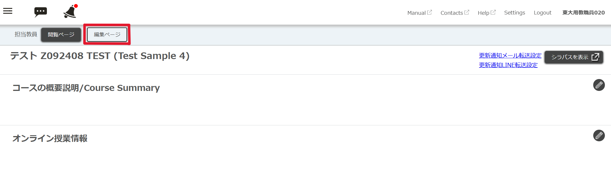
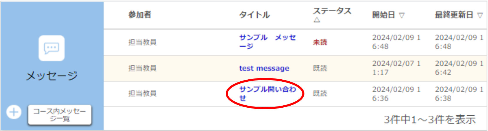
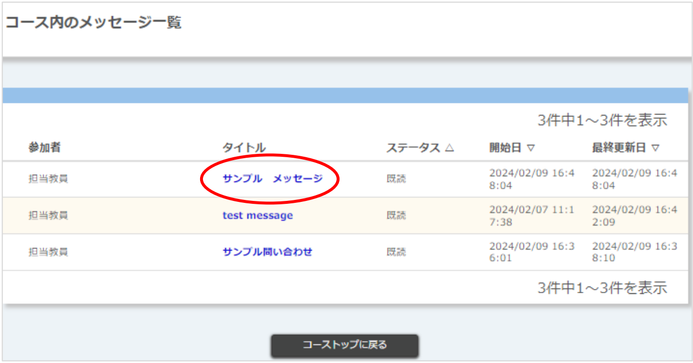
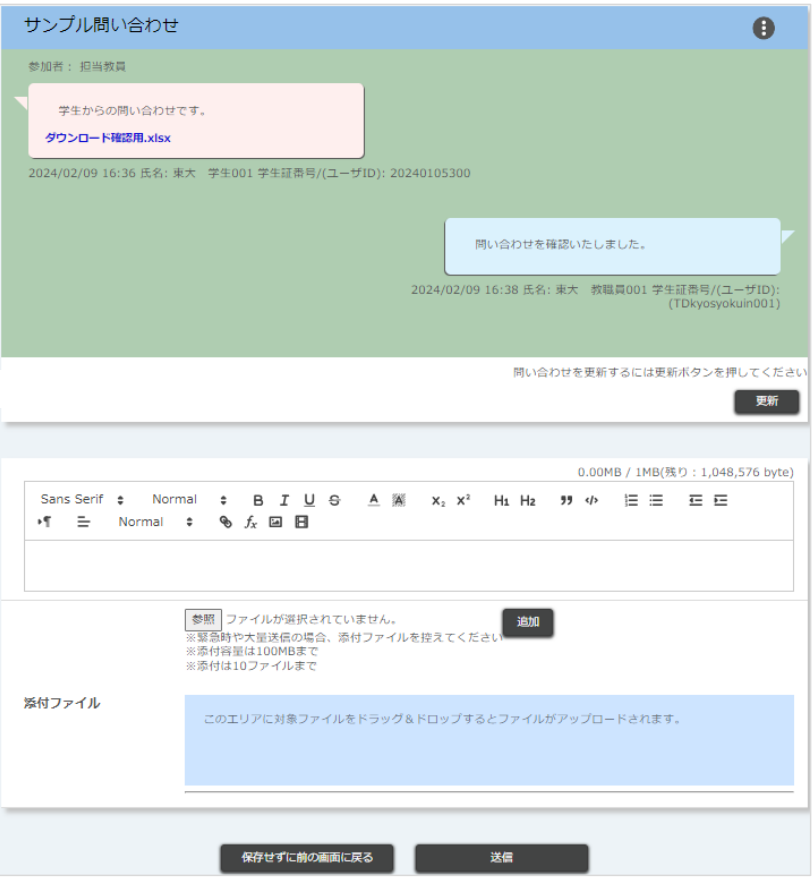
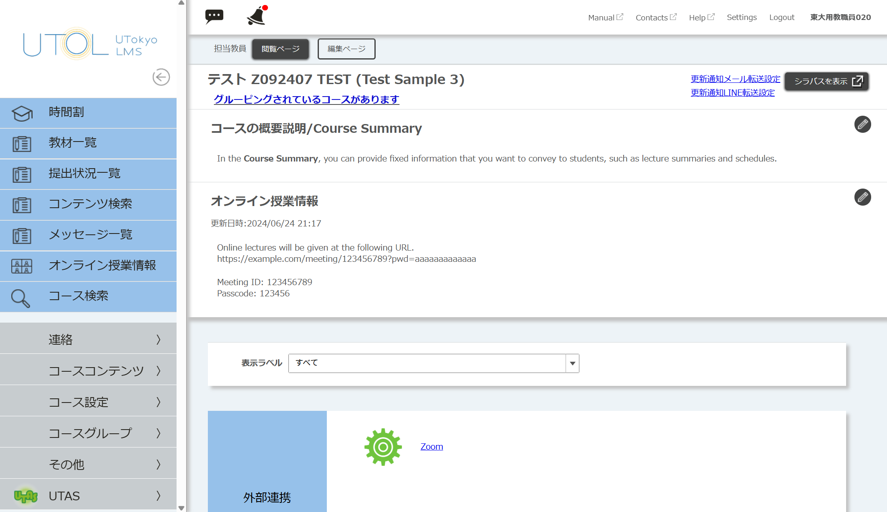
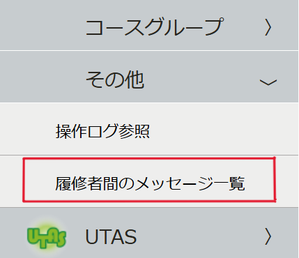
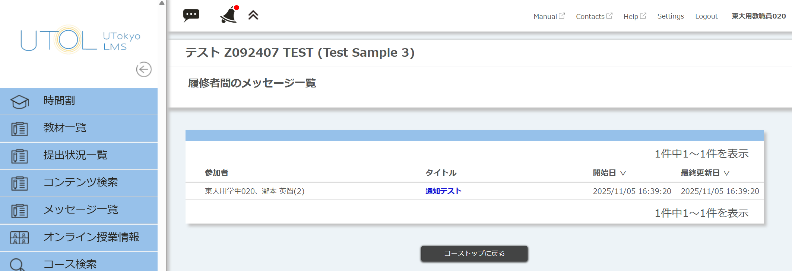
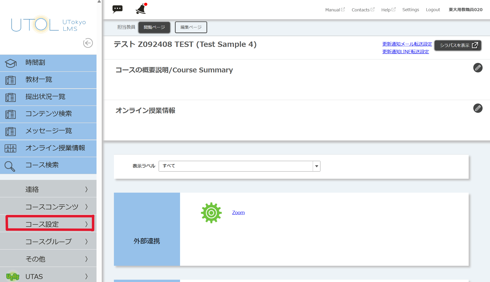
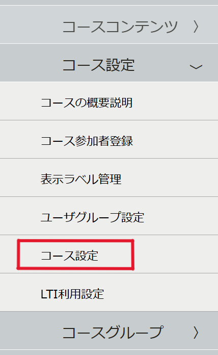
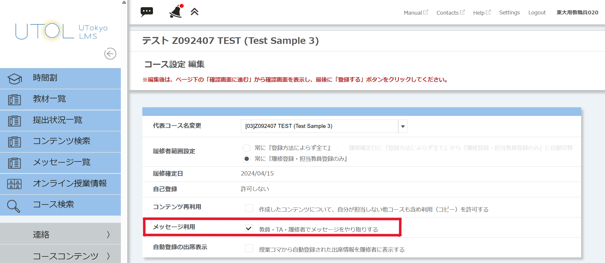

## 概要

UTOLのコース参加者（担当教員やTA，履修者）は他のコース参加者にメッセージを送ることができます．メッセージ機能は，履修者が担当教員に質問する，履修者同士でのグループワークのやり取りに使うなど，授業内外でのコミュニケーションに便利です．

なお，メッセージ機能はデフォルトでは有効化されていますが，設定により無効化することもできます．メッセージ機能の有効化・無効化をする方法に関しては「[メッセージ機能の有効化・無効化](#enable_disable_function)」を参照してください．

また履修者からのメッセージ，他の担当教員およびTAが返信したメッセージについて，メールやLINEで通知を受信することができます．詳細は「[UTOLからの通知を設定する](../../notification/)」を参照してください．

## メッセージの送信

1.  コーストップ画面のメッセージ欄の{:.icon}ボタンをクリックしてください．
    
2.  以下の画像のようなメッセージ投稿画面に，以下の必要事項を入力してください．なお，送信前に[更新]ボタンをクリックすると，入力した内容が消えてしまう可能性がありますのでご注意ください．
    
    * タイトル
    * 本文
      * マークアップ機能を利用できます．マークアップ機能の使い方についての詳細は「[UTOLでマークアップ機能を利用する](https://utelecon.adm.u-tokyo.ac.jp/utol/markup/)」を参照してください．
    * 添付ファイル
      * [参照]ボタンをクリックしてファイルを選択したあと，[追加]ボタンをクリックすることでファイルを添付できます．
      * 緊急時や大量送信の場合は，ファイルの添付を控えてください．
    * 宛先：メッセージを送りたい相手に応じて，教員・TA（コース管理者）の宛先と学生の宛先を別々に指定してください．
      * 教員・TA（コース管理者）の宛先を指定する
        * 「すべての担当教員およびTA」，「すべての担当教員」のどちらかを選択してください．
      * 学生の宛先を指定する
        * 宛先一覧から，左端のボックスにチェックを入れることで学生を選択してください．なお，一番上のボックスにチェックを入れると，すべての学生を選択することができます．
3.  画面下部の「送信」ボタンをクリックしてください．
4.  送信が完了すると，メッセージ投稿画面に遷移します．
    

## 自分宛のメッセージの確認・返信

1. コーストップ画面のメッセージ欄の部分を確認してください．
    - 未読のメッセージがあると，メッセージ欄ステータス列に「未読」と表示されます．
    - メッセージ欄にメッセージの一覧が表示されない場合は，コーストップ画面上部のボタンが「編集ページ」になっているか確認してください．（「閲覧ページ」の状態ではメッセージ欄は表示されますが，実際に受け取ったメッセージは表示されず，メッセージの一覧は常に空となります．）
      
    - 「コース内のメッセージ一覧」をクリックすると，自分が送信者または受信者であるメッセージの一覧を表示することができます．
2. 確認したいメッセージのタイトルをクリックしてください．メッセージ投稿画面に遷移します．
    <figure class="gallery"> </figure>
    
    - この時点でメッセージのステータスは「未読」から「既読」になります．
    - 「メッセージ投稿画面」では，更新ボタンをクリックすることで，画面を更新することができます．画面を開いている間に他のユーザーがメッセージを投稿していた場合にクリックすると，その内容が表示されます．

## 履修者間のメッセージのやり取りの確認

担当教員は履修者間のメッセージのやり取りを確認することができます．ただし，返信したり，削除したりすることはできません．またTAは確認もできません．

1.  コーストップ画面の左上にある3本線のメニューを開き，その中から「その他」をクリックしてください．
    
2.  「その他」のメニューの中から，「履修者間のメッセージ一覧」をクリックしてください．
    {:.small}
3.  履修者間のメッセージ一覧が表示されます．確認したいメッセージのタイトルをクリックすると，メッセージ投稿画面に遷移します．
    

## メッセージ機能の有効化・無効化
{:#enable_disable_function}

担当教員はそのコースのメッセージ機能の有効化・無効化をすることができます．なおTAにはその権限がありません．

1.  コーストップ画面の左上にある3本線のメニューを開き，その中から「コース設定」をクリックしてください．

2.  「コース設定」のメニューの中から，再び「コース設定」をクリックしてください．

3.  コース設定の編集画面が表示されます．その中の「メッセージ利用」のチェックを，有効化する場合は入れ，無効化する場合は外し，ページ下部の「確認画面に進む」をクリックしてください．

4.  登録内容確認の画面が表示されます．「メッセージ利用」の項において，有効化する場合は「教員・TA・履修者でメッセージをやり取りする」，無効化する場合は「教員・TA・履修者でメッセージをやり取りしない」になっていることを確認し，ページ下部の「登録する」をクリックしてください．
