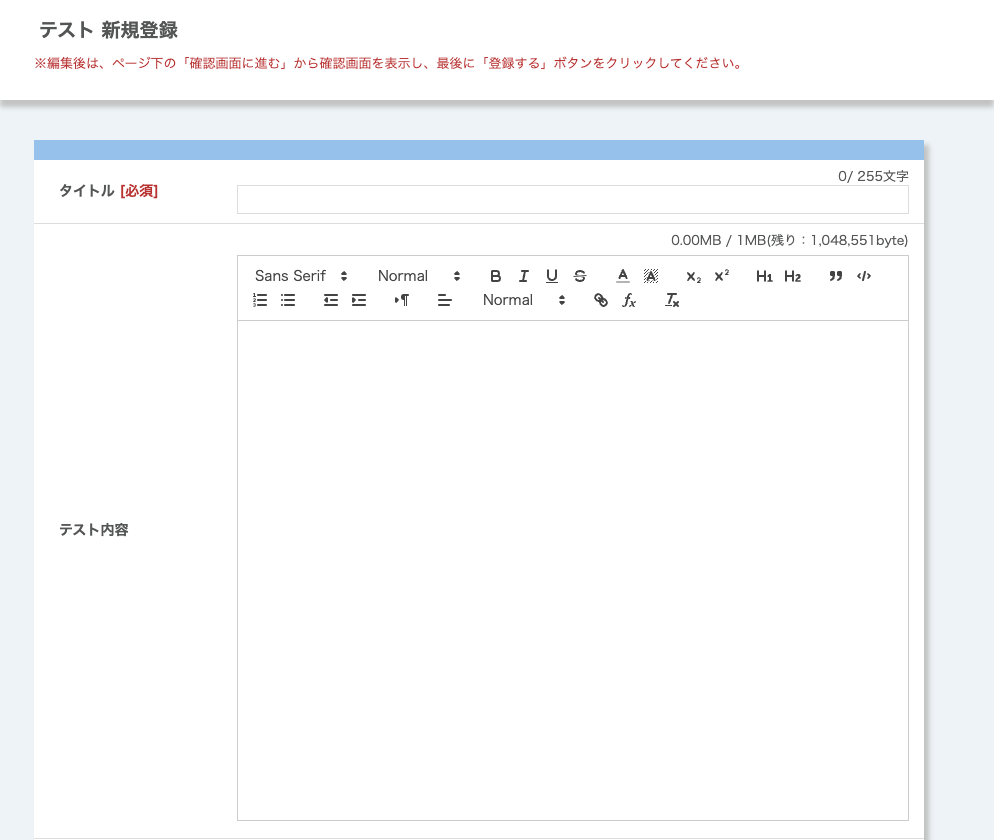
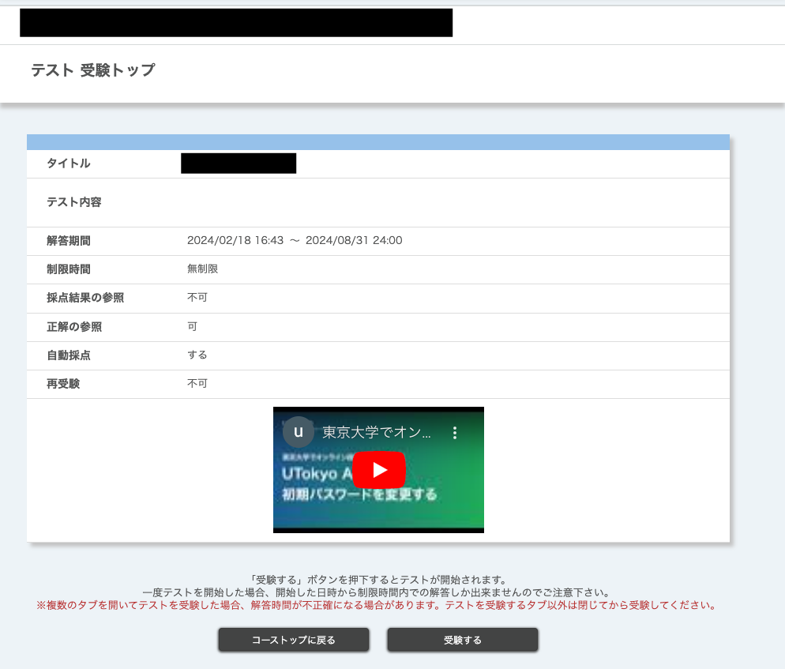
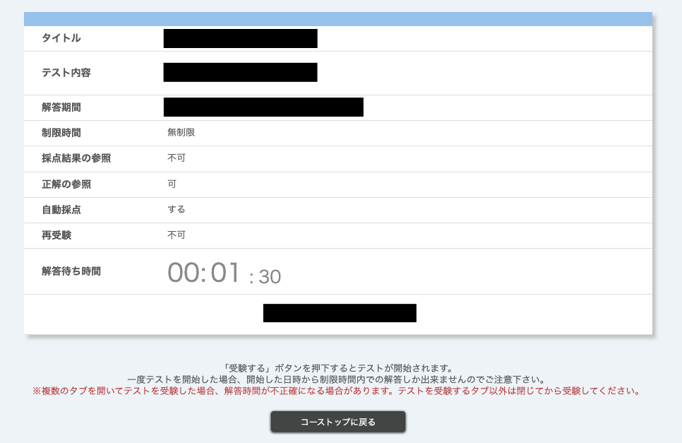
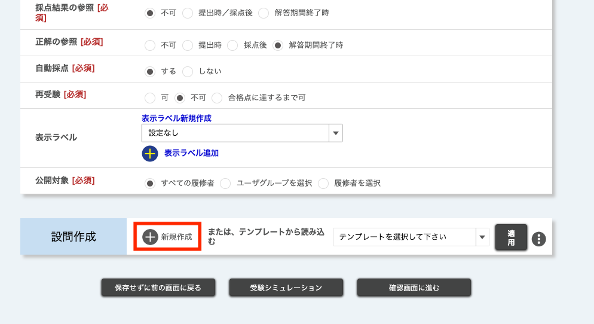
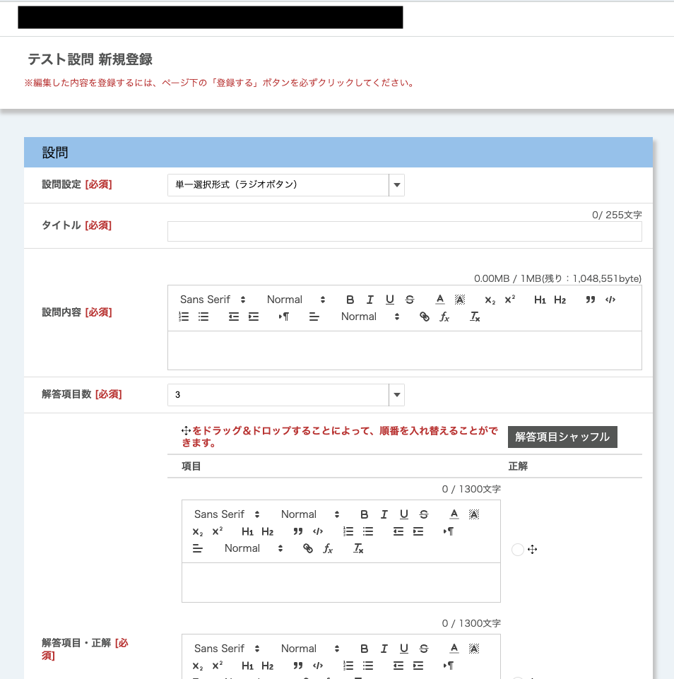
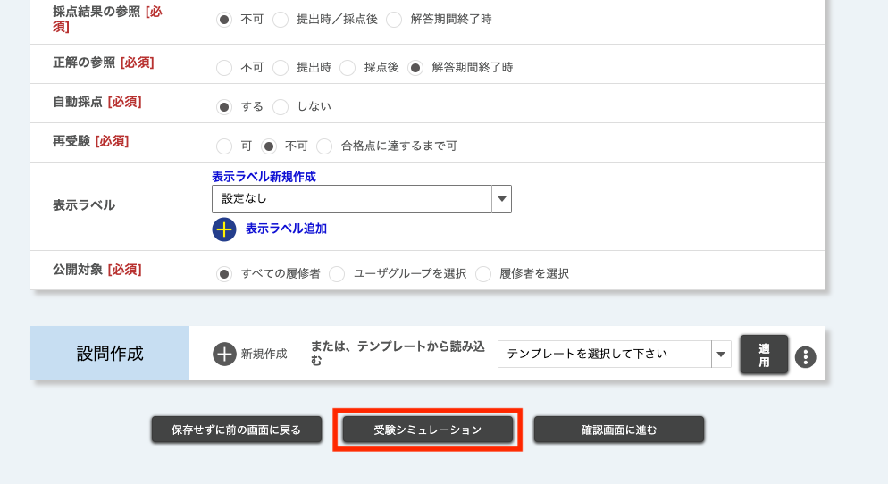
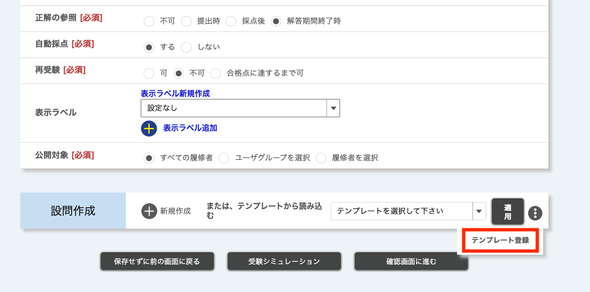
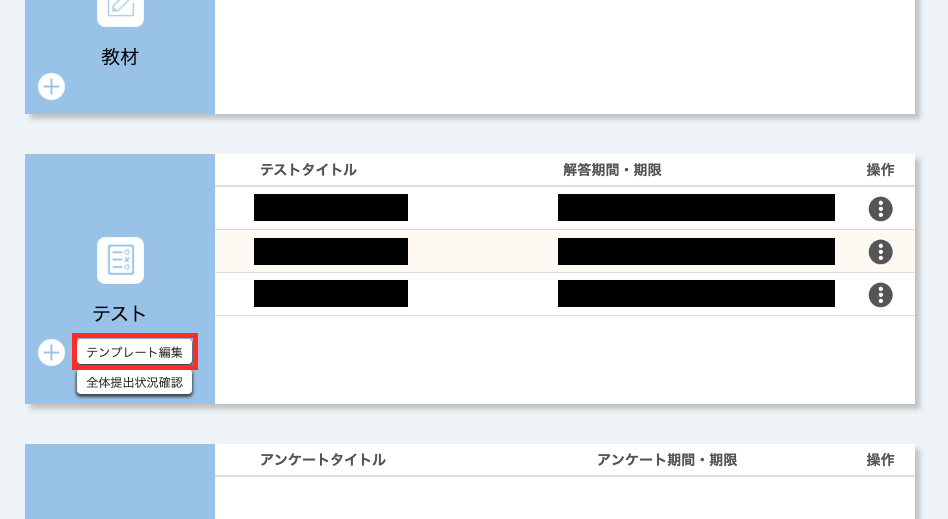

このページでは，UTOLで新しくテストを作成する方法および既存のテストを編集する方法を解説します．

テストを採点する・提出状況を確認する方法については「**[テストを採点する・提出状況を確認する](grade_and_evaluate)**」を，テスト機能全般の説明は「**[テスト機能を利用する](.)**」を参照してください．

## 新しいテストを作成する
{:#create}

新しいテストを作成するには，「コーストップ」画面の「テスト」欄で「＋」を押してください．テストの「新規登録」画面が表示されます．

以下の手順1〜手順3にしたがって，テストの設定を行ってください．

### 手順1：テスト全体の設定
{:#general_settings}

まず，テスト全体の設定項目を入力してください．設定を行った後でも編集することはできますが，タイミングによっては編集できる項目が制限されます．詳しくは，本ページ下部「[作成したテストを編集する](#update)」を参照してください．

各設定項目の意味と注意点は以下の通りです．なお，*印の付いている項目は入力必須です．

- **タイトル***：テストのタイトル．
- **テスト内容***：テストの説明（[マークアップ機能](/utol/markup/)対応）．
- **動画配信URL**：受験開始前の画面で表示する動画URL．
    {:.small}
    - `http://`から始まるURLの場合，動画そのものではなく，動画へのリンクが表示されます．
- **解答期間***：テストに解答できる期間を開始日時と終了日時で指定してください．
- **制限時間**：制限時間を設定できます．
    - 設定した場合，制限時間を過ぎると自動で解答が送信されるようになります．
- **解答待ち時間***：「受験トップ」画面で履修者を待機させる時間です．
    - 設定した場合，その時間が経過するまで受験を開始できません．
    - この機能は，動画配信URLで指定した動画を確実に視聴させるために使うことが考えられます．
- **待ち時間表示**：解答待ち時間を設定した場合に，解答待ち時間を表示するかどうか．
    {:.small}
- **ランダム出題***：履修者によって異なる問題をランダムに出題するかどうか．
    - ランダムに出題する場合，出題する問題の数も入力してください．
    - 履修者によらず必ず出題したい設問は，設問を必須問題とすると必ず出題できます．必須問題の指定方法は，[手順2](#create_problem)の末尾を参照してください．
- **合格点***：指定された点数を超えた解答が，UTOL上で「合格」として扱われます．
- **採点結果の参照***：採点結果を履修者が自分で参照できるかどうか．
    - 不可：一切参照できません．
    - 提出時／採点後：提出日時以降に参照できます．
    - 解答期間終了後：解答期間終了後に参照できます．
        - 「不可」以外の場合，採点が完了している設問から順次採点結果を参照できるようになります．
- **正解の参照***：正解を履修者に開示するかどうか．
    - 不可：一切参照できません．
    - 提出時：提出日時以降に参照できます．
    - 採点後：採点が完了した設問から参照できます．
    - 解答期間終了後：解答期間終了後に参照できます．
        - 「提出時」「採点後」の場合，まだ受験していない他の履修者に正解が伝わる可能性があるので注意してください．
- **自動採点***：設問を自動採点するかどうか．
    - 自動採点に対応していない設問は，教員やTAが採点する必要があります．
- **再受験***：解答を一度提出した後再び受験できるかどうか．
    - 合格点に達していない場合のみ再受験を可能とすることもできます．
- **表示ラベル**：テストに分類用のラベルを付与できます．
    - ラベルを付与すると，履修者がラベルごとにテストを表示できるようになります．
- **公開対象***：テストを受験できる履修者を制限する機能です．
    - 初期状態では「すべての履修者」がテストを受験できます．
    - [ユーザグループ](../settings/user_groups/)や履修者を指定することで，コース内の特定の履修者のみがテストを受験できるように制限できます．

### 手順2：設問の作成
{:#create_problem}

続いて，「新規登録」画面の下部にある「設問作成」欄で「新規作成」を押してください．設問の「新規登録」画面が表示されます．

1. 初めに，作成する設問の形式を決めます．以下の4種類の中から，問いたい内容に応じて適切なものを選択してください．
    - **単一選択形式**：選択肢から1つを選択させる問題です．自動採点ができます．
    - **複数選択形式**：選択肢から複数を選択させる問題です．自動採点ができます．
    - **フリーテキスト形式**：答えを自由に記述させる問題です．自動採点はできません．
    - **穴埋め形式**：設問中の空欄を埋めさせる問題です．自動採点ができますが，完全に一致したときにのみ正答とされるため表記ゆれなどの扱いに注意が必要です．
1. 続いて，設問の情報を入力してください（下図は，単一選択形式の場合のスクリーンショットです）．
    

    各設定項目の意味と注意点は以下の通りです．なお，\*印のついた項目は入力必須です．
    - **タイトル***：設問のタイトル．
    - **設問内容***：問題文（[マークアップ機能](/utol/markup/)対応）．
        - （穴埋め形式のみ）穴埋めの空欄は右上の「穴埋めタグ追加」を押して挿入してください．この際に挿入される文字列`[fb]`が空欄となって出題されます．
    - **解答項目数***：（フリーテキスト形式を除く）選択肢または空欄の数．
    - **解答項目・正解***：（選択形式のみ）解答の選択肢．
        - 正解は右側のラジオボタンで指定してください．
    - **正解***：（穴埋め形式・フリーテキスト形式のみ）正解．
        - 自動採点のできないフリーテキスト形式においても，入力必須です．
    - **自動採点形式***：（穴埋め形式のみ）複数の空欄がある場合にどのように配点するか．
        - 以下の3形式があります．
            - 正解（完全一致）の穴の数に応じて配点
            - 不正解（完全一致しない）の穴があれば0点
            - 不正解（完全一致しない）の穴があれば未採点
        - 空欄ごとに点数を重み付けすることはできません．
    - **解説文**：解説文．
    - **配点***：配点．
    - **画像**：画像に関する設問を出題する場合や補助的に画像を使いたい場合に画像をアップロードできます．
1. 必要事項を入力したら，画面下部の「登録する」を押して，設問を登録してください．この時点では設問が登録されただけで，テストの登録は完了していません．
1. テスト全体の設定と設問の作成を終えたら，「新規登録」画面の下部にある「確認画面に進む」を押して内容を確認し，「登録する」を押してテストを登録してください．

なお，作成した設問はテストの「新規登録」画面で順番を並べ替えたり，再び編集したりすることができます．

また，手順1で「ランダム出題」を利用する設定にした場合，「新規登録」画面で必須問題を指定できます．必須にしたい設問の右上に現れるチェックボックスにチェックを入れてください．

### 手順3：受験シミュレーション
{:#simulation}
テストを作成した後は「**受験シミュレーション**」機能によって，履修者が実際に受験する流れを確認できます．この機能を利用して，テスト作成者の視点だけではなく履修者の視点から，きちんとテストに解答できるか，解答不能な問題がないかなどの確認をすることをお勧めします．

1. 「新規登録」もしくは「編集」画面の下部の「受験シミュレーション」を押してください．受験シミュレーションが始まります．
    
1. 「受験トップ」画面が表示されます．「受験する」を押して受験を始めてください．
    - 解答待ち時間があるテストの場合，「待ち時間スキップ」を押すと待ち時間がなくなり「受験する」が表示されます．
1. 各設問に解答してください．
1. 解答が終わったら「確認画面に進む」を押して確認画面に進んでください．
1. 解答内容を確認して「解答する」を押して解答内容を送信してください．「解答結果」画面が表示されます．
1. 最後に「戻る」を押してください．「新規登録」画面もしくは「編集」画面に移動します．

受験シミュレーションで不備が見つかった場合は，後述する「[作成したテストを編集する](#update)」を参考にテストを修正してください．

## 作成したテストを編集する
{:#update}

既に作成したテストを編集するには，「コーストップ」画面の「テスト」欄で対象のテストのタイトルを押してください．新規登録時と同様の画面である「編集」画面が表示されます．

### テスト全体の設定を編集する
テスト全体についての設定を編集できます．各設定項目の説明は「新しいテストを作成する」内の「[手順1：テスト全体の設定](#general_settings)」を参照してください．

新規登録時と異なり，タイミングによっては編集できる項目が制限されます．編集できる項目は，以下の通りです．
- 解答期間開始**前**：すべての項目
- 解答期間開始**後**：以下の7項目のみ
    - タイトル
    - テスト内容
    - 動画配信URL
    - 解答期間の終了日時（延長・短縮）
    - 採点結果の参照
    - 正解の参照
    - 設問の解答項目

### 設問を編集する
テストの各設問を編集できます．設問を編集するには右上の鉛筆マークを押してください．設問の各項目の説明は「新しいテストを作成する」内の「[手順2：設問の作成](#create_problem)」を参照してください．

テスト全体の設定と同様に，タイミングによって編集できる項目が制限されます．編集できる項目は，以下のとおりです．
- 解答期間開始**前**：すべての項目
- 解答期間開始**後**：以下の項目のみ
    - 解答項目（選択形式のみ）
    - 正解

また，解答期間開始後には，設問の順番の並び替えや設問の追加・削除はできません．

自動採点対象の設問（選択形式・穴埋め形式）が変更されると，解答が再度採点されるとともに対象の学生に更新通知が送信されます．そのため，解答期間開始後であり，既に解答した学生が存在する場合は，採点時に注意が必要です．

## テンプレートを利用する
{:#use_templates}

テスト機能では，作成したテストを**テンプレート**として登録することで，自身が担当教員・TA・コース設計者のいずれかとして参加している他のコースで，テストを再利用できます．また，他のユーザーが登録したテンプレートも，同一コース内に限り利用できます．同じ内容の授業を複数担当している場合や，過去の年度のテストを再利用したい場合などにうまくご活用ください．

なお，テンプレートとして保存される設定項目は，テストのタイトル（テンプレートのタイトルとして保存されます）と各設問のみです．

### テンプレートを登録する

テンプレートを登録するには，以下の手順に従ってください．

1. 「コーストップ」画面の「テスト」欄でテンプレートとして登録したいテストのタイトルを押してください．
1. 「編集」画面が表示されたら「設問作成」欄の左側の「︙」マーク内の「テンプレート登録」を押してください．

1. 「テンプレート登録内容確認」画面が表示されたら，登録するテンプレートの内容に間違いがないことを確認して「登録する」を押してください．

なお，テンプレートのタイトルは，テストのタイトルと同名で登録されます．テンプレート間でタイトルの重複も可能ですが，見分けがつかなくなることを防ぐため，次の「テンプレートを編集・削除する」に従ってタイトルを区別しやすいものに変更することをお勧めします．

### テンプレートを編集・削除する

テンプレートを編集・削除するには，以下の手順に従ってください．

1. 「コーストップ」画面の「テスト」欄で「テンプレート編集」を押してください．「テンプレート一覧」画面が表示されます．

1. 編集・削除したいテンプレートのタイトルを押してください．
    - **テンプレートを編集する場合**：表示されている設定項目を編集してください．編集できるのは，テンプレートのタイトルと設問のみです．「新規登録」画面や「編集」画面で表示されていたその他の項目は，テンプレートに含まれないため編集できません．
    - **テンプレートを削除する場合**：画面右上の「削除する」を押してください．

### 他のユーザーのテンプレートを引き継ぐ

自分以外が作成したテンプレートは，自分のテンプレートとして登録できます．この機能を利用して，他のユーザーからテンプレートを引き継ぐには，以下の手順に従ってください．

1. 「コーストップ」画面の「テスト」欄で「テンプレート編集」を押してください．「テンプレート一覧」画面が表示されます．
1. 他のユーザーが作成したテンプレートには「登録する」が表示されます．引き継ぎたいテンプレートの「登録する」を押してください．
1. 「テンプレート登録/編集」画面が表示されます．タイトルをわかりやすいものに変更するなど必要な変更を行って「確認画面に進む」を押してください．
1. 内容を確認し誤りがなければ「登録する」を押してください．
