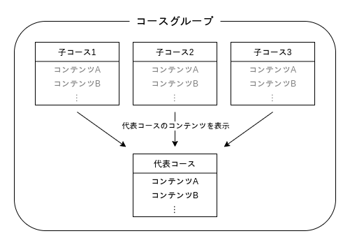
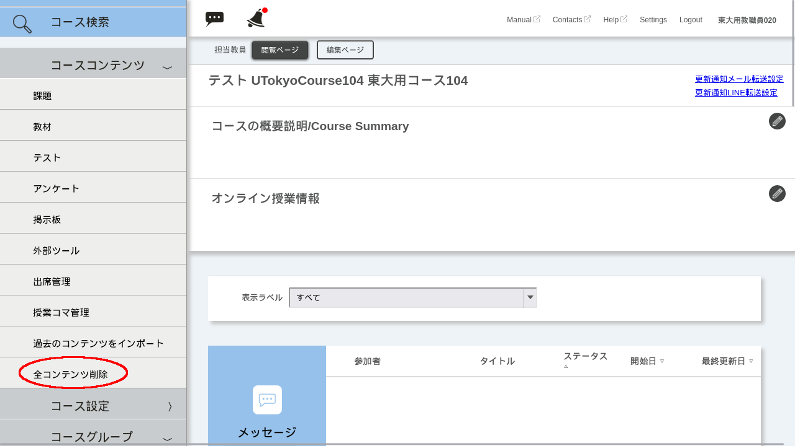
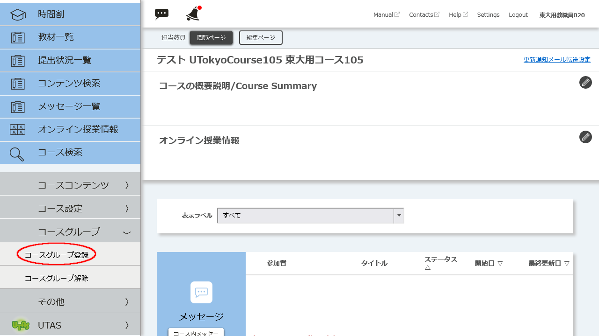
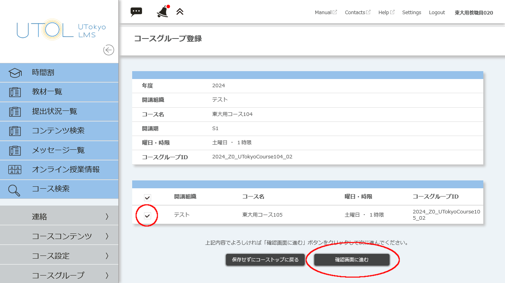
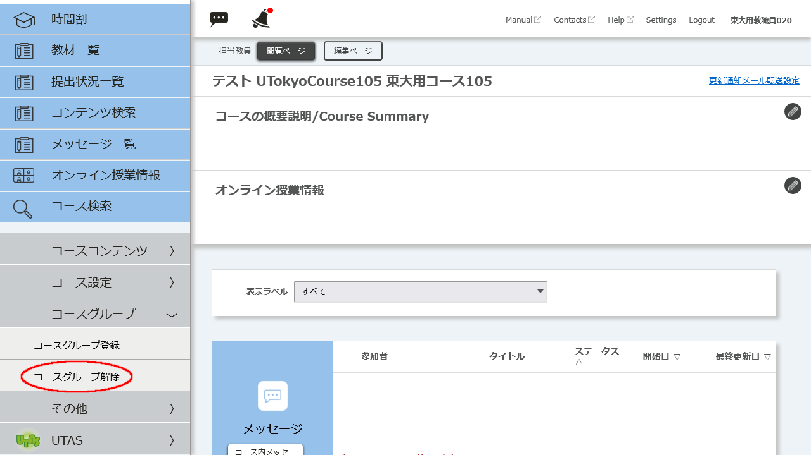
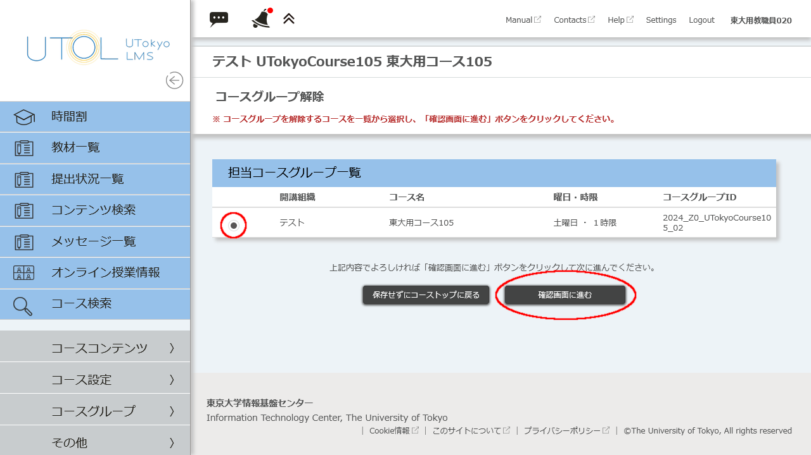

UTOL上に自動で作成されるコースは，学務システム（UTAS）上の時間割コードをもとに登録されます．そのため，一つの授業を複数の学科で開講する場合（合併科目として開講する場合）などには，同じ授業に対して複数のコースが登録されることがあります．

このような場合には，コースグループ機能を用いると，教材やテスト，お知らせなどを一括で管理できます．
コースグループ機能を用いて，複数のコースを一つの「代表コース」に紐付けた「コースグループ」を設定すると，グループ内のどのコースを登録・閲覧しているかに関わらず，代表コースのコンテンツを表示させることができます．

なお，UTOL上にコースが作成される前にUTAS上で合併科目（複数看板科目）設定を行った場合，自動でコースグループが設定されます．自動作成されたコースグループは，担当教員やシステム管理者であってもグループ設定を解除することはできません．

## コースグループを登録する
コースグループを設定する前に，子コースとして登録されるコースからはすべてのコンテンツを削除する必要があります．子コースにコンテンツを追加する操作を行っていない場合には，「子コースからコースコンテンツを削除する手順」を行う必要はありません．

また，すでに別のコースグループに属しているコースを，新たに別コースの子コースとして追加することはできません．コースグループ済みのコース同士をコースグループにするなど，このページに記載されている手順通りに操作してもコースグループを作成できない場合は，[uteleconサポート窓口経由](https://utelecon.adm.u-tokyo.ac.jp/support/)で，情報基盤センターUTOL担当にご連絡ださい.

### 手順1 子コースとするコースからコースコンテンツを削除する
1. 出講表から，子となるコースを押し，コーストップ画面を開いてください．
2. 画面左上の{:.icon}を押してください．
3. 左側に表示されたメニューの「コースコンテンツ >」を展開して，「全コンテンツ削除」を押してください．
    
4. 「本当に全コンテンツを削除してよろしいですか？ ※削除すると元には戻せません。」というダイアログボックスが表示されます．「削除する」を押してください．

### 手順2 コースグループを登録する
1. 出講表から，代表となるコースを押し，コーストップ画面を開いてください．
2. 画面左上の{:.icon}を押してください．
3. 左側に表示されたメニューの「コースグループ >」を展開して，「コースグループ登録」を押してください． 
    
4. 「コースグループ登録」画面で，子コースとしたいコースの行の左側にあるチェックボックスを押し,「確認画面へ進む」を押してください．
    
5. 確認画面が表示されます．「登録する」を押してください．

## コースグループを解除する
### 注意事項
コースグループを解除する際には，以下の事項に留意してください．
* コース内のコンテンツはすべて代表コースに移行され，子コースからは閲覧できなくなります．
* 代表コース以外の受講者から提出された課題やテストのデータは参照できなくなります．
* UTAS上で合併科目（複数看板科目）として自動でコースグループ化された科目は，担当教員・システム管理者ともに解除できません．

### 手順
1. 出講表から，コースグループを解除したいコースを押し，コーストップ画面を開いてください．
2. 画面左上の{:.icon}を押してください．
3. 左側に表示されたメニューの「コースグループ >」を展開して，「コースグループ解除」を押してください．
    
4. 「コースグループ解除」画面で，グルーピングを解除したいコースグループを選択し，「確認画面へ進む」を押してください．
    
5. 「解除対象コースを履修しているユーザの提出データは参照できなくなりますがよろしいですか？ ※解除すると元には戻せません。」というダイアログが表示されます．「解除する」を押してください．
6. 確認画面が表示されます．「解除する」を押してください．

## コース名の表示について
担当教員の画面には，担当教員として登録したコースに関わらず，常に「代表コース名」が表示されます（履修者には登録したコースが表示されます）．画面上に代表コース名しか表示されていなくても，コースグループ解除の画面で担当コースグループ一覧に表示されていれば，子コースは正常に登録されています．なお代表コース名は， コーストップ画面から「コース設定 > コース設定」 を開き，「代表コース名変更」 から変更することができます．
