このページでは，コースの概要説明や参加者の管理といった，UTOLのコース全体に関わる設定を説明します．

また，コース内の設定だけでなく，コースグループやコンテンツの再利用といった，他のコースと連携する方法も説明します．

なお，TAは，このページで説明する内容のうち，ラベルの管理，オンライン授業情報の更新，「コース参加者登録」画面の**閲覧のみ**が可能です．その他の機能を利用したり，コース参加者の追加・削除を行ったりすることはできません．

[^1]:
    「コース設定→表示ラベル管理」等の表記は，左メニュー（画面左上の{:.icon}を押すと左側に表示されるメニュー）内の「コース設定」の中にある「表示ラベル管理」という意味です．

    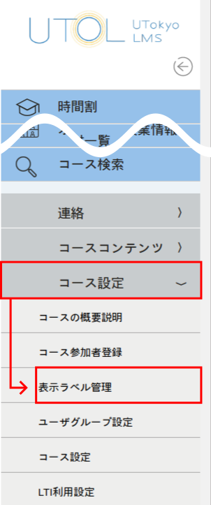{:.medium}

## コース内の設定
{:#in-course}

ここでは，以下のような，コース内の設定を説明します．

- [コースの概要説明・オンライン授業情報](#coursetop-headers)
- [参加者の管理](#participant)
- [ラベル](#label)
- [メッセージと出席の設定](#message-and-attendance)
- [LTI連携](#lti)

### コースの概要説明・オンライン授業情報
{:#coursetop-headers}

「コースの概要説明」と「オンライン授業情報」は，担当教員等と受講者双方の画面で，コーストップ（コースの詳細画面）の上部に表示される項目です．

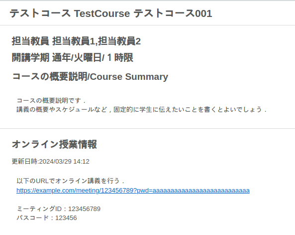{:.medium}

これらは，コーストップの右端にある{:.icon}（鉛筆のマーク）を押すと編集できます．なお，「コースの概要説明」は，「コース設定→コースの概要説明」[^1]からも編集画面を開くことができます．

#### コースの概要説明
{:#course-description}

「コースの概要説明」には，講義の概要やスケジュールなど，固定的に学生に伝えたいことを書くとよいでしょう．

また，この設定項目では，マークアップを利用できます．マークアップを使った書き方について詳しくは「マークアップ」を参照してください．

#### オンライン授業情報
{:#online-lecture-info}

オンライン授業を行う場合は，「オンライン授業情報」にオンライン授業のURLなど，オンライン授業にアクセスするための情報を書いてください．

なお，オンライン授業のURLの通知には必ずこの「オンライン授業情報」欄を利用し，「コースの概要説明」欄や，お知らせ，掲示板等には掲載しないようお願いします．詳しくは「[授業URLの連絡方法（教員向け）](/faculty_members/url)」を参照してください．

「オンライン授業情報」を編集する際は，次の点に注意してください．

- アプリから参加する学生のため，URLだけでなく，ミーティングID，パスコード等も記入してください．
- 編集画面では，URLは自動ではハイパーリンクになりません．ハイパーリンクにする手順は次のとおりです．
  1. URLを選択した状態で左上の{:.icon}（鎖のアイコン）を押してください．
     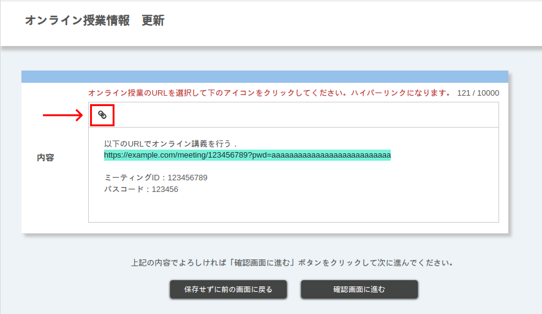{:.medium}
  1. リンク先のURLを入力するよう求められるので，URLを確認して「Save」を押してください．
     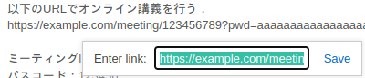{:.small}

### 参加者の管理
{:#participant}

UTOLではコースごとに，担当教員・コース設計者・TA・履修者（これらを「参加者」と呼びます）を管理することができます．

参加者の管理は「[コース参加者登録](#course-participants)」で行えます．ただし，以下の参加者に関しては，担当教員・コース設計者の操作なしに登録される場合があります．

- 担当教員
  - 学務システム（UTAS）から連携されるコースの場合，UTASで担当教員として登録されている教員は，UTOLでも担当教員として登録されます．
  - [申請して作成したコース](/utol/lecturers/#course-application)の場合，申請者の教員が担当教員として登録されます．
- 履修者
  - UTASで履修登録・お気に入り登録すると，UTOLでも自動的に履修者として登録されます．
  - 「[自己登録](#self-registration-and-content-use-scope)」を許可しているコースでは，ユーザ自身がUTOL上でボタンを押して登録することもできます．

この項では，参加者を管理する方法（[コース参加者登録](#course-participants)）を中心に，参加者をグループ分けする機能（[ユーザーグループ](#user-group)），受講者がコンテンツを利用するための条件（[自己登録・履修者範囲設定](#self-registration-and-content-use-scope)），受講者等に表示する担当教員を限定する方法（[担当教員表示](#lecturer-names)）を説明します．

#### コース参加者登録
{:#course-participants}

「コース参加者登録」は，コースの参加者（担当教員・コース設計者・TA・履修者）を管理する機能です．なお，TAは参加者一覧の閲覧のみが可能です．

詳しくは「[コース参加者登録](course_participants/)」を参照してください．

#### ユーザーグループ
{:#user-group}

「ユーザーグループ」を使うと，コースの参加者をグループ分けして，課題やお知らせ等を出し分けることができます．

詳しくは「[ユーザーグループ](user_groups/)」を参照してください．

#### 担当教員表示
{:#lecturer-names}

「担当教員表示」は，担当教員として登録されているユーザーのうち，時間割とコーストップに表示される人を限定する機能です．多数の教員が関わる授業において，履修者側の画面で代表となる教員だけを表示したい場合などに使われます．

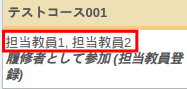{:.small}

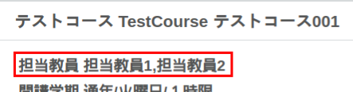{:.small}

デフォルトでは，担当教員として登録されているユーザーはすべて，時間割とコーストップに表示されます．

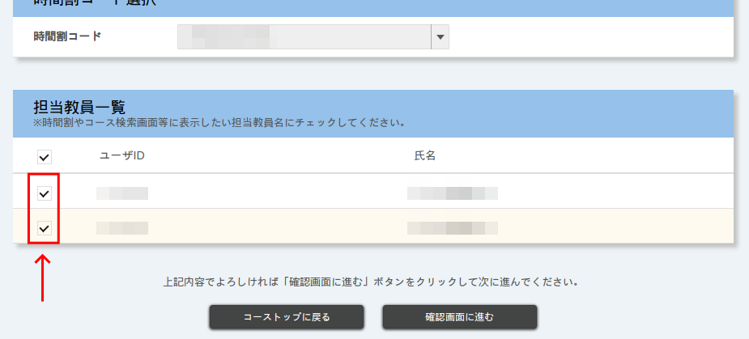{:.medium}

1. 「コース設定→コース設定」[^1]を開いてください．
1. 画面の下部に「担当教員一覧」という欄があります．表示させたい担当教員にチェックを入れ，表示させたくない担当教員のチェックを外してください．
1. 「確認画面へ進む」ボタンを押し，内容を確認したら「登録する」ボタンを押してください．

#### 自己登録・履修者範囲設定
{:#self-registration-and-content-use-scope}

この項では，UTASで履修登録せずにコンテンツを利用する，いわゆる「聴講」を可能にするために必要な「自己登録」に関する設定と，「履修者範囲設定」を説明します．なお，自己登録は，[申請して作成したコース](/utol/lecturers/#course-application)に受講者が自分で登録できるようにする場合にも必要です．

まず，**「自己登録」に関する設定**では，ユーザ自身がUTOL上で「受講登録」ボタンを押し，自分自身を履修者として登録する「自己登録」を許可するかどうかを選ぶことができます．デフォルトでは「許可する」になっています．

次に，**「履修者範囲設定」**では，受講登録している人のうち，コンテンツを利用（教材のダウンロード，課題の提出等）できる人の範囲を選ぶことができます．履修者範囲設定には，以下の選択肢があります．自己登録を許可できるかどうかにも影響するので，注意してください．なお，デフォルトでは「履修登録・担当教員登録のみに自動切替」になっています．また，[申請して作成したコース](../#course-application)では，履修者範囲設定は「常に登録方法によらず全て」に固定されます．

- **常に履修登録・担当教員登録のみ**：履修登録・担当教員登録など[^2]の方法で登録した受講者のみがコンテンツを利用できます．特に，自己登録で登録している人はコンテンツを利用できないので，自己登録は「許可しない」に固定されます．
  - 受講者を担当教員登録にするには，「[コース参加者登録 > 登録方法の更新](course_participants/#renew-method)」を参考に，担当教員・コース設計者が当該ユーザを登録し直してください．
- **常に登録方法によらず全て**：受講登録していれば，誰でもコンテンツを利用できます．自己登録は許可するか，許可しないかを選べます．
- **履修登録・担当教員登録のみに自動切替**（履修登録期限前のみ）：履修登録期限の前は「常に登録方法によらず全て」，履修登録期限の後は「常に履修登録・担当教員登録のみ」と同じふるまいをします．自己登録を「許可する」にしていた場合は，履修登録期限を過ぎると自動的に「許可しない」に切り替わります．

[^2]:
    この設定でコンテンツを利用できる・できない人は次のとおりです（コンテンツを利用する人が受講登録していることを前提とします）．
    - 利用できる人
      - UTASで履修登録をした人
      - 担当教員・コース設計者等が参加者として登録した人
        - 担当教員登録：担当教員・コース設計者が「[コース参加者登録](#course-participants)」で登録した人
        - 出席管理：担当教員・コース設計者が「出席者一括登録」で登録した人
    - 利用できない人
      - 自己登録で登録している人
      - UTASで「お気に入り登録」をした人
      - 履修登録をした後で解除した人

設定手順は以下の通りです．

1. 「コース設定→コース設定」[^1]を開いてください．
1. 「履修者範囲設定」と「自己登録」を設定してください．
    - 自由に「聴講」することを許可する場合
      - 履修者範囲設定を「常に登録方法によらず全て」，自己登録を「許可」にしてください．
    - 許可した受講者のみに「聴講」させたい場合・「聴講」を許可しない場合
      - 履修者範囲設定を「常に履修登録・担当教員登録のみ」にしてください．
      - いわゆる「聴講」を許可したい受講者がいれば，「[コース参加者登録 > 登録方法の更新](course_participants/#renew-method)」を参考に，「担当教員登録」で登録し直してください．
1. 「確認画面へ進む」ボタンを押し，内容を確認したら「登録する」ボタンを押してください．

### ラベル
{:#label}

「ラベル」は，コース内のコンテンツをグループ化する機能です．コーストップで表示を絞り込むときに使われます．

なお，ラベルは，該当するコンテンツがない履修者を含め，教員側・履修者側両方で表示されます．個人情報など，履修者に見られては困る内容をラベルに含めないように注意してください．

#### ラベルを作成する
{:#create-label}

1. 「コース設定→表示ラベル管理」[^1]を開いてください．
1. 左上の「{:.icon}表示ラベル新規作成」を押してください．
   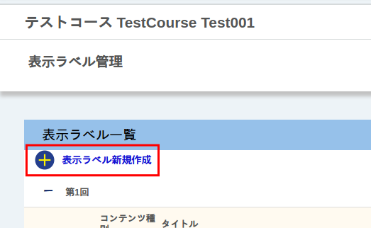{:.medium.border}
1. タイトルを入力してください．
   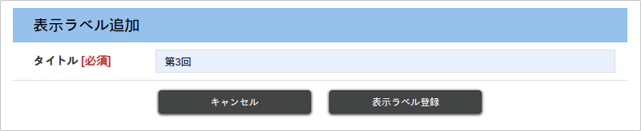{:.medium.border}
1. 「表示ラベル登録」を押すと，登録されます．

#### ラベルを編集・削除する
{:#edit-label}

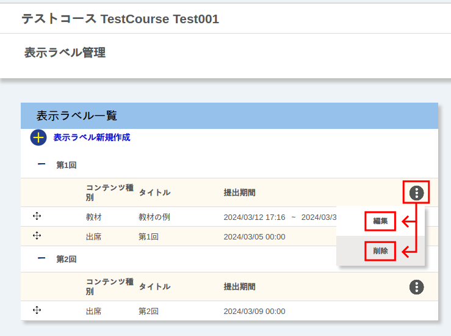{:.medium.border}

1. 「コース設定→表示ラベル管理」[^1]を開いてください．
1. 「表示ラベル一覧」欄のラベルの右側にある{:.icon}を押してください．
1. 編集するには「編集」を，削除するには「削除」を押してください．

#### コンテンツのラベルを編集する
{:#label-content}

コンテンツにラベルを設定する方法には，作成時にラベルを紐づける方法と，後から紐づける方法があります．ここでは後から紐づける方法を説明します．作成時に紐づける方法は各コンテンツの説明ページを参照してください．

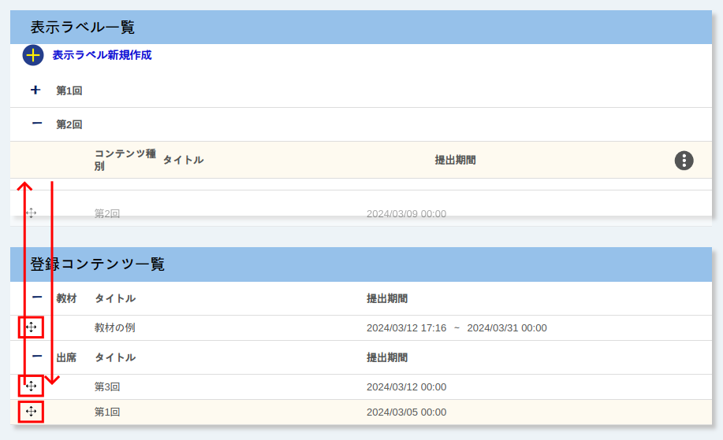{:.medium}

1. 「コース設定→表示ラベル管理」[^1]を開いてください．
1. コンテンツ名の左側の{:.icon}を押しながら，コンテンツをドラッグ＆ドロップしてください．
    - 新たにラベルを紐づける場合は，「登録コンテンツ一覧」から「表示ラベル一覧」の追加したいラベルへ移動させてください．
    - ラベルとの紐づけを解除したい場合は，「表示ラベル一覧」から「登録コンテンツ一覧」へ移動させてください．

なお，現在とは別のラベルと紐づけたい場合は，一旦解除してからもう一度新しく紐づけてください．「表示ラベル一覧」のあるラベルから別のラベルへドラッグ＆ドロップしても，反映されません．

### メッセージと出席の設定
{:#message-and-attendance}

「コース設定→コース設定」[^1]から，メッセージ機能を有効化するかどうかや，出席情報を表示するかどうかを設定することができます．

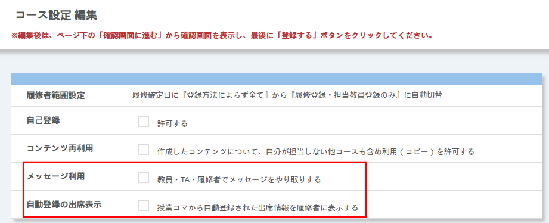{:.medium}

- メッセージ利用
  - 「教員・TA・履修者でメッセージをやり取りする」をオンにするとメッセージ機能が有効化されます．
  - 詳しくは「[メッセージ](../messages/)」を参照してください．
- 自動登録の出席表示
  - UTOLでは，UTASから連携されたり，教員がUTOLで登録したりした授業コマ情報に基づいて，自動で出席が設定されます．「授業コマから自動登録された出席情報を履修者に表示する」をオンにすると，この自動で設定された出席情報が，履修者に表示されます．
  - UTOLで出席を管理しない場合は，出席した回に「欠席」と表示されて混乱を招く可能性があるので，オフにしておくことをおすすめします．
  - 授業コマと出席について詳しくは「[出席](../attendances/)」を参照してください．

### LTI連携
{:#lti}

LTI連携は，UTOLのコースと外部のツールを連携させる[^3]機能です．

[^3]: UTOLはLearning Tool Interoperability (LTI) v1.3に対応しており，Learning Platformとしての動作ができます．

ここではコースで外部ツールを使うための手順を説明します．外部ツールの機能については，各ツールのウェブサイト等を参照してください．

#### コースに外部ツールを追加する
{:#add-lti}

1. 「コース設定→LTI利用設定」[^1]を開いてください．
1. 利用したいLTIツールの「利用する」列にチェックを入れてください．
   

   
表示されていない外部ツールを利用したい場合

   「LTI利用設定」に表示されていない，LTI v1.3に対応する外部ツールのライセンスをお持ちで，利用を希望される方は，UTOL担当までメールでご連絡下さい{/* TODO: メールアドレス公開確認 */}．その際には，当該ツール及びそのライセンス，利用を希望する範囲（特定の学部・コースのみでの利用か，全学での利用を希望か）等をお伝え下さい．
   

1. 「確認画面へ進む」ボタンを押し，内容を確認したら「登録する」ボタンを押してください．
1. コーストップを開くと，追加したLTIツールのアイコンが表示されます．

スクリーンショット

## 他のコースとの連携
{:#inter-course}

UTOLでは，複数のコースをまとめて管理したり（コースグループ），他のコースからコンテンツをコピーしたり（コンテンツ等の再利用）できます．

### コースグループ・時間割コード
{:#course-group}

「コースグループ」は，複数のコースをまとめて管理する機能です．また，「時間割コード」はコースグループの中で代表とするコース（親コース）を選ぶ設定です．

詳細は「[コースグループ](course_group/)」を参照してください．

### コンテンツ等の再利用
{:#contents-reuse}

「コンテンツ等の再利用」は，過去に自分が担当した授業や，他の教員が担当している授業から，コンテンツをコピーする機能です．以下で手順を説明します．

#### 手順1：コピー元のコースで行う作業
{:#contents-reuse-step1}

この手順は，コピー先のコースで作業を行う教員が，コピー元のコースでも担当教員として登録されている場合には**不要**ですので，手順2に進んでください．

そうでない場合は，コピー元のコースの担当教員に次の作業を依頼してください．

1. コピー元のコースの「コース設定→コース設定」[^1]を開いてください．
1. 「作成したコンテンツについて、自分が担当しない他コースも含め利用（コピー）を許可する」にチェックを入れてください．
   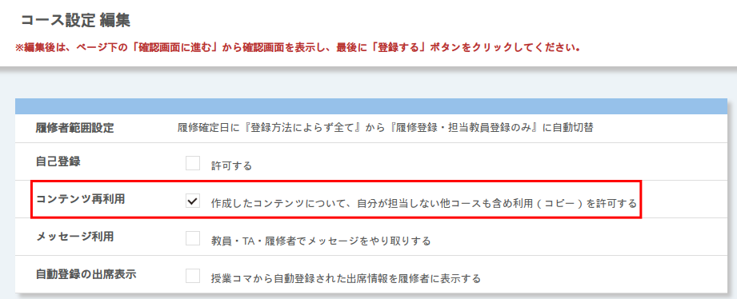{:.small}
1. 「確認画面へ進む」ボタンを押し，内容を確認したら「登録する」ボタンを押してください．

#### 手順2：コピー先のコースで行う作業
{:#contents-reuse-step2}

1. コピー先のコースの「コースコンテンツ→過去のコンテンツをインポート」[^1]を開いてください．
1. 「コピー元コース検索」欄の「コース検索」ボタンを押し，コピー元のコースを検索してください．
1. コピー元のコースを選択し，「指定」ボタンを押してください．
1. コピー元のコースのコンテンツが表示されるので，コピーしたいものにチェックを入れてください．
1. 「確認画面へ進む」ボタンを押し，内容を確認したら「登録する」ボタンを押してください．
