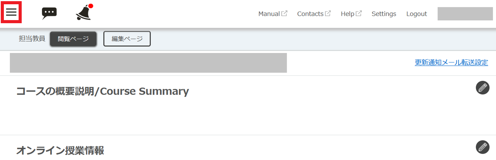

## ユーザグループとは
{:#about}
[UTOL](/utol/)のコースでは，任意の履修者から「ユーザグループ」とよばれる単位を構成することができます．これは，一部の履修者にのみコースのコンテンツ（[教材](/utol/lecturers/materials/)，[課題](/utol/lecturers/assignments/)など）を公開することを目的に使用するもので，コンテンツを公開する際は，特定のユーザグループのみを公開対象として選択することが可能です．
コンテンツを公開する対象を制限する頻度が高い場合，あらかじめユーザグループを登録しておくことで，公開対象の履修者を毎回個別に指定する手間を避けることができます．ユースケースとしては，履修者を複数の班に分けて行うグループワークでそれぞれの班のみに資料を公開する場合，などが考えられます．

## 利用にあたって
{:#details}
ユーザグループの管理（登録・変更・削除）ができるのは，担当教員もしくはコース設計者に限られます．TAは管理することができません．
一人の履修者は，複数のユーザグループに登録することが可能です．
コンテンツを公開する際は，複数のユーザグループを公開対象として選択することが可能です．

### コースグループとの関連
{:#course_group}
[コースグループ]((/utol/lecturers/course_group))を登録した場合，グルーピングされたそれぞれのコースの履修者をメンバーとしたユーザグループが「 (開講年度)\_(開講組織コード)\_(時間割コード) -group」の名称で自動的に登録されます．これを「デフォルトユーザグループ」とよびます．登録後にUTAS上で履修者が変更された場合，システム連携により各デフォルトユーザグループのメンバーの一覧に反映されます．

## ユーザグループを管理する
{:#manage}
ユーザグループを管理（登録・変更・削除）する手順を説明します．

### ユーザグループを登録する
{:#register}
ユーザグループを登録する方法は以下の二つがあります．

- 画面上で選択して登録する方法
{:.medium}
UTOLの画面上でメンバーを選択して一つのユーザグループを登録する方法です．
一つだけユーザグループを登録する場合や，登録するメンバーが少ない場合に適しています．

- Excelファイルをアップロードして登録する方法
{:.border}{:.medium}
ユーザグループとそのメンバーについての情報を入力したExcelファイルをアップロードして，一つもしくは複数のユーザグループを登録する方法です．
複数のユーザグループを一度に登録する場合や，履修者の共通IDや学生証番号についての電子データが手元にある場合に適しています．

#### 画面上で選択して登録する方法
{:#web}
1. 対象のコースを開いた状態で左上の三本線のアイコンを押してください．
{:.border}
1. 「コース設定」の「ユーザグループ設定」を押してください．
    

    
「コース設定」がない場合

        あなたにはこの操作に必要な[権限](#details)がありません．必要と思われる場合は，授業を担当する教員と[権限の付与](/utol/lecturers/settings/course_participants/)についてご相談ください．
    

    {:.border}{:.medium}
1. 「ユーザグループ管理」の右側にある「+」を押してください．
{:.border}{:.medium}
1. 「ユーザグループ名」と「グループ概要」（任意）を入力してください．これらの情報は，後からユーザグループを区別する際に使用します．

1. ユーザグループのメンバーとする履修者のチェックボックスをすべて選択し，「確認画面に進む」を押してください．（「グループメンバー選択」の真下にあるチェックボックスを選択すると、表示されているすべての履修者を一度に選択できます．）

1. 登録する内容を確認し，問題がなければ「登録する」を押してください．

1. 「登録が完了しました。」と表示されれば完了です．

#### Excelファイルをアップロードして登録する方法
{:#excel}
1. 対象のコースを開いた状態で左上の三本線のアイコンを押してください．
{:.border}{:.medium}
1. 「コース設定」の「ユーザグループ設定」を押してください．
    

    
「コース設定」がない場合

        あなたにはこの操作に必要な[権限](#details)がありません．必要と思われる場合は，授業を担当する教員と[権限の付与](/utol/lecturers/settings/course_participants/)についてご相談ください．
    

    {:.border}{:.medium}
1. 「ユーザグループ管理」の右側にある「一括登録」を押してください．

1. 「フォーマットダウンロード」を押して，入力に使用するExcelファイルをダウンロードしてください．

1. ダウンロードしたExcelファイルを開いてください．
{:.border}{:.medium}
1. 登録するユーザグループごとに，以下の手順で入力してください．なお，登録するユーザグループとExcelファイルの行は一対一で対応しています．**すなわち，一つのユーザグループについて複数の行を用いて記述することはできません**．
    - まず、「ユーザグループ名」と「グループ概要」（任意）を入力してください．これらの情報は，後からユーザグループを区別する際に使用します．
    - 次に、メンバーとする履修者すべてについて，共通IDもしくは学生証番号のどちらかを入力します．共通IDの場合は「ユーザID」欄，学生証番号の場合は「学生証番号」欄に入力してください．共通IDと学生証番号はそれぞれ一つの欄内にセミコロンで区切って入力してください．
  
    以下の画像は入力例です．
{:.border}
1. 入力が完了したら保存してください．
1. UTOLの画面上の「参照」を押して入力したExcelファイルを選択したあと，「確認画面に進む」を押してください．

1. 内容を確認し，問題がなければ「登録する」を押してください．

1. 「登録が完了しました。」と表示されれば完了です．

### ユーザグループを変更する
{:#edit}
登録したユーザグループに対して，メンバーの追加・削除などの変更を加える手順を説明します．
1. 対象のコースを開いた状態で左上の三本線のアイコンを押してください．
{:.border}{:.medium}
「コース設定」の「ユーザグループ設定」を押してください．
    

    
「コース設定」がない場合

        あなたにはこの操作に必要な[権限](#details)がありません．必要と思われる場合は，授業を担当する教員と[権限の付与](/utol/lecturers/settings/course_participants/)についてご相談ください．
    

    {:.border}{:.medium}
1. 「ユーザグループ一覧」のうち，変更を加えたいもののユーザグループ名を押してください．

[画面上で選択して登録する方法](#web)と同様の画面が表示されます．変更を加えたい項目について編集を加え，「確認画面に進む」を押してください．
1. 内容を確認し，問題がなければ「登録する」を押してください．

1. 「登録が完了しました。」と表示されれば完了です．

### ユーザグループを削除する
{:#remove}
登録したユーザグループを削除する手順を説明します．
1. 対象のコースを開いた状態で左上の三本線のアイコンを押してください．
{:.border}{:.medium}
1. 「コース設定」の「ユーザグループ設定」を押してください．
    

    
「コース設定」がない場合

        あなたにはこの操作に必要な[権限](#details)がありません．必要と思われる場合は，授業を担当する教員と[権限の付与](/utol/lecturers/settings/course_participants/)についてご相談ください．
    

    {:.border}{:.medium}
1. 「ユーザグループ一覧」のうち，削除したいものの「操作」メニューを開き，「削除」を押してください．

1. 「(ユーザグループ名)を削除して宜しいですか？」と表示されます．対象のグループが正しいか確認したうえで「削除」を押してください．

1. 対象のグループが「ユーザグループ一覧」から削除されていれば完了です．

## 選択したユーザグループにのみコンテンツを公開する
{:#access_management}
選択したユーザグループにのみコンテンツ（教材，課題など）を公開する手順を説明します．ここでは[課題](/utol/lecturers/assignments/)を例にとって説明しますが，他の種類のコンテンツでも同様です．
1. 対象のコースを開いてください．
新しく課題を登録する場合は，「課題」欄の左下の「＋」マークを押してください．すでに登録された課題を編集する場合は，「課題」欄のうち編集したい課題名を押してください．

1. 新規登録・課題編集画面が表示されます．他の項目を入力・編集したのち、下部の「公開対象」で「選択したユーザーグループ」を選択してください．

1. 「ユーザグループ一覧」から公開対象とするユーザグループのチェックボックスをすべて選択してください．完了したら，「確認画面に進む」を押してください．（「ユーザグループ一覧」の真下にあるチェックボックスを選択すると、表示されているすべてのユーザグループを一度に選択できます．）

1. 内容を確認し，問題がなければ「登録する」を押してください．
{:.medium}
1. 「登録が完了しました。」と表示されれば完了です．

