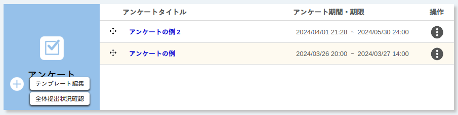
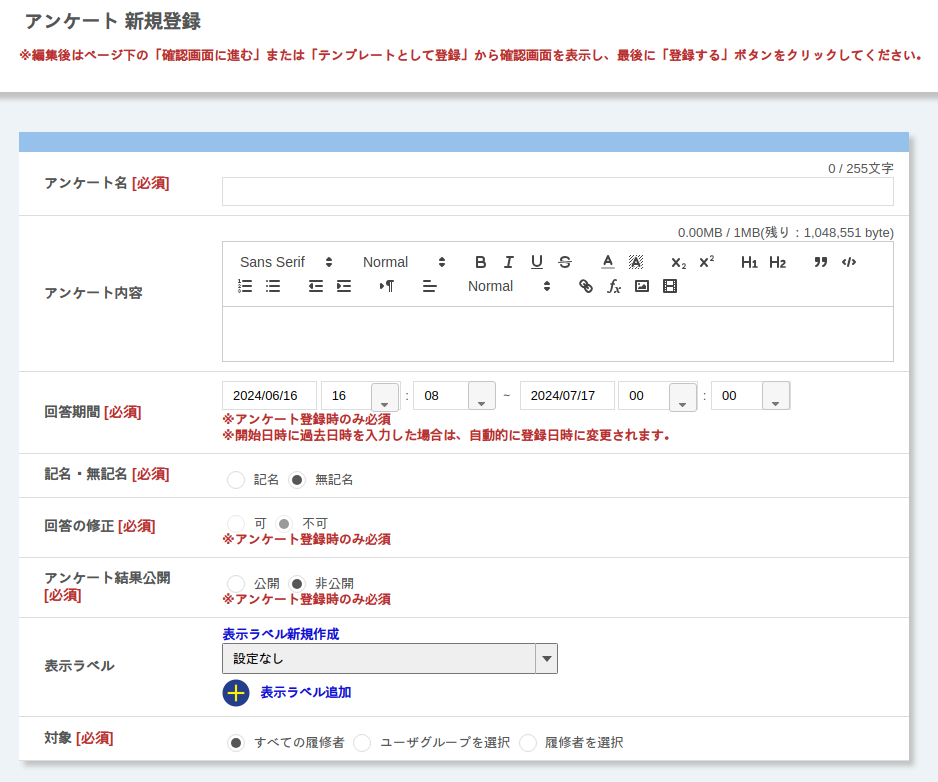
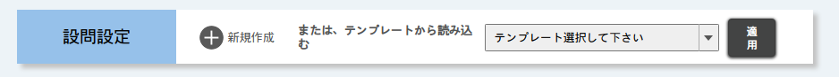
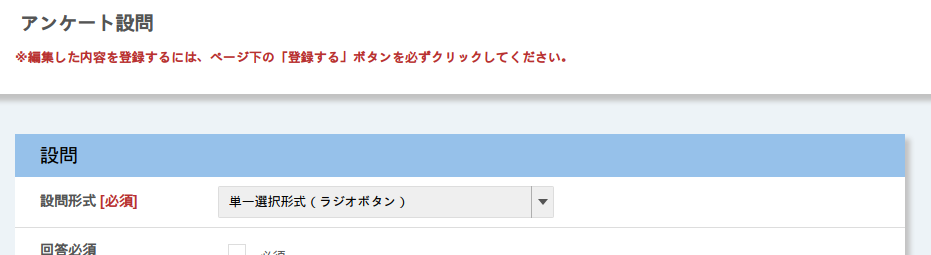

import DisplayLabel from '../_displaylabel/DisplayLabel.mdx';

このページでは，アンケートを作成したり，編集したりする方法を説明します．

アンケート結果を見る方法については「[アンケート結果を見る](result)」を参照してください．

## 新しいアンケートを作成する
{:#create}

新しいアンケートを作成するには，コーストップ画面の「アンケート」欄の{:.icon}ボタンを押してください．アンケート新規登録画面が表示されます．

以下の手順1〜手順3にしたがって，アンケートの設定を行ってください．

### 手順1：アンケート全体の設定
{:#general_settings}

まず，アンケート全体の設定項目を入力してください．設定を行った後でも編集することはできますが，タイミングによっては編集できる項目が制限されます．詳しくは，本ページ下部「[作成したアンケートを編集する](#update)」を参照してください．

- **アンケート名**：アンケートのタイトルです．
- **アンケート内容**：アンケートの説明です（[マークアップ機能](/utol/markup/)対応）．
- **回答期間**：回答できる期間です．
  - 開始と終了の日時を設定してください．
  - 開始・終了日時は，それぞれ設定した時刻を過ぎると変更できなくなります．
- **記名・無記名**：無記名にすると，個人別の回答と回答有無を確認できなくなります．
  - 開始日時を過ぎると変更できなくなります．
- **回答の修正**：「可」にすると，一度アンケートに回答した後，回答内容を修正できるようになります．
  - 無記名の場合は回答の修正ができません．
  - 開始日時を過ぎると変更できなくなります．
- **アンケート結果公開**：「公開」にすると，集計結果を受講者が見られるようになります．
- **結果公開期間**：アンケート結果を「公開」にしている場合に，受講者が集計結果を見られる期間です．
  - これはいつでも変更できます．
- <DisplayLabel />
- **対象**：アンケートを見たり，アンケートに回答したりできる人を限定します．

### 手順2：設問の作成
{:#question_settings}

続いて，「新規登録」画面の下部にある「設問作成」欄で「新規作成」を押してください．設問の「新規登録」画面が表示されます．

1.  初めに，作成する設問の形式を決めます．以下の7種類の中から，質問したい内容に応じて適切なものを選択してください．
    - **単一選択（ラジオボタン）**：選択肢から一つを選ぶ形式です．
    - **複数選択（チェックボックス）**：選択肢から複数選ぶ形式です．
    - **テキスト（テキストボックス）**：一行のテキストボックスです．長文になったり，複数行になったりする可能性がある場合はフリーテキストを選択してください．
    - **フリーテキスト（テキストエリア）**：複数行入力できるテキストエリアです．長文の入力に適しています．
    - **リスト選択（プルダウン）**：単一選択と同様，複数の選択肢から一つを選ぶ形式ですが，ラジオボタンではなくプルダウンで表示されます．
    - **単一選択表（ラジオボタン）**：表の中にラジオボタンが表示され，各行につき一つを選択する形式です．
    - **複数選択表（チェックボックス）**：表の中にチェックボックスが表示され，複数を選ぶ形式です．

2.  続いて，設問の情報を入力してください（下図は，単一選択形式の場合のスクリーンショットです）．
    - **設問形式**：1.で決めた設問形式を選択してください．
    - **回答必須**：オンにすると，送信する前にこの設問に回答することが必要になります．
    - **設問タイトル**：設問のタイトルです．
    - **設問内容**：設問の上に表示される説明文です．マークアップが使えます．
    - **回答項目数・回答項目**：設問の選択肢などの設定です．
        - 入力内容は以下のように設問形式によって異なります．
            - **単一選択・複数選択・リスト選択**：回答項目（選択肢）の数と，回答項目を入力してください．
            - **テキスト・フリーテキスト**：追加の入力項目はありません．
            - **単一選択表形式・複数選択表形式**：縦列の設問項目の数と設問項目，横列の回答項目の数と回答項目を入力してください．
        - 注意
            - 回答項目の数を減らすと，回答項目の欄が最後から順に削除されます．削除された欄の入力内容は消えますので，注意してください．
    - **コメント記入欄**：オンにすると，自由入力欄（テキストエリア）が表示されます．ここに入力された内容は，担当教員・TAが個別の回答内容として確認できます．なお，選択式の設問でのみ利用でき，テキスト形式・フリーテキスト形式では利用できません．
    - **画像**：設問の添付画像を登録できます．形式はgif，jpg，pngのいずれかにしてください．
    - **表・グラフ表示**：アンケートの集計結果を表示するときの形式を設定します．テキスト形式・フリーテキスト形式では利用できません．
        - **表示しない**：この設問の集計結果は「表・グラフ」画面に表示されません．
        - **回答数（表形式）**：選択肢ごとに回答者数と割合が表示されます．
        - **割合（円グラフ）**：「回答数」の表に加え，割合を円グラフにしたものが表示されます．
        - **総数（棒グラフ）**：「回答数」の表に加え，回答者数を棒グラフにしたものが表示されます．

3.  必要事項を入力したら，画面下部の「登録する」を押して，設問を登録してください．この時点では設問が登録されただけで，アンケートの登録は完了していません．
4.  必要に応じて，分岐（次に表示される設問）を設定してください．
    - 設問形式が単一選択形式，リスト選択形式の場合は，選択肢ごとに移動先の設問を選べます．次に表示する設問を回答によって変えたい場合に便利です．
    - 移動先には，「次へ」，「設問の末尾」に加え，他の設問（編集中の設問より下にある設問のみ）を選べます．
        - **次へ**：この設問に答えると，次の設問へ進みます．
        - **設問の末尾**：この設問をアンケートの最後の設問にします．
        - **設問n（nは設問の番号）**：この設問に答えると，選択した設問が表示されます．

5.  アンケート全体の設定と設問の作成を終えたら，「新規登録」画面の下部にある「確認画面に進む」を押して内容を確認し，「登録する」を押してアンケートを登録してください．

### 手順3：回答シミュレーション

アンケートを作成した後は「回答シミュレーション」機能によって，履修者が実際に回答する流れを確認できます．

1.  「新規登録」もしくは「編集」画面の下部の「回答シミュレーション」を押してください．受験シミュレーションが始まります．
2.  各設問に回答してください．
3.  回答が終わったら「確認画面に進む」を押して確認画面に進んでください．
4.  回答内容を確認して「提出する」を押して解答内容を送信してください．「新規登録」画面もしくは「編集」画面に移動します．

回答シミュレーションで不備が見つかった場合は，後述の「作成したアンケートを編集する」を参考にアンケートを修正してください．

## 作成したアンケートを編集する
{:#update}

既に作成したアンケートを編集するには，「コーストップ」画面の「アンケート」欄で対象のアンケートのタイトルを押してください．新規登録時と同様の画面である「編集」画面が表示されます．

### アンケート全体の設定を編集する

アンケート全体についての設定を編集できます．各設定項目の説明は「新しいアンケートを作成する」内の「[手順1：アンケート全体の設定](#general_settings)」を参照してください．

新規登録時と異なり，タイミングによっては編集できる項目が制限されます．編集できる項目は，以下の通りです．

- 回答期間**開始前**：すべての項目
- 回答期間**開始後**，回答期間**終了前**：以下の7項目のみ
  - アンケート名
  - アンケート内容
  - 回答期間の終了日時（延長・短縮）
  - アンケート結果公開
  - 結果公開期間
  - 表示ラベル
  - 設問の回答項目
- 回答期間**終了後**：以下の3項目のみ
  - アンケート結果公開
  - 結果公開期間
  - 表示ラベル

### 設問を編集する

アンケートの各設問を編集できます．設問を編集するには右上の鉛筆マークを押してください．設問の各項目の説明は「新しいアンケートを作成する」内の「手順2：設問の作成」を参照してください．

アンケート全体の設定と同様に，タイミングによって編集できる項目が制限されます．編集できる項目は，以下のとおりです．

- 回答期間**開始前**：すべての項目
- 回答期間**開始後**，回答期間**終了前**：以下の6項目のみ
  - 回答必須
  - 設問タイトル
  - 設問内容
  - 回答項目（選択形式のみ）
  - コメント記入欄
  - 表・グラフ表示
- 回答期間**終了後**：「表・グラフ表示」のみ

また，回答期間開始後には，設問の順番の並び替え，設問の追加・削除，移動先の変更はできません．

## テンプレートを利用する
{:#use_templates}

アンケート機能では，作成したアンケートを**テンプレート**として登録することで，自身が担当教員・TA・コース設計者のいずれかとして参加している他のコースで，アンケートを再利用できます．また，他のユーザーが登録したテンプレートも，同一コース内に限り利用できます．同じ内容の授業を複数担当している場合や，過去の年度のアンケートを再利用したい場合などにうまくご活用ください．

なお，テンプレートとして保存される設定項目は，アンケートのタイトル（テンプレートのタイトルとして保存されます）と各設問のみです．

### テンプレートを登録する

テンプレートを登録するには，以下の手順に従ってください．

1. 「コーストップ」画面の「アンケート」欄でテンプレートとして登録したいアンケートのタイトルを押してください．
1. 「編集」画面が表示されたらページ下部の「テンプレートとして登録」を押してください．
1. 「テンプレート登録内容確認」画面が表示されます．登録するテンプレートの内容に間違いがないことを確認して「登録する」を押してください．

なお，テンプレートのタイトルは，アンケートのタイトルと同名で登録されます．テンプレート間でタイトルを重複させることも可能ですが，見分けがつかなくなることを防ぐため，次の「テンプレートを編集・削除する」に従ってタイトルを区別しやすいものに変更することをお勧めします．

### テンプレートを編集・削除する

テンプレートを編集・削除するには，以下の手順に従ってください．

1. 「コーストップ」画面の「アンケート」欄で「テンプレート編集」を押してください．「テンプレート一覧」画面が表示されます．
1. 編集・削除したいテンプレートのタイトルを押してください．
    - **テンプレートを編集する場合**：表示されている設定項目を編集してください．編集できるのは，テンプレートのタイトルと設問のみです．「新規登録」画面や「編集」画面で表示されていたその他の項目は，テンプレートに含まれないため編集できません．
    - **テンプレートを削除する場合**：画面右上の「削除する」を押してください．

### 他のユーザーのテンプレートを引き継ぐ

自分以外が作成したテンプレートを，自分のテンプレートとして登録できます．この機能を利用して，他のユーザーからテンプレートを引き継ぐには，以下の手順に従ってください．

1. 「コーストップ」画面の「アンケート」欄で「テンプレート編集」を押してください．「テンプレート一覧」画面が表示されます．
1. 他のユーザーが作成したテンプレートには「登録する」が表示されます．引き継ぎたいテンプレートの「登録する」を押してください．
1. 「テンプレート登録/編集」画面が表示されます．タイトルをわかりやすいものに変更するなど必要な変更を行って「確認画面に進む」を押してください．
1. 内容を確認し誤りがなければ「登録する」を押してください．

