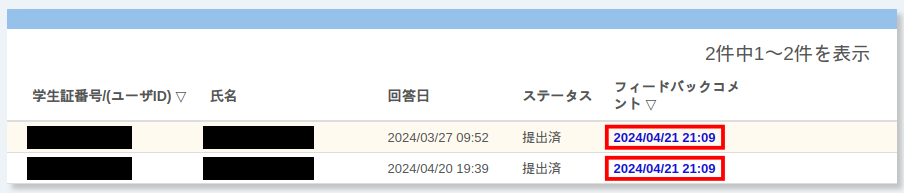
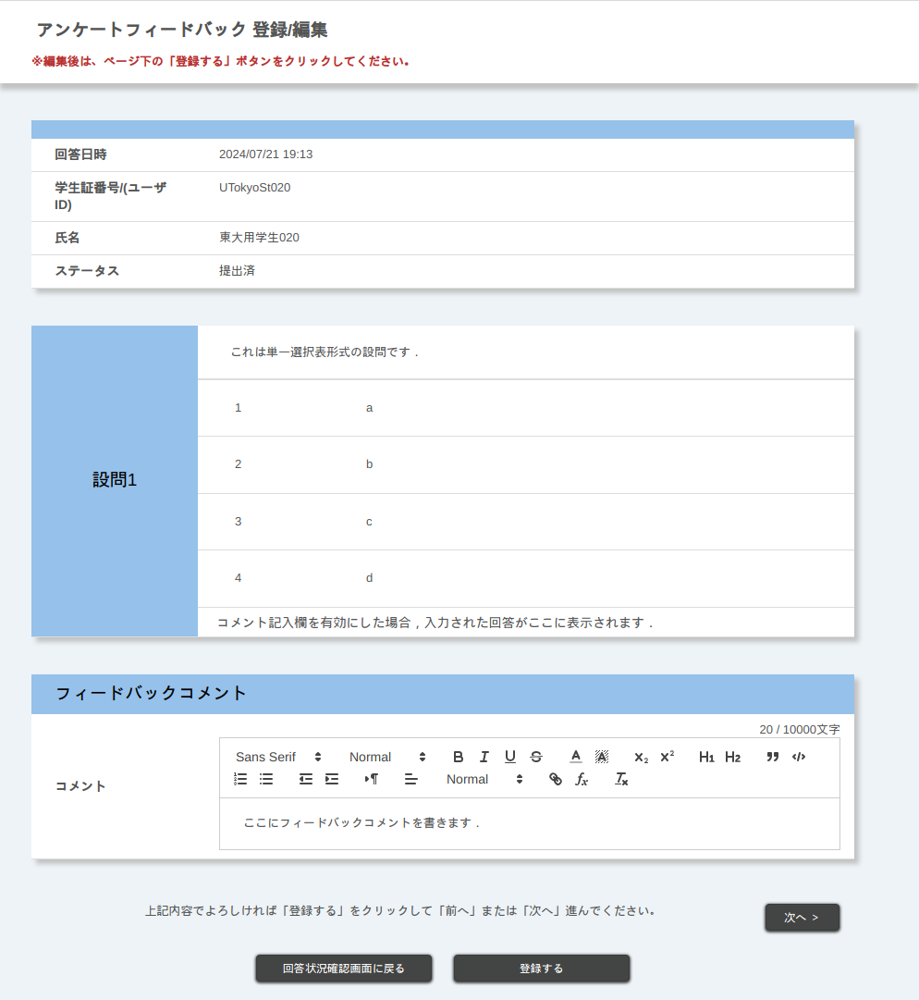
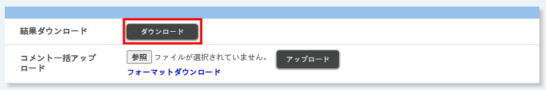
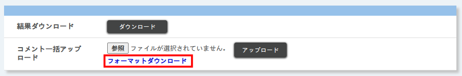
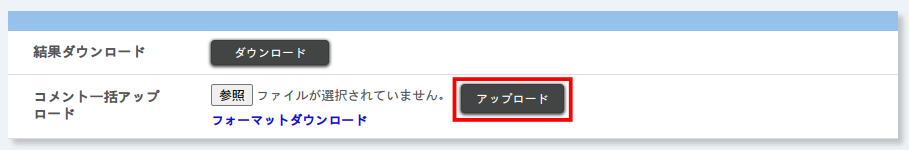
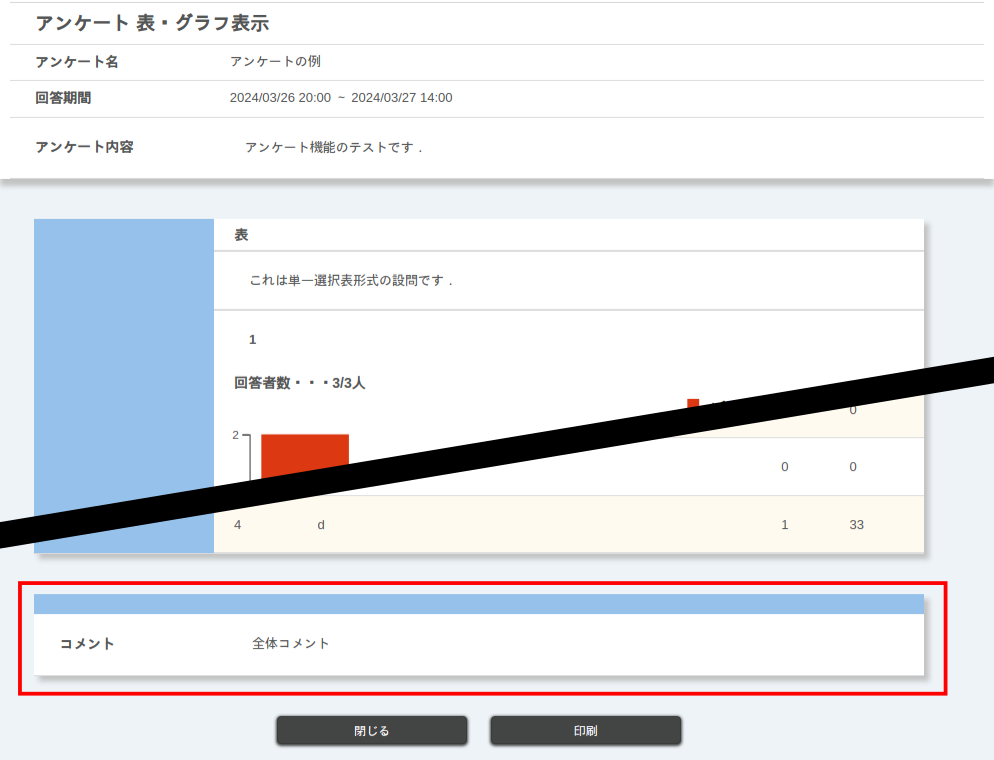

このページでは，アンケートの結果を見たり，回答にコメントをつけたりする方法を説明します．また，コース内のすべてのアンケートへの回答状況をまとめて確認する方法も説明します．

なお，授業アンケートに関しては，担当教員は集計結果の表示だけができます．

アンケート結果を作成したり，編集したりする方法については「[アンケートを作成する](create)」を参照してください．

## 回答を確認する・回答にコメントをつける

アンケートの回答を確認する方法は，以下のように無記名式・記名式で異なります．

- 無記名式の場合：[一括ダウンロードする](#answer-download)ことによって確認します．
- 記名式の場合：[UTOL上で個別に確認する](#answer-comment)，もしくは[一括ダウンロードする](#answer-download)ことによって確認します．

また，記名式アンケートでは，個別または一括で，回答に対してコメントをつけることができます．

### UTOL上で回答を見る・コメントをつける
{:#answer-comment}

記名式のアンケートの回答は，UTOL上で個別に閲覧したり，コメントをつけたりすることができます．

なお，無記名式アンケートへの回答は個別には表示できません．「[一括で回答をダウンロードする](#answer-download)」にしたがって，ダウンロードしてから閲覧してください．

1. 回答を見たいアンケートの{:.icon}を押し，「回答状況確認」を押してください．
2. 各回答が表示された表があるので，右側の「フィードバックコメント」列のリンクを押してください．
   - コメントをまだつけていない回答では「コメントする」が，コメントをつけた回答ではコメントを登録した日時が，表示されます．
   {:.medium}
3. 各設問への回答が表示されます．
   {:.small}
4. フィードバックコメントを登録する場合は，「フィードバックコメント」欄にコメントを入力し，「登録する」を押してください．

### 一括で回答をダウンロードする
{:#answer-download}

アンケートの結果は，以下の手順によって一括でダウンロードすることもできます（記名式・無記名式共通）．

1. 回答をダウンロードしたいアンケートの{:.icon}を押し，「回答状況確認」を押してください．
2. 「結果ダウンロード」欄の「ダウンロード」を押してください．
   {:.medium}
3. パスワード入力画面で，回答のExcelファイルに設定する任意のパスワードを入力してください．
4. 「ダウンロード」を押すと，ZIPファイルがダウンロードされます．
   - 解凍すると，HTMLファイルとExcelファイルがあります．
   - HTMLファイルには設問内容のみが含まれます．
   - Excelファイルには設問内容と，個別の回答が含まれます．なお，Excelファイルを開くには，3.で設定したパスワードが必要です．

### 一括で回答にコメントをつける

記名式のアンケートの回答には，一括でコメントをつけることができます．

なお，無記名のアンケートの回答にはコメントをつけることができません．

1.  コメントをつけたいアンケートの{:.icon}を押し，「回答状況確認」を押してください．
2.  「コメント一括アップロード」欄の「フォーマットダウンロード」を押してください．
    - パスワードの設定が必要です．表示される画面で任意のパスワードを設定してください．
   {:.medium}

3.  ダウンロードしたExcelファイルを開き，「コメント」列にコメントを入力，保存してください．
    -   2で設定したパスワードで開くことができます．
    -   このファイルには回答済みのユーザーのみが載っています．また，回答は含まれないので，[UTOL上で確認する](#answer-comment)か，[一括でダウンロードした回答を参照](#answer-download)してください．

4.  UTOLに戻り，「コメント一括アップロード」欄の「参照」を押して，コメントを入力したExcelファイルを指定してください．

5.  「コメント一括アップロード」欄の「アップロード」を押してください．
   {:.medium}

6.  「パスワード入力」画面が表示されるので，Excelファイルに設定したパスワードを入力し，「アップロード」を押してください．
    -   パスワードを変更していない場合は，2.で設定したパスワードを入力してください．

7.  正常にアップロードされると「アップロードが完了しました」と表示されます．

## 集計結果を確認する・集計結果にコメントをつける

アンケートの設問のうち，表示形式を設定したものについては，集計結果を表やグラフとして表示できます．表示形式を設定する方法については，「[アンケートを作成・編集する > 設問の作成](create#question_settings)」の「表・グラフ表示」を参照してください．

また，集計結果にコメントをつけ，集計結果とともに履修者側に表示させることもできます．

注意：履修者範囲設定を「常に「履修登録・担当教員登録のみ」」にしているとき，自己登録などの方法で登録している人は，アンケートを含めたコンテンツを利用できません．また，記名式アンケートの場合，たとえ過去の履修者範囲設定で回答できていたとしても，コンテンツを利用できない人の回答は集計されません．

### 集計結果を確認する
{:#view-result}

表示形式を設定した設問の集計結果は，コーストップのアンケート右側の{:.icon}を押し，「表・グラフ」を押すと確認できます．

表示形式はいつでも変更できます．設定する方法は「[アンケートを作成・編集する > 設問の作成](create#question_settings)」の「表・グラフ表示」を参照してください．

### 集計結果にコメントをつける
{:#comment-result}

履修者側の「表・グラフ」画面の末尾に，コメントを表示させることができます．

{:.small}

なお，デフォルトでは「アンケート結果公開」設定が「非公開」となっており，履修者に集計結果を公開しない設定になっています．この状態では履修者が「表・グラフ」を開くことができず，コメントをつけても履修者から見えないので注意してください．「アンケート結果公開」の設定については，「[アンケートを作成・編集する > アンケート全体の設定](create#general_settings)」を参照してください．

1. コメントを設定したいアンケートの{:.icon}を押し，「コメント」を押してください．
2. コメントを入力して「登録する」を押してください．

## アンケートへの回答状況を確認する

受講者の回答状況は，コーストップの「アンケート」欄にある「全体提出状況確認」ボタンからまとめて確認できます．

また，「全体提出状況確認」画面で履修者の学生証番号（もしくは共通ID）を押すと，その履修者の回答状況に絞って確認することができます．

なお，無記名のアンケートは「全体提出状況確認」には表示されないほか，個別の回答内容は確認できません．
