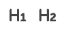
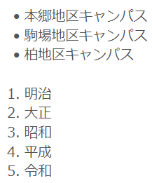

## マークアップ機能とは

マークアップ機能は，UTOL上で入力されたテキストに書式を設定することができる機能です．この機能を利用することで，テキストの見た目を見やすく綺麗にしたり，文章の構造を明確にしたりすることができます．具体的には，文字を強調したりリンクを埋め込んだりすることに加え，数式の挿入などが可能です．

以下の画像はマークアップ機能を利用してテキストに書式を設定したものです．
（例としてあるマークアップがどのように表示されるのかのスクショ）

### マークアップ機能対応のテキストエリアの見分け方

すべてのテキストエリア（文字列の入力欄）がマークアップ機能に対応しているわけではありません．マークアップ機能に対応したテキストエリアには，専用のツールバーが存在します．
<div class="gallery">
<figure class="center">

<figcaption>マークアップ機能対応のテキストエリア</figcaption>
</figure>
<figure class="center">

<figcaption>マークアップ機能非対応のテキストエリア</figcaption>
</figure>
</div>

## マークアップ機能の使い方

マークアップ機能の使い方を書式を設定する方法と，書式を削除する方法の2つに分けて説明します．

### 書式を設定する

書式を設定するには，ツールバーの中の適切なアイコンを押してください．テキストに設定できる各書式の説明と使い方は，以下のとおりです．

- フォント：フォントを「Sans Serif」「Serif」「Monospace」から選ぶことができます．初期状態では「Sans Serif」です．
  
  
- 文字の大きさ：文字の大きさを「Small」「Normal」「Large」「Huge」から選ぶことができます．初期状態では「Normal」です．
  
- 太字・斜体・下線・取り消し線：文字を太くしたり，斜めにしたり，文字の下や中央に線を引くことができます．{:.icon}が太字，{:.icon}が斜体，{:.icon}が下線，{:.icon}が取り消し線です．
- 文字色・背景色：（文字色アイコン）が文字色・（文字背景色アイコン）が文字背景色です．35色から選ぶことができ，初期状態では黒です．
  
- 上付き文字・下付き文字：文字を直前の文字の上方や下方に小さく表示できます．（下付きアイコン）が下付き文字・（上付きアイコン）が上付き文字です．
- 見出し表示：テキストを見出し表示できます．適切に見出し表示することで文章の構造が明確になります．見出しには6段階あり，段階に応じて太字や文字サイズなどの書式が設定されます．
    - Heading1〜Heading6の6段階があります．
      
    - Heading1とHeading2はアイコンで設定できます．
      
    
- 引用・転載（引用アイコンのスクショ）：テキストが引用・転載されたものであることがわかるようにします．以下の例のような表示になります．
  
- コードブロック（アイコンのスクショ）：プログラミング言語のソースコードを黒背景に白文字で表示し，視覚的にわかりやすく表示します．色付け（シンタックスハイライト：ソースコードに意味に応じた色を付けること）には対応していません．
  
- 番号付きリスト・番号なしリスト：対象の行をリスト表示できます．（番号付きアイコン）が番号付き・（番号なしアイコン）が番号なし（箇条書き）リストです．以下のように表示されます．
  
- テキストのインデント：テキストのインデント（行頭の余白）を設定できます．（アイコン）でインデントが増え，（アイコン）でインデントが減ります．
- テキストの配置：テキストの配置方法を設定できます．「左揃え」「右揃え」「中央揃え」「両端揃え」から選べます．「左揃え」「右揃え」はドロップダウンリストの左側のアイコン（アイコンのスクショ）でも設定できます．
  
- リンク（リンクアイコンのスクショ）：テキストにリンクを設定できます．リンクを設定するには，リンクを設定するテキストを選択した状態でアイコンを押し，表示される入力欄にURLを入力してください．
- 数式挿入（数式アイコンのスクショ）：数式を表示できます．アイコンを押すと表示される入力欄にTeX記法で数式を入力してください．TeX記法とは，数学を初めとする複雑な式を表示するための記法です．表示できる記号については[こちらのページ](https://katex.org/docs/supported)を参照してください．
  <div class="gallery">
  <figure class="center">
  
  <figcaption>TeX記法の数式```\frac{\mathrm{d}}{\mathrm{d}x} \int_a^x f(t) \, \mathrm{d}t = f(x)```</figcaption>
  </figure>
  <figure class="center">
  
  <figcaption>入力後に表示される数式</figcaption>
  </figure>
  </div>

### 設定した書式を削除する

設定した書式を削除するには，削除したい部分のテキストを選択して（削除アイコン）を押してください．書式が削除され，初期状態の表示になります．