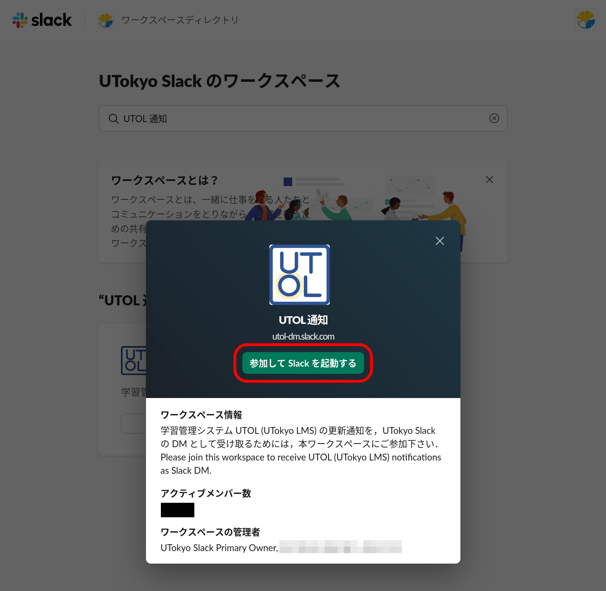
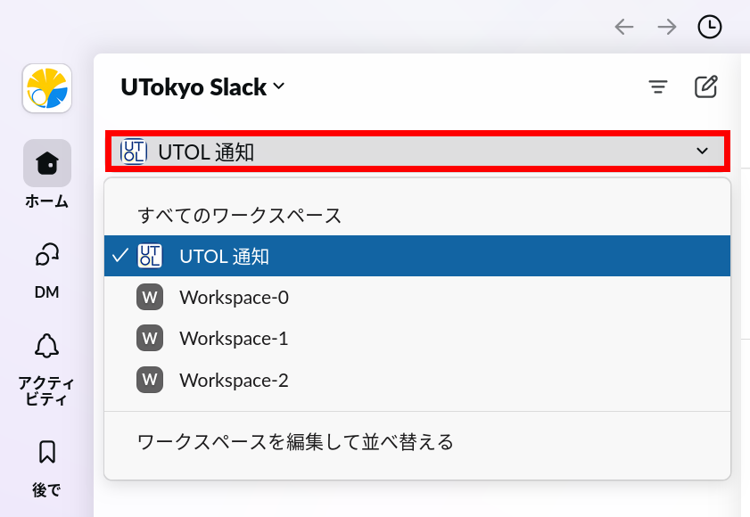
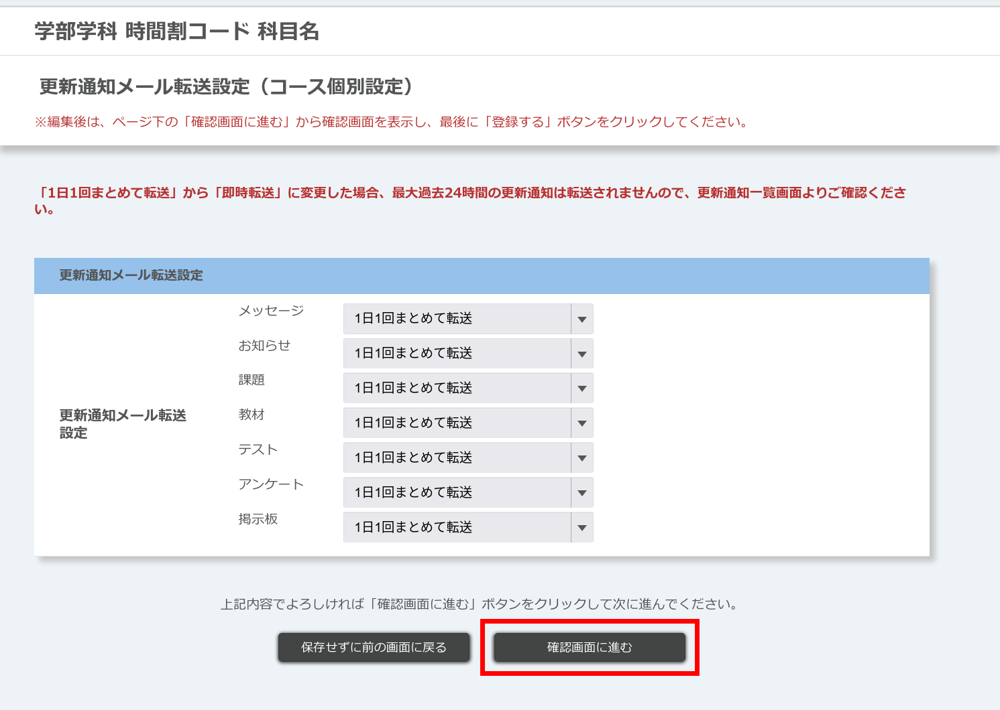

## 概要

UTOLには，コースからの通知を外部のサービス（メール・LINE・UTokyo Slack）に送信（転送）する機能があります．普段利用するサービスに通知を送るよう設定することで，課題や掲示の追加などがあった際に，そのことを即座に把握できるようになります．

送信できる通知には，「更新通知」と「お知らせ・メッセージ通知」の二種類があります．

### 「更新通知」

- 登録したコースに更新があった際に，**更新があったこと**を通知します．
- 送信されるのは**タイトルのみ**で，詳細な内容は添付のリンクからUTOLを開いて閲覧できます．
- メール・LINE・Slack，いずれでも受け取れます．
- 「更新」に該当するのは，たとえば以下のような場合です．
  - 履修者：教員による課題の追加，お知らせ・メッセージの追加
  - 教員：履修者による課題の提出
- 通知には以下のような項目が含まれます．
  - **曜日・時限**
  - **授業名**
  - **教員名**
  - **更新内容**
  - **コースのURL**（LINE・Slackの場合のみ）

更新通知のサンプル文面を以下に示します．

```txt
曜日,時限: 月曜１限
授業名: （授業名）
教員名: （教員名）
更新内容:
・お知らせ(お知らせのタイトル)が追加されました。(2024/10/12 19:36)
https://utol.ecc.u-tokyo.ac.jp/lms/course?idnumber=XXXX
```

### 「お知らせ・メッセージ通知」

- 登録したコースから送られた，お知らせ・メッセージの**内容**を通知します．
- メール・LINEでのみ受け取れます（**Slackは不可**）．
- 通知には以下のような項目が含まれます．
  - **コースのURL**
  - **曜日・時限**
  - **コース名**
  - **発信者**
  - **お知らせ内容**

お知らせ・メッセージ通知のサンプル文面を以下に示します．

```
https://utol.ecc.u-tokyo.ac.jp/lms/course?idnumber=XXXX
曜日,時限: 1時限,月曜日
コース名: （コース名）
発信者: （発信者名）
お知らせ内容: お知らせ内容です。
```

### 送信先の比較

通知の送信先は複数選択でき，それぞれの通信先ごとに異なった設定が可能です．

- 例：「メールには1日1回まとめて通知・LINEには即時通知」

以下に，簡単な送信先の比較表を示します．

| 送信先       | 更新通知 | お知らせ・メッセージ通知 | 具体的な送信先                                                  |
| :----------- | :------- | :----------------------- | :-------------------------------------------------------------- |
| メール       | ◯        | ◯                        | 任意のメールアドレス                                            |
| LINE         | ◯        | ◯                        | 「LINE Notify」との個別トークルーム（または任意のトークルーム） |
| UTokyo Slack | ◯        | ×                        | 「UTOL 通知」（Slack App）とのダイレクトメッセージ              |

## 通知を有効にする（初期設定）

ここでは，通知を送信するために必要な初期設定の手順を，送信先ごとに説明します．

### メールで受け取る

1. 画面上端のメニューから，「Settings」の画面を開いてください．
  <figure class="gallery">{:.center}{:.center}</figure>
2. 「転送先メールアドレス」の欄で，通知を送信したいメールアドレスを選択，または入力してください．
    - 「連携メールアドレス」
      - 学生の場合：UTASに「E-MAIL 1」として登録されているメールアドレスが表示されます．
        - 登録されているメールアドレスは，UTAS上で「学生情報」\>「学生情報参照」\>「学生個人属性」\>「現住所情報」から確認できます．
      - 教員の場合：職員名簿に登録されているメールアドレスが表示されます．
    - 「手動登録メールアドレス」
      - 任意のメールアドレスを登録できます．
3. 画面下端に移動し，「確認画面に進む」を押してください．
  {:.center}
4. 「内容確認」画面が開くので，設定内容を確認し，「登録する/Submit」を押してください．
  {:.center}
5. 「個人設定完了」画面が開きます．「設定が完了しました。設定されたメールアドレスに確認メールを送信しました。しばらく待ってもメールが届かない場合は、設定されたメールアドレスが正しいか確認してください。」と表示されていれば，問題ありません．
6. 指定したメールアドレスに確認メールが届いていることを確認してください．
7. 「[通知の範囲を指定する](#notification-range)」に従い，通知の送信先・送信内容を設定してください．
    - この設定を行わない場合，**初期状態では通知が一切送信されません**．

### LINEで受け取る

<b class="box center">LINE通知を利用すると，通知に関わる各種情報をLINEヤフー株式会社が取得して利用する場合があります．詳しくは<a href="/notice/2024/0522-utol-notification-line">UTOLにおける，LINE通知機能の提供開始と利用上の注意事項について（情報基盤センター）</a>を参照してください．</b>

LINEを送信先に設定した場合，通知は「LINE Notify」アカウントとの個別トークルーム（または指定したトークルーム）に送信されます．

以下の設定にあたっては，LINEアプリがインストールされたモバイル端末でブラウザを開いて作業を行うと，連携がスムーズに進められます．

1. 画面上端のメニューから，「Settings」の画面を開いてください．
  <figure class="gallery">{:.center}{:.center}</figure>
2. 「通知用SNSアカウント」の欄で，「LINEから通知を受け取る」（青字）を押してください．
  {:.center}
3. LINEのログイン画面が開くので，LINEアカウントにサインインしてください．作業を行っている端末の種類によって手順が異なります．
    - **LINEアプリがインストールされたモバイル端末の場合**  
      a. 自動でLINEアプリが開き，認証が行われ，自動でブラウザ画面に戻ります．そのまま4. の手順に進んでください．
          - iPhone / iPadの場合，デフォルトブラウザがSafari以外に設定されていると，自動でLINEアプリが開かないことがあります．デフォルトブラウザを変更してやり直すか，下のPC向けの手順に従ってください．
    - **PC（を含む，自動でLINEアプリが開かない端末・環境）の場合**  
      a. LINEアカウントのメールアドレスとパスワードを入力してください．もしくは，「QRコードログイン」を押し，モバイル端末のLINEアプリでQRコードを読み取ってください．
        {:.center}  
      b. 画面に確認コードが表示され，同時にモバイル端末のLINEアプリに通知が届きます．通知を開き，モバイル端末側で確認コードを入力してください．
        {:.center}
4. トークルームを選択する画面が開くので，「1:1でLINE Notifyから通知を受け取る」を押してください（もしくは，通知を送信したい別のトークルームを選択してください）．選択されたトークルームは名前が緑字になります．
  {:.center}
5. 選択が済んだら，「同意して連携する」を押してください．
  {:.center}
6. 自動でUTOLの画面に戻り，「個人設定完了」画面が開きます．「設定が完了しました」と表示されていれば問題ありません．
7. LINEアプリを開き，「LINE Notify」とのトークルームに「[UTokyo LMS]と連携が完了しました」というメッセージが届いていることを確認してください．
8. 「[通知の範囲を指定する](#notification-range)」に従い，通知の送信先・送信内容を設定してください．
    - この設定を行わない場合，**初期状態では通知が一切送信されません**．

### UTokyo Slackで受け取る

- 事前にUTokyo Slackの利用条件を満たしていることが必要です．
  - 詳細は[UTokyo Slackのページ](/slack)を参照してください．
- Slackの場合，「お知らせ」「メッセージ」の内容（「お知らせ・メッセージ通知」）は受け取れません．
- 通知は，「UTOL 通知」（Slack App）からダイレクトメッセージで送信されます．Slack Appとのダイレクトメッセージは，「App」メニューの「UTOL 通知」を押すと，開くことができます．
  {:.center}

#### 手順1：ワークスペース「UTOL 通知」に参加する

1. 「[UTokyo Slackに自由に参加できるワークスペースの中から選んで参加する#手順](https://utelecon.adm.u-tokyo.ac.jp/slack/join#手順)」の5. までを参考に，「UTokyo Slackのワークスペース」という画面を開いてください．
2. 上部の検索ボックスに「通知」や「UTOL<mark> </mark>通知」（注意：**半角空白あり**）と入力し，表示された候補から「UTOL 通知」を選択してください．
  
3. 一覧表示が「UTOL 通知」のみに絞り込まれるので，「詳細を表示」を押してください．
  
4. ワークスペースの説明を確認し，「参加してSlackを起動する」を押してください．
  {:.center}
6. 参加が完了すると，ワークスペースの画面が表示されます．「UTokyo Slack」タイトルの直下にあるワークスペース一覧を開き，「UTOL 通知」が含まれていることを確認してください．
  {:.center}

#### 手順2：UTOL上でSlack通知を有効化する

1. UTOLを開き，画面上端のメニューから「Settings」の画面を開いてください．
  <figure class="gallery">{:.center}{:.center}</figure>
2. 「通知用SNSアカウント」の欄で，「UTokyo Slackから通知を受け取る」（青字）を押してください．
  {:.center}
3. 押した部分が「UTokyo Slackの通知を止める」（青字）に変わったことを確認してください．
  {:.center}
4. 「[通知の範囲を指定する](#notification-range)」に従い，通知の送信先・送信内容を設定してください．
    - この設定を行わない場合，**初期状態では通知が一切送信されません**．

## 通知の範囲を指定する
{:#notification-range}

ここでは，通知の範囲（どの送信先に・どの種類の通知を・どの頻度で送信するか）を設定する手順を説明します．

設定は，[更新通知](#update-notification-range)（**タイトルのみ**）と[お知らせ・メッセージ通知](#message-notification-range)（お知らせ・メッセージの**内容**）のそれぞれについて行います．ただし，設定できる項目は両者で異なります．

- 更新通知：送信先・種類・頻度
- お知らせ・メッセージ通知：**送信先のみ**

### 更新通知
{:#update-notification-range}

ここでは，更新通知の送信先・種類・頻度を設定する手順を説明します．設定できる内容は以下の通りです．

- **送信先**
  - 「メール」「LINE」「UTokyo Slack」のそれぞれについて設定を行います．
- **種類**
  - 「メッセージ」「お知らせ」「課題」「教材」「テスト」「アンケート」「掲示板」の7種類の通知について設定を行います．
- **頻度**
  - 「転送無し」「即時転送」「1日1回まとめて転送」からいずれかを選択します．

なお，更新通知の設定については，[UTOL全体で共通の設定](#update-notification-range-all)に加えて，[コースごとの設定](#update-notification-range-per-course)を行うこともできます．「特定の重要なコースのみ，Slackで即時に更新通知を受け取りたい」といった場合に有用です．

以下では，[全体で共通の設定](#update-notification-range-all)・[コースごとの設定](#update-notification-range-per-course)のそれぞれについて説明します．

#### UTOL全体の設定
{:#update-notification-range-all}

1. 画面上端のメニューから，「Settings」の画面を開いてください．
  <figure class="gallery">{:.center}{:.center}</figure>
2. 「更新通知」「更新通知メール / LINE / Slack転送設定」の欄に移動してください．
  {:.center}
    - 「更新通知」
      - 更新通知を送信するか否かを選択できます．
    - 「更新通知メール / LINE / Slack転送設定」
      - 送信先ごと・更新通知の種類ごとに，ドロップダウンリストから送信頻度を選択できます．
3. 選択が完了したら，「確認画面に進む / Confirm」を押してください．
4. 「内容確認」画面が開くので，設定内容を確認し，「登録する/Submit」を押してください．
  {:.center}
5. 「個人設定完了」画面が開きます．「設定が完了しました。設定されたメールアドレスに確認メールを送信しました。しばらく待ってもメールが届かない場合は、設定されたメールアドレスが正しいか確認してください。」と表示されていれば問題ありません．

#### コースごとの設定
{:#update-notification-range-per-course}

注意：コースごとの設定を行ったあとで，[全体の設定](#update-notification-range-all)を変更すると，変更した項目について，コースごとの設定も**上書きされます**．

1. 設定したいコースの「コーストップ」を開いてください．
2. 画面右上の「更新通知メール / LINE / Slack転送設定」（青字）のうち，設定したい送信先の箇所を押してください．
  {:.center}
3. 更新通知の種類・送信先ごとに，ドロップダウンリストから送信頻度を選択してください．
  {:.center}
4. 選択が完了したら，「確認画面に進む」を押してください．
5. 内容を確認し，「登録する」を押してください．
  {:.center}
6. 「個人設定完了」画面が開きます．「設定が完了しました」と表示されていれば問題ありません．

### お知らせ・メッセージ通知
{:#message-notification-range}

ここでは，「お知らせ・メッセージ通知」の送信先を設定する手順を説明します．

1. 画面上端のメニューから，「Settings」の画面を開いてください．
  <figure class="gallery">{:.center}{:.center}</figure>
2. 「お知らせ・メッセージ通知」の欄で，希望する受け取り方法をドロップダウンリストから選択してください．
  {:.center}
3. 画面下端に移動し，「確認画面に進む」を押してください．
4. 「内容確認」画面が開くので，設定内容を確認し，「登録する/Submit」を押してください．
  {:.center}
5. 「個人設定完了」画面が開きます．「設定が完了しました。設定されたメールアドレスに確認メールを送信しました。しばらく待ってもメールが届かない場合は、設定されたメールアドレスが正しいか確認してください。」と表示されていれば問題ありません．

## 通知を解除する

ここでは，UTOLからの通知の送信を解除（停止）する手順を説明します．

（共通）画面上端のメニューから，「Settings」の画面を開いてください．

<figure class="gallery">{:.center}{:.center}</figure>

### メールの場合

1. 「転送先メールアドレス」の欄で，「転送しない」を選択してください．
2. 画面下端に移動し，「確認画面に進む」を押してください．
3. 「内容確認」画面が開くので，設定内容を確認し，「登録する/Submit」を押してください．
  {:.center}
4. 「個人設定完了」画面が開きます．「設定が完了しました。設定されたメールアドレスに確認メールを送信しました。しばらく待ってもメールが届かない場合は、設定されたメールアドレスが正しいか確認してください。」と表示されていれば問題ありません．

### LINEの場合

1. 「通知用SNSアカウント」の欄で，「LINEの通知を止める」（青字）を押してください．
  {:.center}
2. 「LINEからの通知を止めてよろしいですか．」と表示されるので，「LINEの通知を止める」を押してください．
  {:.center}
3. 「個人設定完了」画面が開きます．「設定が完了しました」と表示されていれば問題ありません．
4. 「LINE Notify」とのトークルームに「\[UTokyo LMS\]と連携が解除されました」というメッセージが届いていることを確認してください．

### UTokyo Slackの場合

1. 「通知用SNSアカウント」の欄で，「UTokyo Slackの通知を止める」（青字）を押してください．
  {:.center}
2. 押した部分が「UTokyo Slackから通知を受け取る」（青字）に変わったことを確認してください．
  {:.center}

