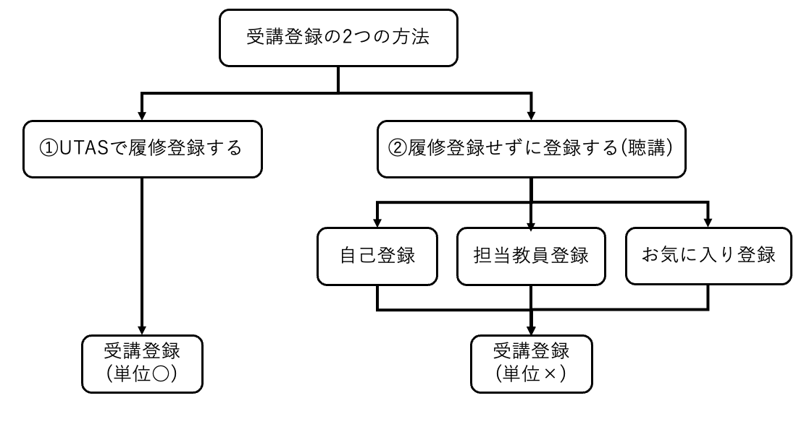
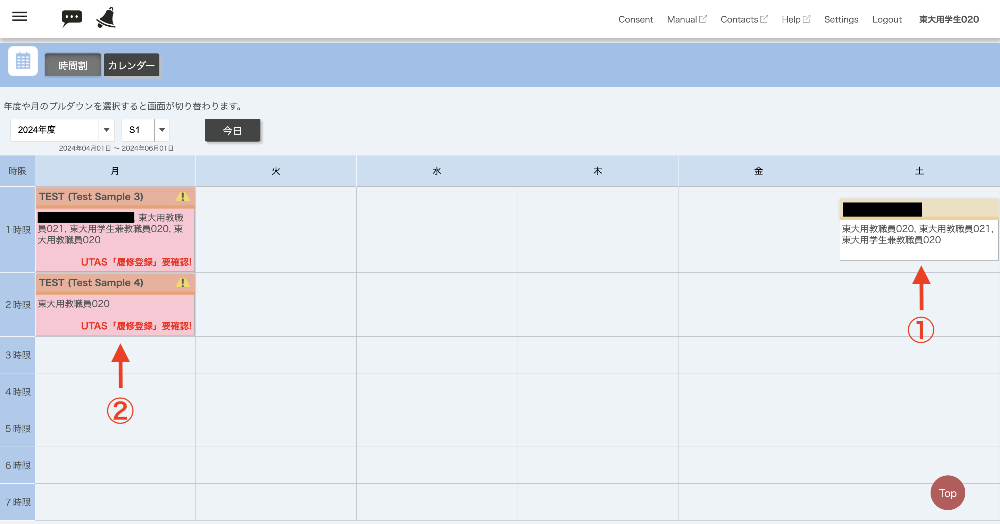
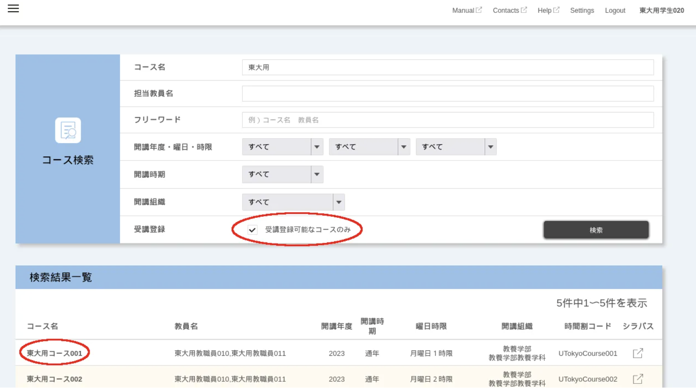
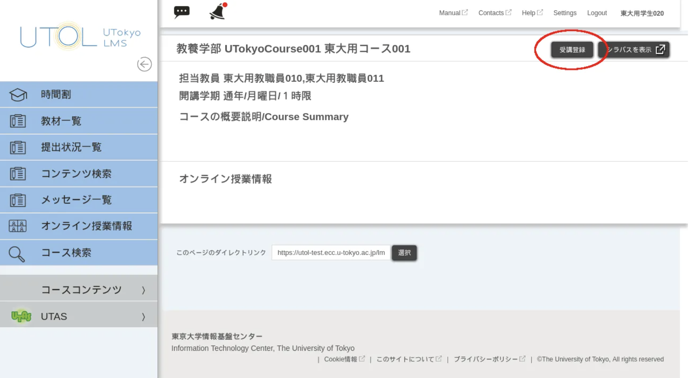
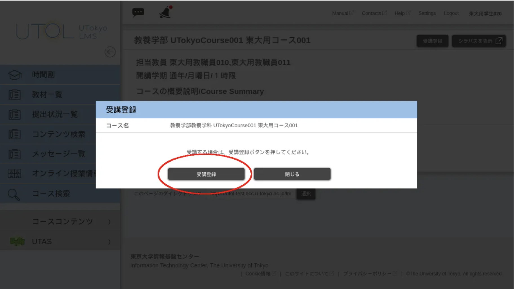
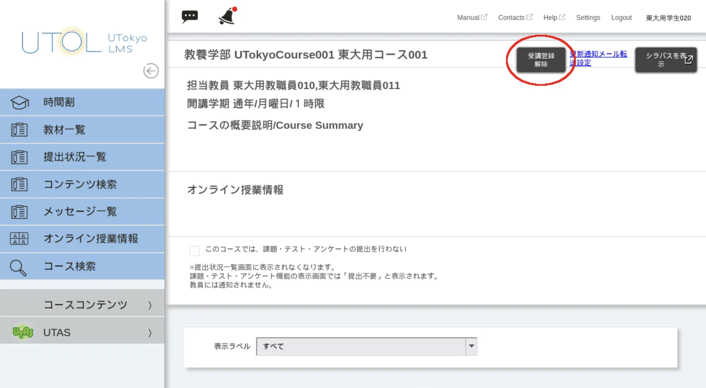
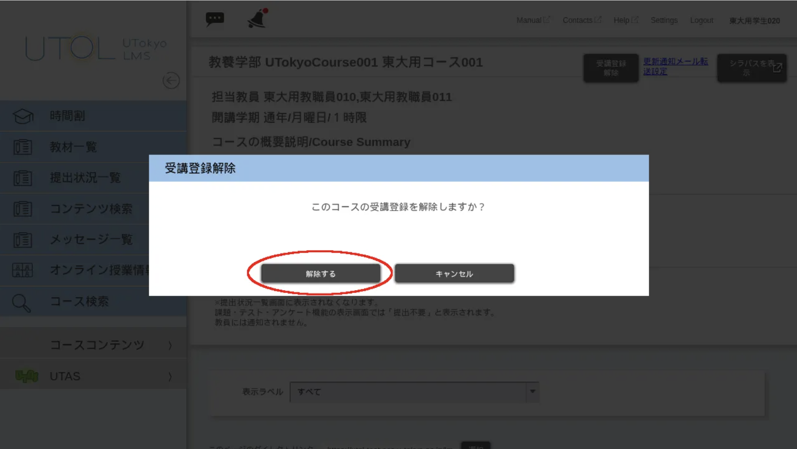

本ページでは，UTOLでコースに登録する方法について説明します．

## 概要

UTOLでは，科目のことをコースと呼びます．コース内の授業資料等を利用するには「**受講登録**」が必要です．  
受講登録には，「①UTASで履修登録する」「②履修登録せずに登録する」という2つの方法があります．

UTASで履修登録すると，自動的にUTOL上でも受講登録されます．また，UTOL上での操作等により，コースによっては履修登録せずに受講登録だけすることもできます（いわゆる「聴講」）．ただ，この方法では単位がつかないので，単位を取得したい科目は必ず**UTASで履修登録してください．**

本ページでは，以下の2つを説明します．

* [コースの登録状態の確認方法](#registration-status)
* [コースへの登録・登録解除の操作方法](#registration-operation)

## コースの登録状態の確認方法
{:#registration-status}

### ①UTASで履修登録した場合

UTOLの時間割画面に表示されます．**なお，UTOLの表示だけで履修登録の有無を判断するのは危険です**．最終的な確認は必ずUTASの「履修科目控出力」機能で行ってください．

UTASでの履修登録がUTOLに反映されるまでには，1時間ほどのタイムラグがあります．また，メンテナンス等で反映が失敗したり遅れたりすることもあります．

### ②履修登録しないで利用している場合

UTOLの時間割画面に表示されますが，「履修登録要確認」の文言が表示されます．なお，講習会など，対応する科目がUTASにないコースには「履修登録要確認」が表示されません．  
この状態になることがあるのは主に以下の3つです．

* 自己登録  
* 担当教員登録  
* UTASでのお気に入り登録

履修登録せずに利用しているコース（いわゆる「聴講」の状態）では，以下の点に注意してください．

* この状態でもコースは利用できますが，正式な履修として認められません（単位がつきません．）  
* 自己登録・お気に入り登録では利用できないコースや，履修登録期間が終わると利用できなくなるコースがあります．  
* お気に入り登録は履修登録期限が来ると自動的に削除され，コースを利用できなくなるので，その前に自己登録か担当教員登録に切り替える必要があります．

### ③受講登録していない場合

UTOLの時間割画面に表示されません．

## コースへの登録・登録解除の操作方法
{:#registration-operation}

### 履修登録して利用する

正式な履修として認められる唯一の方法です．（**「お気に入り登録」は履修登録ではありません！**）UTASで履修登録を行い，利用してください．なお，以下の点に注意してください．

* 履修登録してからUTOLに反映されるまでに1時間ほどのタイムラグがあります．  
* すぐに利用したい場合は**履修登録したうえで**以下の「履修登録しないで利用する」の手順を踏む必要があります．その場合，反映されるまでは「履修登録要確認」が表示されますが，反映が完了すると表示されなくなります．  
* 履修登録を取り消すとUTOLにもそれが自動的に反映されます．

### 履修登録しないで利用する

正式な履修としては認められず，単位は認定されません．「自己登録」「担当教員登録」「お気に入り登録」の3つの方法があります．

#### 自己登録

自己登録は，科目の教員が設定で許可している場合のみ利用できます．また，コースの設定によっては履修登録期間の終了後に自己登録が使えなくなることがあります．その場合は[担当教員登録](/utol/lecturers/settings/course\_participants/)に切り替える必要があるため，担当教員に問い合わせてください．

##### 登録方法

担当教員がいわゆる「聴講」を行えるように設定している場合は，学生が自分で受講登録（「自己登録」）を行ってコース内のコンテンツを閲覧できます．「自己登録」が可能なコースの受講登録は以下の手順で行えます．

1. [コース検索](/utol/students/course_search/)で受講登録したいコースを探してください．検索をする際，「受講登録可能なコースのみ」にチェックを付けると「自己登録」が可能なコースのみが表示されます．

    
2. 検索結果として表示されるコースのタイトルを押すとコース画面が表示されます．コース画面右上の「受講登録」ボタンを押してください．
    * コース画面に「受講登録」ボタンがない場合には，コースの担当教員にコース設定を変更してもらうか，手動での受講登録を行ってもらうよう依頼してください．

    
3. 「受講する場合は、受講登録ボタンを押してください。」というダイアログが表示されるので，「受講登録」ボタンを押してください．

    
4. 一度UTOLからログアウトして，再度ログインしてください．時間割表を開くと，受講登録したコースが表示されるようになります．

##### 解除方法
1. 時間割表で受講登録を解除したいコースのコースタイトルを押してください．
2. コーストップ画面の右上に表示されている「受講登録解除」ボタンを押してください．

    
3. 「このコースの受講登録を解除しますか？」というダイアログが表示されるので，「解除する」を押してください．
    
    
4. 一度UTOLからログアウトして，再度ログインしてください．時間割表を開くと，受講登録を解除したコースが表示されなくなります．

#### 担当教員登録

##### 登録方法

履修していない科目のコースについて，コースの担当教員に依頼して手動で登録してもらうことができます．

必要に応じて，担当教員に[コース参加者登録](/utol/lecturers/settings/course\_participants/)のページを案内するとスムーズです．  

##### 解除方法

登録方法と同様に，コースの担当教員に受講登録の解除を依頼してください．

#### お気に入り登録

お気に入り登録を利用できるのは履修登録期間中に限られます．履修登録期間が終了すると削除されるので注意してください．

##### 登録方法

UTASで科目をお気に入り登録すると，およそ1時間以内に受講登録されます．履修登録期間が終了するとこの登録は削除されます．

##### 解除方法

UTAS上でお気に入り登録を解除すると，およそ1時間以内に受講登録が解除されます．  
