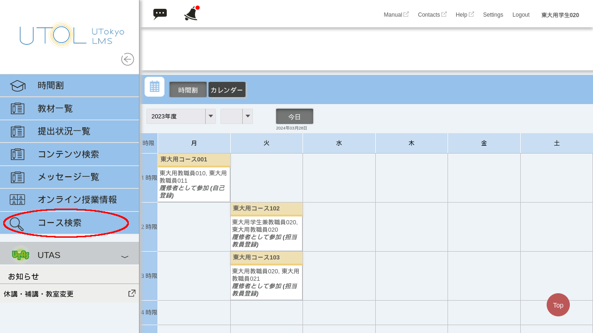
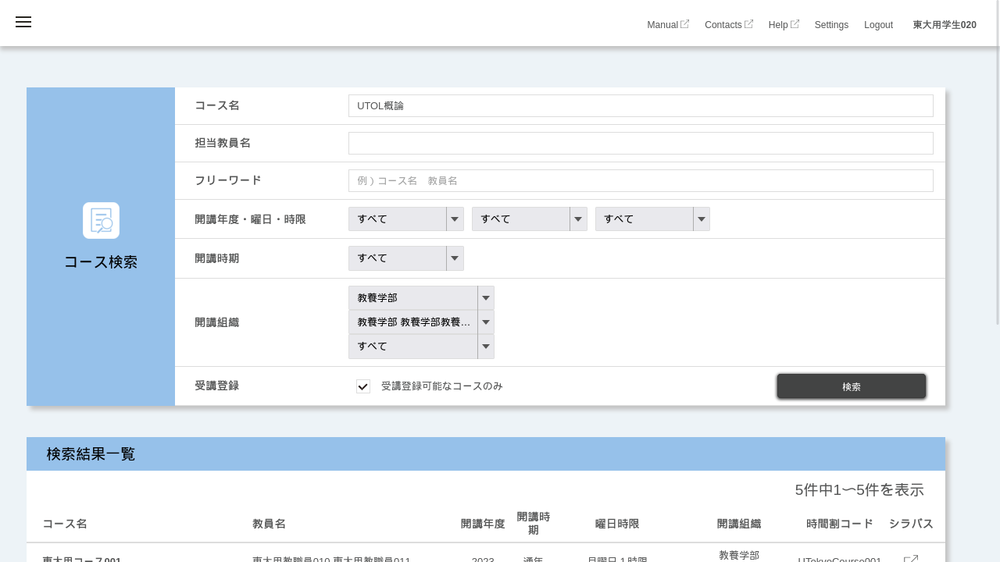
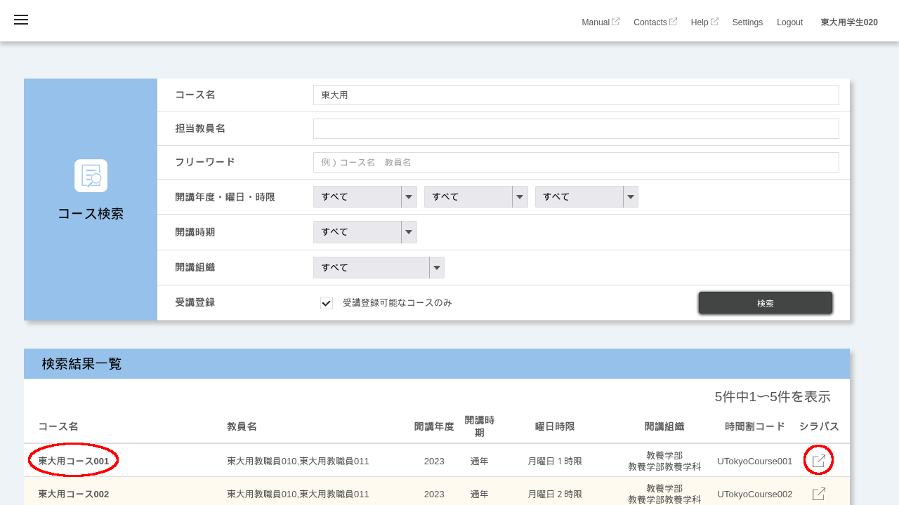

UTOLでは，タームやセメスター単位で開講される科目のことを「コース」と呼びます．

コース検索機能を使用すると，UTOL上のコースを，コース名や曜限，開講組織などの条件で絞りこんで検索することができます．

## UTOL上のコースを検索する手順
1. 画面左上の{:.icon}を押してください．
2. 左側に表示されたメニューの「コース検索」を押してください．

    
3. コース検索画面が表示されるので，条件を入力して検索してください．入力できる条件は，以下の通りです．
    * コース名
    * 担当教員名
    * フリーワード
      * コース名や担当教員名，「コースの概要説明」に含まれるキーワードで検索できます．
    * 開講年度
    * 曜日
      * 集中講義等では「その他」になります．
    * 時限
      * 集中講義等では「時間割外」になります．
    * 開講時期
      * 「開講期」を選択した場合，「S1」や「A2」などのタームを指定して，そのタームで開講されているコースを検索します．
        * 例として，「開講期」で「S1」を指定すると，S1ターム，Sセメスター，通年のコースなどが該当します．
      * 「開講区分」を選択した場合，「S1」や「A1A2」，「集中」などの区分を指定して検索します．
        * 例として，「開講区分」で「A1A2」を指定すると，Aセメスターを通して開講されるコースは該当しますが，A1タームのみのコースは該当しません．
    * 開講組織
      * 上位の組織（「教養学部」など）を選択すると，下位の組織（「教養学科」など）を選択するためのプルダウンメニューが表示されます．
    * 受講登録
      * 「受講登録可能なコースのみ」をチェックすると，履修登録をしていなくても自分で[受講登録](../course_registration/)ができるコースのみを検索します．

    
4. 検索結果一覧のコース名を押すと，コーストップ画面に遷移します．また，「シラバス」列のボタンを押すと，UTAS上で対応するシラバスのページが開きます．

    