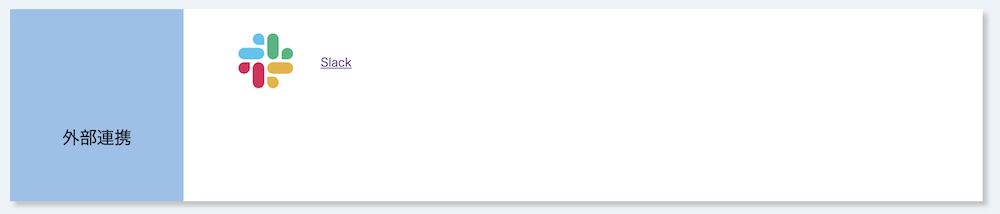
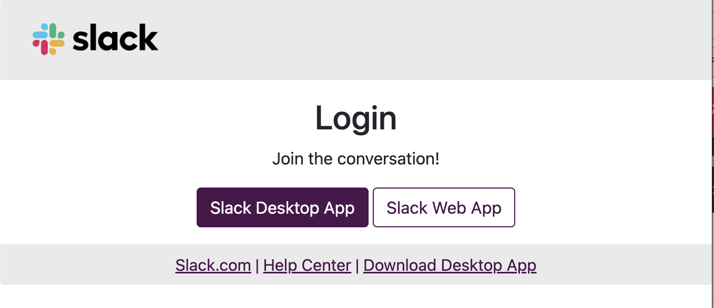

## 概要

UTOLのSlack連携機能は，UTOL上のコースの担当教員や履修者などメンバーとする専用のUTokyo Slackワークスペースを運用する機能です．担当教員がSlack連携機能を利用している場合，履修者は，担当教員や同じ授業を受けている学生との間のやり取りにワークスペースを利用できます．

## 準備

[情報セキュリティ教育](https://univtokyo.sharepoint.com/sites/Security/SitePages/Information_Security_Education.aspx)の受講や，[UTokyo Accountの多要素認証](/utokyo_account/mfa/)の有効化が完了していない場合は，それらを完了させてください．

## 利用手順

1. コーストップ画面の「外部連携」の欄にある「Slack」をクリックして下さい．
   
1. SlackアプリもしくはウェブブラウザからSlackを利用してください．
   

## 補足・注意事項

- Slack連携機能の利用が開始されると，当該コースの参加者は，当該コースと連携したUTokyo Slackのワークスペースに自動的に招待されます．そのため，すでにUTokyo Slackを利用している場合，ワークスペースに参加する操作をしていなくとも，ワークスペースに追加されていることがあります．
- コースの開講期間が終了して30日経過すると，ワークスペースは自動的にアーカイブされます．アーカイブ後は当該ワークスペースを利用することはできません．
- Slack利用上の注意事項等に関しては，UTokyo Slackの「[利用上の注意事項](/slack/#precautions)」を参照してください．
