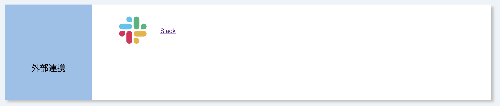

## 概要

UTOLのSlack連携機能は，UTOL上のコースの担当教員や履修者などメンバーとする専用のUTokyo Slackワークスペースを運用する機能です．担当教員がSlack連携機能を利用している場合，担当教員や同じ授業を受けている学生との間でワークスペースを利用できます．

## 準備

UTokyo Slackを利用したことが無い場合は，[UTokyo Slack](/slack/)を読み，必要な設定を行って利用開始してください．

## 利用手順

1. コーストップ画面の「外部連携」の欄にある「Slack」をクリックして下さい．
   
1. SlackアプリもしくはウェブブラウザからSlackを利用してください．
   

## 補足・注意事項

- コースの開講期間が終了して30日経過すると，ワークスペースは自動的にアーカイブされます．アーカイブ後は当該ワークスペースを利用することはできません．

