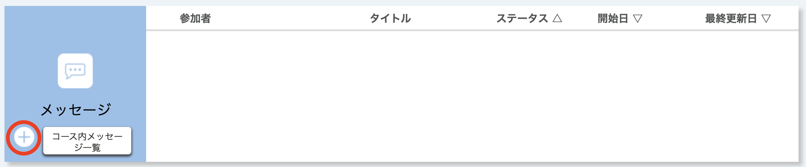
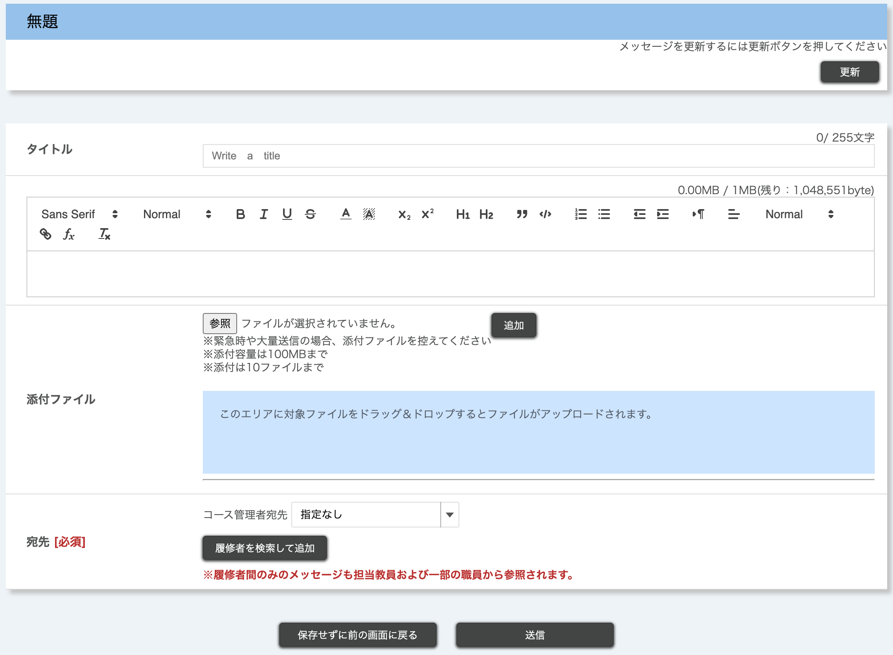
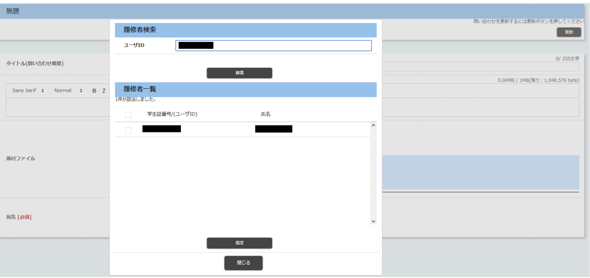
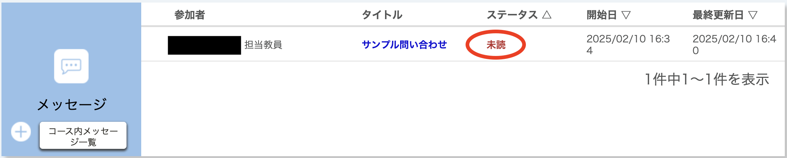
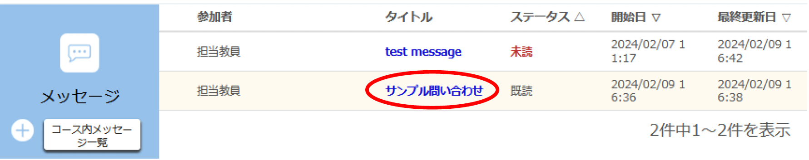
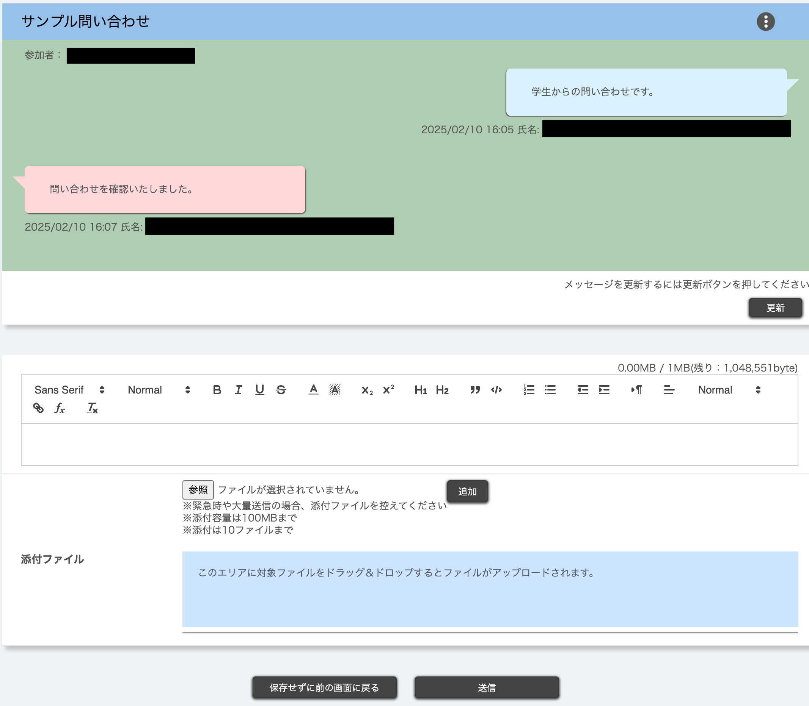

## はじめに

UTOL上のコースに登録している履修者は，担当教員やTA，他の履修者にメッセージを送ることができます．なお，教員がメッセージ機能を有効にしていない場合は利用できません．

## 利用の手順

ここでは，メッセージ機能を利用する手順を説明します．

### 新しく会話を始める

1. 「コーストップ」画面の「＋」ボタンを押すと，「メッセージ」画面に移り，新しくメッセージを作成することができます．
   
2. 以下の必要事項を入力してください．
   
    * タイトル
    * 本文
      * マークアップ機能を利用できます．マークアップ機能の使い方についての詳細は「[UTOLでマークアップ機能を利用する](../../markup/)」をご参照ください．
    * 添付ファイル
      * 「参照」ボタンを押してファイルを選択したあと，「追加」ボタンを押すことでファイルを添付できます．
      * 緊急時や大量送信の場合は，ファイルの添付を控えてください．
    * 宛先：教員・TAや履修者，あるいはその両者を宛先として設定できます．
      * 宛先に教員・TA（コース管理者）を指定する
        * コース管理者の宛先は「すべての担当教員及びTA」「すべての担当教員」「指定なし」から選択できます．    
        * 複数の教員・TAが参加するコースで特定の教員・TAに対してのみメッセージを送ることはできません．
        * 教員にのみ伝えたい内容かどうかで「すべての担当教員およびTA」か「すべての担当教員」かを使い分けてください．      
        * コース管理者の宛先に「指定なし」を選択すると，履修者同士のメッセージのやりとりとなります．なおこの時，担当教員やTAはメッセージに参加できませんが，担当教員はメッセージを閲覧することができます．また，「指定なし」を選択した場合は1人以上の履修者を宛先に指定してください．
      * 宛先に履修者を指定する
        * 以下の手順に従って追加できます．
          1. 「履修者を検索して追加」ボタンを押すと，履修者検索画面がポップアップで表示されます
          2. 追加したい履修者のID（UTokyo Accountでログインしているユーザの場合は，共通ID（UTokyo Accountの先頭10桁の数字のみの部分））を「ユーザID」欄に入力し，「検索」を押してください．検索結果一覧にユーザが表示されます．
          3. 追加したいユーザのチェックボックスにチェックを入れてください．
          4. 「指定」ボタンを押してください．
       
3. 画面下部の[送信]ボタンを押すとメッセージが送信されます．
   

### 受信したメッセージを確認する・返信する

#### 受信したメッセージを確認する

新しく受信したメッセージは，コーストップの「メッセージ」欄から以下のように確認できます．
* すでに始めた会話に返信があるとき
  * 既存の会話の「ステータス」列に「未読」と表示されます．
* 担当教員やTA、他の履修者が自分を含む新しい会話を始めたとき
  * 新しく会話が作られ，「ステータス」列に「未読」と表示されます．

なお，更新通知からも確認できます．また，メール・LINEで返信内容を受信することもできます．詳しい通知設定方法については「[UTOLからの通知を設定する](../../notification/)」をご参照ください． 

#### 既存の会話に返信する

以下の手順で返信できます．
1. 「タイトル」列のリンクを押すと，「メッセージ投稿」画面に移り，返信を確認できます．
   
   
   この画面を開いている間に届いた新着メッセージを確認したい時は画面上部の[更新]ボタンを押してください．
2. メッセージに返信する場合は，本文と添付ファイルを入力して送信してください．
