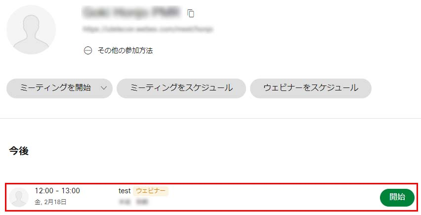
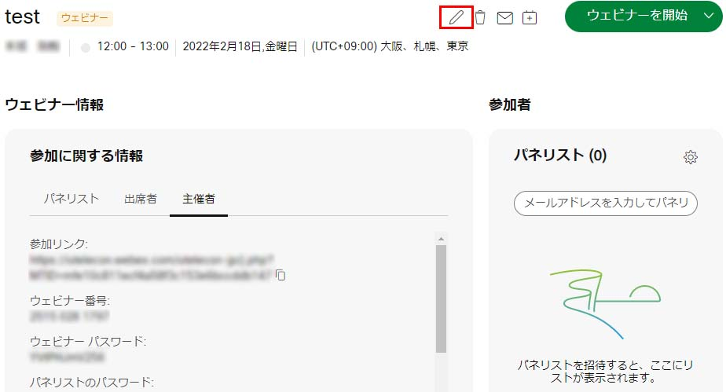
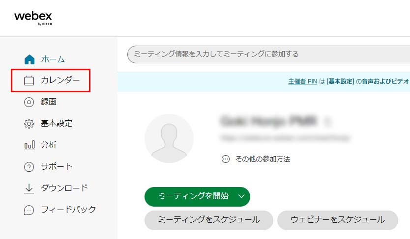
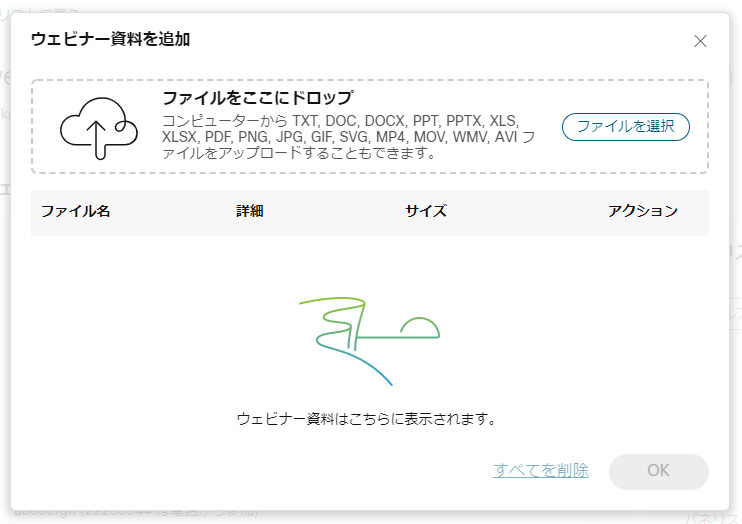
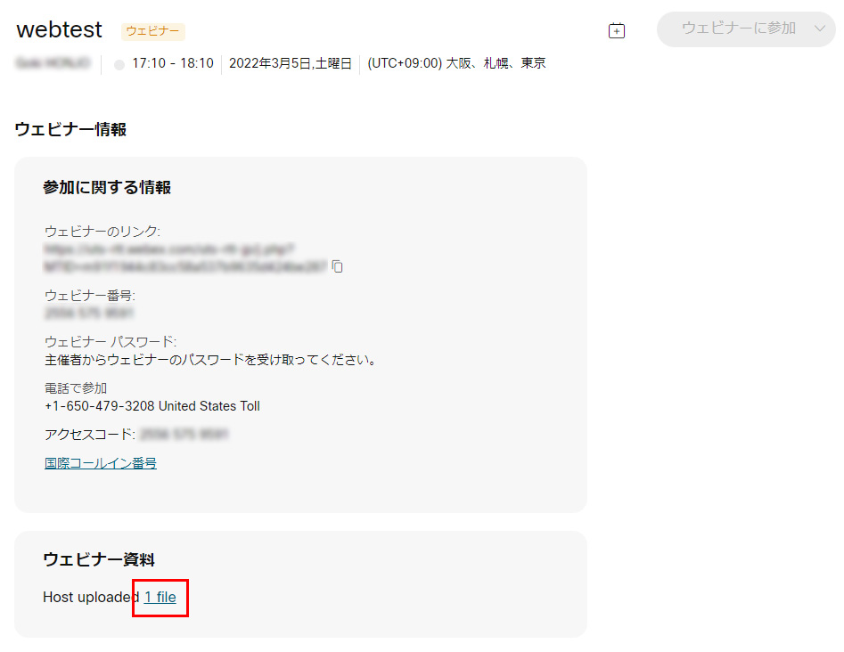

## Webexウェビナーを作成する

* Webexウェビナーをスケジュールするには，ホーム画面の「ウェビナーをスケジュール」ボタンを押して，各種設定を行います．
	* 「ウェビナーをスケジュール」画面では，議題，パスワード，日時，パネリストなどを設定することができます．各項目について説明します．
	* **議題**： このウェビナーの名称を入力します．必須項目です．
	* **ウェビナーパスワード**： 参加者がウェビナーに参加する時に必要となるパスワードです．任意の文字列が表示されていますが，変更可能です．
	* **日時**： この画面を開いた直近の時間が表示されていますが，右端の記号をおすことで，変更することができます．また，繰り返しにすることもできます．繰り返しのチェックボックスをオンにすると，繰り返しの規則について設定する項目があらわれます．
	* **パネリスト**： このウェビナーでパネリストにしたい方のメールアドレスをここに記入します．この設定全体が完了すると自動的にここで設定された参加者にメールでURL等が連絡されます．
	* **パネリストパスワード**： パネリストがウェビナーに参加する時に必要となるパスワードです．任意の文字列が表示されていますが，変更可能です．
	* **詳細設定を表示する**： 音声接続オプション，協議事項，スケジューリングオプションが設定できます．この中では，たとえば，自動で録画をはじめたり，参加者登録，リマインドメールの設定などができます．

	{:.border}

* 一通りの設定を終えて「スケジュール」ボタンを押すと，ウェビナー番号が作成されます．
	* 出席者に入力したメールアドレスには招待メールが送信されます．
	* 出席者に入力していない出席者にも，表示された参加リンク・ミーティング番号・パスワード等をメールで周知することができます．主催者キーは，主催者のみが知るべき番号なので，一般の出席者には周知すべきではありません．

	{:.border}

## Webexウェビナーを編集する

作成したウェビナーの内容を編集するには，ホーム画面に表示されている該当のウェビナーを選択し，編集アイコンをクリックします．
{:.border.medium}
{:.border.medium}
* ホーム画面には一週間以内に開催されるミーティング・ウェビナーが表示されます．それ以降のウェビナーを選択したい場合はホーム画面左の「カレンダー」をクリックして，日付を指定して検索します．
{:.border.medium}
{:.border.medium}

### 資料を配布する

ウェビナーに資料を添付して，参加者に配布することができます．
* スマートホン等で参加している参加者には配布できません．
* ウェビナーの編集画面の「ウェビナー資料」の「編集」をクリックし，ファイルをアップロードします．
{:.border}
{:.medium.border}
* 参加者は，招待URLにブラウザからアクセスしたときに表示されるページからファイルをダウンロードすることができます．
{:.border.medium}
{:.medium.border}

<!--
### メールの文面をカスタマイズする

Webexには，テンプレートの種別（ウェビナーへの招待，リマインダー等）ごとに3種類のテンプレートを保存しておくことができます．ウェビナーごとにこの3種類からテンプレートを選び，さらにそのウェビナー用に編集することができます．

#### アカウントのテンプレートを編集する

#### テンプレートを選択する

#### ウェビナー用に編集する
-->

 
 
<a href="index" target="_blank">Webexの使い方ページに戻る</a>
