## 役割

### Webex Meetings

Webex Meetingsには主に以下の権限があります．（[「Webex Meetings での異なるロールとは?」](https://help.webex.com/ja-JP/article/WBX9000028575/)）
* **主催者**： イベントの開始・終了をする他，プレゼンター権限の設定，ブレイクアウトセッションの制御，参加者のロビーへの移動・入場，Slidoの起動，録画をすることができます．また，参加者のマイクミュートの設定もできます．
* **共同主催者**： 主催者とほぼ同等の権限を持ち，主催者のアシスタントとして，会議の進行を円滑にすることができます．
* **プレゼンター**： コンテンツの共有をすることができます．主催者が「誰でも共有可」の設定をしている時は，コンテンツの共有をするとその人が自動的にプレゼンターになります．「誰でも共有可」の設定がされていない時は，主催者・共同主催者が設定したプレゼンターのみがコンテンツ共有・投票の管理ができます．
* **参加者**： 自分でマイクミュートの解除も，カメラ映像の送信もすることができます．相互にチャットをすることもできます．主催者が「出席者が各自でミュート解除することを許可する」の設定をしていない時は，自分でマイクミュートを解除することができません．

### Webex Webinars

Webex ウェビナーには主に以下の権限があります．（[「Webex Webinars でのロール」](https://help.webex.com/ja-JP/article/nme90adb/)）
* **主催者**： イベントの開始・終了をする他，他の参加者の権限を設定することができます．
* **共同主催者**： 主催者とほぼ同等の権限を持ち，主催者のアシスタントとして，会議の進行を円滑にすることができます．
* **プレゼンタ**： コンテンツの共有をすることができます．自分のミュートの設定・解除はすることができます．
* **パネリスト**： 参加者からのQ&Aに回答することができます．自分のミュートの設定・解除はすることができます．
* **参加者**： カメラ映像は送信されず，主催者がミュートを解除しないと，自分でもミュートを解除できません．また，参加者同士は完全に見知らぬ相手同士が同じイベントに参加している想定なので，チャットは参加者同士ではできず，主催者・パネリスト・プレゼンターのみとしかできません．唯一，Q&Aのみ他の参加者のやりとりも見ることができます．

## 画面の構成

* ミーティング・ウェビナーに入ると下記のような画面になります．

	{:.border}

* 画面の下部にボタンが並んでいます．権限によってボタン自体が表示されなくなる，Webexのウィンドウの大きさによってボタンのラベルが表示されなくなるなど，見え方が異なることもあります．

	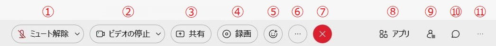
	1. **ミュート**： 黒くなっているときはマイクがオンになっています．ミュートのときは赤くなります．音声を検知して送出している時はマイクの中がアニメーションします．**発言しない場合には基本的にミュート（アイコンを赤くする）にしておきましょう．思わぬ音が他の参加者にもれてしまっていることがあります．**Webexのウィンドウがアクティブになっている間は，スペースキーを押している間だけミュートを解除することができます（スペースキーを離すとミュートになります）．
	1. **ビデオ**： 黒くなっているときはカメラがオンになっています．カメラがオフになっているときは赤くなります．**ネットワーク環境が不安定な場合，ビデオを停止（アイコンを赤くする）しましょう．**
	1. **共有**： 画面共有を行い，他の参加者に資料を共有するための機能です．手元のPCの画面をそのまま共有する，特定のアプリケーションウィンドウのみを共有するといったことができます．手元のパワーポイント資料を見せたり，動画を見せたり，といったときに用います．また，ホワイトボード機能もあり，その場で手書きしたものを共有することもできます．
	1. **録画（主催者・共同主催者のみ）**： 会議の様子を録画して残すことができます．クラウド上（Webexのサーバー上）に残すことも，手元のコンピューター上に残すこともできますが，設定によっては手元のコンピューター上への録画は無効になっていることもあります．主催者が参加している場合，共同主催者は録画を開始することができません．
	1. **反応**： 挙手やいいね！などの反応を送ることができます．
	2. **他のオプション**： ここにはその他のオプションがあります．<!-- ブレイクアウトセッションの制御，会議室への入室をさせないようにする（一定時間以上の遅刻を認めないなどのときに利用します），参加者の入室時に，音を鳴らしたり，ミュートで入ってもらう設定などを行うことができます．投票機能はブラウザでは行うことができずデスクトップアプリが必要になります． -->
	3. **退出**： 会議室から退出します．ブレイクアウトセッションに参加している時は，ブレイクアウトセッションから抜けてメインミーティングに戻るときもここを押します．
	4. **アプリ**： ここからSlidoなどのサードバーティーアプリケーションを利用することができます．
	5. **参加者**： 参加者ボタンを押すと参加者一覧が表示されます．参加者一覧では，それぞれの名前にマウスを重ねると，その参加者だけにメッセージを送れたり，プルダウンメニューで退出させることができます．
	6. **チャット**： チャットボタンを押すとチャットウィンドウが現れて，全員や特定の人にメッセージを送ることができます．
	7. **パネルオプション**： メモや投票，Q&Aのウィンドウを表示することができます．

以下，主に利用するメニュー項目について，追加で詳細を説明します．

## 画面の共有
	
「共有」を押すと，共有する画面の選択肢が出てきます．希望のものを選択して「共有」を押すと，画面の共有が始まります．

{:.border}
	
* 「**画面1**」を選択すると，共有する人の画面そのものが全員に共有されます（マルチモニタなどで画面が複数ある場合は画面1，画面2…と選択肢が増えます）．
* 現在開いているウィンドウも選択肢に表示されます．ウィンドウ単位で画面共有することもできます．ウィンドウ以外の場所を見られたくない場合は，そのウィンドウを選択して画面共有することをおすすめします．
* 「**新しいホワイトボード**」を選択すると自由に描けるホワイトボードが共有されます．
* 「**自動的に最適化**」の右のスピーカーアイコンをクリックすると，コンピューター上で再生される音声を共有するかどうかを選択することができます．

### 画面共有での注釈

画面共有中にマウスを画面上部にスクロールすると，ミーティング・ウェビナーのコントロールメニューが出てきます．その中の「注釈」ボタンを押すとパレットが表示され，今表示している画面の上に線・矢印・四角形などを重ねて表示して共有することができます．注釈パレットの一番上のアイコンをクリックすると，他の参加者にもパレットが表示され，他の参加者も注釈を書くことができるようになります．簡単なYes/Noクエスチョンなどに利用できます．
{:.border}
{:.border}

ホワイトボードの共有を開始すると，最初から注釈オン・参加者の注釈オンの状態になります．（必要に応じてオフにすることもできます．）

## スピーカー・マイク・カメラの詳細設定

「ミュート」「カメラ」ボタンの右にある矢印をクリックすると，Webexで利用するスピーカー・マイク・カメラを選択することができます．

<figure>

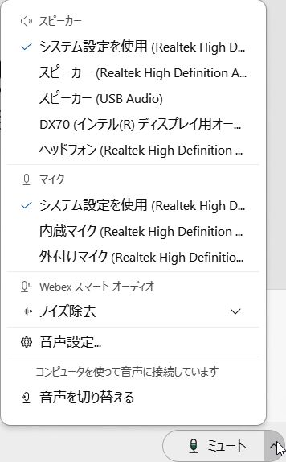

</figure>

それぞれの「設定」をクリックするとより詳しい設定と，機器のテストを行うことができます．

### スピーカー・マイクの詳細設定

「音声設定…」をクリックすると次のような画面が表示されます．
（「ミュージックモード」が見えるよう画像を合成しているため，画面が実際よりも大きくなっています．）

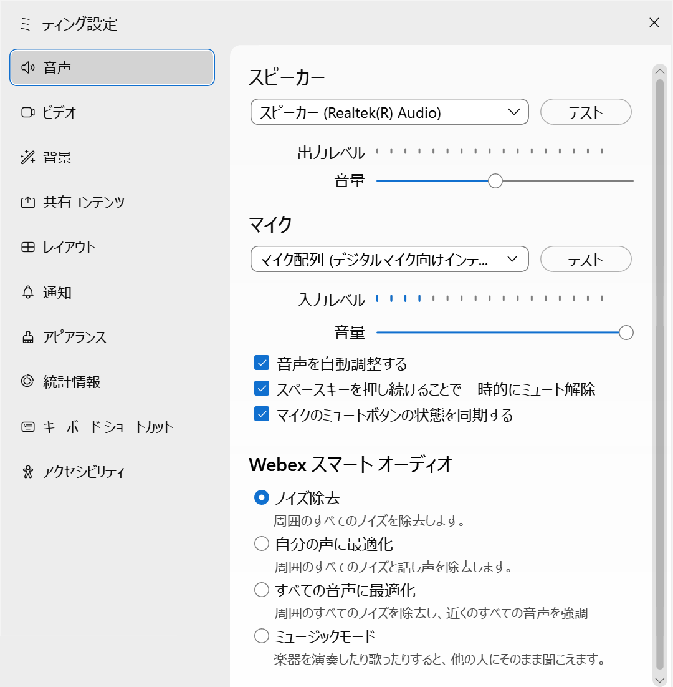{:.border}

* **スピーカー** : 使いたいスピーカーを選択できます（別途スピーカーを接続している場合，複数の選択肢が出てくるため，目的のものを選択してください）．**「テスト」**をクリックすると確認音が流れます．
* **マイク** : 使いたいマイクを選択できます（別途マイクを接続している場合，複数の選択肢が出てくるため，目的のものを選択してください）．正しくマイクから音が拾えていれば下のメーターが振れます．**「テスト」**をクリックすると，選択したマイクからの音声を短時間録音して再生してくれるので，マイクを確認することができます．必要に応じて**「音声を自動調整する」**にチェックを入れて下さい．一般的には**「ノイズ除去」**を選択しますが，近くで別の人が話をしている時には**「自分の声に最適化」**を選択すると別の人の声をフィルタできることもあります．**「ミュージックモード」**を選択すると，ノイズリダクション機能が無効化され，背景で流れているBGMやノイズ等も送出されるようになります．

### カメラの詳細設定

「ビデオ設定…」をクリックすると次のような画面が表示されます．

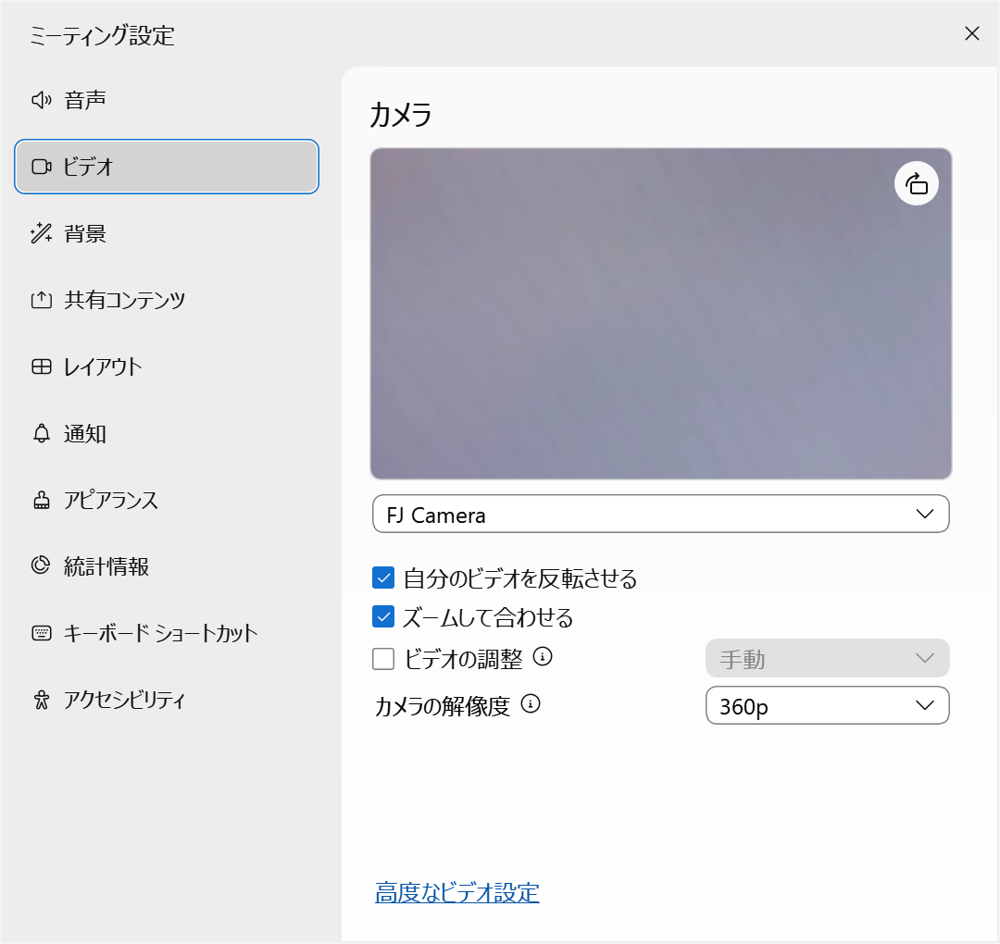{:.border}

* **カメラ** : 使いたいカメラを選択できます（別途カメラを接続している場合，複数の選択肢が出てくるため，目的のものを選択してください）．画面上部にカメラのプレビューが表示されますので確認できます．

### バーチャル背景の設定

「仮想背景を変更」をクリックすると次のような画面が表示されます．

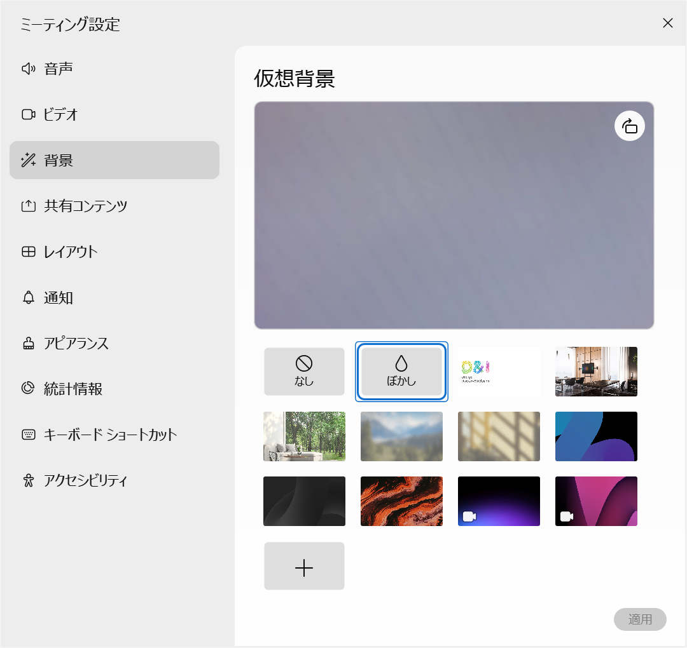{:.border}

* **仮想背景** : バーチャル背景を設定することができます．**一部の端末ではバーチャル背景が設定できないことがあります．**

## 参加者

「参加者」を押すと，参加者一覧が見られる画面が出てきます．

{:.border}
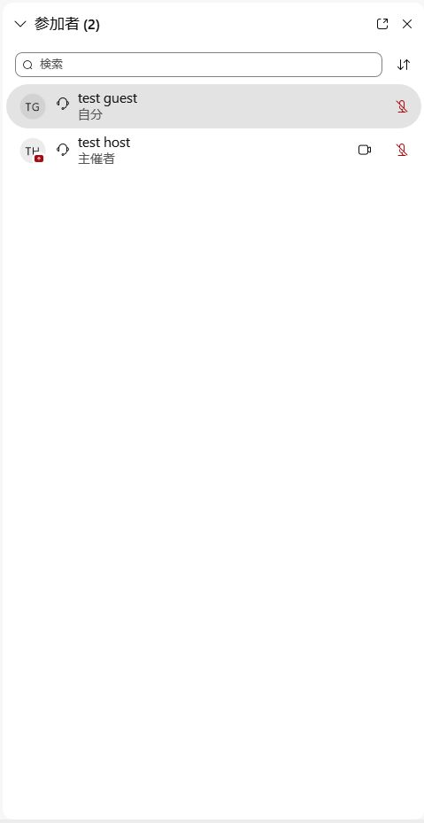{:.border}

左側が主催者側の様子，右側が参加者側の様子です．
* **手のアイコン**： 主催者以外の参加者は手のアイコンを押すと「手を挙げている」ことになり，主催者にも手を挙げていることがわかります．上の図では，test attendeeが手を挙げています．
* **マイクのアイコン**： マイクのアイコンが赤くなっている参加者は，マイクがミュート状態になっています．主催者は，参加者のマイクをミュートすることもできます．上の図では，test hostとtest userのマイクはミュート状態になっています．
* 参加者一覧を検索したり，並び替えたりすることもできます．
* 参加者を右クリックして「表示名の編集」を選択すると表示名を変更することができます．Webex Meetingsでは，自分自身の表示名を変更できるほか，主催者・共同主催者は参加者の表示名も変更することができます．Webex Webinarsでは，主催者・共同主催者はパネリストの表示名も変更することができますが，参加者の表示名を変更することは（参加者自身であっても）できません．
* Webex Webinarsでは，参加者として参加している時は他の参加者は一覧に表示されず，自分のみが表示されます．

## Slidoを操作する

主催者がSlidoを起動すると，Slidoの画面が表示されます．

{:.border}
{:.border}

* 主催者がPollの操作をすると，投票タブにPollの回答画面が表示されます．
* 質問などは，Q&Aタブで操作します．
* 基本的な操作はウェブで利用する時と同じです．

## チャット
	
「チャット」を押すと，テキストチャットができるようになります．自分が参加する以前のチャットの履歴は読むことができません．

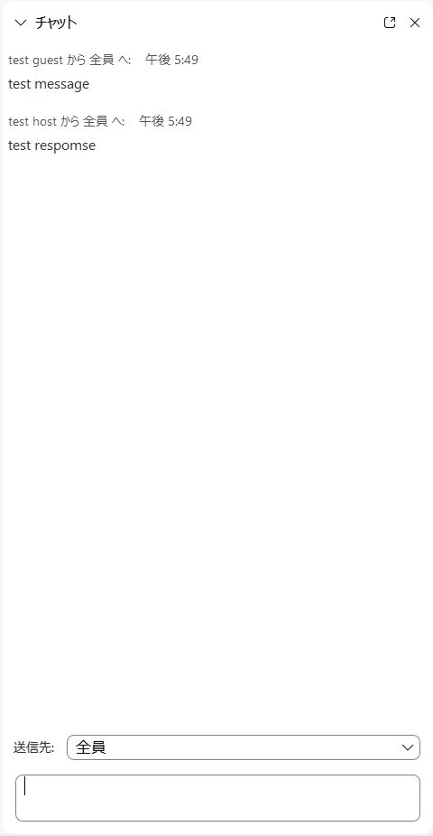{:.border}
	
* **送信先**： 送信する相手を変更できます．「全員」を選択すれば全員に送信されます．

## Q&A

「Q&A」を押すと，主催者・プレゼンター（・パネリスト：Webex Webinarsのみ）に質問を送ることができます．

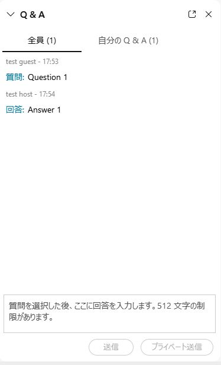{:.border}
{:.border}

* 左側が主催者側の様子，右側が参加者側からの様子です．質問に対する回答が揃うと，両方が全参加者に共有されます．途中からイ
ベントに参加した参加者も過去のQ&Aを読むことができます．
* 質問する相手を主催者だけ，など選択することができます．
* 主催者は「プライベート送信」をクリックすると「プライベートに回答」「保留」「却下」を選ぶことができます．全参加者に見せるべきでない回答は「プライベートに回答」，調査が必要で回答に時間がかかる場合は「保留」，などとすることができます．

## ブレイクアウトセッション

ブレイクアウトセッション機能では，「メインミーティング」のほかに「ブレイクアウトセッション」が複数個作成され，参加者は各自に割り当てられたブレイクアウトセッションに散って議論したり，メインミーティングに戻ってきたりすることができます．**ブレイクアウトセッションは最大100個作成することができます．**

**ブレイクアウトセッション機能は，End-to-End Encrypted Meetingでは利用できません．**

参加者は，参加ボタンを押してセッションに移動することができます．終わったら，退出のボタンを押してメインミーティングに戻ることができます．（このあたりは，主催者によって行動が限定されている可能性があります．）

{:.border}
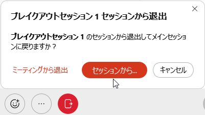{:.border}

ブレイクアウトセッション中では，メインミーティング同様に参加者同士がビデオ映像や画面を共有することができたり，チャットを送り合うことができます．（このあたりはブレイクアウトセッションでない部分と変わりません．）

さらに，主催者にヘルプを求めることができます．ヘルプを求めると，主催者に通知され，主催者が自分のセッションに来てくれるかも知れません．主催者がいずれかのセッションに参加しているとヘルプを求めることができません．待ちましょう．

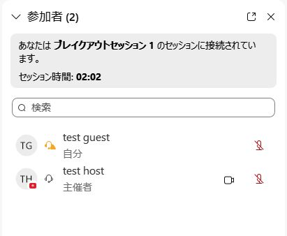{:.border}

主催者の操作については，[Webex 会議室でできること（開催者）](do_webex_host)をご覧ください．

## ロビー機能（Webex Meetingsのみ）

ミーティングがロックされているときに参加者が参加しようとすると，いったんロビーに送られます．

**End-to-End Encrypted Meetingでは，いったん会議室に入った参加者をロビーに送ることができません．**

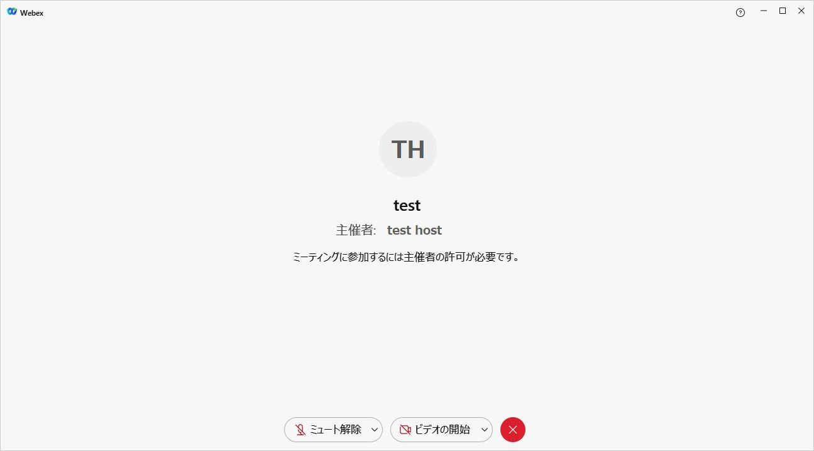{:.border}
