* ここでは，開催者特有のWebex Meetings・Webex Webinarsの機能を説明します．	
* 基本的な使い方については<a href="do_webex" target="_blank">こちら</a>をご覧ください．

## ブレイクアウトセッション

管理者は，ブレイクアウトセッションの数の設定，参加者のブレイクアウトセッションへの割り当て，各ブレイクアウトセッションの名前の変更，制限時間とカウントダウンタイマーの設定ができます．**ブレイクアウトセッション機能は，End-to-End Encrypted Meetingでは利用できません．**
* ブレイクアウトセッションは最大100個まで作成可能です．
* （Webex Webinarsのみ）主催者はパネリストを各ブレイクアウトセッションに割り当てることはできますが，参加者の割り当てはできず，参加者は自分で入る部屋を選ぶことになります.
* ブレイクアウトセッションは，スケジュール時に設定するか，ミーティングが始まってからでもメニューバーから有効にする必要があります．
	{:.border}
	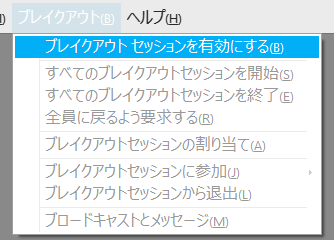{:.border}

* 「ブレイクアウトセッション」ボタンを押すと，ブレイクアウトセッションの割り当てウィンドウが表示されます．
	* 「自動」を選択すると，参加者はランダムに割り当てられます．

	{:.border}

* 「割り当て」をクリックすると，ブレイクアウトセッションの管理ウィンドウが表示されます．
	* この画面では，各ブレイクアウトセッションへの参加者の割り当ての確認や変更，ブレイクアウトセッションの追加・削除・名前の変更をすることができます．
	* 「リセット」をクリックすると，ブレイクアウトの個数の設定からやり直すことができます．手でやった割り当てはすべて上書きされます．
	* 「設定」をクリックすると，参加者のブレイクアウトへの途中参加や途中退出（メインミーティングへの移動）を許可するか，セッションの制限時間，時間切れまでのカウントダウンタイマーの設定をすることができます．

	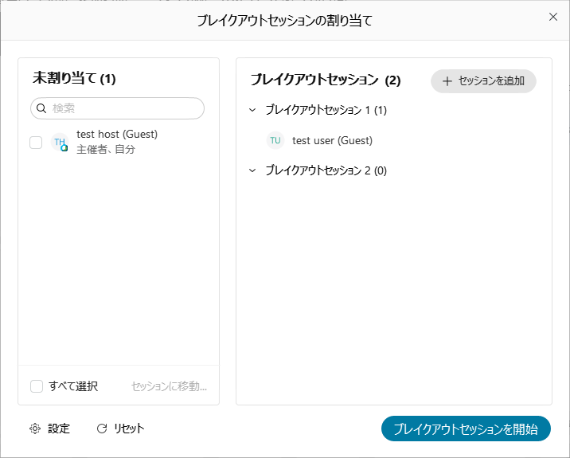{:.border}
	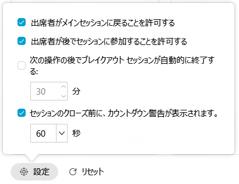{:.border}
	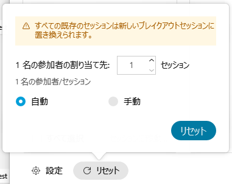{:.border}

* ミーティングの作成時に「ブレイクアウトセッションの事前割当て」をクリックすると，招待した参加者を各ブレイクアウトセッションに割り当てることができます．CSVで割り当てを読み込むこともできます．

	{:.border}
	{:.border}
	{:.border}

* 「ブレイクアウトセッションを開始」を押すと開始します．
	* 参加者の一覧がメインミーティングとブレイクアウトセッションに分かれます．ブレイクアウトセッションには各セッションごとに参加者が一覧表示されます．

	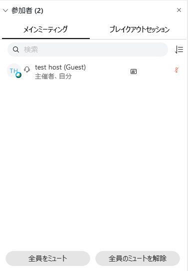{:.border}
	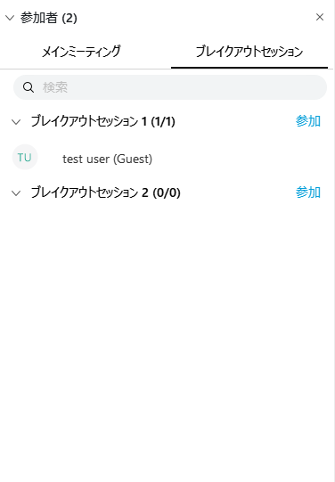{:.border}

* 参加者の一覧のブレイクアウトセッションの所に「参加」が表示されます．これをクリックすると，そのセッションに参加することができます．
	* セッションから抜けるときは，下の赤い「セッションから退出」をクリックします．メインミーティングに戻ります．

* メインミーティングにいるときにブレイクアウトセッションからヘルプが要求されると，ウィンドウがポップアップ表示され，そのセッションに参加することができます．

	{:.border}

* ブレイクアウトセッション中に下の「ブレイクアウトセッション」ボタンをクリックすると，参加者の割り当ての変更やブレイクアウトセッションの終了ができます．
	* 「一斉送信」を押すと，特定のセッションやすべてのセッションの参加者にメッセージを送ることができます．

	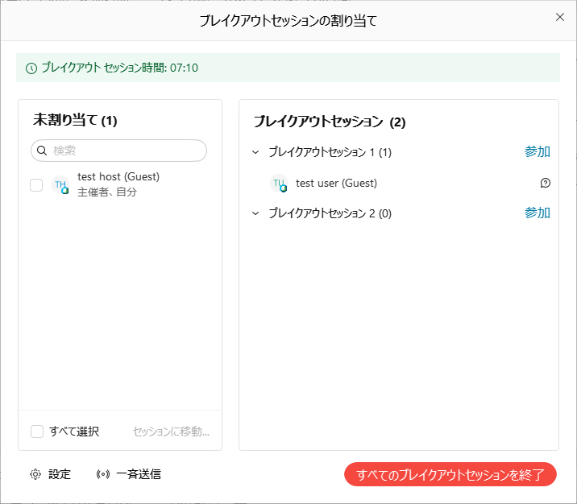{:.border}
	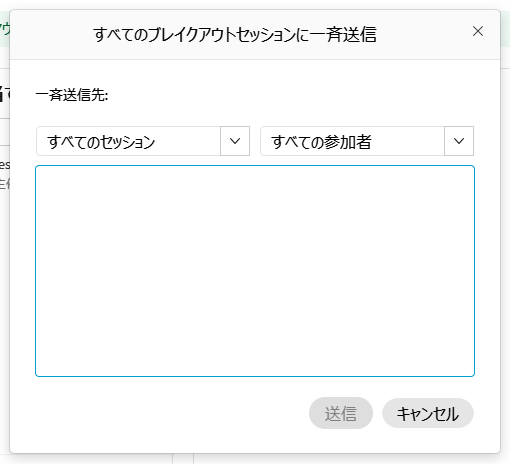{:.border}

## ミーティングのロック・ロビー機能

秘匿性の高い会議の開催時など，ミーティングをロックして新しい参加者が自由に参加してくるのを防ぐことができます．**ロビー機能は，End-to-End Encrypted Meetingでは利用できません．**

* ロック中に参加しに来た参加者はロビーで待機することになります．

	{:.border}

* ロビーで参加者が待っていると，参加者一覧の上に表示されるので，確認して参加を許可することができます．

	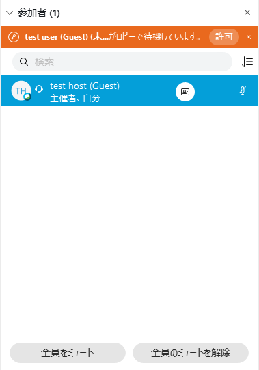{:.border}

* すでに会議に参加している参加者をロビーに追い出すこともできます．該当の参加者を右クリックして「ロビーに移す」を選択します．このときにその参加者がプレゼンターに指名されていると，追い出すことができません．

	{:.border}

* スケジュール時に設定すると，ミーティングをロックしていない状態でも未登録の（utelecon.webex.comにアカウントを持っていない）参加者が来た時にロビーに送ることもできます．ロックしていない状態でutelecon.webex.comにアカウントを持っている参加者が来た場合は阻む方法はありません．

	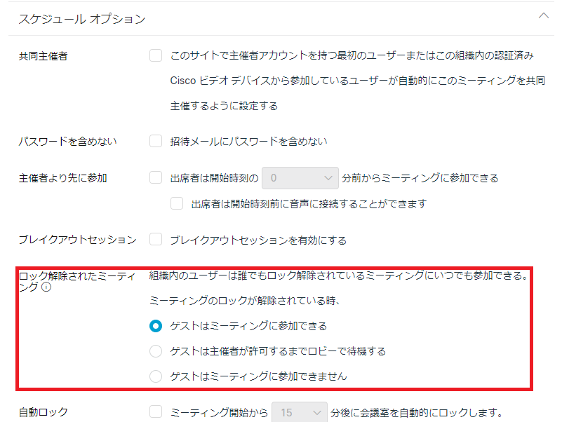{:.border}

## 参加者の手を下げさせる

* 手を挙げた参加者の手を下げさせることができます．複数人が手を挙げているときに一度に全員の手を下げさせることもできます．
* 手を挙げている参加者を右クリックし，「手を下げる」「すべての手を下げる」を選択します．

	{:.border}

## 参加者全員のミュート

* ミーティングの最初の設定において，入室時にミュートにすることができます．
* 会議が開始されてからも，「参加者」メニューに「参加時にミュート」という機能があります．

	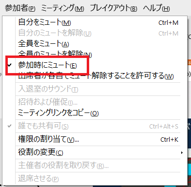{:.border}

* 「参加者」メニュや参加者の一覧に「全員をミュート」という機能があり，全員を即座にミュートにすることができます．
* 「出席者が各自でミュート解除することを許可する」のチェックを外しておくと，参加者が勝手にミュートを外して話し始めることを防ぐことができます．

	{:.border}
	{:.border}

## コンテンツ共有の制限

* 主催者が「プレゼンタ」として役割を割り当てた人以外からのコンテンツ共有を制限することができます．
* 「参加者」メニューに「誰でも共有可」という機能があり，このチェックを外しておくと，想定していない参加者からのコンテンツ共有を防ぐことができます．

	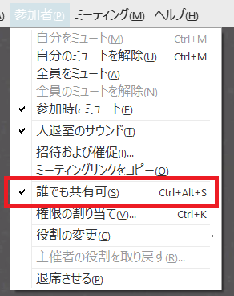{:.border}

## 参加者の入退室時のサウンド

* 参加者が入退室する時にサウンドを鳴らすことができます．気づかないうちに予期せぬ参加者が紛れ込むことを防ぐことができますが，参加者の多い会議では煩わしくなります．
* ミーティングの最初の設定において，入退室時のサウンドを設定することができます．
* 「参加者」メニューの「入退室のサウンド」で設定します．

	{:.border}

## 参加者の権限を設定する

* 「参加者」メニューの「権限の割り当て」の中で，各参加者の権限を細かめに設定することができます．

	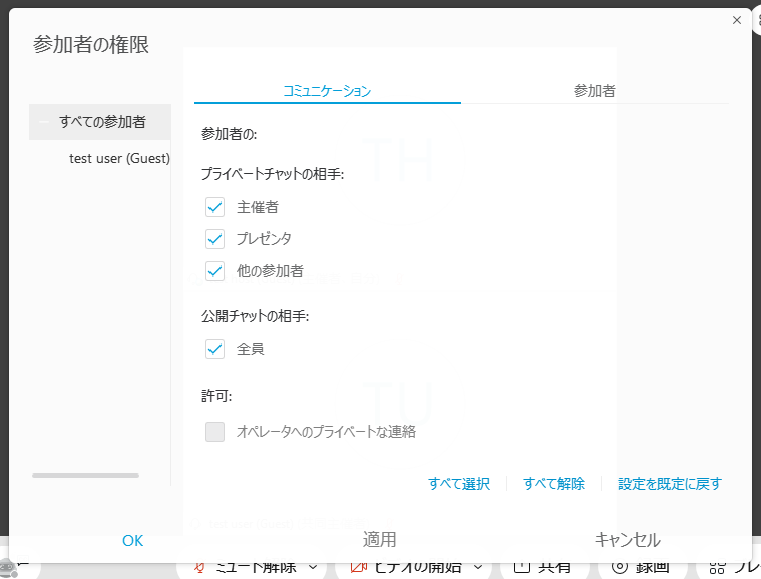{:.border}
	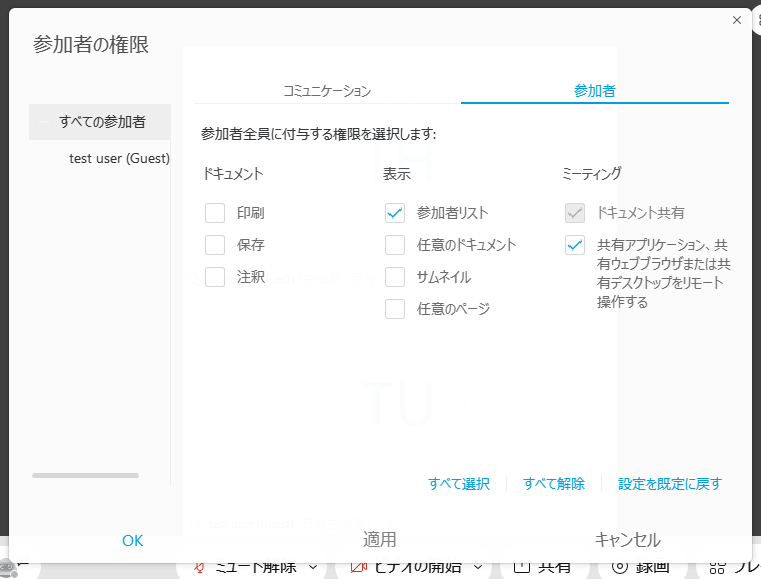{:.border}

## 録画

* 会議を全て録画しておき，ITC-LMS等で公開することで，通信状態の悪かった学生や復習用の教材として活用することができます．
* 録画は会議の設定時に「自動録画」を設定するか，会議中に録画のアイコンをクリックすることでの任意の時間に行うことが可能です．
* 主催者がミーティングに参加している場合，共同主催者は録画を開始することはできません．
* ブレイクアウトセッション中は，録画が一時停止されます．

	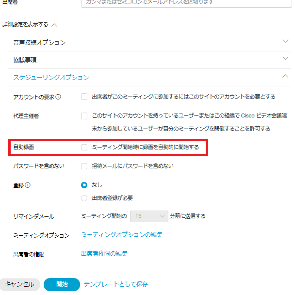{:.border}

* 録画された動画ファイルは，MP4形式で自動的に保存され，ホーム画面の録画メニューの領域に保存されます．ダウンロードすることもできますし，共有するためのパスワード付きのリンク（URL）を取得することもできます．

	{:.border}
	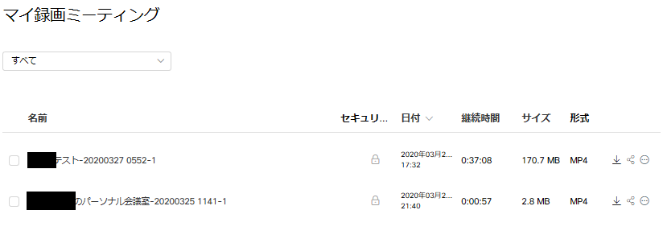{:.border}

## 主催者を取り戻す

* 主催者がネットワークトラブル等で切断してしまうと，他の参加者に主催者が移ります．
* そんなときは，参加者として再度参加後，「参加者」メニューから「主催者の役割を取り戻す」を押し，会議を作成したときに表示されている「主催者キー」を入力すると，主催者に戻ることができます．

	{:.border}

* 会議のスケジュール時に「スケジューリングオプション」の中の「主催者より先に参加」を設定しておくと，主催者が会議を開始していなくても参加者は会議室に入ることができます．ここで参加者が「主催者の役割を取り戻す」をすると，主催者になって会議を進めることができるようになります．

	{:.border}

## 出席者レポート

* 会議に参加した人と時間の記録を表示・ダウンロードすることができます．
* 会議が終了してから出席者のレポートが生成されるまでには時間がかかることがあります．

1. ホーム画面左の「カレンダー」をクリックします．
{:.border}
1. 「完了」をクリックし，出席者一覧を取得したい会議を選択します．
	* デフォルトでは直近一週間の開催分しか表示されていません．それ以前のものを探したい場合は日付セレクターを使用します．
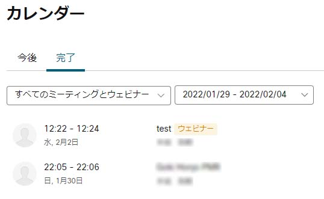{:.border}
1. 出席者が表示されます．必要に応じて「出席レポートをエクスポート」します．
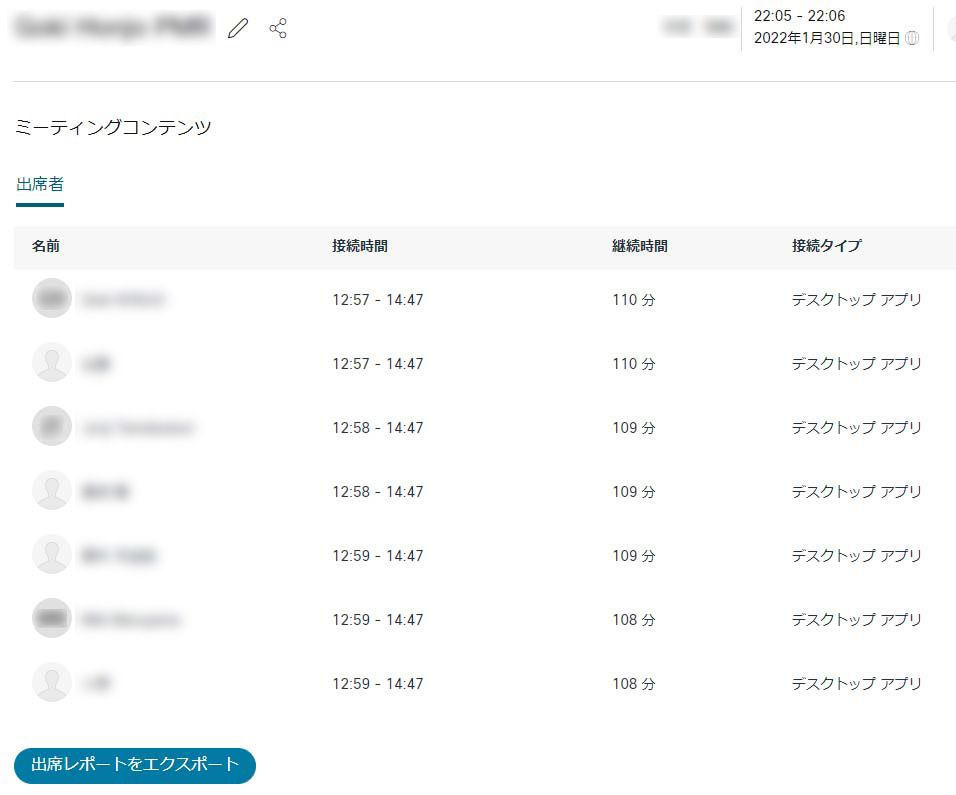{:.border}
	* 名前・メールアドレス・参加時刻・退席時刻等の載ったCSVファイルをダウンロードできます．

## Slidoを起動する

* End-to-End Encrypted Meetingでは利用できません．
* 主催者のみSlidoを起動できます．(共同主催者は起動できません．)
* 主催者はデスクトップアプリからSlidoを起動する必要があります．（モバイルアプリ・ウェブアプリでは起動できません．）

1. Webex Meeting開催中に画面下メニューのアプリボタンを押します．
{:.border}
1. アプリ画面が表示されますので，Slido(Polling and Q&A)を選択します．
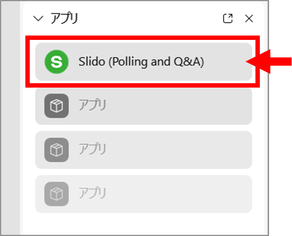{:.border}
1. Slidoの画面が起動します．
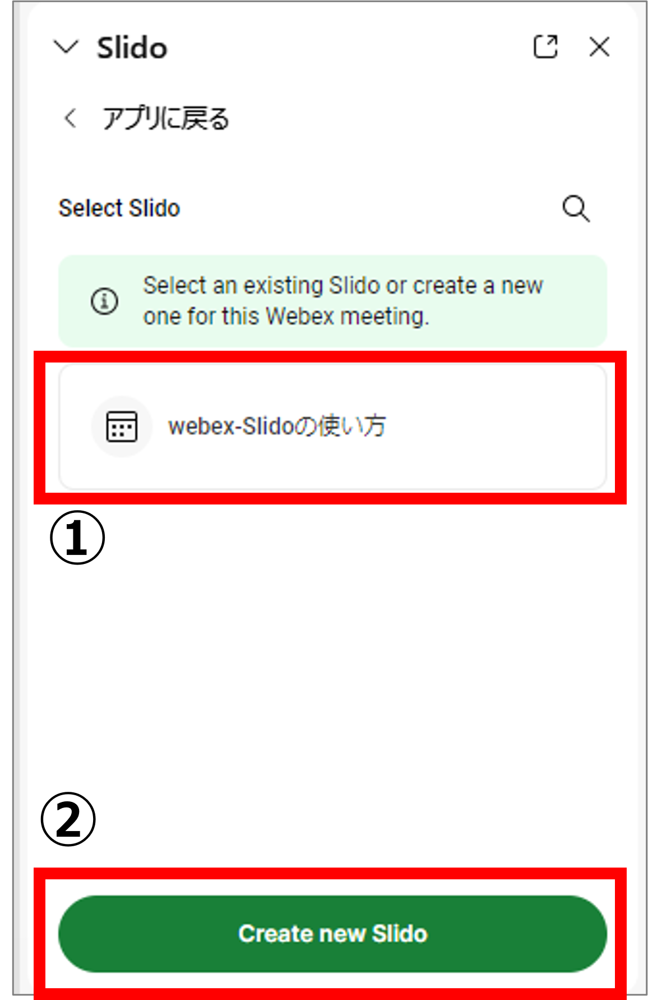{:.border}
	1. 事前に主催者のSlidoイベント一覧のページで用意したイベントを選択できます．
	1. Create new Slidoボタンで，新規にイベントを作成できます．
		* Webex上で作成したSlidoイベントは，主催者のSlidoイベント一覧のページに保存されます．

## Slidoを操作する

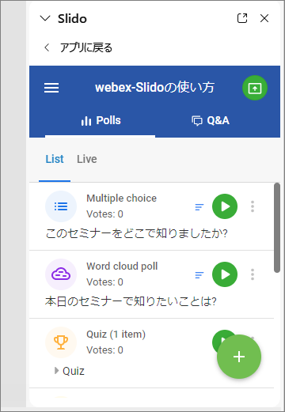{:.border}

1. PollとQ&Aを切替える
{:.border}
	* タブでPollsとQ&Aを切替えることができます．
1. Pollsを操作する
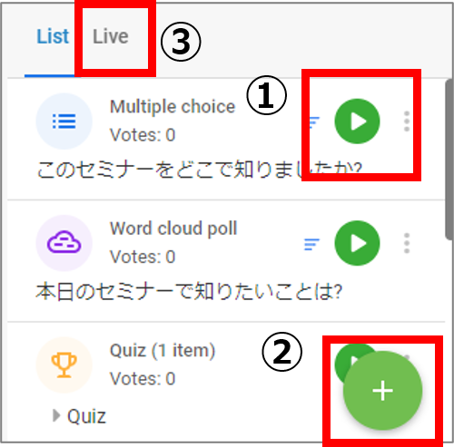{:.border}
	* Listタブの①実行/停止ボタンでPollの実行/停止を操作します.
	* Listタブの②Poll追加ボタンで，Pollを追加することもできます．
	* 投票結果は③Liveタブで確認できます．
	* 基本的な操作はウェブで実施する時と同じです．
1. Q&Aを操作する
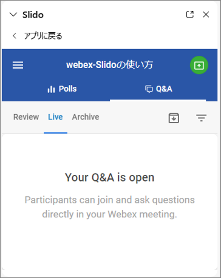{:.border}
	* Q&Aタブで質問の回答や管理を実施します．
	* 基本的な操作はウェブで実施するSlidoと同じ操作です．

## ステージマネージャー（Webex Webinarsのみ）

* Webexのウィンドウで，話者やパネリストのビデオ映像や共有したコンテンツが表示される部分をステージと呼びます．
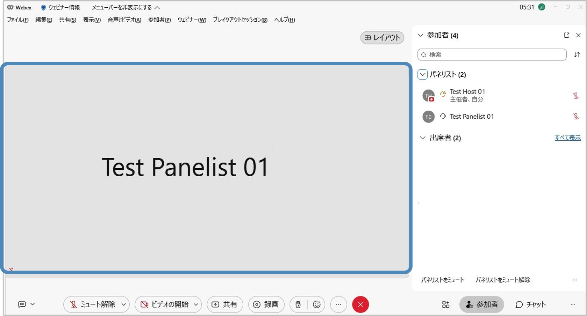
* ステージマネージャー機能を使用すると，背景やロゴ・カスタマイズした名前ラベルをステージに設定でき，効果的なウェビナーの開催に貢献します．
* ステージマネージャーは主催者が開催前および開催中に設定を行うことができます．

* カスタマイズしたステージは録画には反映されません．
* カスタマイズしたステージはビデオデバイスを使用した出席者やWebex Meetings Mobile App (iPhone / Android)には反映されません．
* パネリストはウェビナーに電話音声で参加している場合，主催者から設定した表示名とサブタイトルは表示されません．
* ウェブキャストビューのウェビナーはステージマネージャーに対応していません．

参考
* [ステージマネージャーの使用](https://help.webex.com/ja-jp/article/n3a5tpp/)
* [ステージを全員と同期](https://help.webex.com/ja-jp/article/nic6kmbb/)

### 開催前の設定

1. スケジュールしたウェビナーを選択します．情報画面が表示されます．
1. ウェビナー情報内から「ステージマネージャー」の「編集」をクリックします．
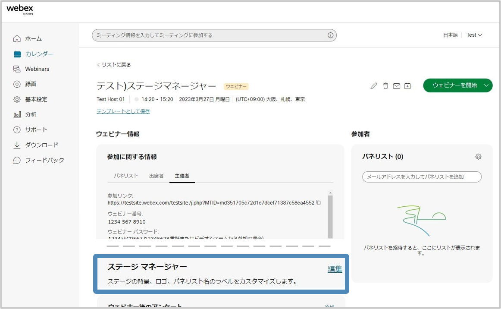
1. ステージマネージャーの編集画面が表示します．
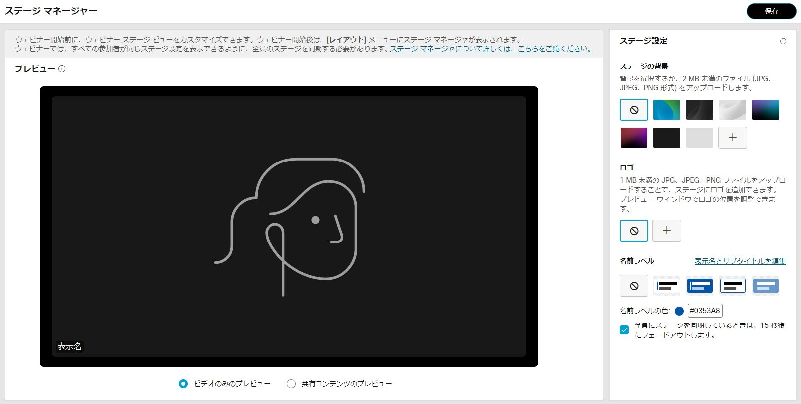

#### ステージの背景

1. ステージの背景を設定します．
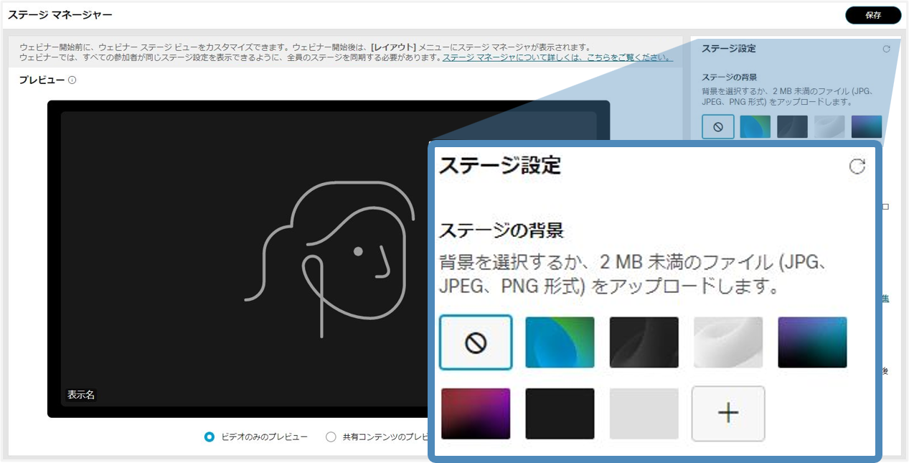
1. デフォルトで表示されている7つの背景から選択，もしくはファイルをアップロードし，背景を変更します．
1. アップロードする場合は「＋」を選択します． アップロードするファイルを選択する画面が表示されます．
1. 利用したいファイルを選択します。 「開く」を選択し，ファイルをアップロードします．

1. アップロードが完了するとアップロードしたファイルが背景に設定されます．
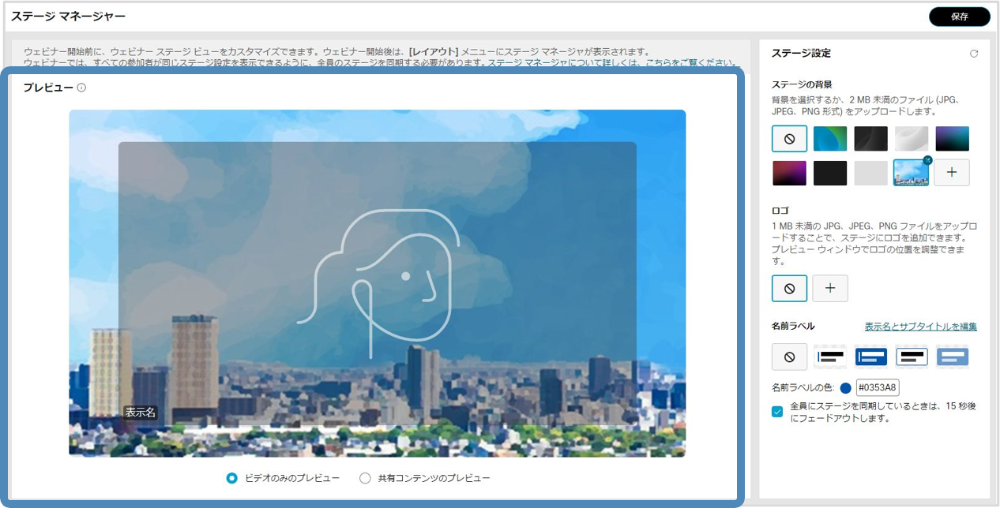
1. 他のファイルを使用したい場合は同様の手順でファイルをアップロードします．
1. 背景を利用しない場合は選択肢から「{:.inline}」を選択します．

#### ロゴ

1. ステージ上に表示するロゴを設定します．デフォルトでは設定されていません．

1. 「＋」をクリックします．アップロードするファイルを選択する画面が表示されます．
1. 利用したいファイルを選択します．「開く」を選択し，ファイルをアップロードします．
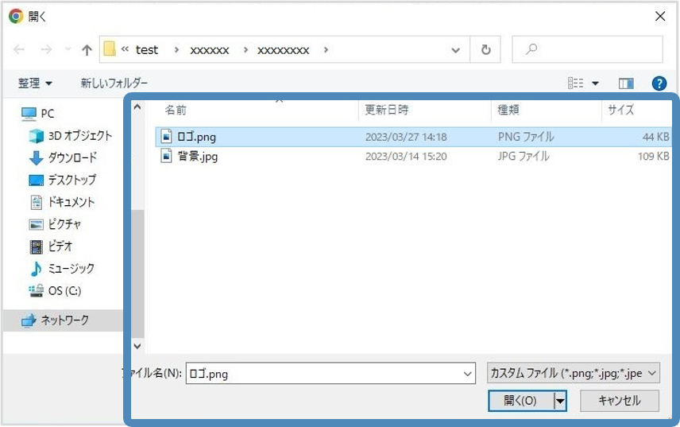
1. アップロードが完了するとアップロードしたファイルのサイズ調整画面が表示します．
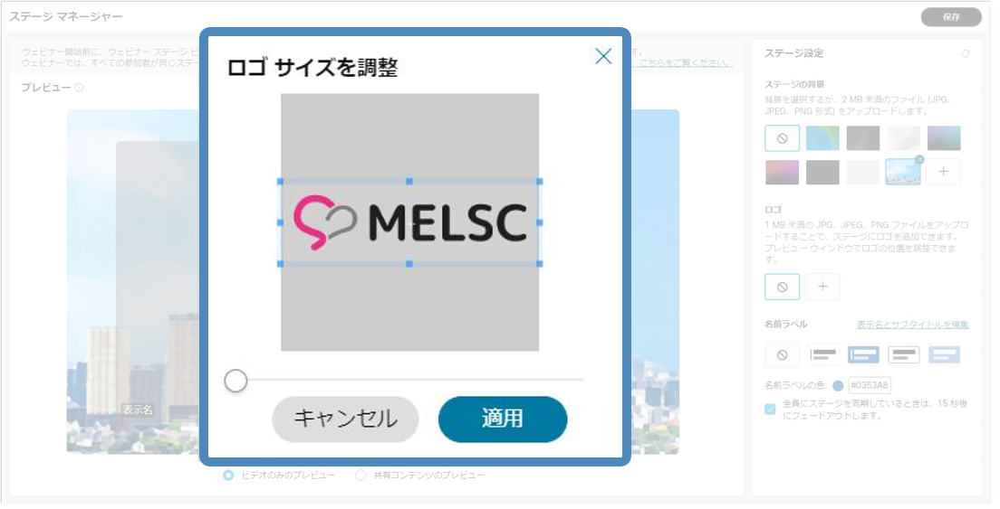
1. ロゴのサイズをスライドバー({:.inline})で調整し，「適用」を選択します．ロゴが設定されます．
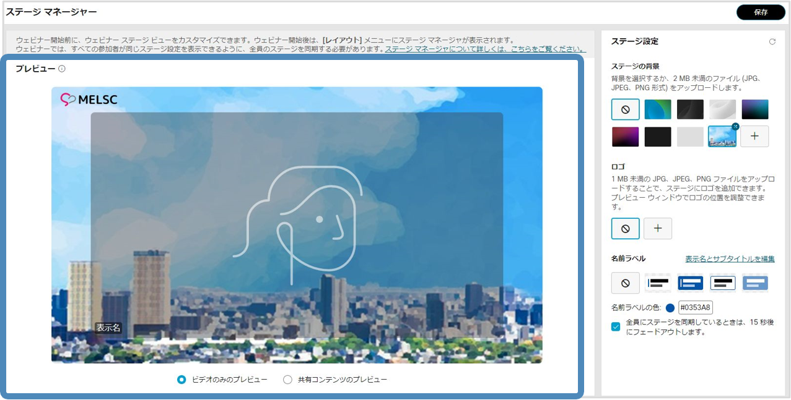
1. ロゴを利用しない場合は選択肢から「{:.inline}」を選択します．

#### 名前ラベル

ステージ上に表示されるパネリストの名前ラベルを設定します．

**表示名とサブタイトルを設定する**

1. 「表示名とサブタイトルを編集」を選択します．
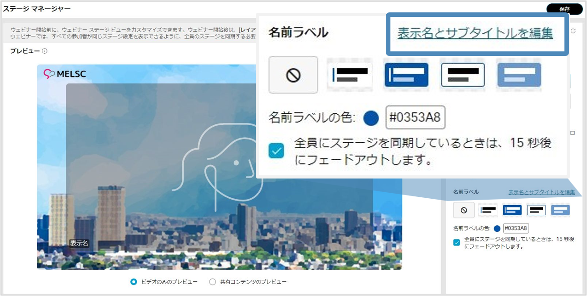
1. パネリストの表示名・サブタイトルを編集する画面が表示されます．

1. 招待されているパネリストが一覧で表示されます．
1. 各パネリストの表示名・サブタイトルを編集できます．
1. 編集が終わったら「保存」を選択します．

**名前ラベルのデザイン**

1. デフォルトで表示されている4つのデザインから選択，もしくは色を自分で設定します．
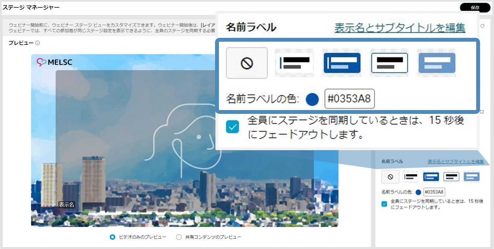
1. デザインを選択すると，パネリストのビデオ上に表示名とサブタイトルが表示されます．
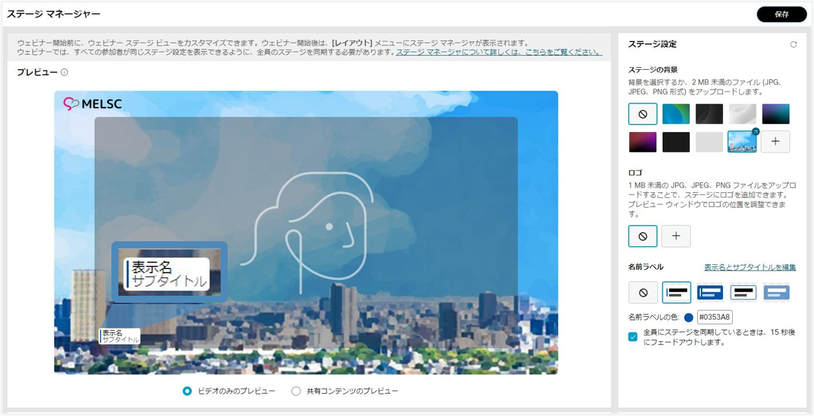
1. 名前ラベルを利用しない場合は選択肢から「{:.logo}」を選択します．

**名前ラベルのフェードアウト**

* 「全員にステージを同期しているときは、15秒後にフェードアウトします」を有効にすると，15秒後に名前ラベルは表示されなくなります．無効の場合，名前ラベルは表示し続けます．

#### プレビュー・保存

1. 設定した内容は画面上で随時確認できます．
1. 「ビデオのみのプレビュー」「共有コンテンツのプレビュー」の2種類のプレビューを確認することができます．
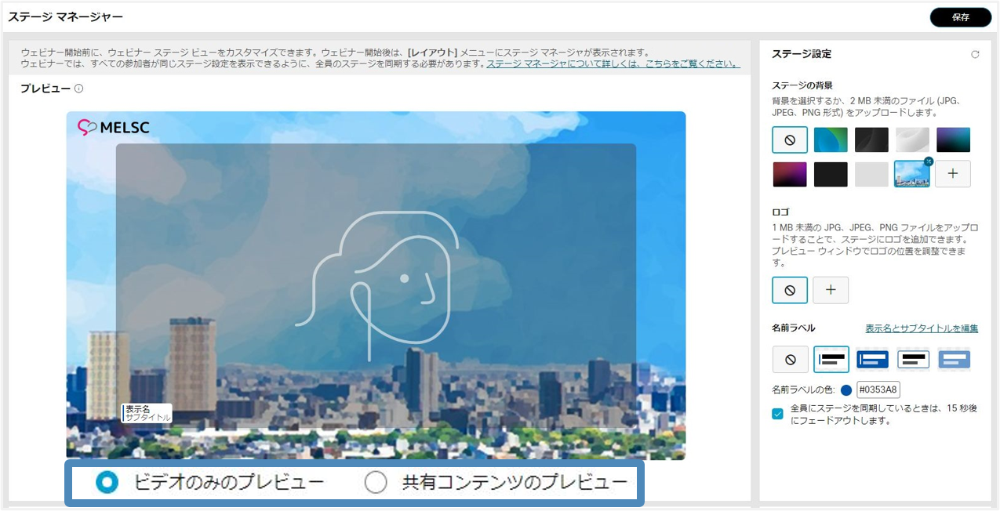
1. 設定した内容に問題なければ，画面上部の「保存」を選択します．
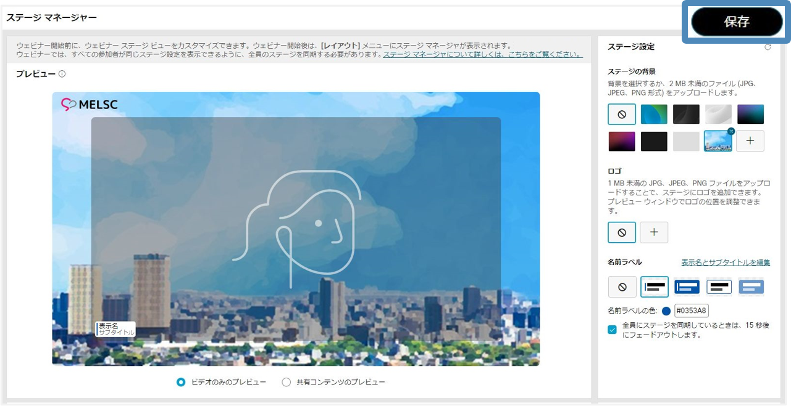
1. 設定が保存されるとウェビナー情報画面へと戻ります．

### 開催中

#### 練習セッション

ステージマネージャーでレイアウトや背景などの設定を行う際には練習セッションをご活用ください．練習セッション中は，出席者には主催者側の映像は見えません．

練習セッションを利用する際には以下の設定をご利用ください．
* スケジュール時：詳細オプション > 練習セッション「ウェビナー開始時に自動的に練習セッションを開始」を有効
* スケジュール後：ウェビナー情報 > 練習セッションの出席者ビュー練習セッションで利用する映像や音声を設定

#### ステージマネージャーの起動

1. ウェビナーを開催します．
1. 他のパネリストが参加すると画面右上部に「レイアウト」ボタンが表示されます．
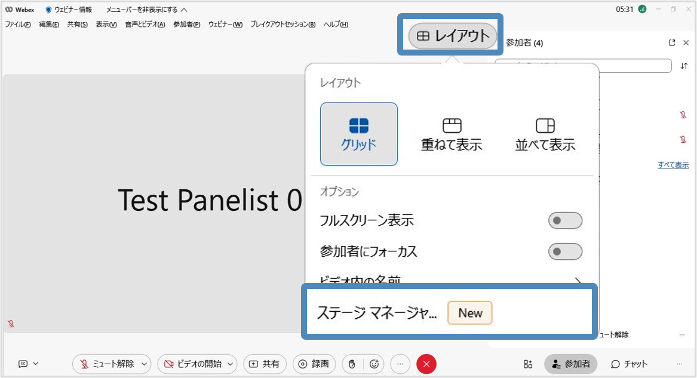
1. 「レイアウト」メニューから「ステージマネージャー」を選択します．
1. 画面右側にステージマネージャーの設定画面が表示します．
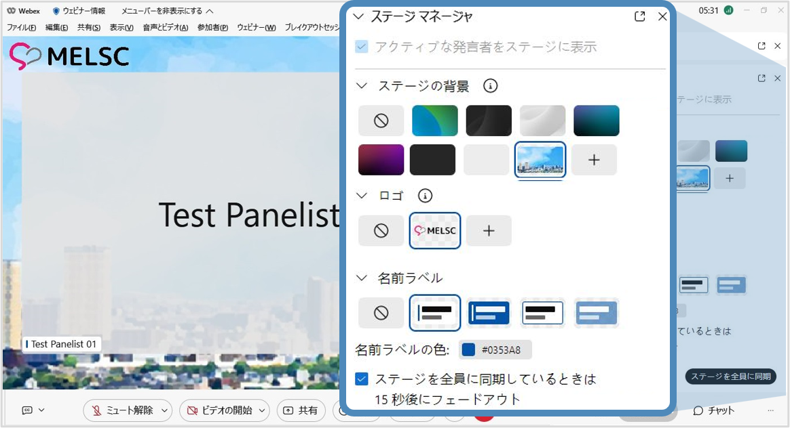

#### ステージの背景

1. ステージの背景を設定します．開催前で説明している操作方法と同じになります．
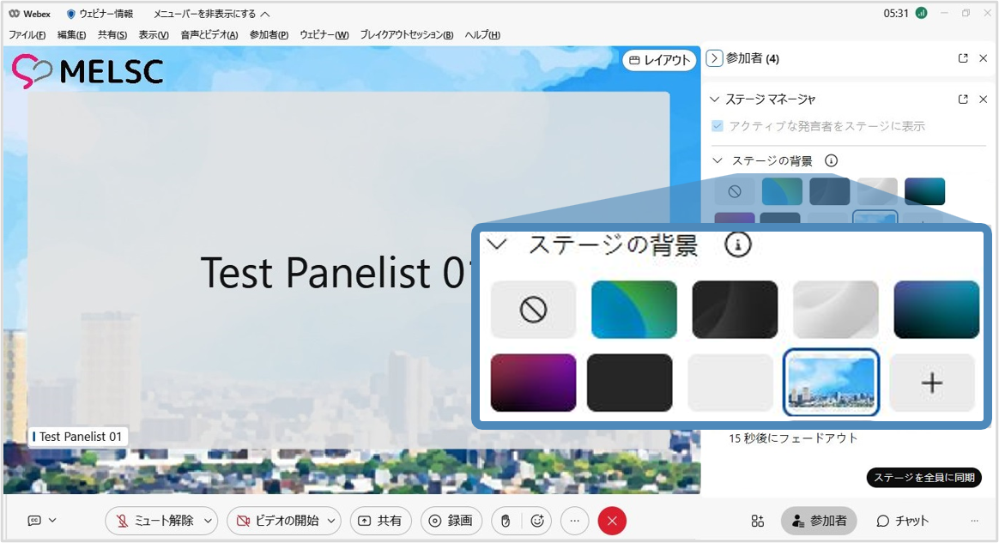
1. デフォルトで表示されている7つの背景から選択，もしくはファイルをアップロードし，背景を変更します．
1. アップロードする場合は「＋」を選択します．アップロードするファイルを選択する画面が表示されます．
1. 利用したいファイルを選択します．「開く」を選択し，ファイルをアップロードします．
1. アップロードが完了するとアップロードしたファイルが背景に設定されます．
1. 背景を利用しない場合は選択肢から「{:.logo}」を選択します．

#### ロゴ

1. ステージの背景を設定します．開催前で説明している操作方法と同じになります．
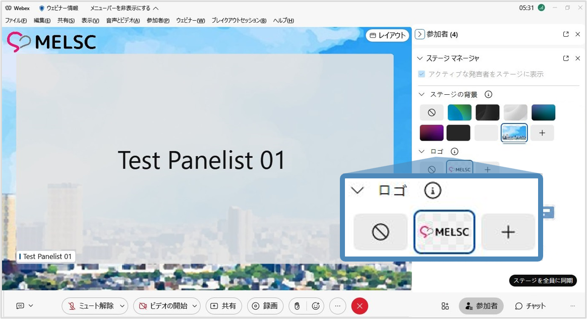
1. 利用したいロゴを選択もしくはファイルをアップロードします．
1. 「＋」をクリックします．アップロードするファイルを選択する画面が表示されます．
1. 利用したいファイルを選択します．「開く」を選択し，ファイルをアップロードします．
1. アップロードしたファイルのサイズ調整画面が表示します．
1. ロゴのサイズをスライドバー({:.inline})で調整し，「適用」を選択します．ロゴが設定されます．
1. ロゴを利用しない場合は選択肢から「{:.logo}」を選択します．

#### レイアウト

**パネリストをステージ上に表示する**

ウェビナー内で話すパネリストをステージ上に固定します．

1. 参加者 > パネリストからステージに移動したいパネリストを選択します．
1. パネリストの名前の上で右クリックし，メニューを表示します．メニュー内にある「ステージに移動」を選択します．
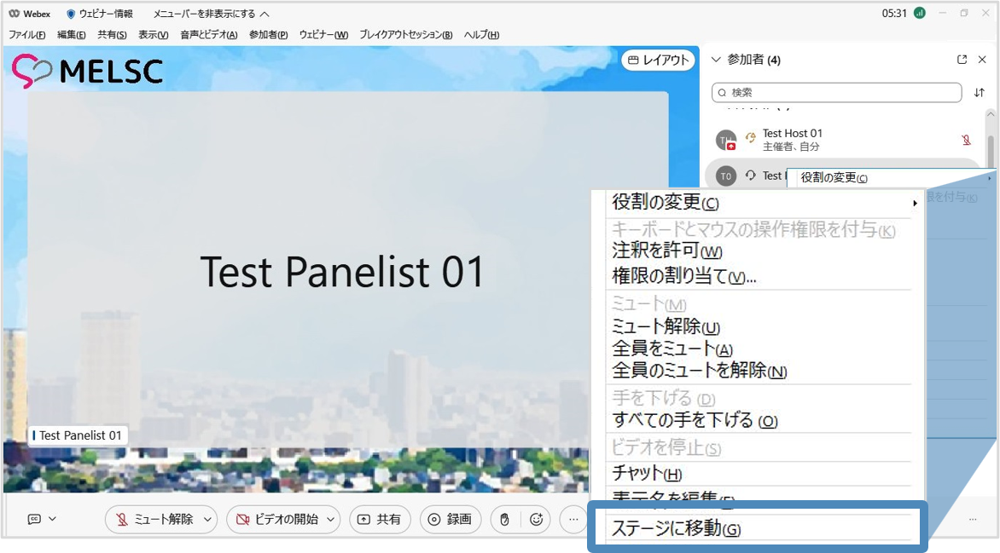
1. ステージに選択したパネリストが表示されます．

1. 他のパネリストも表示したい場合は同様の手順にてパネリストをステージに移動させます．
1. ステージ上に表示したパネリストに対して，同様の手順でメニューを開いて「ステージから削除」を選択するか，パネリストの映像の左上の「{:.logo}」を選択するとステージから表示されなくなります．

**アクティブな発言者をステージに表示**

1. ステージ上に表示させたパネリストは操作を行わない限り，ステージ上に表示されたままになります．
1. 選択したパネリストのみステージ上に表示したい場合，「アクティブな発言者をステージに表示」を無効にします．
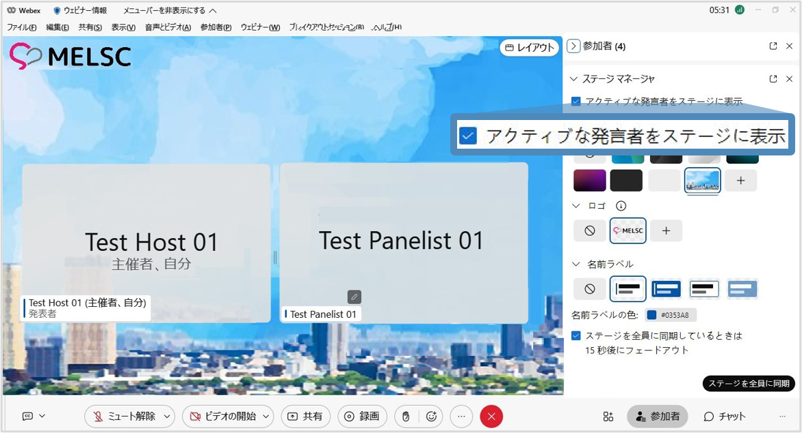
1. 無効にすると選択したパネリストのみステージ上に表示します．
1. 「アクティブな発言者をステージに表示」が有効だと発言しているパネリストが自動的に表示されます．
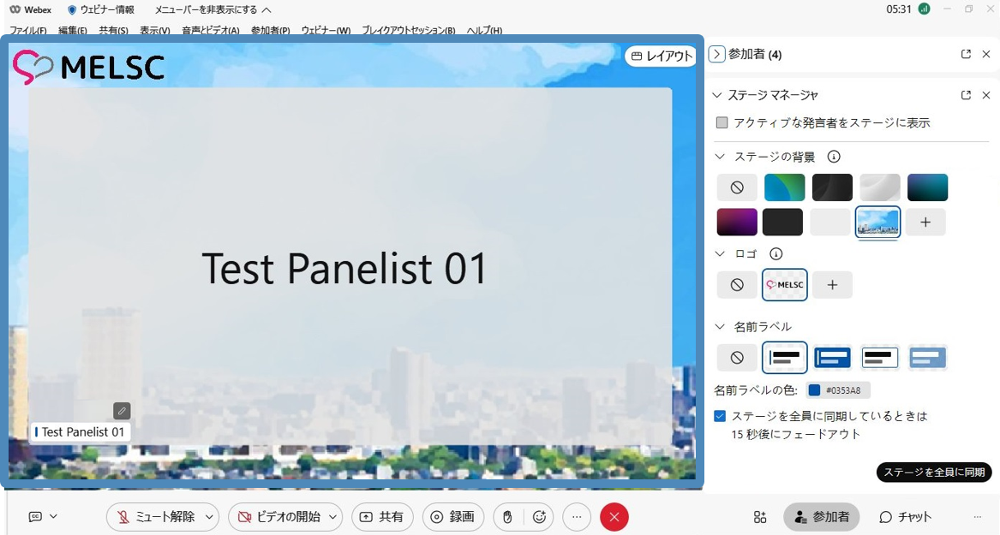

**コンテンツ共有時のレイアウト設定**

1. パネリスト（発表者）は画面下部メニューよりコンテンツを共有することができます．ステージ上に共有されたコンテンツが表示します．
1. パネリスト画面と共有されたコンテンツの間に「{:.logo}」が表示されます．
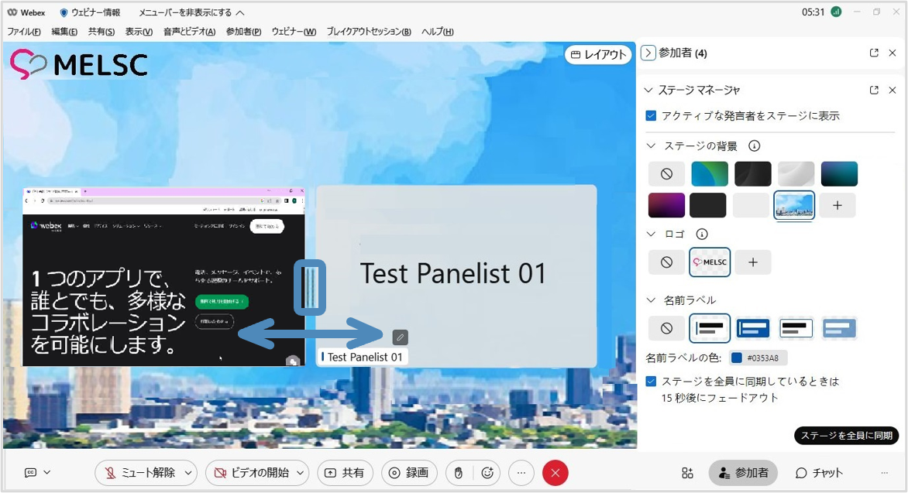
1. 「{:.logo}」を左右にドラッグすると共有したコンテンツとパネリストの画面サイズを変更することができます．
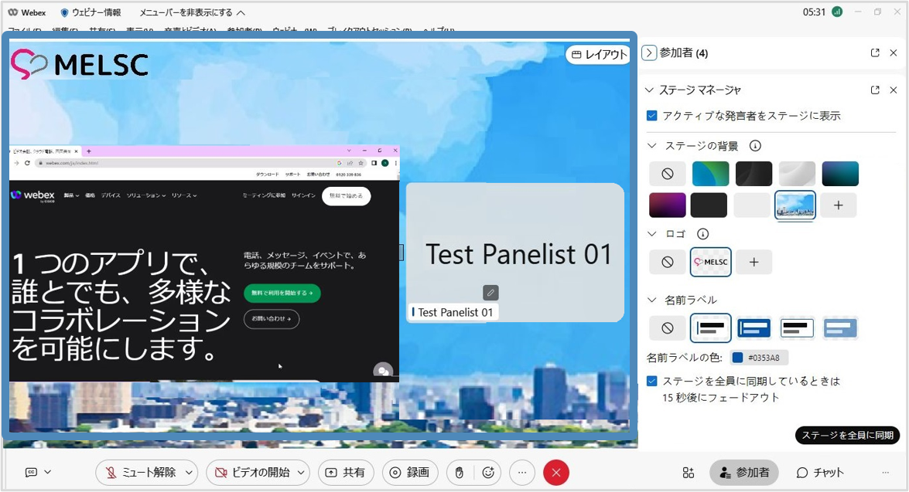

#### 名前ラベル

ステージ上に移動したユーザーの名前ラベルを設定します．

**表示名とサブタイトルを設定する**

1. ステージ上に表示されているパネリストの名前の上部にある「{:.logo}」マークをクリックします．

1. 表示名・サブタイトルの編集画面が表示します．
1. 表示名・サブタイトルを変更し，「保存」を選択します．
1. ステージ上で表示されていた表示名が変更され，サブタイトルが表示されます．
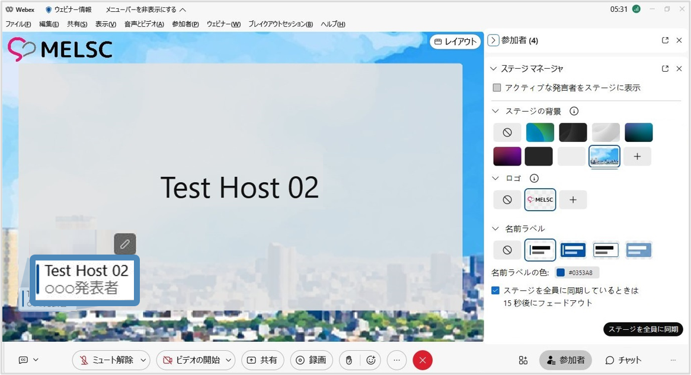

※ステージに移動したパネリストに対してのみ表示名とサブタイトルを変更することができます．ステージにいないパネリストに対しては表示名のみ変更できます．

**名前ラベルのデザイン**

1. デフォルトで表示されている4つのデザインから選択，もしくは色を自分で設定します．

1. デザインを設定すると，パネリストのビデオ上に表示名とサブタイトルが表示されます．
1. 名前ラベルを利用しない場合は選択肢から「{:.logo}」を選択します．

**名前ラベルのフェードアウト**

* 「全員にステージを同期しているときは，15秒後にフェードアウトします」を有効にすると，15秒後に名前ラベルは表示されなくなります．無効の場合，名前ラベルは表示しつづけます．

#### 同期

設定したステージのレイアウトを出席者へ同期し，全員が同じレイアウトで見えるようにします．

1. すべての設定や調整ができたのを確認します．
1. ステージマネージャー設定画面の下部の「ステージを全員に同期」を選択します．
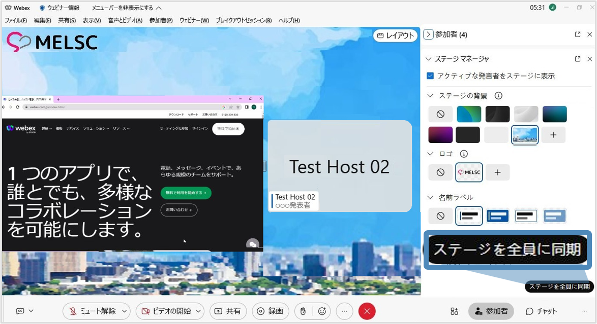
1. 設定したステージのレイアウトを出席者に対して同期するかの確認画面が表示されます．
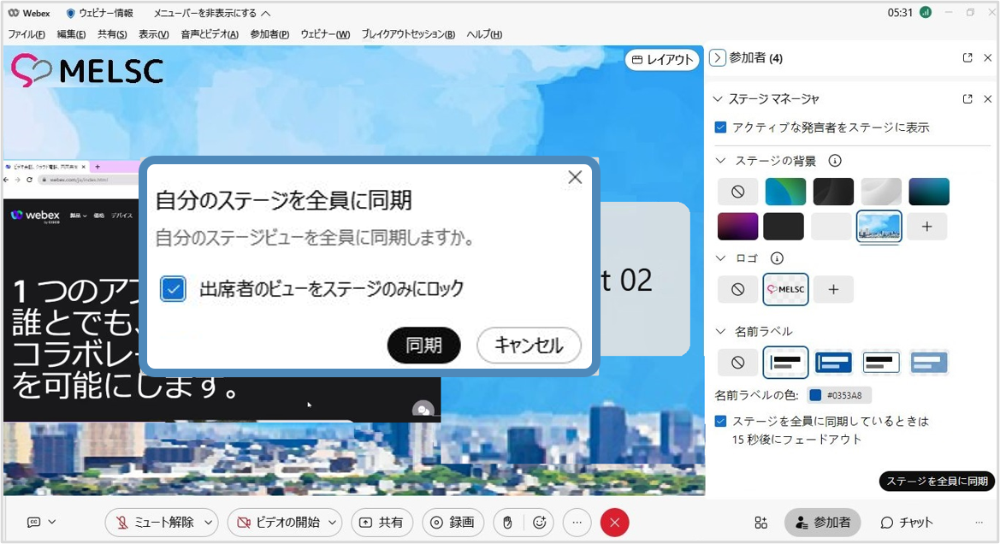
1. 「出席者のビューをステージのみロック」が有効の場合，出席者のレイアウトは同期されたレイアウトから変更できなくなります．無効の場合，出席者はレイアウトを変更できます．出席者がレイアウトを変更すると同期したレイアウトに戻すことはできません．
1. 「同期」を選択し，ステージのレイアウトを出席者に同期します．
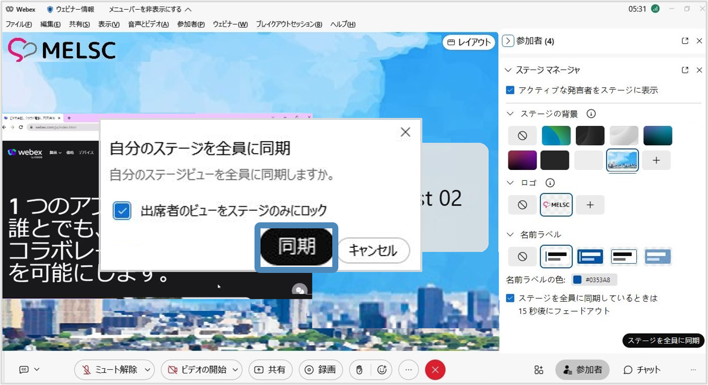
1. 同期されている間はステージ上にメッセージが表示されます．

**同期したレイアウトの更新**

1. レイアウトが同期された状態でレイアウトを変更すると操作メニューがステージ上に表示されます．
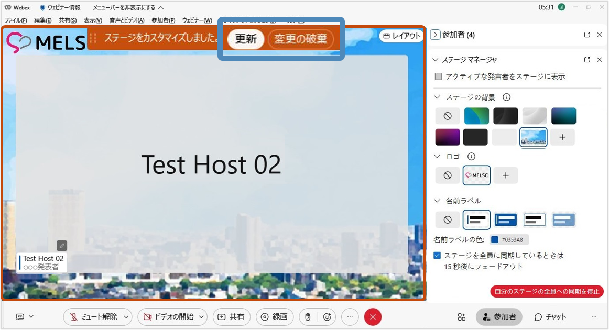
1. 変更したレイアウトを同期する場合は「更新」を選択します．変更したレイアウトが出席者に反映されます．
1. 変更したレイアウトを同期しない場合，「変更の破棄」を選択します．変更前のレイアウトのままとなります．

**同期の停止**

1. レイアウトの同期を止めたい場合，ステージ上に表示されているメッセージ内の「停止」を選択します．
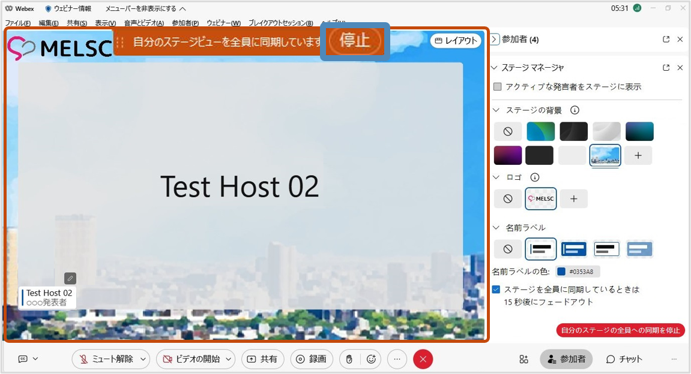
1. レイアウトの同期が停止され，出席者側はレイアウトを操作することができます．

※停止した場合，出席者はステージマネージャーで設定した背景などは利用することはできません．再度「同期」するとステージマネージャーで設定したレイアウトを使用できます．
