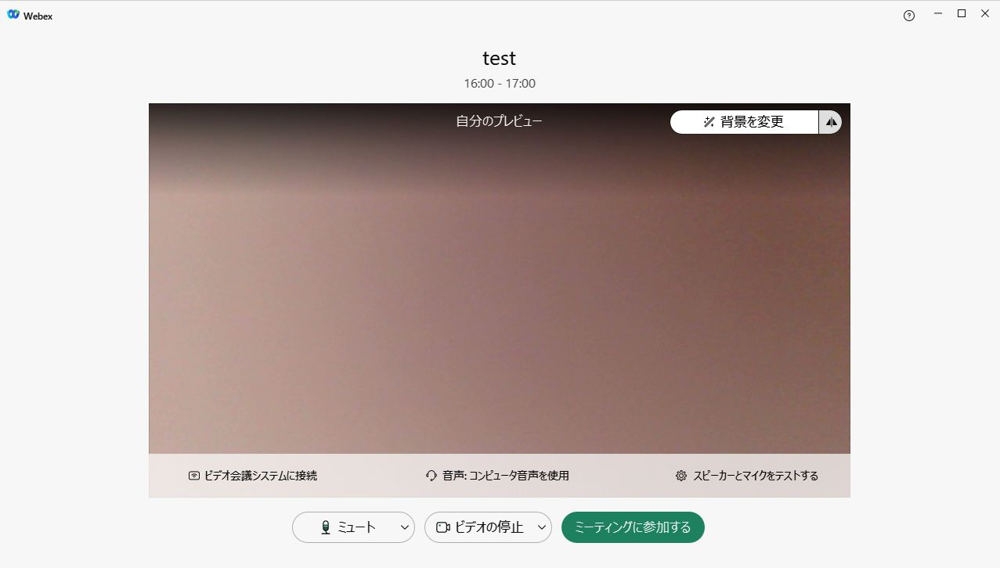

## ミーティングへ参加する
* 開催者から送られてきたメールにある「ミーティングに参加」をクリックすると，デフォルトのブラウザが開き，Webexアプリが起動します．
* 名前の入力を進むとプレビュー画面に移行します．

	 {:.border}

* 下で，オーディオ，マイク，カメラの設定を行います．ヘッドセットを装着する場合など，どの機材でオーディオやマイクを使うのかの設定切り替えをここで行います．ここでうまくいかなくても，ミーティングに参加してからでも変更できます．
	 * プレビュー画面に何もうつっていない場合には，カメラが認識されていない可能性がありますので，カメラ設定を確認します．
	 * マイクがうまく聞こえるかどうかをここで確認しておきます．音を出したときマイクの下のアイコンに反応があれば音をひろえています．
* 画面内にあるマイクとビデオのボタンは， それぞれ，ミュートの解除・設定とビデオ停止・開始を行います．デフォルトは音が聞こえ，ビデオがうつっている状態です．
* ここで「ミーティングに参加」を押すと会議に参加することができます．開催者の場合は会議を開始することができます．
* 開催者が開催していない場合には時間を過ぎている場合であっても参加することができません．（開催者が開始前に入室可能という設定をすることもできます．）

 
 
<a href="index" target="_blank">Webexの使い方ページに戻る</a>
