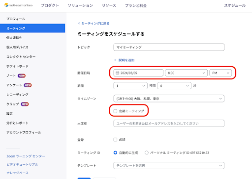
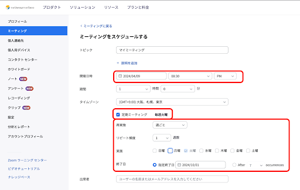
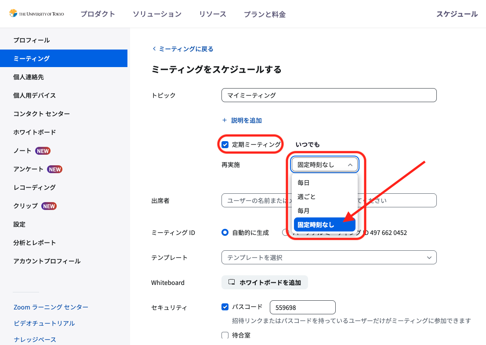

# Zoom 開催日時の詳細な設定
この記事では，Zoomミーティングの開催日時の詳細な設定の種類と，それぞれの種類の特徴について説明します．開催日時の詳細な設定を行うことで，URLを変えずに複数回利用できるミーティングを設定することが可能になります．基本的なZoomミーティングの作成方法については，[Zoomミーティングを作成する](/zoom/create_room/)をご覧ください．

## 開催日時の3つの設定
ミーティングをスケジュールする際には，1回限りのミーティングとするか，複数回行うミーティングとするかを選ぶことができます．また，複数回行うミーティングでは，そのミーティングの開催日時・周期を指定するかどうかも選ぶことができます．
- 1回限りのミーティング
- 開催日時と周期を指定して複数回行うミーティング
- 開催日時を指定せず複数回行うミーティング

以下では，それぞれの設定の特徴と設定方法を説明します．

## 1回限りのミーティングの設定方法
開催日時を指定し，1回限りのミーティングを設定する方法を紹介します．

Web ブラウザで [Zoom のマイページ](https://u-tokyo-ac-jp.zoom.us/meeting)を開き，右上の「ミーティングをスケジュールする」を押してミーティングのスケジュール画面を開いてください．この画面の「定期ミーティング」というチェックボックスをオフのままにしておくと，1回限りのミーティングになります．1回限りのミーティングでは「開催日時」の項目で日付・時刻を指定する必要があります．

なお，実際には指定した日時とは異なる日時に会議室を使うことができます．また，指定した終了時刻を過ぎてもミーティングが強制的に終了されることもありません．

加えて，1回限りのミーティングであっても，実際には1つのURLを使って複数回ミーティングを開催することができます．しかし，1回限りのミーティングのURLは指定された日付から30日後に失効します．そのため，会議室を複数回使用したい場合は以降で紹介する**複数回行うミーティング**に設定する方が良いでしょう．

なお，一度スケジュールしたミーティングを，1回限りのミーティングから複数回行うミーティングに変更することもできます．詳しくは，[ミーティングの編集と管理](/zoom/misc/edit_meeting/)をご覧ください．

## 開催日時と周期を指定して複数回行うミーティングの設定方法
開催日時と周期が指定された複数回行うミーティングを設定する方法を紹介します．

ミーティングを設定する際に，「定期的なミーティング」にチェックを入れることで，複数回行うミーティングになります．複数回行うミーティングは，「開催日時」で指定した日時を第1回目として，その後開催周期を設定することで，定期的なミーティングとなります．

まず，「定期的なミーティング」にチェックを入れた後に表示される「再実施」という項目で，ミーティング以降に開催する周期の単位を「毎日」「週ごと」「毎月」から選ぶことができます（「固定時刻なし」を選択すると，後述する開催日時を指定せずに複数回行うミーティングになります）．さらに，「リピート頻度」，「終了日」を指定することでより詳細に設定するともできます．例えば，開催日時を「2024/04/09 08:30 PM」，開催周期の単位を「週ごと」，リピート頻度を「1週数」，実施を「火曜日」，終了日を「2024/10/01」とすれば，2024年の4月9日から10月1日まで毎週火曜日8時30分からのミーティングを設定することができます．

開催日時と周期を指定した場合でも，指定された日時以外に会議を行うことができます．
もっとも，必ずしも開催周期が固定されていない複数回のミーティングを開きたい場合は次の項目で説明する「**固定時刻なし**」の設定が適しています．

## 開催日時を指定せずに複数回行うミーティングの設定方法
「定期ミーティング」にチェックを入れた後で，「再実施」の項目を「固定時刻なし」と選択することで，開催日時を指定しない会議室を設定することができます．

1回限りのミーティングや開催日時・周期を指定して複数回行うミーティングでも，同じURLで複数回ミーティングを行うことはできます．しかし，それぞれ開催可能な期間や回数等に制限があることや，スケジュールした日時以外にミーティングを行う際も事前に指定した日時が表示されて混乱を招くことがあるなど，使いづらい点があります．そのため，開催するミーティングが不定期である場合は，再実施の周期を「固定時刻なし」と設定することが適しています．

