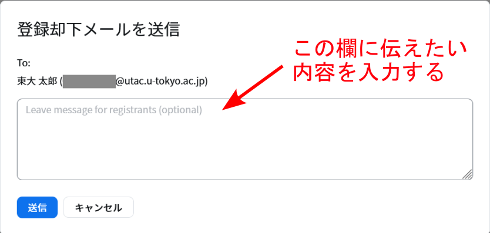
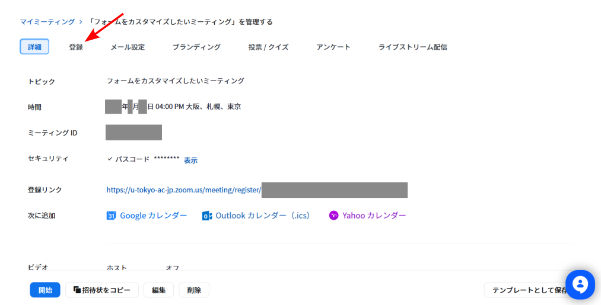

Zoomの「**参加者の登録**」機能は，参加希望者に事前の登録を求め，登録をした参加希望者だけがミーティングに参加できるようにする機能です．

ミーティングのホストは，この機能を使い登録用ページのURLを作成します．その次に，参加希望者に登録用ページのURLを案内し，そこで登録手続きを行ってもらいます．
登録手続きを終えた参加希望者は，登録を終えた時点で，個別の参加用URLが記載された確認メールを受け取ります．
このURLが手元に無ければミーティングに参加できないため，登録手続きを行わない限りミーティングには参加できません．

ホストは，参加希望者が登録用ページでフォームに入力した内容を，確認することができます．
オプションを使用すれば，どの参加希望者が参加用URLを受け取れるか，ホストが決定することができます．

## 基本的な使い方

ここでは，ホストが参加者の登録機能を有効にしたミーティングを作成する方法と，参加者が事前登録しミーティングに参加するための方法について説明します．

### 「参加者の登録」が必要なミーティングを新しく作成する場合

1.  Web ブラウザで[Zoomのミーティングページ](https://u-tokyo-ac-jp.zoom.us/meeting/)へ移動し，「ミーティングをスケジューリング」を押してください．
1. 次の画面で「登録」の「必須」チェックボックスをオンにしてください．
   {:.medium} 
1. 下にある「保存」を押してください．
1. 次の画面に表示される「登録リンク」を参加希望者に知らせてください．
   {:.medium}
1. 参加希望者は「登録リンク」を通じて登録手続きをすることができます．
   登録手続きが完了した参加希望者には，自動的に参加用URLが記載された確認メールが送られます．

   ※ホストは，参加希望者が確認メールを受け取るかどうか，個別に決定することができます．
   後述の「手動承認」オプションを使ってください．

### すでに作成されたミーティングで「参加者の登録」機能を有効にする場合（非推奨）

参加者の登録が不要なミーティングを，参加者の登録が必要なミーティングに，後から変更することができます．ホストがこの変更を適用した後でも，参加者が登録用URLではなくミーティング参加用のURLを知っていれば登録手続きをしなくてもミーティングに参加できてしまうため，推奨されません．

1. Web ブラウザで[Zoomのミーティングページ](https://u-tokyo-ac-jp.zoom.us/meeting/)へ移動してください．
1. 参加者の登録機能を有効にしたいミーティングにマウスを重ねると，右側に「編集」ボタンが表示されます．このボタンを押してください．
   {:.medium}
1. 次の画面で「登録」の「必須」チェックボックスをオンにしてください．
1. 下にある「保存」を押してください．
1. 次の画面に表示される「登録リンク」を参加希望者に知らせてください．

### 参加希望者がすること

1. ホストから知らされた「登録リンク」を押してください．
1. 図のような画面が表示されます．入力欄に自分の情報を入力し，下にある「登録してご参加ください」ボタンを押してください．
   メールアドレスの欄には，自分のメールアドレスを入力してください．
   特に学内関係者は`0123456789@utac.u-tokyo.ac.jp`のように，10桁の共通ID（UTokyo Accountのユーザ名）の後に東京大学であることを表す記号`@utac.u-tokyo.ac.jp`を付けたものを入力してください．
   {:.medium}
1. ホストに承認されると，入力したメールアドレス宛に確認メールが送付されます．
   確認メールには，ミーティングの参加に必要な参加用URLが記載されています．
   参加用URLは登録した参加希望者に個別に割り当てられるため，他の人に漏らしたり，なくしたりしないようにしてください．
1. ミーティング当日は，参加用URLを押してミーティングに参加してください．

### 参加登録ができない場合

参加登録ができない場合は，以下を確認してください．

-  **`0123456789@utac.u-tokyo.ac.jp`形式のメールアドレスを入力していない**：10桁の共通ID（UTokyo Accountのユーザ名）の後に東京大学であることを表す記号`@utac.u-tokyo.ac.jp`を付けたものを入力してください．
-  **東京大学のZoomアカウントでZoomにサインインしたことがない**： 
   今まで一度も東京大学のZoomアカウントにログインしたことがない場合，学内向けのZoomミーティングに登録できないことがあります．
   このような場合は，[Zoom サインイン方法](/zoom/signin/)に従い一度サインインした後，再度登録手続きを行ってください．

## 「参加時に認証を求める」オプション

ここでは，事前登録を学内向けに制限できる「**参加時に認証を求める**」オプションについて説明します．
これは，特定のメールアドレスを持つ参加希望者だけが事前の登録をできるようにするオプションです．
東京大学の構成員のみに割り当てられる，末尾が`u-tokyo.ac.jp`のメールアドレスを持つ参加希望者だけが登録できるようにすれば，「参加者の登録」を学内向けに制限できます．

1. Web ブラウザで[Zoomのミーティングページ](https://u-tokyo-ac-jp.zoom.us/meeting/)へ移動し，「ミーティングをスケジューリング」を押してください．
1. 次の画面で，「登録」の「必須」チェックボックスをオンにしてください．
1. 続けて同じ画面で，「認証されたユーザーのみ参加可能」チェックボックスをオンにしてください．
   {:.medium}
1. 続けて直下のプルダウンメニューで，「大学アカウントでサインイン」を選択してください．
1. メニューのさらに下の欄が「*.u-tokyo.ac.jp」となっていることを確認してください．そうでない場合は，となりの「編集」を押して変更してください．
   {:.medium}
1. 下にある「保存」を押してください．
1. 次の画面に表示される「登録リンク」を参加希望者に知らせてください．
   「メールアドレス」の欄には`0123456789@utac.u-tokyo.ac.jp`のように，
   10桁の共通ID（UTokyo Accountのユーザ名）の後に東京大学であることを表す記号 `@utac.u-tokyo.ac.jp` を付けたものを入力するよう，参加希望者に案内してください．

   ※Zoomのシステム上は，参加希望者のメールアドレスが`0123456789@utac.u-tokyo.ac.jp`の形式ではなくても登録可能な場合があります（末尾が`u-tokyo.ac.jp`のZoomアカウントがある場合）．
   しかしながら，東京大学では10桁の共通ID（UTokyo Accountのユーザ名）の後に東京大学であることを表す記号 `@utac.u-tokyo.ac.jp` を付けた形式のZoomアカウントをお使いいただくのが基本であるため，`0123456789@utac.u-tokyo.ac.jp`の形式で入力するようにしてください．
   {:.medium}

## 確認メールの再送

ここでは，登録済みの参加希望者に確認メールを再送する方法について説明します．
この方法を使えば，登録済み参加希望者に何度でも確認メールを再送することができます．登録を終えた参加希望者から「確認メールを紛失した」「もう一度確認メールを送ってほしい」という問い合せを受けたときなどに役立ちます．

1. Web ブラウザで[Zoomのミーティングページ](https://u-tokyo-ac-jp.zoom.us/meeting/)へ移動してください．
1. 自分のスケジュールしたミーティングが，リストとして表示されます．確認メールを再送したい登録済み参加希望者が登録したミーティングの名前を押してください．
   {:.medium}
1. ミーティングの情報が表示されます．上の方に「登録」「メール設定」等のタブが並んでいます．「登録」タブを選択してください．
   {:.medium}
1. 「登録者を管理」の右側にある，「表示」ボタンを押してください．
   {:.medium}
1. ミーティングの登録者が一覧表示されます．
1. 確認メールを再送したい登録者のチェックボックスをオンにして，「確認メールを再送信」ボタンを押してください．
   {:.medium}

※参加者の手動承認を設定している場合（後述）は，「承認済み」リストに表示されている参加希望者にしか，確認メールを再送できません．

## そのほかのオプション

Zoomの「参加者の登録」機能を使うと，次のようなことが可能です．

-  ホストが承認するまで登録手続きをした参加希望者が参加用URLを受け取れないようにする，「手動承認」オプションを利用する
-  参加希望者が登録用ページで記入するフォームの項目をカスタマイズする
-  参加希望者が登録用ページでフォームに入力した内容を閲覧する
-  定期的なミーティングで事前登録を求める
-  終了予定時刻を過ぎた時点で登録を締め切る
-  登録用のウェブサイトにオリジナルのバナーやロゴを表示する

### 手動承認

ここでは，ホストが承認するまで，登録手続きをした参加希望者が参加用URLを受け取れないようにするオプションについて説明します．

※通常は，参加希望者が登録手続きを済ませた時点で，システムが自動的に参加用URLを送付します．
つまり，参加登録を済ませた参加希望者は，全員が参加用URLを受け取ることができます．

#### オプションの有効化

ここでは，「手動承認」オプションを有効にする方法について説明します．

1. Web ブラウザで[Zoomのミーティングページ](https://u-tokyo-ac-jp.zoom.us/meeting/)へ移動してください．
1. 自分のスケジュールしたミーティングが，リストとして表示されます．手動承認オプションを有効にしたいミーティングの名前を押してください．
   {:.medium}
1. ミーティングの情報が表示されます．上の方に「登録」「メール設定」等のタブが並んでいます．「登録」タブを選択してください．
   {:.medium}
1. 「登録オプション」の右側にある，「編集」ボタンを押してください．
   {:.medium}
1. 表示される画面で，「手動承認」を選択してください．
1. 「すべて保存」ボタンを押してください．

#### 参加者の承認

ここでは，登録手続きを済ませた参加者を個別に承認する方法について説明します．

1. Web ブラウザで[Zoomのミーティングページ](https://u-tokyo-ac-jp.zoom.us/meeting/)へ移動してください．
1. 自分のスケジュールしたミーティングが，リストとして表示されます．登録した参加希望者を確認したいミーティングの名前を押してください．
   {:.medium}
1. ミーティングの情報が表示されます．上の方に「登録」「メール設定」等のタブが並んでいます．「登録」タブを選択してください．
   {:.medium}
1. 「登録者を管理」欄の右側にある「編集」ボタンを押してください．
   {:.medium}
1. 表示される画面の「承認待ち」リストに，登録手続きを済ませた参加希望者の一覧が表示されます．
   {:.medium}
1. 承認したい参加希望者の左にあるチェックボックスをオンにして，「承認」ボタンを押してください．
   {:.medium}

※承認した参加希望者の一覧は，「承認待ち」リストの右隣にある「承認済み」リストで見ることができます．

#### 参加者の拒否

ここでは，登録手続きを済ませた参加希望者の参加をホストが拒否する方法について説明します．拒否された参加希望者は，参加用URLが記載された確認メールではなく，参加を拒否されたことが書かれた「登録却下メール」を受け取ります．

1. Web ブラウザで[Zoomのミーティングページ](https://u-tokyo-ac-jp.zoom.us/meeting/)へ移動してください．
1. 自分のスケジュールしたミーティングが，リストとして表示されます．登録した参加希望者を確認したいミーティングの名前を押してください．
   {:.medium}
1. ミーティングの情報が表示されます．上の方に「登録」「メール設定」等のタブが並んでいます．「登録」タブを選択してください．
   {:.medium}
1. 「登録者を管理」欄の右側にある「編集」ボタンを押してください．
   {:.medium}
1. 表示される画面の「承認待ち」リストに，登録手続きを済ませた参加希望者の一覧が表示されます．
   {:.medium}
1. 拒否したい参加希望者の左にあるチェックボックスをオンにして，「拒否」ボタンを押してください．
   {:.medium}
1. 「登録却下メールを送信」という画面が表示されます．拒否した参加希望者に伝えたい内容を入力し，「送信」を押してください．ここで入力した内容が記載された登録却下メールを，拒否された参加希望者は受け取ります．
   {:.medium}

※拒否した参加希望者の一覧は，「却下済み」リストで見ることができます．

承認したい参加希望者を誤って拒否した場合，以下の手順で拒否の操作を取り消して，参加を承認することができます．

1. 「却下済み」リストを開いてください．
   {:.medium}
1. 承認したい参加希望者の左にあるチェックボックスをオンにして，「承認」ボタンを押してください．

### 参加希望者が登録用ページで記入するフォームの項目をカスタマイズする

ここでは，参加希望者が登録用ページで記入するフォームの項目をカスタマイズする方法について説明します．
参加希望者に事前にアンケートをとったり，「手動承認」オプションが有効の場合に承認の参考としたりするために役立ちます．

1. Web ブラウザで[Zoomのミーティングページ](https://u-tokyo-ac-jp.zoom.us/meeting/)へ移動してください．
1. 自分のスケジュールしたミーティングが，リストとして表示されます．フォームの項目を設定したいミーティングの名前を押してください．
   {:.medium}
1. ミーティングの情報が表示されます．上の方に「登録」「メール設定」等のタブが並んでいます．「登録」タブを選択してください．
   {:.medium}
1. 「登録者を管理」欄の右側にある「編集」ボタンを押してください．
   {:.medium}
1. 以下の手順で，あらかじめ用意された質問をフォームに追加できます．

   1. 表示される画面で，「質問」タブを選択してください．
      {:.medium}
   1. 追加可能な質問（「国／地域」，「会社名／学校名」など）が一覧で表示されます．
   1. 追加したい質問の左にあるチェックボックスをオンにしてください． 
   1. 質問への回答を必須とするためには，右側の「必須」列のチェックボックスをオンにしてください．
   1. 「すべて保存」を押してください．

1. 以下の手順で，オリジナルの質問をフォームに追加できます．

   1. 表示される画面で，「質問」タブを選択してください．
      {:.medium}
   1. 「質問の追加」を押してください．
      {:.medium}
   1. オリジナルの質問を一番上のテキストボックスに入力してください．
      {:.medium}
   1. Question Type横のメニューから，質問の形式を選んでください．「ショートテキスト」は自由記述，「単一選択」は選択問題の形式です．
   1. 追加したい質問への回答を必須とするためには，「必須」チェックボックスをオンにしてください．そうでないときは，「必須」チェックボックスをオフにしてください．
   1. 「保存」ボタンを押してください．
      {:.medium}
   1. 続けて表示される画面で，オリジナルの質問が表示されていることを確認してください．
      すでに作成したオリジナルの質問を編集したいときは，右に表示されているペンのアイコンを押してください．
      オリジナルの質問を削除したいときは，ゴミ箱のアイコンを押してください．
   1. 「すべて保存」ボタンを押してください．

### 参加希望者が登録用ページでフォームに入力した内容を閲覧する

ここでは，参加希望者が登録用ページでフォームに入力した内容を確認する方法について説明します．

#### 登録した参加希望者ごとに回答を確認する方法

ここでは特定の参加者の回答を閲覧する方法について説明します．

1. Web ブラウザで[Zoomのミーティングページ](https://u-tokyo-ac-jp.zoom.us/meeting/)へ移動してください．
1. 自分のスケジュールしたミーティングが，リストとして表示されます．登録者の回答を閲覧したいミーティングの名前を押してください．
   {:.medium}
1. ミーティングの情報が表示されます．上の方に「登録」「メール設定」等のタブが並んでいます．「登録」タブを選択してください．
   {:.medium}
1. 「登録者を管理」欄の右側にある「表示」（手動承認を有効にしている場合は「編集」）ボタンを押してください．
   {:.medium}
2. 登録手続きをした参加希望者の一覧が表示されます．
3. 回答の内容を確認したい参加希望者の名前を押してください．
4. 参加希望者が入力した内容が表示されます．

#### 回答の一覧を取得する方法

ここでは回答の一覧を取得する方法について説明します．

1. Web ブラウザで[Zoomのミーティングページ](https://u-tokyo-ac-jp.zoom.us/meeting/)へ移動してください．
1. メニューから「レポート」を選択してください．
   {:.medium}
1. 「使用状況レポート」タブを選択してください．

    ※通常は，初めから「使用状況レポート」タブが選択されています．
   {:.medium}
1. 「ミーティング」を押してください．
   {:.medium}
1. ミーティングの一覧が表示されます．集計結果を見たいミーティングを探し，右側にある「作成」ボタンを押してください．
   {:.medium}
1. 続けて表示される画面で，集計の対象となる参加希望者を選択してください．「すべての登録者」，「承認済みの登録者」，「拒否された登録者」から選択し，「続行」ボタンを押してください．
1. 自動的に「レポートキュー」の画面に移動します．
1. 集計結果を見たいミーティングを探し，右側にある「ダウンロード」ボタンを押してください．
   {:.medium}
1. 集計結果が出力されます．

### 定期的なミーティングで参加希望者に事前登録を求める

ここでは，すでに作成された定期的なミーティングで，事前登録機能を使用する方法について説明します．
定期的なミーティングを作成する方法は，[（Zoom 教員編）複数回利用できる URL が変わらない会議室を予約する](/zoom/create_room/date_and_time/)を確認してください．

1. Web ブラウザで[Zoomのミーティングページ](https://u-tokyo-ac-jp.zoom.us/meeting/)へ移動してください．
1. 自分のスケジュールしたミーティングが，リストとして表示されます．事前登録機能を有効にしたい定期ミーティングの名前を押してください．どの回の項目を押しても構いません．
   {:.medium}
1. 「編集」ボタンを押してください．
   {:.medium}
1. 「定期的なウェビナーを編集」という画面が表示されます．「すべての定期開催を編集」ボタンを押してください．
1. 「登録」の「必須」チェックボックスをオンにしてください．
1. 「必須」チェックボックスをオンにすると下に三つの選択肢が表示されます．一つ選択してください．
   -  **出席者は一度登録するとすべての定期的なウェビナーに出席可能**：参加希望者は一度登録手続きをすれば，全ての回に参加できます．
   -  **出席者は出席する定期的なウェビナーごとに登録が必要**：参加希望者は，毎回登録手続きをする必要があります．
   -  **出席者は一度登録すると出席する定期的なウェビナーを 1 つ以上選択可能**：参加希望者は，どの回に参加登録をするか選べます．
1. 「保存」ボタンを押してください．

### 終了予定時刻を過ぎた時点で登録を締め切る

ここでは，終了予定時刻が過ぎた時点で登録手続きを受け付けないようにする方法について説明します．

1. Web ブラウザで[Zoomのミーティングページ](https://u-tokyo-ac-jp.zoom.us/meeting/)へ移動してください．
1. 自分のスケジュールしたミーティングが，リストとして表示されます．終了予定時刻が過ぎた時点で登録手続きを受け付けないようにしたいミーティングの名前を押してください．
   {:.medium}
1. ミーティングの情報が表示されます．上の方に「登録」「メール設定」等のタブが並んでいます．「登録」タブを選択してください．
   {:.medium}
1. 「登録者を管理」欄の右側にある「編集」ボタンを押してください．
   {:.medium}
1. 「イベント日の後に登録を締め切る」チェックボックスをオンにしてください．
   {:.medium}
1. 「すべて保存」ボタンを押してください．

### 登録用のウェブサイトにオリジナルのバナーやロゴを表示する

ここでは，登録用ページにオリジナルのバナーやロゴを加える方法について説明します．

1. Web ブラウザで[Zoomのミーティングページ](https://u-tokyo-ac-jp.zoom.us/meeting/)へ移動してください．
1. 自分のスケジュールしたミーティングが，リストとして表示されます．バナーやロゴを登録用ページに追加したいミーティングの名前を押してください．
   {:.medium}
1. ミーティングの情報が表示されます．上の方に「登録」「メール設定」等のタブが並んでいます．「ブランディング」タブを選択してください． 
   {:.medium}
1. バナーやロゴの画像をアップロードしてください．正常にアップロードされると，バナーの画像が表示されます．
1. これで，登録用ページにバナーやロゴが表示されるようになります．
