このページでは，Zoomミーティングへの参加方法について説明します．Zoomミーティングに参加するには，対象となるミーティングの「ミーティングID」または招待用URLを用いることが一般的です．そのどちらを用いるかによって，入室の手順が異なります．

Zoomミーティングに参加するには，いくつかの注意点があります．具体的には，パスコードの入力が求められるケースや，入室時にUTokyo Accountでサインインしていることが求められるケースなどです．以上の注意点にふれながら，Zoomミーティングへの参加方法について手順通りに説明します．

## 参加方法
### ミーティングID・パスコードとURLの仕組み

Zoomミーティングは，ミーティングIDという数字で識別されます．ミーティングに参加するには，基本的に，参加するミーティングのミーティングIDを知っておいて，それを用いてアクセスすることになります．一方，Zoomには，ミーティングIDが埋め込まれた招待用URLというものがあります．これを使えば，ミーティングIDを直接知らなくても，そのミーティングに直接アクセスできます．

また，多くの会議室では，ミーティングIDをただ知っているだけでは入室できないよう，セキュリティがかけられています．その最たるものがパスコードの入力が求められるケースです．ただし，URLを用いてミーティングに参加する場合，URLにパスコードの情報が埋め込まれていることもあり，その場合はミーティングIDだけでなくパスコードの入力も省略できます．この「パスコードの情報が埋め込まれたURL」が使用されることが多いため，以上のような仕組みは普段あまり気にならないかもしれませんが，このような仕組みとなっているということをぜひ知っておいてください．

### 参加方法

Zoomミーティングに参加する主な方法には，招待用URLにアクセスして参加する方法と，ミーティング IDとパスコードをアプリに直接入力して参加する方法の2種類があります．このセクションでは，これら2つの方法の具体的な手順をそれぞれ説明します．

※基本的に，PCで参加する手順を紹介しますが，スマートフォンなどでもほぼ同じ手順で利用できます．また，Zoomアプリがインストールされていない場合は，インストールしてください．

### 招待用URLにアクセスして参加する方法
1. ブラウザで招待用URLにアクセスしてください．例えば，東京大学のアカウントで作成したZoomミーティングのURLは，多くの場合`https://u-tokyo-ac-jp.zoom.us/j/99999999999?pwd=xxxxxxxxxxxxxxxxxxxxxxxxxxxxxx.1`のような形をしています．`99999999999`の部分はミーティングIDの情報を，`xxxxxxxxxxxxxxxxxxxxxxxxxxxxxx.1`の部分はパスコードの情報を，それぞれ表しています．
2. ブラウザ上に「ミーティングを起動」というページが表示されます．Zoomアプリがインストールされている場合は，ブラウザ上部に「Zoom Meetingsを開きますか？」というダイアログが表示され，この「Zoom Meetingsを開く」を押すとアプリが起動します．アプリ起動後の操作については，「アプリでの操作」のセクションで詳しく説明します．  
  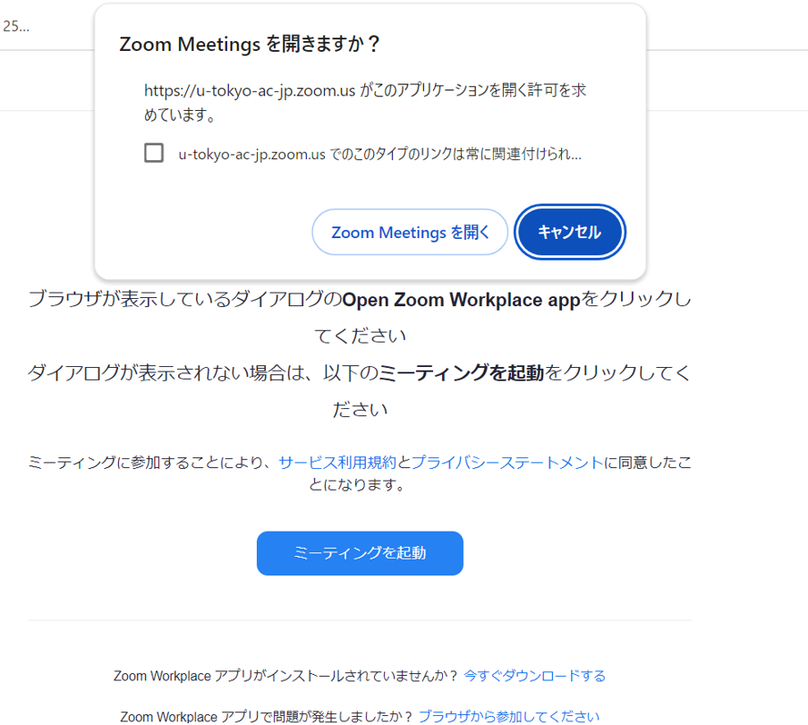{:.border}

   - Zoomアプリがインストールされていない場合は，「Zoom Meetingsを開きますか？」のダイアログは表示されません．アプリを使わずにZoomミーティングに参加する方法は，「ブラウザでの操作」のセクションで詳しく後述します．
#### アプリでの操作
アプリが起動した後，そのままミーティングに入室できる場合と，そうでない場合があるので，注意点を説明します．また，入室した後に行う操作についても説明します．

- 「サインインしてこのミーティングに参加する」という画面が表示されることがあります．この画面が表示された場合は，「サインインして参加」を押して，UTokyo AccountでZoomにサインインしてください．サインインの方法は「Zoom サインイン方法」(https://utelecon.adm.u-tokyo.ac.jp/zoom/signin/)を参照してください．
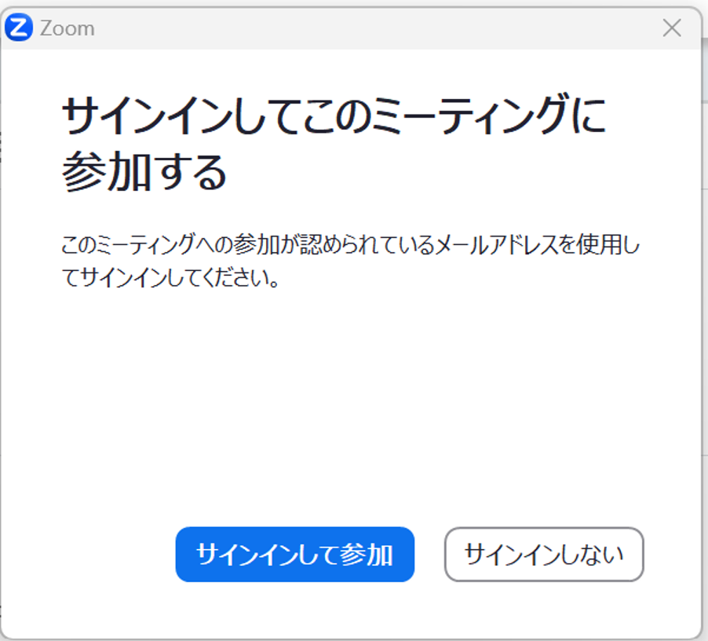
- 「ミーティングパスコードを入力」という画面が表示された場合は，パスコードを入力してください．
- ミーティングに入室した後でオーディオ接続を求められた場合，オーディオの設定を行い，「コンピューターオーディオで参加」を押してください．
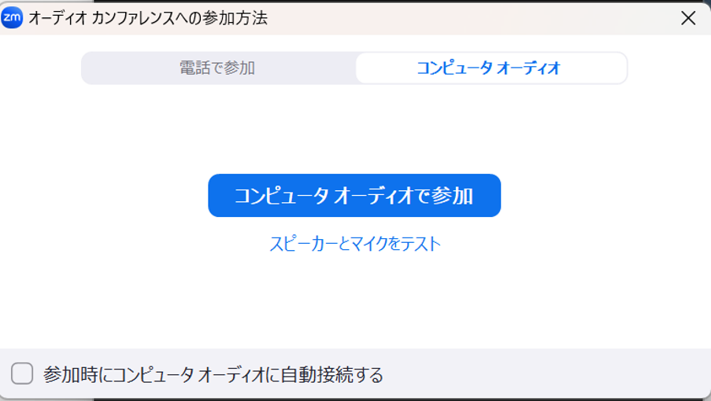
#### ブラウザでの操作
アプリをインストールしていない場合や，アプリがインストールしてあるのに開かない場合は，下の手順に従って，ブラウザからミーティングに参加することも検討してください．
1. 下図の画面下部にある「ブラウザから参加してください」を押してください
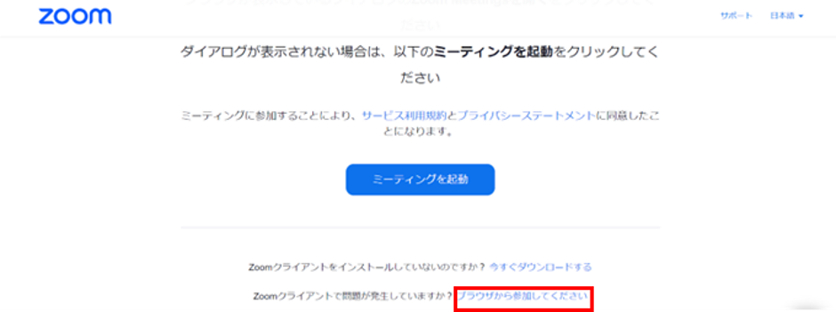
- 「サインインしてこのミーティングに参加する」という画面が表示されることがあります．この画面が表示された場合は，「サインインして参加」を押して，UTokyo AccountでZoomにサインインしてください．サインインの方法は「Zoom サインイン方法」を参照してください．
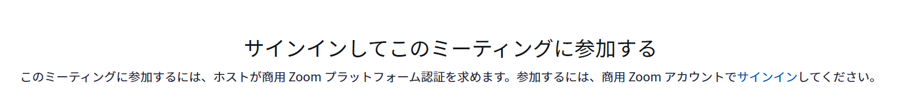
「ミーティングパスコードを入力」という画面が表示された場合は，パスコードを入力してください．
2. ミーティング中に表示される名前と，使用するオーディオとビデオの設定画面が表示されます．サインインしていない場合は，ミーティングで参加者に表示される自身の名前を入力してください．サインインしている場合は，名前が自動で入力されます．ミーティング中に使用するオーディオと，ミュートとビデオのオン/オフを設定し，「参加」を押してください．
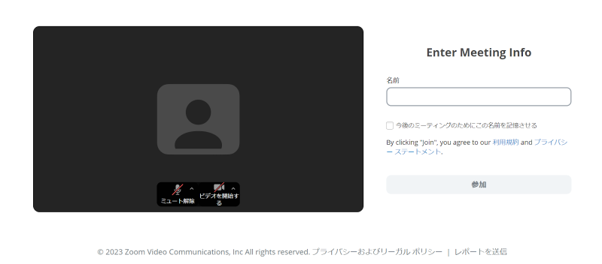
3. 入室した際に「コンピューターでオーディオに接続」という画面が表示された場合，「コンピューターでオーディオに接続」を押してください．押した後，手順2で行ったオーディオ設定でZoomに参加できます．  
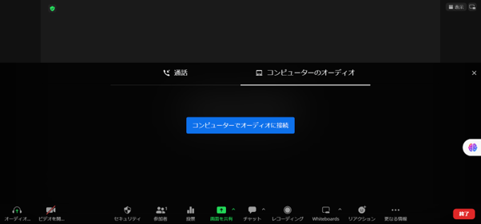
  
### ミーティング IDとパスコードをアプリに直接入力して参加する方法

Zoomアプリを起動し，「参加」のボタンを押してください.
  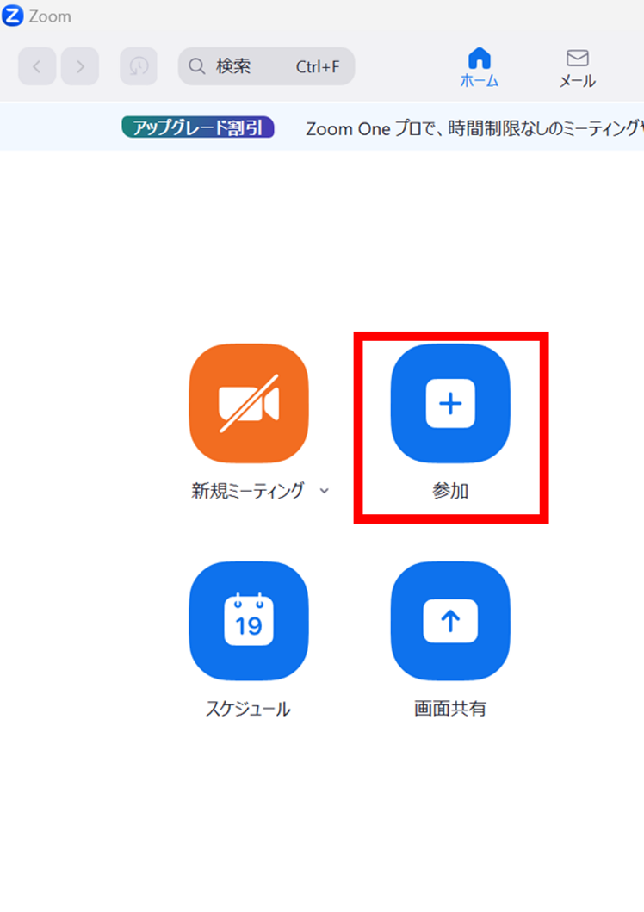
2. 「ミーティングに参加」という画面が表示されるので，「ミーティングID またはパーソナル リンク名」の欄にミーティングIDを入力してください．サインインしていない場合は，ミーティングで参加者に表示される自身の名前を入力してください．入力が終わったら「参加」を押してください．
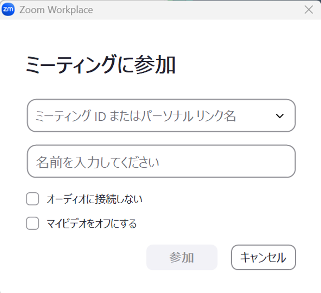{:.border .small}
「参加」ボタンを押した後，そのままミーティングに入室できる場合と，そうでない場合があるので，注意点を説明します．
「サインインしてこのミーティングに参加する」という画面が表示されることがあります．この画面が表示された場合は，「サインインして参加」を押して，UTokyo AccountでZoomにサインインしてください．サインインの方法は「Zoom サインイン方法」を参照してください．
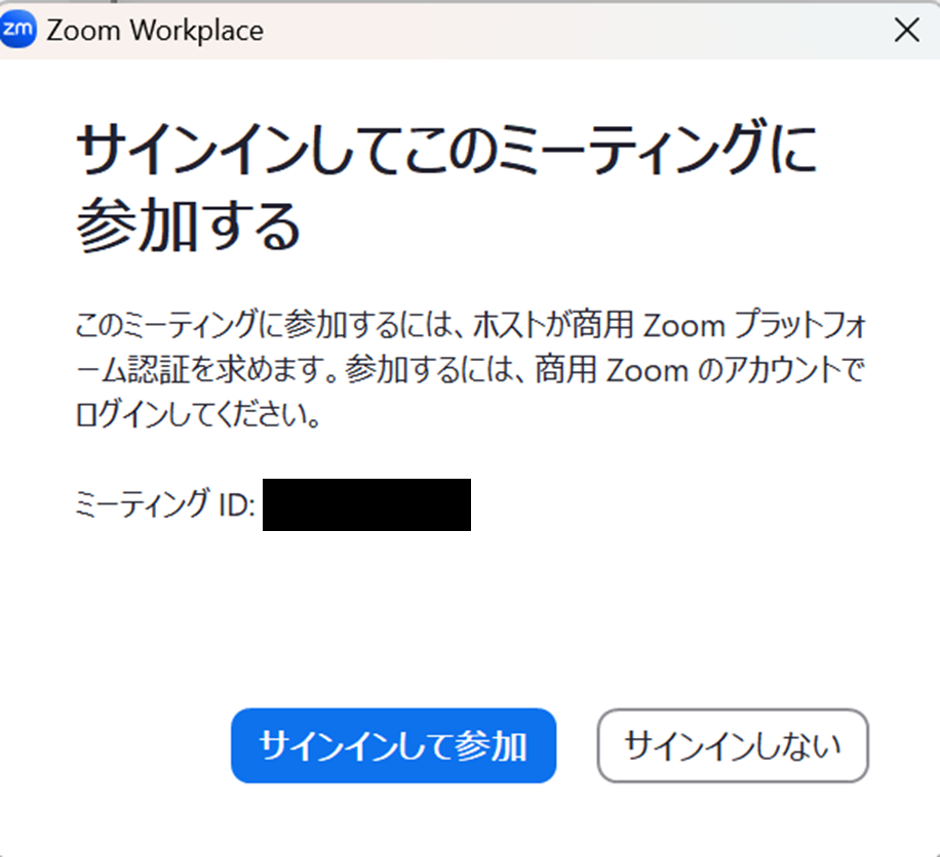{:.border .small}
- 「ミーティングパスコードを入力」という画面が表示された場合は，パスコードを入力してください．

- ミーティングに入室した後でオーディオ接続を求められた場合，オーディオの設定を行い，「コンピューターオーディオで参加」を押してください．
{:.border .small}
## 補足
### ホストとしてミーティングに参加する際の注意

ここでは，ホストとしてミーティングに参加する際の注意点について説明します．UTokyo Accountでサインインしていなければミーティングに参加できない場合があることについては既に説明しましたが，それ以外にもサインインした状態でなければミーティングの進行に支障をきたす可能性がある場合があります．
例えば次のようなケースです．ミーティングを作成した方が，そのアカウントでミーティングに参加すると，自動的に「ホスト」という役割に割り当てられます．あるいは，ミーティングを作成した方によって「代替ホスト」に指定されていた場合も，代替ホストが割り当てられたアカウントでミーティングに参加すると，「ホスト」または「共同ホスト」に割り当てられます．サインインしていない場合，ミーティングに参加してもホスト扱いにならず，以下の画面が表示され，ミーティングが開始されないことがあります．
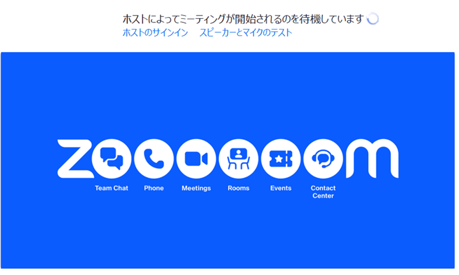{:.middle}
ミーティングを作成したアカウントや代替ホストに割り当てられたアカウントにサインインしていなければ，ホストや共同ホストが不在となり，ミーティングの進行に支障をきたす可能性も考えられますので注意が必要です．
