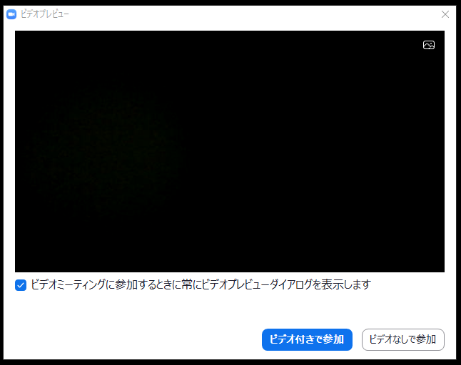
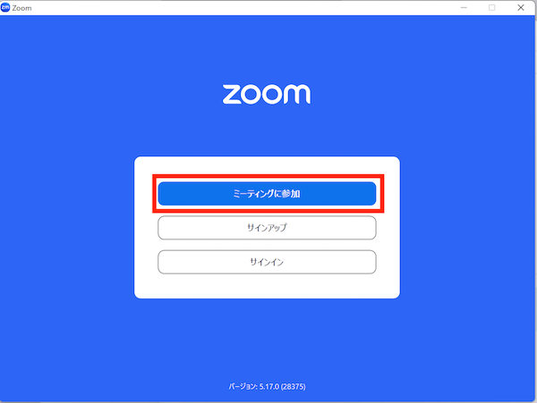

ここでは，会議室への入り方を説明します．  
URL（https://zoom.us/j/xxxxxxxxxx?pwd=xxxxxxxx xは英数字）を使って入る方法と ID（9～10桁の数字） を使って入る方法があるため，それぞれについて説明します．

## URL を使って入る
1. 会議室の URL（https://zoom.us/j/xxxxxxxxxx?pwd=xxxxxxxx xは英数字）にアクセスします
1. Web ブラウザー上で「Zoom Meetings を開く」を押します（Zoom がインストールされてない場合は，その画面からダウンロード可能であるため，そのままダウンロードして Zoom をインストールします）  
   
    
2. （名前を設定していない場合）名前の設定をします  
  
    
1. （カメラがついていて，ビデオプレビューダイアログを表示する設定になっている場合）ビデオ付きで参加するかビデオなしで参加するか選択できるため，希望の方を選択します  
  
  
1. （オーディオ（音声）の参加方法が未定の場合）「コンピューターでオーディオに参加」を選択します  
  
  
以上の流れで会議室へ入れます

## ID を使って入る
1. Zoom を起動します
1. 「ミーティングに参加」を押します  
  
  
1. ①にミーティングID（9～10桁の数字）を入力，②に名前を入力して，「参加」を押します（パスワードが設定されている場合は，パスワードも知らせてもらってパスワードを入力します）  
  
  
1. （カメラがついていて，ビデオプレビューダイアログを表示する設定になっている場合）ビデオ付きで参加するかビデオなしで参加するか選択できるため，希望の方を選択します
  
  
1. （オーディオ（音声）の参加方法が未定の場合）「コンピューターでオーディオに参加」を選択します  
  
  
以上の流れで参加できます

