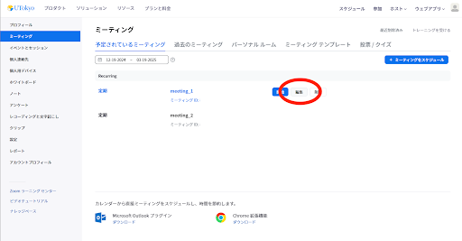
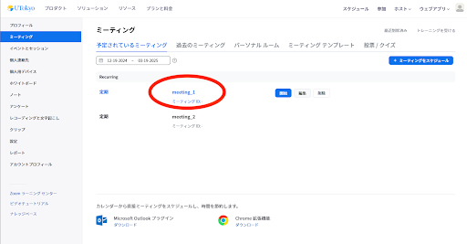
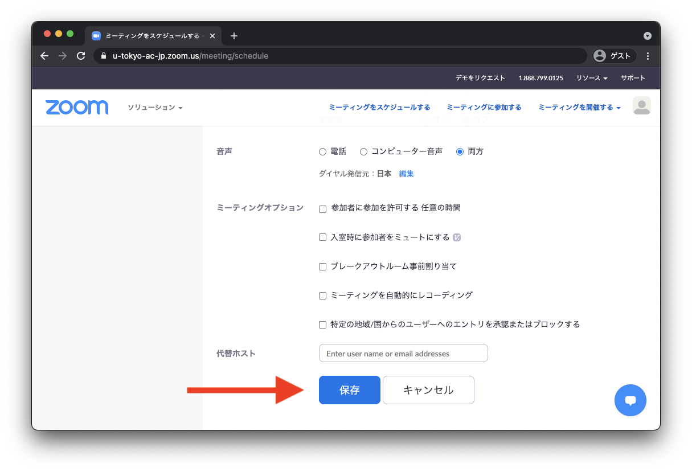

ミーティングをスケジュールしたあとでも，ミーティングの設定を変更することができます．

1. Web ブラウザで<a href="https://u-tokyo-ac-jp.zoom.us/meeting#/upcoming" target="_blank"> Zoom のミーティングページ</a>へ移動します．
{:.medium} 
2. 自分のスケジュールしたミーティングが，リストとして表示されます．設定を変更したいミーティングにマウスを重ねると，右側に「編集」ボタンが表示されるので，このボタンを押します．
{:.medium}
3. 設定を変更して，下にある「保存」を押すことで，ミーティングをスケジュールします．この際，「ミーティングID」や「パスコード」を変更しない限り，会議室のURLは変わりません．
{:.medium}  
