import HelpItem from "@components/utils/HelpItem.astro";

## Zoom ミーティングを管理する
{:#manage}
### ミーティング管理機能の種類
{:#functions}
Zoom ミーティングを管理するための機能は，「ミーティングの設定変更や記録確認に関する機能」と「ミーティングの進行に関する機能」の二つに大きく分類することが可能です．ミーティングの管理に関わる役割（後述する「[ホスト](#host)」「[共同ホスト](#co-host)」など）が利用することのできる機能のそれぞれの範囲は，この枠組みを用いることで整理することができます．たとえば，ホストは2種類の機能の両方が使える一方で，共同ホストは後者の「[ミーティングの進行に関する機能](#moderate)」しか使うことができません．

#### ミーティングの設定変更や記録確認に関する機能
{:#settings_and_records}
ミーティングの設定変更や記録確認に関する機能としては，具体的には以下の機能が挙げられます．
- [ミーティングに待機室を設定](/zoom/create_room/waiting_room/)する
- [ミーティングの参加者に認証を求める](/zoom/create_room/auth/)
- ミーティングの[レポート](https://support.zoom.us/hc/ja/articles/201363213)を確認する
- ミーティングを開始する

#### ミーティングの進行に関する機能
{:#moderate}
ミーティングの進行に関する機能としては，具体的には以下の機能が挙げられます．
- [ブレイクアウトルーム](/zoom/usage/breakout/)の作成
- [投票](/zoom/usage/poll/)を作成する
- 参加者をミュートにする

### ミーティングの管理の方法
{:#how_to_manage}
ミーティングを作成した人は原則として[^1]自動的に「[ホスト](#host)」という役割に割り当てられ，上記の2種類の管理機能の両方が利用可能です．加えて作成者以外の方を「[共同ホスト](#co-host)」「[代替ホスト](#alt_host)」といった役割に設定することで，ミーティングの管理を補助してもらうことができます．これらのミーティングの管理に関わる役割について，以下で説明します．

## ホスト
{:#host}
### ホストとは
{:#host_desc}
ホストとは，ミーティングの作成者に対して付与される役割のことです．一つのミーティングに対し，一人だけ存在します．ミーティング中に誰がホストになっているかを確認するには，ミーティング画面下部の「参加者」ボタンを選択してください．

表示された参加者の一覧のうち，ホストになっている参加者には名前の右側に「（ホスト）」の表示があります．
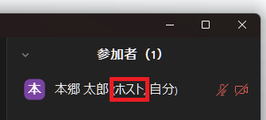

### ホストができること
{:#host_authority}
ホストは，[ミーティングの設定変更や記録確認に関する機能](#settings_and_records)と，[ミーティングの進行に関する機能](#moderate)の両方が利用でき，ミーティングの管理に関する役割の中で最も多くの機能を扱える役割です．
### ホストの譲渡
{:#transfer_host}
ホストが利用できる[2つの機能](#functions)のうち，[ミーティングの進行に関する機能](#moderate)を行う権限に関しては，ミーティングの開催中に他の参加者に譲渡することが可能です．[ミーティングの設定変更や記録確認に関する機能](#settings_and_records)については譲渡することはできません．
- **ただし，他の参加者にミーティングの進行に関する機能を使って補助してもらう場合は，ホストを譲渡するよりも，下で説明する「[共同ホスト](#co-host)」に割り当てたほうが便利な場合があります**
- **また，画面共有の権限など，個別具体的な機能についてはホスト自体を譲渡することなく特定の参加者に許可をすることが可能です**
  **→ [Zoom 画面共有の許可と制限](/zoom/usage/screen_sharing/security/)**

**ホストの譲渡は，自身からホスト権限を解除して，なおかつ他の参加者にホスト権限を割り当てたい場合に利用します．**たとえば，本来ホストとして表示されるべき人の代わりにミーティングを作成してしまった場合や，自分がホストであることを他の参加者に対して明示したくない場合に利用することが考えられます．ミーティングが自分自身の名義である場合[^4]，譲渡したホストは「[ホストの再要求](#reclaim_host)」で再びホストに戻ることが可能です．ホストの譲渡を行う具体的な方法は以下の通りです．

#### ホストの譲渡を行う方法
{:#how_to_transfer_host}
1. ミーティング画面下部の「参加者」ボタンを選択してください

2. ミーティング中の「参加者」欄に表示されている自分以外の参加者のうち，ホストに割り当てたい参加者にマウスを合わせてください
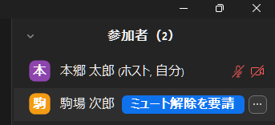
3. 表示されたケバブメニュー（「…」のアイコン）をクリックし，「ホストに指定」を選択してください
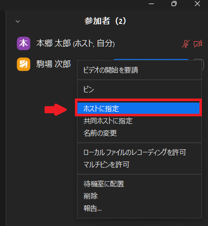

### ホストキー
{:#host_key}
ホストは，あらかじめ他の参加者に「[ホストキー](https://support.zoom.us/hc/ja/articles/205172555)」とよばれるコードを共有しておくことで，ミーティング開始時に自身が不在の場合であっても，代わりに他の参加者にホストを務めてもらうことができます．この機能は，ホストがミーティングに遅れて参加する場合[^2]で，他の参加者に一時的にホストを担ってもらいたい場合などに利用します．この場合，元々のホストがミーティングに参加すると「[共同ホスト](#co-host)」に割り当てられますが，「[ホストの再要求](#reclaim_host)」を行うことでホストに復帰することが可能です．

**ホストキーはホストキーを発行したホストが作成した全てのミーティングに対して共通なため，セキュリティ上慎重な運用が求められます．一時的にホストを担ってもらいたい方が東京大学の Zoom アカウントを利用している場合は，下で説明する「[代替ホスト](#alt_host)」に割り当てた方が便利な場合があります．**
利用手順については、[**ホストキーの利用手順**](#host_key_instructions)をご覧ください。

### ホストの退出
{:#host_leave}
[ホストが進行中のミーティングを退出する](https://support.zoom.us/hc/ja/articles/201362573)場合，以下のように「全員に対してミーティングを終了」と「ミーティングを退出」の2つの選択肢が表示されることがあります．
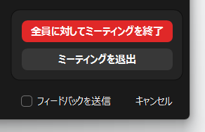
これは，1つのミーティングに対しては原則として[^3]常に1人のホストが存在している必要があるため，ホストがミーティングを退出する場合，ミーティング自体を終了させるか他の参加者にホストを移動させる必要があるために表示されているものです．

ホストの退室に伴ってミーティングを終了させる場合，「全員に対してミーティングを終了」を選択してください．もし，ホストが退出した後も他の参加者にホストを移動させてミーティングを継続させたい場合は，「ミーティングを退出」を選択したあと，ホストを移動させたい参加者を選択して，「割り当てて退出する」を選択してください．
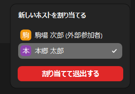

### ホストの意図しないミーティング離脱
{:#host_accidental_leave}
インターネット回線が切断されたなどの理由でホストが意図せずミーティングから離脱することになった場合，一定時間経過後，以下の順番で他の参加者にホストが移動することが確認されています．元々のホストは，再度ミーティングに参加することにより自動的にホストを回復することができます．
- ミーティングに共同ホストが存在する場合  
  共同ホストにホストが移動します．共同ホストが複数人存在する場合は，その中で当該のミーティングの最初の参加者に移動します．
- ミーティングに共同ホストが存在しない場合  
  東京大学の Zoom アカウントのうち最初の参加者に移動します．離脱したホスト以外がすべて東京大学の Zoom アカウントでないアカウントで参加していた場合は，当該のミーティングの最初の参加者に移動します．

上記の動作により，ミーティングに共同ホストが存在しない状態でホストが意図せず離脱した場合，想定しない参加者にホストが移動してしまう可能性があります．**悪意のある参加者にホストが移動する可能性を低減するため，不特定多数が参加するミーティングにおいては共同ホストを設定することを推奨します．**

### ホストを回復する
{:#reclaim_host}
ホストが他の参加者に移動したあと（[ホストの譲渡](#transfer_host)，[ホストキーの使用](#host_key)，[ホストの退出](#host_leave)，[ホストの意図しないミーティング離脱](#host_accidental_leave)などによる），元々のホストが再びホストに戻ることを希望する場合は，以下の方法でホストを回復することができます．この機能を実行できるのは，当該ミーティングの名義を持つユーザーだけであり，たとえば「[代替ホスト](#alt_host_desc)」を設定されたことでミーティング中にホストになった場合などは実行することはできません．
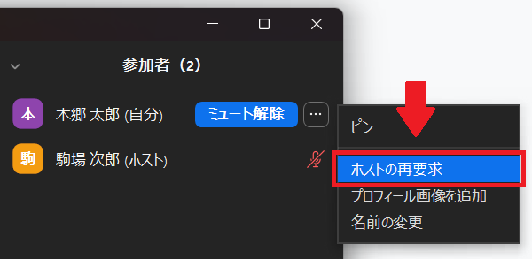
ミーティング中の「参加者」欄に表示されている自身の名前にマウスを合わせ，表示されたケバブメニュー（「…」のアイコン）をクリックし，「ホストの再要求」を選択することで，再びホストに戻ることが可能です．

## 共同ホスト
{:#co-host}
### 共同ホストとは
{:#co-host_desc}
共同ホストとは，あるミーティングにおいて，[ミーティングの進行に関する機能](#moderate)に関して，ホストから管理権限を付与された役割のことです．ホストと異なり，同一ミーティングに対し複数名が存在することが可能です．ミーティング中に誰が共同ホストになっているかを確認するには，「参加者」ボタンを選択してください．

表示された参加者の一覧のうち，共同ホストになっている参加者には，名前の右側に「（共同ホスト）」の表示があります．
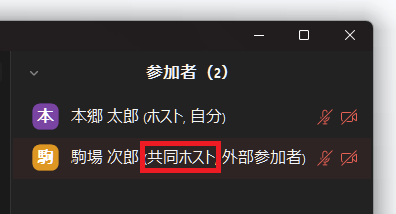

### 共同ホストができること・できないこと
{:#co-host_authority}
- [ミーティングの設定変更や記録確認に関する機能](#settings_and_records)に関しては利用することができません
- [ミーティングの進行に関する機能](#moderate)に関してはホストとほとんど同様に利用することができます．なお，参加者を共同ホストに指定できるのはホストだけで，共同ホストが他の参加者をさらに共同ホストに指定することはできません．

### 共同ホストを使うとき
{:#co-host_usage}
具体的には，以下のような状況で使うことが想定されます．
- 授業内演習の進行をTAに補助してもらうため，共同ホストに設定する
- 会議の幹事を共同ホストに設定することで，進行を複数人で分担して行う

### 共同ホストに設定する方法
{:#assign_co-hosts}

#### ミーティング進行中に他の参加者を指定する
{:#assign_co-hosts_during_meeting}
ホストは，ミーティングの進行中に他の参加者を指定することで共同ホストに設定することが可能です．具体的な手順は以下の通りです．
1. ミーティング画面下部の「参加者」ボタンを選択してください

2. ミーティング中の「参加者」欄に表示されている自分以外の参加者のうち，共同ホストに割り当てたい参加者にマウスを合わせてください

3. 表示されたケバブメニュー（「…」のアイコン）をクリックし，「共同ホストに指定」を選択してください
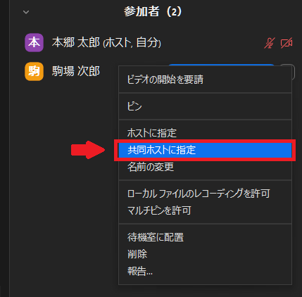

#### 事前に共同ホストを設定する
{:#assign_co-hosts_before_meeting}
[進行中に指定する方法](#assign_co-hosts_during_meeting)では，ミーティング開催中にしか共同ホストを設定することができません．ミーティングの開始前にあらかじめ共同ホストを設定しておきたい場合は，指定したい東京大学の Zoom アカウントを，下で説明する「[代替ホスト](#alt_host)」に指定することで実現できます．これは，代替ホストに指定されたユーザーがミーティングに参加した場合，ホストもしくは共同ホストとして設定されるからです．この方法を用いることで，定期的なミーティングの場合などで毎回共同ホストを設定する手間を省くことが可能です．

## 代替ホスト
{:#alt_host}
### 代替ホストとは
{:#alt_host_desc}
代替ホストとは，あるミーティングにおいて，そのミーティングの開始権限を[ホスト](#host)から付与された役割です．ホストと異なり，同一ミーティングに対し複数名が存在することが可能です．代替ホストとして指定されたユーザーは，実際のミーティング内ではホストもしくは[共同ホスト](#co-host)として表示されます．ホストと代替ホストの中で，一番最初にミーティングに参加したユーザーがミーティング内でのホストとなり，それ以外は共同ホストとして表示されます．**なお，代替ホストに設定できるのは，東京大学の Zoom アカウントに限定されます**．

### 代替ホストができること・できないこと
{:#alt_host_authority}
- [ミーティングの設定変更や記録確認に関する機能](#settings_and_records)に関しては，「ミーティングの開始」のみ行うことが可能で，それ以外は利用することができません
- [ミーティングの進行に関する機能](#moderate)に関しては，[ホスト](#host)・[共同ホスト](#co-host)とほとんど同様に利用することができます

### 代替ホストを使うとき
{:#alt_host_usage}
具体的には，以下のような状況で使うことが想定されます．
- 説明会で，主催者側の誰でもミーティングを始められるようにしたいため，あらかじめ主催者側のメンバーを代替ホストに設定しておく
- TAに授業の進行を手伝ってもらいたいが，毎回手動で共同ホストに設定するのは手間なため，あらかじめ代替ホストに設定しておく

### 代替ホストに設定する方法
{:#assign_alt_hosts}
他のユーザーを代替ホストに設定する具体的な手順を説明します．

#### ブラウザから代替ホストを設定する
{:#assign_alt_hosts_on_web}
1. Zoom ウェブポータルの「[ミーティング](https://u-tokyo-ac-jp.zoom.us/meeting)」ページにアクセスしてください
1. 新しくスケジュールするミーティングに代替ホストを設定する場合は「ミーティングをスケジュール」を選択してください．
以前に作成したミーティングに代替ホストを設定する場合は，対象のミーティングの開始時期にあわせて「予定されているミーティング」もしくは「過去のミーティング」を選択し，一覧に表示されているミーティングにカーソルを合わせ，表示された「編集」ボタンを選択してください
    - 新しくスケジュールするミーティングに代替ホストを設定する場合
    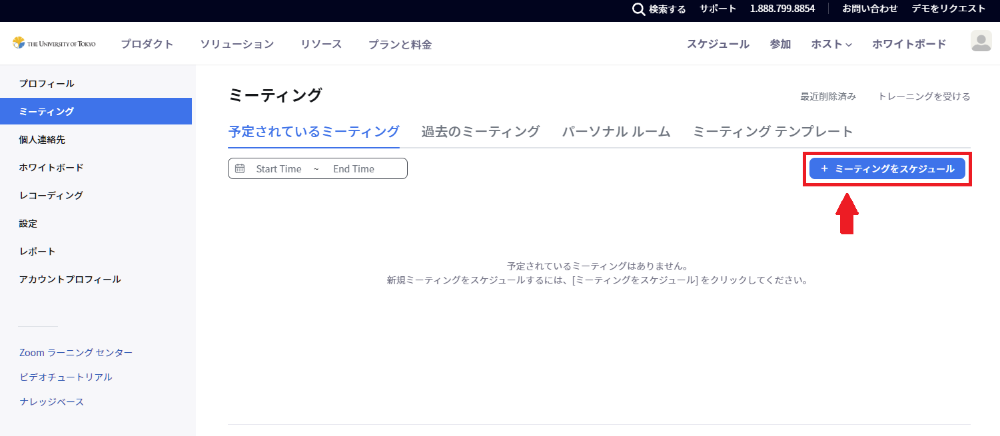
    - 以前に作成したミーティングに代替ホストを設定する場合
    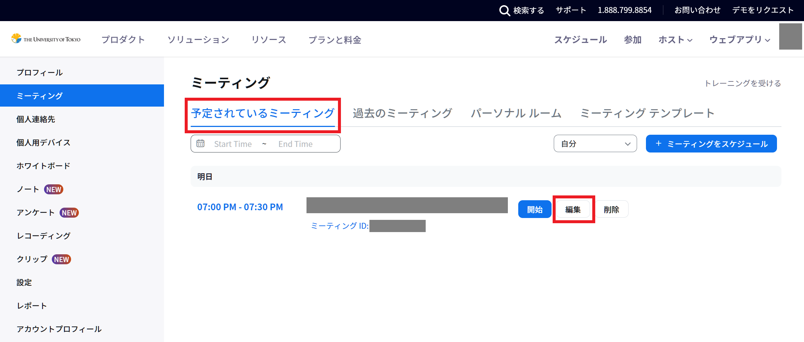
1. ミーティングのスケジュール・編集画面で「オプション」の項目の [表示] を選択してください
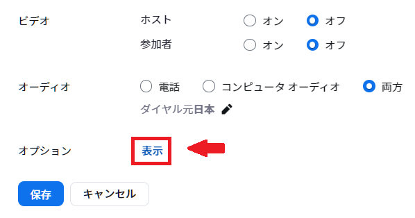
1. 「代替ホスト」欄に，追加対象のユーザーの「10桁の共通ID＋`@utac.u-tokyo.ac.jp`」（例：`1234567890@utac.u-tokyo.ac.jp`）を入力してください
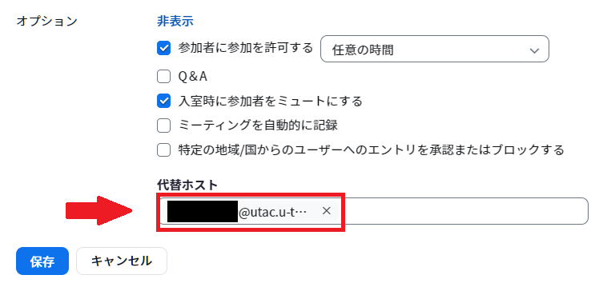
1. 「保存」を選択して完了してください

#### アプリから代替ホストを設定する
{:#assign_alt_hosts_on_app}

1. 新しくスケジュールするミーティングに代替ホストをを設定する場合は「ホーム」タブの「スケジュール」を選択してください．以前に作成したミーティングに代替ホストを設定する場合は，「ミーティング」タブで該当のミーティングを選択し，「編集」を選択してください
    - 新しくスケジュールするミーティングに代替ホストをを設定する場合
    
    - 以前に作成したミーティングに代替ホストを設定する場合
    
1. ミーティングのスケジュール・編集画面で「詳細オプション」を選択してください

1. 「代替ホスト」欄に，「追加対象のユーザーの10桁の共通ID＋`@utac.u-tokyo.ac.jp`」（例：`1234567890@utac.u-tokyo.ac.jp`）を入力してください
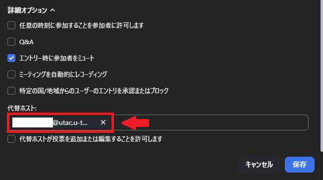
1. 「保存」を選択して完了してください

## スケジュール作成特権
{:#scheduling_privilege}

### スケジュール作成特権とは
{:#scheduling_privilege_desc}
スケジュール作成特権とは，他のユーザーに対し，自分の名義でミーティングを作成したり，すでに作成されたミーティングを編集することを許可する機能のことです．**スケジュール作成特権を設定されたユーザー（以下「子ユーザー」とする）は，設定したユーザー（以下「親ユーザー」とする）のすべてのミーティングにおいて代替ホストとして設定されるため，セキュリティ上慎重な運用が必要になります．なお，スケジュール作成特権を付与できるのは，東京大学の Zoom アカウントに限定されます．**スケジュール作成特権を設定されたユーザーは，Zoom プラグイン・アドイン・アドオンを用いることで，Outlook やGoogle カレンダーなどからミーティングを管理することも可能です．
利用手順については[**スケジュール作成特権の利用手順**](#scheduling_privilege_instructions)をご覧ください。

### スケジュール作成特権の下でできること・できないこと
{:#scheduling_privilege_authority}
- [ミーティングの設定変更や記録確認に関する機能](#settings_and_records)に関しては，以下の通りです
  - 親ユーザーの代わりにミーティングをスケジュールすることができます
  - 親ユーザーがスケジュールしたミーティングについて，自由に開始・編集・削除することができます．
    - このため，子ユーザーは既存の親ユーザーのミーティングに対して以下のような設定に関する変更を行うことができます
      - [ミーティングに待機室を設定](/zoom/create_room/waiting_room/)する
      - [ミーティングの参加者に認証を求める](/zoom/create_room/auth/)
    - また，子ユーザーは親ユーザーのミーティングを自分の名義に書き換えることができます．いったん名義が変更された場合，親ユーザーの側からミーティングを自分の名義に戻すことは，二者が互いにスケジュール作成特権を設定しあっている場合を除き，不可能です
  - 録画されたレコーディングや，レポートなどに関しては，子ユーザーは利用することができません
- [ミーティングの進行に関する機能](#moderate)に関しては，[ホスト](#host)・[共同ホスト](#co-host)とほとんど同様に利用することができます

### スケジュール作成特権を使うとき
{:#scheduling_privilege_usage}
具体的には，以下のような状況で使うことが想定されます．
- 教員である自分が主催するミーティングについて，秘書にあらかじめスケジュールを行ってもらうため，スケジュール作成特権を付与する

## 各種操作の手順
{:#instructions}

### ホストキーの利用手順
{:#host_key_instructions}

#### ホスト側の操作
{:#host_key_instructions_hosts}
ホストは，以下の手順で自身のホストキーを取得・編集するすることができます．取得したホストキーは，ホストを務めてもらいたい参加者に共有します．
1. Zoom ウェブポータルの「[プロフィール](https://zoom.us/profile)」ページにアクセスしてください
2. "Meeting"欄まで移動し，「ホストキー」の横にある瞳のアイコンをクリックしてください．表示された6桁の数字がホストキーです．もし，ホストキーが意図しない他者に知られてしまった場合などで，新しくホストキーを設定することを希望する場合，右側の\[編集\]から設定することができます．
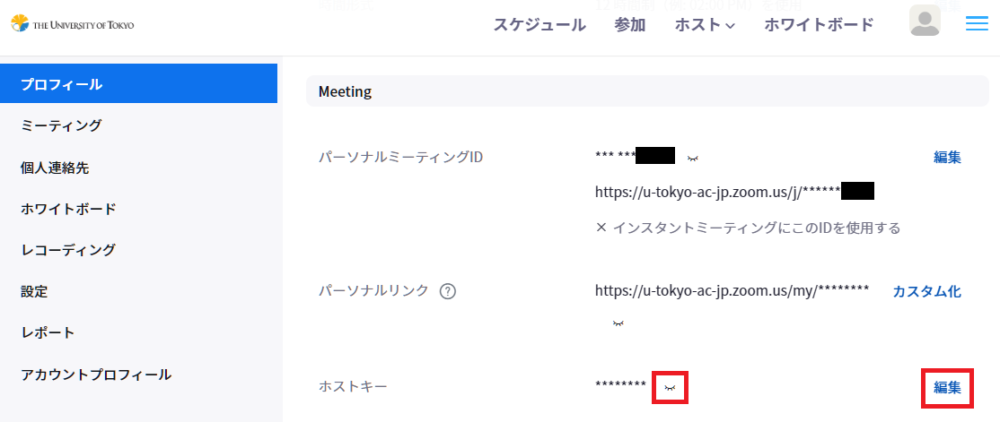

#### 参加者側の操作
{:#host_key_instructions_participants}
ホストからホストキーを共有された参加者は，以下の手順でホストになることができます．
1. ホストが不在のミーティングに入室してください
2. 「参加者」ボタンを選択してください

3. 参加者欄の下部にある「ホストの要求」を選択してください
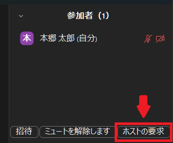
4. ホストキーを入力してください
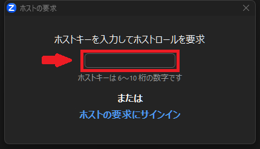
5. 新しく表示された「ホストの要求」を選択してください
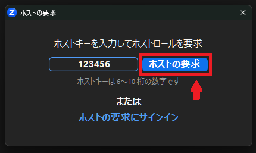
6. [自分がホストになっていることを確認](#host_desc)してください

### スケジュール作成特権の利用手順
{:#scheduling_privilege_instructions}

#### スケジュール作成特権を設定する
{:#grant_scheduling_privilege}
親ユーザーが子ユーザーにスケジュール作成特権を設定する具体的な手順は以下の通りです．
1. Zoom ウェブポータルの「[設定](https://zoom.us/profile/setting)」ページにアクセスしてください
2. 「ミーティング」タブを選択し，「その他」欄の「スケジュールする権限」まで移動し，\[追加\]を選択してください
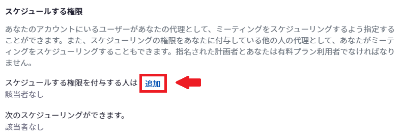
3. 「ユーザー」欄下部の\[追加\]を選択してください
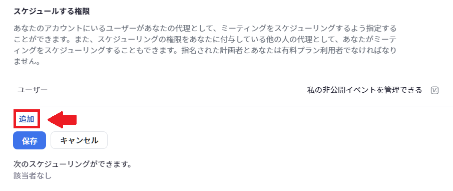
4. 「ユーザー」欄に，「追加対象のユーザーの10桁の共通ID＋`@utac.u-tokyo.ac.jp`」（例：`1234567890@utac.u-tokyo.ac.jp`）を入力してください
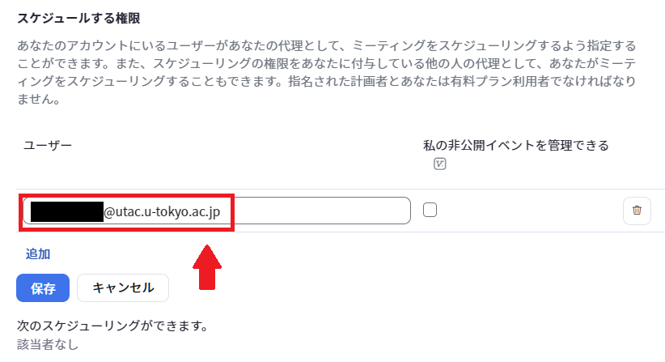
5. （オプション）追加するユーザーが非公開ミーティングを管理できるようにしてください  
このオプションは，子ユーザーがZoom プラグイン・アドイン・アドオンを用いて Outlook や Google カレンダーからミーティングを管理する際の権限に関わるものです．有効にした場合，子ユーザーはOutlook または Google カレンダーで非公開になっているミーティングの詳細（招待リンク，ミーティング トピック，出席者リスト）の表示・編集が可能になります．無効にした場合，子ユーザーはカレンダー上で「非公開ミーティング」の存在は確認できますが，その詳細の閲覧・編集はできません．
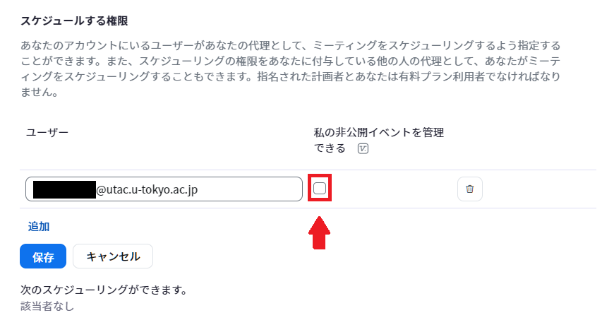
6. 「保存」を選択して完了してください

#### スケジュール作成特権を用いてミーティングをスケジュール・編集する
{:#schedule_meetings_using_privilege}
ここでは，スケジュール作成特権を用いてのミーティングのスケジュールと編集について，ブラウザとアプリでの方法を説明します．プラグインなどを用いた方法については，公式サポートページをご覧ください．→ [**スケジュール作成特権**](https://support.zoom.us/hc/ja/articles/201362803)

##### ブラウザからスケジュール作成特権を用いてミーティングをスケジュール・編集する
{:#schedule_meetings_using_privilege_on_web}

- 新しくミーティングをスケジュールする場合の手順
  1. Zoom ウェブポータルの[ミーティング](https://u-tokyo-ac-jp.zoom.us/meeting)ページにアクセスしてください
  1. 「ミーティングをスケジュール」を選択してください
  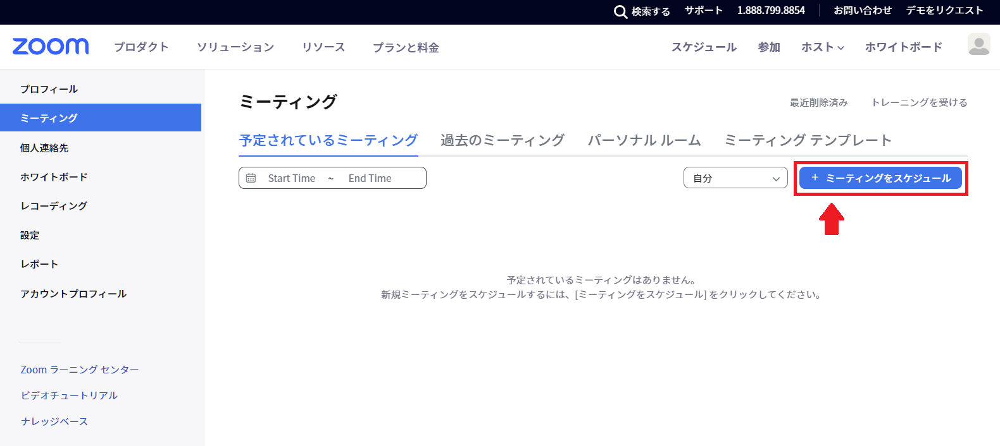
  1. 「スケジュール対象」のプルダウンメニューから親ユーザーを選択してください
  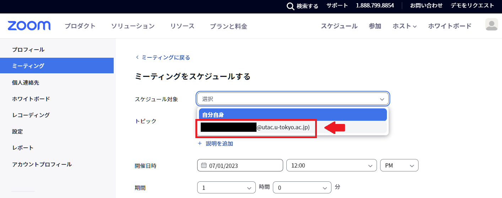
  1. その後は通常通りに[ミーティングをスケジュール](/zoom/create_room/)してください

- 既存のミーティングを編集する場合の手順
  1. Zoom ウェブポータルの[ミーティング](https://u-tokyo-ac-jp.zoom.us/meeting)ページにアクセスしてください．
  1. 編集したいミーティングにあわせて「予定されているミーティング」もしくは「過去のミーティング」を選択したあと，「ミーティングをスケジュール」の左側にあるプルダウンメニューから，「すべて」もしくは親ユーザーを選択してください
  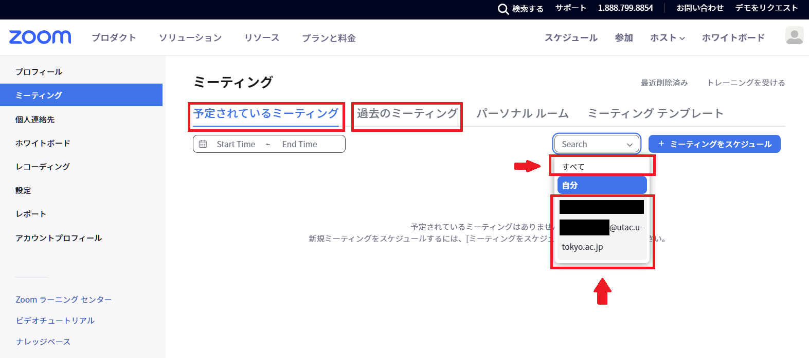
  「すべて」を選択した場合は自分自身のミーティングと親ユーザーのミーティングの一覧が，親ユーザーを選択した場合は親ユーザーのミーティングの一覧が表示されます．

  1. 対象とするミーティングにカーソルを合わせ，新しく表示された「編集」を選択してください
  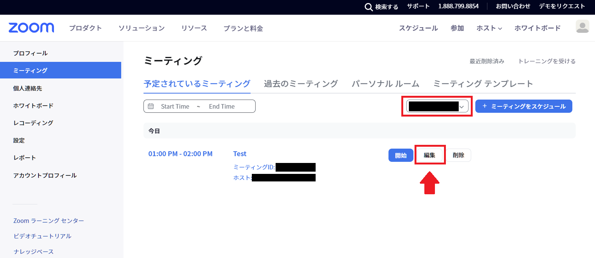
  1. その後は通常通りに[ミーティングを編集](/zoom/misc/edit_meeting/)してください．なお，この編集画面で「スケジュール対象」を「自分自身」に変更をすると，当該ミーティングの名義を親ユーザーから子ユーザーに移動させることが可能です
  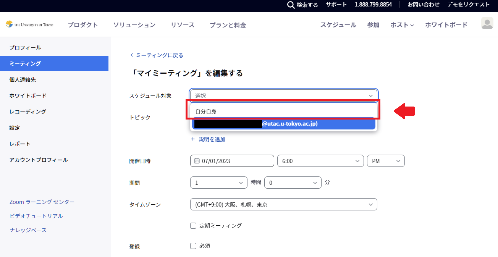

##### アプリからスケジュール作成特権を用いてミーティングをスケジュール・編集する
{:#schedule_meetings_using_privilege_on_app}

- 新しくミーティングをスケジュールする場合の手順
  1. 「ホーム」タブの「スケジュール」を選択してください
  
  1. ミーティングのスケジュール画面で「スケジュール対象」から親ユーザーを選択してください
  
  1. その後は通常通りに[ミーティングをスケジュール](/zoom/create_room/)してください

- 既存のミーティングを編集する場合の手順
  1. 「ミーティング」タブで，「ミーティングホスト」のプルダウンメニューから，「全員」もしくは親ユーザーの名前を選択してください
  
  「全員」を選択した場合は自分自身のミーティングと親ユーザーのミーティングの一覧が，親ユーザーを選択した場合は親ユーザーのミーティングの一覧が表示されます．
  1. 該当のミーティングを選択し，「編集」を選択してください
  
  1. その後は通常通りに[ミーティングを編集](/zoom/misc/edit_meeting/)してください．なお，この編集画面で「スケジュール対象」を「自分自身」に変更をすると，当該ミーティングの名義を親ユーザーから子ユーザーに移動させることが可能です
  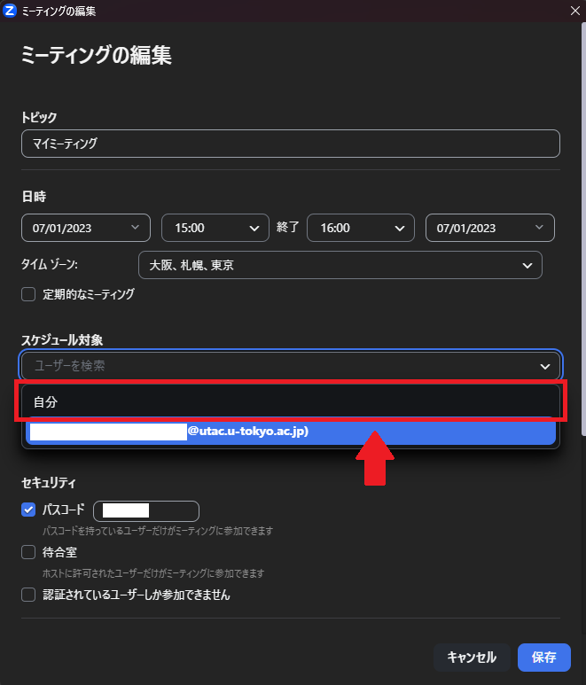

[^1]: 例外として，後述するスケジュール作成特権を用いてミーティングを作成した場合には付与されません
[^2]: ホストがミーティングを開始する前に参加者がミーティングに参加するためには，[ミーティング作成時](/zoom/misc/app/#%E3%82%A2%E3%83%97%E3%83%AA%E3%81%A7%E3%81%AE%E4%BC%9A%E8%AD%B0%E5%AE%A4%E3%81%AE%E4%BD%9C%E3%82%8A%E6%96%B9)の詳細オプションで「ホストより前の参加を有効にする」を有効にしている必要があります
[^3]: ミーティング作成時の詳細オプションで「ホストより前の参加を有効にする」を有効にしている場合，ホストが参加するまでの間は，ホスト不在でミーティングが進行します
[^4]: 「[代替ホスト](#alt_host_desc)」に設定されるなどで，ミーティング中にホストであっても名義は持たないという場合が存在します