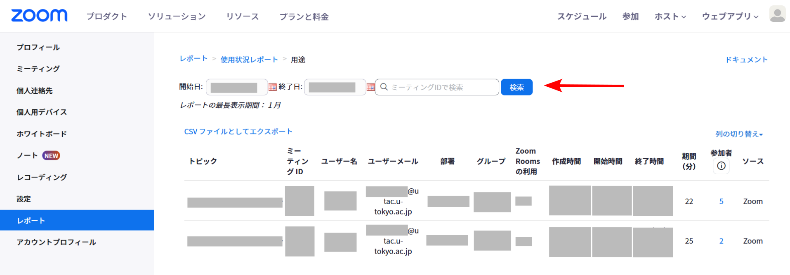

Zoomの「**レポート**」機能は，ミーティング出席者の名前・メールアドレス・参加時刻・退出時刻等の一覧（レポート）を，ホストが取得できる機能です．この機能を使えば，参加者の出席管理ができます．

この機能を利用するにあたって，事前の設定や手続きは不要です．

## レポートを表示する

ここでは，ミーティング出席者の情報を一覧できるレポートを表示する方法について説明します．

1. Web ブラウザで[Zoomのレポートページ](https://u-tokyo-ac-jp.zoom.us/account/report?isPersonal=true#/usageReports)へ移動してください
1. 「用途」を押してください．
   {:.medium}
1. 過去に開催された，自分がホストのミーティングが表示されます．
1. レポートを取得したいミーティングを見つけてください．対象のミーティングの日付が間になるように「開始日」「終了日」を設定し，「検索」を押すと，指定した期間内のミーティングのみが表示されます．
   {:.medium}
1. 「参加者」の列に表示される数字を押してください．
   {:.medium}
1. 出席した人の名前，参加時刻，退出時刻，所要時間，またZoomアカウントでサインインしていればメールアドレスが表示されます．
   {:.medium}

※共同ホストや代替ホストだったミーティングのレポートは，取得することができません．

## レポートをCSVファイルの形式で取得する

ここでは，レポートの内容をCSVファイルの形式でダウンロードする方法について説明します．

1. 「[レポートを表示する](#レポートを表示する)」の最後の手順まで，操作をしてください．
1. 「ミーティングデータでエクスポート」のチェックボックスをオンにしてください．
   {:.medium}
1. 「エクスポート」を押してください．
1. レポートの内容が記録された，CSVファイルがダウンロードされます．

## 参加者の記録がミーティングの途中で抜け落ちてしまう場合の対応

ここでは，参加者が意図していないのに，レポートの上では参加の記録がミーティングの途中で抜け落ちてしまうときの対応について説明します．

途中で表示名を変更した場合や，参加者の通信が途切れた場合は，その時点で一度ミーティングから退出した扱いになり，その退出時間が記録されます．その後，名前を変更したタイミングや，再度参加したタイミングで，新しい参加記録が作成されます．

退出前と再参加後の二つの参加記録が同じ参加者のものかどうかは，判別できる場合とできない場合があります．

- **参加者がZoomにサインインしている場合**：「ミーティング参加者」のユーザーメールの欄に，参加者のメールアドレスが表示されます．名前を途中で変更した場合でも，ユーザーメールが同じならば同一人物と判断できます．
- **参加者がZoomにサインインしていない場合**：「ミーティング参加者」のユーザーメールの欄は空欄なので，ユーザーメールから同一人物と判断することはできません．参加者が途中で名前を変更した場合は，古い表示名を持つ人間が退出し，新しい表示名を持つ人間が参加したように記録されるため，同一人物と判断できないことがあります．

このような事態に備えて，参加者が自分の出席状況を確認できるようにする，などの方策が必要かもしれません．

## いわゆる代返行為の防止方法

ここでは，東京大学の関係者に個別に割り当てられたメールアドレスを使って出席を管理し，別の学生が参加者になりすますこと（いわゆる「代返」）を防ぐ方法について説明します．

メールアドレスを使って出席を管理するには，ミーティングへの参加を東京大学のZoomアカウントにサインインしている参加者に限定してください．こうすることで，レポートには東京大学の関係者に個別に割り当てられたメールアドレスが記録され，なりすまし行為を防ぐことができます．東京大学のZoomアカウントにサインインしている参加者に限定する方法は，「[Zoomミーティングで参加時に認証を求める](/zoom/create_room/auth/)」をご覧ください．

ただし，大学のアカウントでのサインインに参加者が慣れていない場合（特に，授業の学期開始当初）は，設定をオフにすることを推奨します．設定に関する考え方については，「[授業におけるZoom会議室の入室制限](/faculty_members/zoom_access_control)」もご覧ください．
