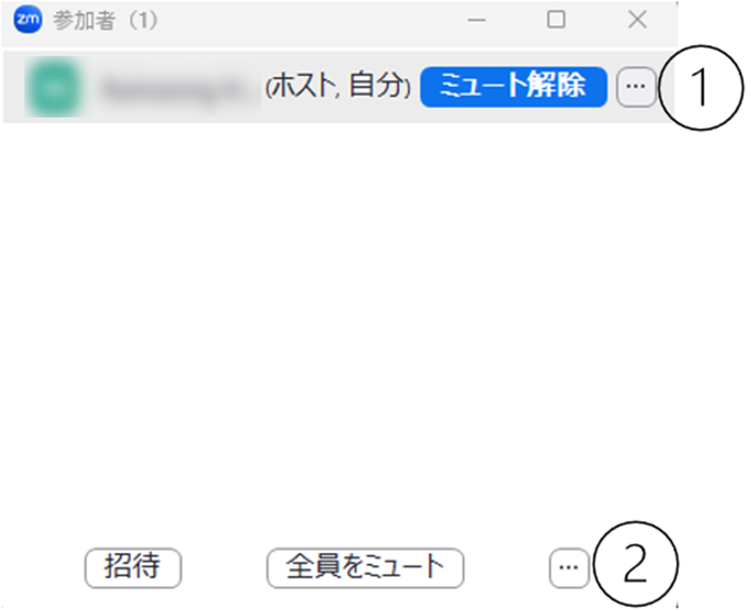

--- 
title: ZOOMの参加者一覧表示
---

## ZOOMの参加者一覧表示

------------------------
Zoomには，ビデオ会議に参加している参加者のリストを表示する機能があります．ホストや共同ホストは，この機能を利用して参加者を確認・管理できます．
このための画面を，「参加者パネル」と呼びます．参加者パネルは，Zoomのミーティングコントロールバーより「参加者」（下図の白枠で囲っている部分）を押すことで表示されます．

参加者パネルはポップアップウィンドウとして表示されることもありますが，参加者パネルの右下にある 「・・・」から，「ミーティング ウィンドウに統合」を押すことでZoomのミーティングウィンドウと一体化できます．
この記事では，Zoomの参加者パネルから利用できる機能について紹介します．

参加者パネルから実行できる操作は，次の方法で利用できます．
①参加者にカーソルを合わせたときに現れる「・・・」
②（ホスト・共同ホストの場合は）参加者パネルの右下にある 「・・・」
これらのいずれかを押すと表示されるオプションから，適切なオプションを選択してください．以降，この①，②の記号を使って具体的な操作手順について説明します．

  
------------------------
## ミュート状態に関する操作

ミーティングの参加者は，参加者パネルから自分のミュート状態を解除したり，再びミュート状態に戻したりできます．またホスト・共同ホストは，ある参加者，もしくはすべての参加者のマイクをミュートすることもできます．

- **自分のマイクをミュート・ミュート解除する**：自分のミュート状態を解除したり，再びミュート状態に戻したりできます．たとえば授業中に発言を求められた際に，この機能を使い，自分のマイクをオンにして自分の音声を聞こえるように設定できます．自分にカーソルを合わせた時に出てくる「ミュート」を押すか，参加者パネルの下側の「ミュート」を押してください．ミュートのオン，オフはマイクマークから管理することもできます．詳しくは[「Zoom マイクとカメラの使い方」](https://utelecon.adm.u-tokyo.ac.jp/zoom/usage/mic_cam/)を参照してください．
- **特定の参加者のマイクを個別にミュートする**：この機能は，ホスト・共同ホストのみが利用できます．ホスト側から参加者のマイクをミュートすることでミーティングに不必要な音声が入らないようにできます．たとえば参加者が意図せずマイクをオンにしている場合などに利用できます．参加者にカーソルを合わせた時に出てくる「ミュート」を押してください．
- **参加者全員のマイクを一斉にミュートする**：この機能は，ホスト・共同ホストのみが利用できます．マイクがオンになっている参加者が複数いる場合，参加者全員のマイクを一斉にミュートできます．参加者パネルの下側の「全員をミュート」を押してください．その際表示されるウィンドウにある，「参加者に自分のミュートの解除を許可する」のチェックボックスを外すことで，今後参加者が自由にミュート状態を解除できないように設定することもできます．
- **参加者が入室時にミュート状態で入室するように設定する**：この機能は，ホスト・共同ホストのみが利用できます．参加者がミーティングに入室する時に，ミュート状態で入室するように設定できます．たとえば授業や説明会のような特定の参加者のみが発言するようなミーティングの場合，この機能を利用すると便利です．②を押して，「参加時に参加者をミュート」を押してください．
- **特定の参加者にミュート解除を依頼する**：この機能は，ホスト・共同ホストのみが利用できます．ある特定の参加者の画面にミュート解除を求めるメッセージを表示します．参加者にカーソルを合わせた時に出てくる「ミュート解除を要請」を押してください．
- **参加者全員に一斉にミュート解除を依頼する**：この機能は，ホスト・共同ホストのみが利用できます．参加者全員の画面にミュート解除を求めるメッセージを表示します．②を押して，「全員にミュート解除するように依頼」を押してください．

## プロフィールの表示に関する操作
ミーティングの参加者は，参加者パネルから自分の表示名やプロフィール画像を変更できます．またホスト・共同ホストは，参加者の表示名を変更したり、参加者が自分の名前を変更できないように設定できます．

- **自分の表示名を変更する**：ミーティング中に自分の名前を変更できます．たとえば学生の方であれば，授業時に名前をわかりやすく変更するなどの操作を求められることがあるかもしれません．自分の名前を隠す，イニシャルだけに設定するなどのこともできます．①を押して，「名前の変更」を押してください．
- **プロフィール画像を変更する**：ほかの参加者からみえる自分のプロフィール画像を変更できます．たとえば顔写真を非表示にしたい場合や、状況に応じて見た目を変更したい場合に利用できます．①を押して，「プロフィール画像を追加」を押してください．
- **参加者の表示名を変更する**：この機能は，ホスト・共同ホストのみが利用できます．他の参加者の表示名を変更できます．①を押して，「名前を変更」を押してください．
- **参加者が自分の表示名を変更できないように設定する**：この機能は，ホスト・共同ホストのみが利用できます．参加者が自由に自分の表示名を変更できないように設定できます．②を押して，「自分で名前変更することを参加者に許可」を押してください．

## ピン留めに関する操作
Zoomでは，特定の参加者を，自分の画面上で目立たせて表示するように設定できます．これを「ピン留め」と呼びます．ミーティングの参加者は，参加者パネルからピン留めの操作を実行できます．またホスト・共同ホストは，複数人をピン留めできるようにしたり，特定の参加者を，自分一人ではなく全員の画面で目立たせて表示するような「スポットライト」の操作を実行できます．

- **ピン留め**：特定の参加者を画面上の目立つところに固定できます．ピン留めは参加者全員が利用できます．①を押して，「ピン留め」を押してください．
- **「マルチピン」の許可**：この機能は，ホスト・共同ホストのみが利用できます．参加者が複数人をピン留めできるように設定できます．「ピン留め」は，初期設定だと一人の参加者にしか適用できませんが，ホスト・共同ホストが「マルチピンの許可」をすることで，参加者は複数人をピン留めできるようになります．①を押して，「マルチピンを許可」を押してください．
- **「全員に対してスポットライト」**：この機能は，ホスト・共同ホストのみが利用できます．参加者全員のZoom上の画面で，ホストが指定した参加者を目立つところに固定できます．ピン留めと似た機能ですが，ピン留めは自分の画面において固定されるだけで他の参加者の画面には影響しないのに対し，スポットライトは参加者全員の画面に影響を及ぼします．①を押して，「全員に対してスポットライト」を押してください．

## ホスト権限の割り当てに関する操作
ホストは，ある参加者にホスト権限の一部または全部を割り当てることができます．ホストの権限についての詳細は，[「Zoom ミーティングの管理とそれに関わる役割（ホスト・共同ホスト・代替ホストなど）について」](https://utelecon.adm.u-tokyo.ac.jp/zoom/misc/management_roles/)を参照してください．

- **ホストの設定**：この機能は，ホストのみが利用できます．他の参加者をホストに指定できます．例えば，ホストがミーティングを先に退出しなければならないときに，事前にホスト権限を割り当てる参加者を指定することで，意図しない参加者にホスト権限が渡るのを防止できます．①を押して，「ホストに設定」を押してください．
- **共同ホストの設定**：この機能は，ホストのみが利用できます．他の参加者を共同ホストに指定できます．共同ホストはホスト権限の一部を共同で持ち，ミーティングの進行に関する機能を使うことができます．たとえば授業や演習の進行の一部をTAに補助してもらう際などに利用すると役立つ機能です．①を押して，「共同ホストに設定」を押してください．

## ビデオに関する操作
この機能は，ホスト・共同ホストのみが利用できます．ホスト・共同ホストは，ビデオがオンになっている参加者のビデオを強制的にオフに設定できます．またある参加者にビデオを開始するよう要請することもできます．①を押して，「ビデオを停止」または「ビデオの開始を要請」を押してください．
## 参加者の入退室の管理に関する操作
ホスト・共同ホストは，ミーティングを円滑に進行するために，様々な機能を用いて，参加者の入退室を管理できます．

- **これ以上Zoomミーティングへの参加者が増えないように設定する**：この機能は，ホスト・共同ホストのみが利用できます．参加すべき参加者が全員参加したときや，これ以上参加者を増やしたくないときにこの機能を利用できます．②を押して，「ミーティングのロック」を押してください．
- **参加者が入退室した際に，サウンドを再生する**：この機能は，ホスト・共同ホストのみが利用できます．ある参加者が入退室したときに音が鳴るので，入退室に気づくことができます．たとえば出席管理など，参加者の管理に役立ちます．②を押して，「入室 / 退室チャイムを鳴らす」を押してください．
- **待機室**：参加者がZoomミーティングに参加する際に，直接入室するのではなく，一度待機室に入り，ミーティングへの参加を保留にし，ホストが許可することで入室するように設定できます．既にミーティングに参加している参加者に関しても，待機室に送り，ミーティングへの参加を保留にできます．待機室の開始はホストのみが，待機室にいる参加者がミーティングに参加することを許可したり，参加者を待機室に送ったりする機能はホスト・共同ホストのみが，それぞれ利用できます．②を押して，「待機室を有効にする」を押してください．「待機室」機能に関する詳細は，[「Zoomミーティングで待機室を設定する」](https://utelecon.adm.u-tokyo.ac.jp/zoom/create_room/waiting_room/) を参照してください．
- **参加者を強制的に退出させる**：この機能は，ホスト・共同ホストのみが利用できます．参加者を強制的にミーティングから退室させられます．ミーティングに参加すべきでない参加者がいる場合に利用できます．①を押して，「削除」を押してください．

## 字幕入力の割り当てに関する操作
この機能は，ホストのみが利用できます．ホストは，ある参加者にミーティングの字幕を手動で入力してもらうように，字幕入力の役割を割り当てることができます．字幕入力を割り当てることができる参加者は一人です．①を押して，「字幕入力のために割り当て」を押してください．
## ミーティングのレコーディングに関する操作
この機能は，ホストのみが利用できます．ホストは，すべての参加者に対し，ミーティングのローカルレコーディングを許可できます．レコーディングされた動画はそれぞれの参加者のコンピューターのデフォルトの Zoom レコーディング フォルダに保存されます．①を押して，「ローカル ファイルのレコーディングを許可」を押してください．
## 招待に関する操作
ミーティングの参加者は，参加者パネルから，他のユーザーをミーティングに招待するために招待リンクを作成したり，指定した連絡先に招待を送信したりできます．またミーティングIDとパスコードを入手することもできます．参加者パネルの下側の「招待」を押してください．