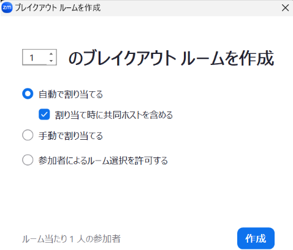
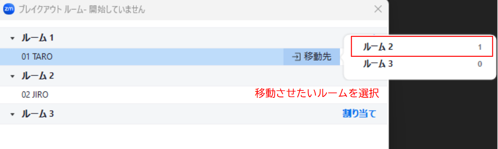
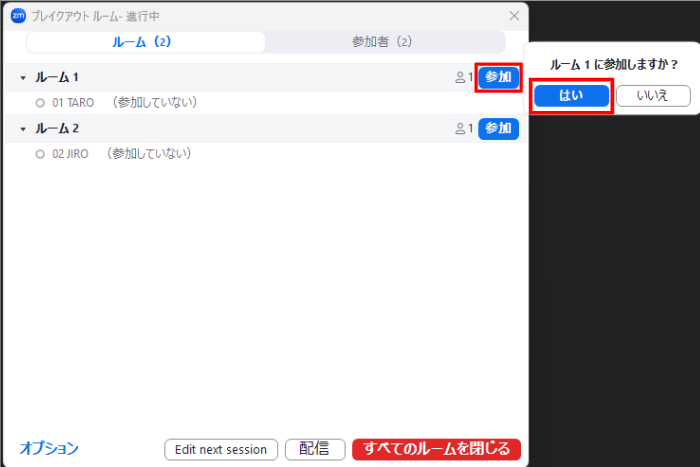
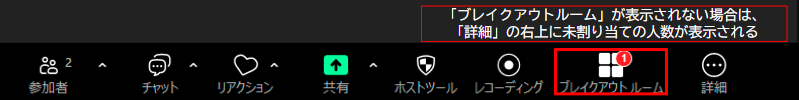

## ブレイクアウトルームとは
{:#overview}
ブレイクアウトルーム機能は，メインのZoomミーティングの参加者を複数のグループに分けて別々のルーム（＝ブレイクアウトルーム）に割り当てることで，少人数でのセッション（＝ブレイクアウトセッション）を同時に行う機能です．それぞれのブレイクアウトルームの参加者は，メインのミーティングと同様に，ビデオ，オーディオ，チャット，画面共有機能などを利用できます．ただし，それぞれのブレイクアウトルームは独立しているため，他のブレイクアウトルームの内容は共有されません．例えば，授業中におけるグループワークや演習中の質問室として活用できます．

ブレイクアウトルーム機能を利用するには，ミーティングのホストまたは共同ホストがブレイクアウトルームを作成して，ルームに参加者を割り当て，参加者がそれぞれのルームに入室します．

東京大学のZoomアカウントで作成されたミーティングでは，最大で100個のブレイクアウトルームを作成できます．

このページでは，ブレイクアウトセッションの実施方法と関連する機能についてまとめています．まず，ホスト向けにブレイクアウトルームの利用条件及びミーティング内でブレイクアウトルームを作成する方法を説明します．そして，ブレイクアウトセッション実行中にホストと参加者がそれぞれ実行できる機能についても解説します．

## ホストとしてブレイクアウトルーム機能の有効化
{:#activation}
ホストとしてブレイクアウトルームを作成し管理するためには，必ず事前に，Zoomウェブポータル上でブレイクアウトルーム機能を有効化しておく必要があります．

ブレイクアウトルーム機能を有効にする手順は以下の通りです．

1. Zoomウェブポータルにサインインしてください．詳細は[「Zoom サインイン方法」のページの「ブラウザからサインインする方法」の項](/zoom/signin/#browser)を参照してください．
2. 「設定」から「ミーティング」というタブの中にある「ミーティング内（詳細）」に移動し，「ブレイクアウト ルーム - ミーティング」のトグルを押してオンにしてください．
3. ブレイクアウトルームに関連する機能について，必要な項目をオンにしてください．
4. 「保存」を押して変更を保存してください．

{:.border}

各項目の詳細な説明は以下の場所に記載されています．

* 「スケジューリング時に参加者をブレイクアウトルームに割り当てる」：「[事前に設定した割り当てを読み込む](#start-assignment-preloading)」を参照
* 「参加者に向けてメッセージを配信する」及び「音声をブレイクアウトルームに配信する」：「[全ての参加者にメッセージまたは音声を配信する](#host-massage)」を参照
* 「ブレイクアウトルームの作成，名前変更，削除」：「[ルームに関する調整](#start-coordination-room)」を参照

## ホストによるブレイクアウトセッションの開始
{:#start}
ホストがブレイクアウトルームを作成して，参加者を割り当てることでブレイクアウトセッションが開始します．ルームオプションの設定やルーム名などの調整もブレイクアウトセッションの開始時に設定します．

この章では，ホストによるブレイクアウトルーム機能の利用方法を，「ブレイクアウトルームの作成」，「ブレイクアウトルームへの割り当て」，「オプションの設定」，「ブレイクアウトルームの調整」の4段階で説明します．

### ブレイクアウトルームの作成
{:#start-create-room}
ブレイクアウトセッションを開始するためには，まず最初に必要なブレイクアウトルームの数を入力し，各ルームに参加者を割り当てる方法を選んでください．ブレイクアウトルームの数は後で変更もできます．

ブレイクアウトルームを実際に作成する手順は以下の通りです．

1. 画面下部の「ブレイクアウトルーム」（図中赤枠）を選択してください．
   
2. 次に，作成するブレイクアウトルームの数と，参加者をどのように割り当てるかを選択してください．
   * 参加者の割り当て方法については下の「[ブレイクアウトルームへの割り当て](#start-assignment)」で詳細を説明します．

   {:.border .small}

3. 右下にある「作成」を押して，ブレイクアウトルームを作成してください．

### ブレイクアウトルームへの割り当て
{:#start-assignment}
ブレイクアウトルームの作成時には，参加者をそれぞれのブレイクアウトルームにどのように割り当てるかを選択してください．割り当てる方法は「自動で割り当てる」「手動で割り当てる」「参加者によるルーム選択を許可する」の3つが基本です．これらに加えて，ミーティング開始前にZoomウェブポータル上で事前に設定した割り当てを読み込むことも可能です．

いずれの方法で割り当てを行っても，割り当てた後に，特定の参加者を別のルームに移動させることや，別の人と交換することが可能です．

なお，ホストが割り当てを行うときは，割り当てる対象は参加者と共同ホストのみであり，ホスト自身を割り当てることはできません．また，共同ホストが割り当てを行うときは，割り当てを行っている共同ホスト自身とホストを割り当てることができません．

#### 自動で割り当てる
{:#start-assignment-automatically}
この割り当て方法を選んだ場合，参加者はホストが指定した数のブレイクアウトルームに自動的に割り当てられます．割り当てられる方法はランダムであり，それぞれのルームで人数が均等になるように分けられます．また，「割り当て時に共同ホストを含める」にチェックを入れると，共同ホストも他の参加者と同様に自動で割り当てられます．主に，一度きりのメンバーでのグループワークのときの利用が考えられます．

<figure class="gallery">{:.border .small}{:.border .small}</figure>

#### 手動で割り当てる / 参加者によるルーム選択を許可する
{:#start-assignment-manually}
これらの割り当て方法を選んだ場合，ホストが指定した数の空のブレイクアウトルームが作成されます．主に，決まったメンバーでのグループワークのときの利用が考えられます．

「手動で割り当てる」を選んだ場合，ホストや共同ホストが参加者を手動で割り当てるのに対し，「参加者によるルーム選択を許可する」を選んだ場合，参加者が自ら参加するルームを選択することになります．ただし，後述するように，「手動で割り当てる」を選んだ場合でもオプション設定で「参加者によるルーム選択を許可する」ことで，割り当て後に参加者が自らルームを選択できるようにもなります．また，「参加者によるルーム選択を許可する」を選んだ場合でも，ホストや共同ホストは参加者を手動で割り当てることができます．

{:.border .small}

参加者を手動でルームに割り当てる手順は以下の通りです．なお，一部の特定の参加者をメインミーティングに残したい場合は，その人をどこのルームにも割り当てず「未割り当て」の状態でブレイクアウトセッションを開始してください．

1. 対象のルームにカーソルを合わせて，「割り当て」を選んでください．
2. まだ割り当てられていない参加者の一覧が横に出るので，そのルームに割り当てたい参加者にチェックをつけて選択してください．
3. 1,2の操作を全てのルームについて行ってください．
4. 割り当てたい参加者が全員ブレイクアウトルームに割り当てられていることを確認してください．
5. 「すべてのルームを開く」を押すと，ブレイクアウトセッションが開始されます．

{:.border .small}

なお，ブレイクアウトセッションの開始後，ホストや共同ホストの画面には「未割り当て」という項目が表示されることがあります．ここに名前がある参加者はどのルームにも振り分けられずメインミーティングに残っていることになります．割り当てを行いたい場合は，名前の横にカーソルを合わせると出てくる「割り当て先」を押し，未割り当ての参加者を参加させるルームを選択してください．

##### 手動で割り当てを行うときの工夫①

手動で割り当てるときの参加者一覧は名前でソートされて表示されます．そのため，参加者の名前をグループに応じた名前に設定する（番号やグループ名を名前の頭に挿入する）ことで，参加者の検索を簡単に行えます．名前の変更は，参加者が自身で行うことも，ホストが行うことも可能です．詳細は，[「Zoom ミーティング中の操作方法」のページ](/zoom/usage/)を参照してください．

{:.border .small}

##### 手動で割り当てを行うときの工夫②

必要な数ちょうどのルームを作ると，全参加者を割り当てたかどうかを確認するためには，ルームの横に出る参加者数の合計を計算しなければなりません．作る必要があるルーム数に加えて1つ余分にルームを作ることで，より簡単に参加者の割り当て漏れを防ぐことができます．割り当てが完了した後に余分なルームに対して割り当てを試みると，「すべての参加者がブレイクアウトルームに割り当てられました．」とメッセージが表示されるので，確認が容易です．

{:.border}

#### 事前に設定した割り当てを読み込む
{:#start-assignment-preloading}
ブレイクアウトルームへの参加者の割り当ては，それぞれのミーティングにおいて毎回実施する必要があります．しかし，あらかじめ参加者が判明している場合は，Zoomウェブポータル上において，手動で割り当てを行う，または割り当てを記入したCSVファイルを取り込むことで，事前に参加者をルームに割り当てたミーティングを作成することが可能です．この機能を利用することで，例えば，授業前に，既に決まっている学生の班分けに基づいたブレイクアウトルームを準備できます．

この割り当て方法を利用するには，Zoomウェブポータル上でブレイクアウトルーム機能とともに，「スケジューリング時に参加者をブレイクアウトルームに割り当てる」が有効化されている必要があります．有効化の手順は以下の通りです．

1. Zoomウェブポータルにサインインしてください．詳細は[「Zoom サインイン方法」のページの「ブラウザからサインインする方法」の項](/zoom/signin/#browser)を参照してください．
2. 「設定」から「ミーティング内（詳細）」に移動してください．
3. 「ブレイクアウトルーム」の下にある「スケジューリング時に参加者をブレイクアウトルームに割り当てる」をオンにしてください．

Zoomウェブポータル上で割り当てが読み込まれたミーティングを作成する手順は以下の通りです．

1. Zoomウェブポータルにサインインしてください．詳細は[「Zoom サインイン方法」のページの「ブラウザからサインインする方法」の項](/zoom/signin/#browser)を参照してください．
2. 「ミーティング」内の「予定されているミーティング」を開いてください．
3. 割り当てが読み込まれたミーティングを新しく作成する場合は「ミーティングをスケジュール」を，すでに予定されているミーティングに割り当てを読み込む場合は「編集」を押してください．

{:.border}

4. 「オプション」で「表示」を押すと，オプション一覧が表示されます．その中から「ブレイクアウトルーム事前割り当て」をオンにすると，「ルームを作成」と「CSVからのインポート」が選択可能になります．手動で割り当てを行う場合は「ルーム作成」，割り当てを記入したCSVを利用する場合は「CSVからのインポート」を選択してください．
  {:.border .small}

CSVファイルには，参加者が当日使用するZoomアカウントのメールアドレスとその人が割り当てられるブレイクアウトルームの名前が記入されている必要があります．東京大学のZoomアカウントを利用する場合は，メールアドレスとしてUTokyo Account（数字10桁の共通ID＋`@utac.u-tokyo.ac.jp`）を使います．詳細は，「[CSVファイルを用いてZoomのブレイクアウトルーム参加者を事前に割り当てる](https://www.sodan.ecc.u-tokyo.ac.jp/hack/zoom-pre-assign-breakout-rooms-with-csv/)」をご覧ください．

定期的なミーティングでは，「ルームを作成」と「CSVからのインポート」に加えて，以前のミーティングで保存した割り当てを利用して参加者をブレイクアウトルームに事前に割り当てることも可能です．この方法については，後述する「[参加者の割り当てを保存する](#host-save-allocation)」で説明します．

### オプションの設定
{:#start-option-settings}
ブレイクアウトルームを作成して参加者を割り当てた後，これから開かれるブレイクアウトセッション全体についてオプションを設定します．参加者のルーム間の移動の許可やルームを開く時間などについて設定できます．

参加者を割り当てるウィンドウの左下に位置する「オプション」（Windows）または歯車のアイコン（macOS）を押して，ブレイクアウトルームのオプション一覧を表示します．

{:.border .small}
{:.border .small}

表示されたオプションのうち，必要な機能を設定して有効化します．

{:.border .small}

それぞれのオプション機能を，ミーティングのどのタイミングで影響するかとその目的で分けて説明します．なお，ルームを開いた後は「参加者によるルーム選択を許可する」以外のオプション項目は設定できないので，ご注意ください．

#### ブレイクアウトセッション開始時の設定
{:#start-option-opning}
##### 参加者をブレイクアウトルームに自動的に移動させる
{:#start-option-opning-aut-move}
この節では，「割り当て済みの全参加者を自動的にブレイクアウトルームに移動する」について説明します．この機能を利用すると，ブレイクアウトルームを開いたときに参加者がルームに移動するタイミングを制御できます．

「割り当て済みの全参加者を自動的にブレイクアウトルームに移動する」がオフになっている場合は，ホストがブレイクアウトルームを開いた後，参加者は「参加する」を押してからブレイクアウトルームに入室するため，参加者の移動タイミングに少しばらつきが生じます．

「割り当て済みの全参加者を自動的にブレイクアウトルームに移動する」がオンになっている場合，ホストが「すべてのルームを開く」を押してブレイクアウトセッションを開始した時点で，全参加者が割り当てられたルームに自動的に移動します．参加者のブレイクアウトルームへの移動漏れを防ぎたいときや，グループワークを行うときに有用です．

##### セッションの終了時間を設定する
{:#start-option-opning-time}
この節では，「ブレイクアウトルームは次の時間後に自動的に閉じます．」について説明します．この機能を利用すると，ブレイクアウトセッションを開始してから終了するまでの時間を設定できます．

セッションの終了時間が設定されていない場合，ブレイクアウトセッションを終了させるには，ホストあるいは共同ホストがブレイクアウトルームを閉じるしか方法はなく，一度開いたルームは閉じなければ開かれたままです．

ルームを決まった時間だけ開いておきたい場合は，「ブレイクアウトルームは次の時間後に自動的に閉じます．」をオンにして，ブレイクアウトルームを開いておく時間を入力します．設定した時間が経つと，自動的にブレイクアウトセッションが終了します．

一方で，セッションの終了時間は設定するものの，延長する可能性がある場合は，「時間切れ時に自分に通知」をオンにしてください．ブレイクアウトセッションの終了時間が来ると，ホストと共同ホストは通知を受け取ります．その際，「ブレイクアウトルームを開いたままにする」かもしくは「今すぐ閉じる」を選ぶことができます．そのため，ブレイクアウトルームがいつの間にか閉じてしまうのを防ぎ，延長することもできるようになります．

#### ブレイクアウトセッション中の設定
{:#start-option-ongoing}
##### 別のルームもしくはメインミーティングへの移動を参加者に許可する
{:#start-option-ongoing-move}
通常，ブレイクアウトセッション開始時に参加者はホストによって割り当てられたルームに移動し，終了までそのルームから他のルームへ移動することができません．同様に，ブレイクアウトセッションの進行中には，メインミーティングに戻れません．

「参加者によるルーム選択を許可する」をオンにすると，参加者が自身でブレイクアウトルームを選び，そのルームに参加することが可能になります．なお，これはブレイクアウトルーム作成時に，参加者の割り当て方法で「参加者によるルーム選択を許可する」を選んでいると自動でオンになります．例えば，演習中に質問用のブレイクアウトルームを作るときに，これを設定すると，学生がそのルームに自由に移動することができるようになります．ただし，このオプションを選択しただけでは，参加者がメインミーティングに自由に戻ることはできません．

また，「いつでもメイン セッションに戻ることを参加者に許可する」をオンにすると，参加者は任意のタイミングでブレイクアウトルームから退出してメインミーティングに戻ることができるようになります．例えば，グループワークが終わった時点で参加者が自由にメインミーティングに戻ることが可能になります．ただし，このオプションを選択しただけでは，参加者が自由にルームを移動することはできません．

##### 特定の参加者を強制的にメインミーティングに呼び戻す
{:#start-option-ongoing-call-back}
ホストは，ブレイクアウトルームにいる任意の参加者に，メインミーティングに戻るように求めることができます．このとき，その呼びかけに対して参加者が「後で」か「参加」を選ぶため，時間差が生じます．

「ブレイクアウトルーム内の選択された参加者全員をメインミーティングに自動的に移動させる」を選択しておけば，参加者をメインミーティングに強制的に呼び戻すことが可能になります．例えば，グループワーク中に参加者に提出物のフィードバックをするなど，ホストのいるメインミーティングに参加者を一人ずつ呼び出して会話をしたい際に使えます．

#### ブレイクアウトセッション終了時の設定
{:#start-option-closing}
##### 強制的にメインミーティングに戻されるまで猶予を設ける
{:#start-option-closing-auto}
何も設定されていない場合，ホストの操作によってブレイクアウトルームが閉じられるか，予定された終了時間がきた時点で，参加者は直ちにメインミーティングに戻されます．

「ブレイクアウトルームを閉じた後のカウントダウン」をオンにして，時間を入力することで，終了時間が来てからブレイクアウトルームが閉じるまでに猶予を設けることができます．例えば，グループワークで意見を集約させる時間として利用できます．

### ブレイクアウトルームの調整
{:#start-coordination}
ブレイクアウトルームについて参加者の割り当てやオプションなどの設定を行った後，ブレイクアウトルームを開く前に最終調整を行うことが可能です．ブレイクアウトルームの名称や数の変更，参加者の再配置ができます．

#### ルームに関する調整
{:#start-coordination-room}
割り当て済みのブレイクアウトルームについて，ルーム名の変更や，ルームの削除，新たな空のルームの追加，そして全てのルームの再作成（やり直し）が可能です．

この機能を利用するには，Zoomウェブポータル上でブレイクアウトルーム機能とともに，「ブレイクアウトルームの作成，名前変更，削除（削除はルームに予約がない場合）」が有効化されている必要があります．有効化する手順は以下の通りです．

1. Zoomウェブポータルにサインインしてください．詳細は[「Zoom サインイン方法」のページの「ブラウザからサインインする方法」の項](/zoom/signin/#browser)を参照してください．
2. 「設定」から「ミーティング内（詳細）」に移動してください．
3. 「ブレイクアウトルーム」の下にある「ブレイクアウトルームの作成，名前変更，削除（削除はルームに予約がない場合）」をオンにしてください．

ルームに関する調整の方法は次の通りです．

* ルーム名を変更・ルームを削除したい場合：対象のルームの上にカーソルを置くと表示される，「名前を変更する」か「削除」のどちらかを押し，変更または削除してください．
* 空のルームを追加する場合：ウィンドウ下部の「ルームを追加」を押してください．作成されたルームには，手動で参加者を割り当てる必要があります．
* ルームを全て再作成する場合：「再作成」を押すと「[ブレイクアウトルームの作成](#start-create-room)」の章と同じ画面が表示されます．そのあとは，改めて「ブレイクアウトルームの作成」以降の手順（「ブレイクアウトルームの作成」，「ブレイクアウトルームへの割り当て」，「オプションの設定」）を踏んでください．
  {:.border .small}

#### 参加者に関する調整
{:#start-coordination-participants}
参加者を別のルームに移動させる，あるいは他の参加者と交換することができます．対象となる参加者の上にカーソルを置くと「移動先」と「交換」が表示されるので，どちらかを押し，その移動先や交換相手を選択すると，移動もしくは交換が実行されます．

{:.border .small}
{:.border .small}

### ブレイクアウトセッションの実行
{:#start-running}
ルームと参加者についての最終調整が終わり，ブレイクアウトルームについて全てを設定したら，ブレイクアウトルームを開いて実行します．右下の「すべてのルームを開く」を押すと，参加者がそれぞれのブレイクアウトルームに入室し，会議ができるようになります．

{:.border .small}

## ブレイクアウトセッション実施中のホスト側の操作
{:#host}
続いて，ブレイクアウトセッションの実施中に，ホストができる操作について説明します．ブレイクアウトセッション開始後，ホストは，各ブレイクアウトルームへの移動・参加者へのメッセージの共有など，会議を円滑に進めるための操作が可能です．

なお共同ホストは，以下で説明するブレイクアウトルーム実施中の操作について，ホストとほとんど同じ機能が使用可能です．ただし，後述する参加者からのヘルプに応答できるのはホストのみであり，共同ホストはヘルプを受け取れません．

### 各ブレイクアウトルームに参加/退出する
{:#host-participate}
ホスト（共同ホストを含む）は好きなブレイクアウトルームに自由に参加できます．ブレイクアウトルームは独立しており，内容がメインミーティングに共有されないため，各グループの様子を正確に把握したいときは，ブレイクアウトルームに直接参加すると良いでしょう．

ホストがブレイクアウトルームに直接参加する手順は以下の通りです．ブレイクアウトルームから他のブレイクアウトルームに移りたいときも，同様の手順で行います．

1. ミーティング画面下部にある「ブレイクアウトルーム」（表示されていない場合は「詳細」を押すと出てきます）を押してください．
2. 出てきたウィンドウ内で，参加したいルームの横にある「参加」→「はい」を押してください．
   {:.border}

メインミーティングに戻りたいときは，ミーティング画面右下の「ルームを退出する」より「ブレイクアウトルームを退出」を押してください．

#### 参加者からのヘルプに応答する
{:#host-participate-help}
ブレイクアウトルームで何らかの問題が生じた場合，ブレイクアウトルームの参加者はホストに対してルームに参加するようにヘルプを求めることができます．ホストはそのリクエストに応答して，そのブレイクアウトルームに参加することができます．

ホストがヘルプを受け取ると，以下のような画面が表示され，どのブレイクアウトルームから誰がヘルプを求めたかが表示されます．リクエストに応える場合は，「ブレイクアウトルームに参加」を押して，そのルームに入ってください．

{:.border}

### 全ての参加者にメッセージまたは音声を配信する
{:#host-massage}
それぞれのブレイクアウトルームでのミーティングは独立しています．そのため，ブレイクアウトルームにいる参加者に向けてチャット機能でメッセージを届けることも，音声を届けることもできません．代わりに，配信という機能によって，ホストから全ての参加者に向けて文字か音声の形式で指示を送ることができます．例えば，終了時間を改めてリマインドするときに使うことができます．なお，配信される音声は，マイクで拾われる音であり，パソコンから再生される音を配信したいときは，後述する画面共有を用いてください．

この機能を利用するには，Zoomウェブポータル上の設定でブレイクアウトルーム機能とともに，「参加者に向けてメッセージを配信する」と「音声をブレイクアウトルームに配信する」の項目が有効化されている必要があります．これらを有効化する手順は以下の通りです．

1. Zoomウェブポータルにサインインしてください．詳細は[「Zoom サインイン方法」のページの「ブラウザからサインインする方法」の項](/zoom/signin/#browser)を参照してください．
2. 「設定」から「ミーティング内（詳細）」に移動してください．
3. 「ブレイクアウトルーム」の下にある「参加者に向けてメッセージを配信する」や「音声をブレイクアウトルームに配信する」をオンにしてください．

メッセージまたは音声を配信する手順は以下の通りです．

1. 「ブレイクアウトルーム」を押してください．
2. 出てきたウィンドウの「配信」を押した後，「メッセージを配信」か「音声を配信」を選んでください．
3. どちらかの場合に沿って操作してください．
   * 「メッセージを配信」する場合：送りたいメッセージを入力した後に，「配信」を押してください．送信されたメッセージは各ブレイクアウトルームで10秒間表示された後に消えます．
    {:.border .small}
   * 「音声を配信」する場合：ミュートが解除されていることを確認した後，音声配信アイコン（図中左赤枠のアイコン）を押してください．「現在、すべてのルームに配信しています」と表示されたら，正しく配信することができています．音声の配信を停止するときは，停止アイコン（図中青枠）を押してください．
    {:.border .small}

### ブレイクアウトルームに画面共有する
{:#host-screenshare}
通常のミーティングと同様，全てのブレイクアウトルームに対して，ホストの画面と端末の音声を共有できます．ブレイクアウトルームへの画面共有では，ホストが喋っているマイク音声は共有されません．画面共有の詳しい方法及び設定については，[「画面共有」のページ](/zoom/usage/screen_sharing/)を参照してください．

ブレイクアウトルームに画面共有を行う手順は以下の通りです．

1. 通常の画面共有を行う手順と同様に，ミーティング画面下部の「画面共有」を押し，共有したい画面を選択してください．
2. ウィンドウの「オプション」欄にある「ブレイクアウトルームに共有」をオンにしてください．端末の音声も共有する場合は，「サウンドを共有」もオンにしてください．
    {:.border .small}
3. 最後に「共有」を押してください．画面共有が開始されます．

### 追加の参加者を割り当てる
{:#host-additional-allocation}
ブレイクアウトセッション開始後にミーティングに参加した人がいる場合，その人は「未割り当て」の状態でメインミーティングにとどまります．その人をいずれかのブレイクアウトルームに追加で割り当てるときは，個別に手動で割り当てる必要があります．

遅れてメインミーティグに入室した参加者がいる場合は，ミーティング画面下部の「ブレイクアウトルーム」（ブレイクアウトルームのボタンが表示されていない場合は，「詳細」）の右上に赤文字でその人数が表示されます．ブレイクアウトルーム実施中は，遅れてきた参加者が未割り当てのままになっていないか，注意してください．

{:.middle}

未割り当ての参加者がいる状態で，ミーティング画面下部の「ブレイクアウトルーム」を選択すると，以下のような画面が表示されます．「未割り当て」の状態にある参加者にカーソルを合わせて，「割り当て先」を押してください．すると，現在開いているブレイクアウトルームの一覧が表示されます．参加させたいブレイクアウトルームを選択すると，割り当てが完了します．
{:.border}

### 参加者の割り当てを保存する
{:#host-save-allocation}
通常のミーティングでは，開催するたびにブレイクアウトルームに参加者を割り当てる必要があります．しかし，繰り返し使われる「定期的なミーティング」では，次も同じ割り当てを使うときのために，現在のブレイクアウトルームへの参加者の割り当てを保存することが可能です．割り当ては1ユーザーにつき最大10種類まで保存できます．参加者の割り当てを保存する手順は以下の通りです．

1. ミーティング画面下部にある「ブレイクアウトルーム」を選択してください．
2. 表示されるウィンドウ下部の「...」から「ブレイクアウトルームを保存」を押してください．
   {:.border}
   * 「...」が表示されない場合は，そのミーティングが定期的なミーティングか，定期的なミーティングでも「固定時刻なし」の繰り返しになっていないかを確認してください．
3. 現在の割り当てに任意の名前をつけて「保存」を押してください．
   {:.border}
   * 名前が重複している場合は保存することができません．

以前に保存したブレイクアウトルームの割り当ては，ミーティングを新しく作成する際に再利用できます．このためには，「スケジューリング時に参加者をブレイクアウトルームに割り当てる」がZoomウェブポータル上で有効化されている必要があります．有効化の方法は，「[事前に設定した割り当てを読み込む](#start-assignment-preloading)」を参照してください．

前もって保存した割り当てを用いて，事前に割り当てを行う手順は以下の通りです．

1. Zoomウェブポータルにサインインしてください．詳細は[「Zoom サインイン方法」のページの「ブラウザからサインインする方法」の項](/zoom/signin/#browser)を参照してください．
2. 「ミーティング」内の「予定されているミーティング」を開いてください．新たにミーティングを予定する場合は「ミーティングをスケジュール」を，すでに作成してある場合はそのミーティングにカーソルを置いて「編集」「シリーズ全体を編集」を押してください．
3. 「タイムゾーン」の項目で「定期的なミーティング」がオンになっていることを確認してください．
4. 「オプション」を表示を押すと，オプション一覧が表示されます．その中から「ブレイクアウトルーム事前割り当て」をオンにしてください．「ルームを作成」と「CSVからのインポート」に加えて，保存した割り当てが選択可能になります．

{:.border}

5. 保存されている割り当ての中から，利用したいものを選択してください．割り当てを保存したときに，「上記のブレイクアウトルーム情報を、今後も定期的なミーティング開催時に適用します」をオンにしていると，自動的にその割り当てが選択された状態になります．
6. 「保存」を押して，変更を保存してください．

保存された割り当ては，手順5で選択した後に編集もしくは削除することができます．
{:.border}

### ブレイクアウトセッションを手動で停止する
{:#host-stop}
ホストはブレイクアウトセッションを任意のタイミングで停止することが可能です．オプションで設定したブレイクアウトセッションの終了時間より前であっても停止できます．ブレイクアウトルームを停止する手順は以下の通りです．

1. ミーティング画面下部にある「ブレイクアウトルーム」を選択してください．
2. 表示された画面右下の「すべてのルームを閉じる」を押してください．
3. 本当にルームを閉じて良いかを確認する画面が表示されるので，もう一度「すべてのルームを閉じる」を押してください．

ブレイクアウトルームを閉じると，「ブレイクアウトルームを閉じた後のカウントダウン」で設定した時間が経過した後に，全ての参加者がメインミーティングに戻されます．

## ブレイクアウトセッション実施中の参加者側の操作
{:#participants}
### ブレイクアウトルームへの参加
{:#participants-join}
参加者はブレイクアウトセッションがホストによって開始されると，ホストの割り当てた（もしくは任意の）ブレイクアウトルームに参加します．

ホストが割り当てたブレイクアウトルームに参加する場合，強制的にそのブレイクアウトルームに移動させられるか，もしくはブレイクアウトルームへの参加確認のウィンドウが表示され，その中の「参加する」を押す，のいずれかの手順でブレイクアウトルームに入室することになります．

加えて，ホストが「参加者によるルーム選択を許可」している場合は，次の手順でブレイクアウトルームに移動することができます．

1. ミーティング画面下部より，「ブレイクアウトルーム」を選択してください．
2. 現在開かれているブレイクアウトルームの一覧が表示されるので，参加したいルームの横にある「参加」を選択し，「はい」を押してください．
   {:.border .small}

### ブレイクアウトルーム内のレコーディング
{:#participants-recording}
ブレイクアウトセッションの実施中は，ホストによるクラウドレコーディング（Zoomのクラウドに録画を保存する方法）ではメインミーティングしか録画されません．一方で，ローカルレコーディング（各自のPC等に録画を保存する方法）であれば，録画している参加者のいるブレイクアウトルームがレコーディング対象になります．したがって，ブレイクアウトルーム内の会議を録画したい場合は，ローカルレコーディングを使用して録画を行うことになります．このためには，各ブレイクアウトルームの参加者の中からレコーディング担当者を決め，ホストがその人たちを共同ホストに指定する，もしくはレコーディングをする権限を与える必要があります．議論を後で見返したい場合などは，ブレイクアウトルームのレコーディングが有効です．
参加者にレコーディングの権限を与える方法や，レコーディングの手順についての詳細は，「[Zoom レコーディング機能の使い方](/zoom/usage/recording/)」を参照してください．

{:.border}

1. （録画を担当する参加者側の操作）各ブレイクアウトルームに参加後，ミーティング画面下部の「レコーディング」を選択してください．すると，自動的にローカルへのレコーディングがスタートします．

### ヘルプを求める
{:#participants-help}
ブレイクアウトルームで何らかの問題が起こった場合，参加者はホストにヘルプを求め，ブレイクアウトルームに参加するように要求できます．チャットでホスト宛にメッセージを送信することも可能ですが，見逃されてしまう可能性があります．そのため，ホストを呼びたいときは，ヘルプを送信した方が良いでしょう．

ヘルプの求め方は次の通りです．

1. ミーティング画面下部より，「ブレイクアウトルーム」を選択し，「ヘルプを求める」（表示されていない場合は「ブレイクアウトルーム」を選択すると出てきます）を押してください．
    
2. 下図のようなウィンドウが出てくるので，「ホストを招待」を押してください．すると，ホストに送信元のブレイクアウトルームに参加するように通知が届きます．
    {:.border}

## ブレイクアウトセッション実施時の注意点
{:#notes}
### 各グループの進捗状況の把握
{:#notes-track-progress}
ブレイクアウトルームの実施中は，ホストが全てのルームを一括で監視することはできないため，各ブレイクアウトルームの会議の進捗状況を把握することが難しくなります．そのため，ミーティングとは別の共有ドキュメントを使用する手法が有効です．GoogleドキュメントやGoogleスライド，もしくはホワイトボードツールを利用して，参加者が会議の議事録や成果をリアルタイムで記入することで，ホストは間接的に進捗を把握できます．具体的な実用例については，「[オンラインのグループディスカッションでワークシートを活用する](/articles/group-discussion-worksheet/)」を参照してください．もし，うまくブレイクアウトルームでの会議が機能していないようであれば，「[オンラインのグループディスカッションで生じやすい問題とその対策案](/articles/group-discussion/)」を参考に，適宜必要な工夫を実行してください．

### チャットの履歴
{:#notes-chat-history}
ブレイクアウトルームを実施中に「全員宛て」でチャットを送信した場合，そのメッセージは同じブレイクアウトルームにいる参加者のみに届くため，他のルームにいる参加者はそのメッセージを受け取りません．なお，チャットは本人が送受信したメッセージのみが履歴として残ります．そのため，ブレイクアウトルーム中に送信したチャットが，メインミーティングに戻った後で他のブレイクアウトルームにいた参加者に知られることはありません．

