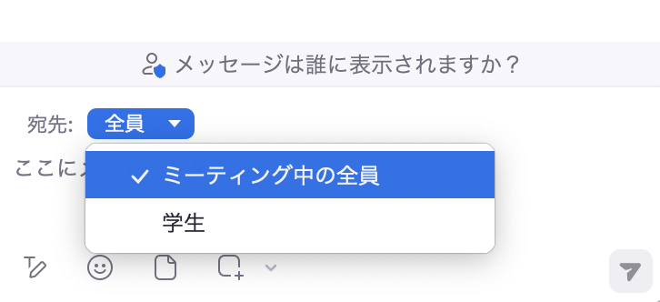

Zoomのチャット機能を用いると，ミーティング中にホストや参加者がテキストやファイルをやりとりすることが可能です．チャット機能を用いることで質疑応答を行ったり，授業資料のファイルを共有したりといったことができます．

このページでは，チャット機能の基本的な使い方と応用的な使い方に分けて，機能や使用手順を紹介します．

なお，機能によっては事前に設定が必要なものもあります．このような機能では，ミーティング進行中に設定変更を行っても，そのミーティングには変更が適用されない点に注意が必要です．進行中のミーティングに適用したい場合は，一度ミーティングを終了してから再び開始してください．

## 基本操作
{:#basic-operation}

ここでは，Zoomミーティングでチャット機能を使うための有効化の手順と，基本的な使い方を紹介します．

### チャット機能の有効化・設定
{:#activate-setting}

自身がホストであるミーティングで，自身や参加者がチャットを使うためには，チャット機能が有効化されている必要があります．またこのとき，チャットを有効化する対象を設定することもできます．なお，デフォルトの設定ではチャット機能は有効化されています．

#### チャット機能を有効化する
{:#activate}

チャット機能を有効化する手順は以下の通りです．

1. 「[Zoom サインイン方法](../../signin/)」を参考にしてブラウザでZoomのウェブポータルにアクセスし，「設定」を開いてください．
   
2. 「ミーティング」のタブを選択してください．
   
3. 「ミーティング内（基本）」内の「ミーティングチャット」の項目をオンにしてください．
   {:.border}

#### チャット機能の利用範囲
{:#scope}

下の画像のように，「[チャット機能を有効化する](#activate)」と同じ画面にあるプルダウンから，参加者がチャットを送ることができる対象を制限できます．プルダウンの設定がいずれの場合も，チャット機能が有効化されている限り，ホスト・共同ホストは参加者全員に向けてチャットを送れます．この制限はミーティング中にもチャットパネル上部のプルダウンより変更できます．
{:.small}{:.border}

* 対象者なし：参加者はチャットを送れません．
* ホストと共同ホスト：参加者はホストと共同ホストのみにチャットを送れます．
* 全員：参加者はミーティングに参加している全員に向けてチャットを送れます．
* 全員の公開チャットとダイレクトチャット：参加者は任意の参加者に個別に非公開メッセージを送れます．
  * この選択肢は下で紹介する「[宛先を選択する](#select)」を有効にすると表示されます．

#### チャットのコピーまたは手動保存を許可する
{:#copy}

ホストが「[チャット機能の有効化](#activate)」と同じ画面にある「ミーティングからチャットのコピーまたは保存をユーザーに許可する」の項目をオンにすると，ミーティングの参加者はチャットをコピーまたは手動で保存することができます．また，ホストはチャットのコピーおよび手動保存を許可する範囲を「ホストと共同ホスト」「全員」「アカウント内のユーザーのみ」から選択できます．

実際の使用手順は，「[チャットの手動保存](#manual-save)」を参照してください．

### チャット機能の使い方
{:#usage}

チャット機能では，単にメッセージを送信するだけでなく，フォーマット（書式）の変更や，他のメッセージへの返信，やりとりを保存などもできます．以下では，基本的なチャットの機能を紹介します．

#### チャットを閲覧・送信する
{:#view-send}
チャットを閲覧・送信する手順は以下の通りです．

1. ミーティング中に画面下部の「チャット」アイコンを押してください．チャットパネルが開き，この画面からチャットの閲覧・送信ができます．
   
   * 「チャット」アイコンが画面上にない場合には，右下にある［詳細］ボタンをクリックすると，「チャット」の項目が出てきます．
   {:.border .small}
   * 自分がミーティングに参加する前に送信されたチャットは閲覧することができません．

2. チャットを送信する場合は，宛先を指定してください．デフォルトではミーティングに参加している全員に送るよう設定されています．
   * 宛先を指定して個別にメッセージを送信する方法は，「[宛先を選択する](#select)」を参照してください．
3. メッセージを入力し，送信アイコン（紙飛行機のアイコン）を押して送信してください．
   {:.border .small}

#### フォーマットを変更する
{:#format}
送信するチャットのフォーマットを変更できます．
具体的には，文字を太字にしたり，下線をつけたり，箇条書きにしたりできます．

使用手順

1. ミーティング中に画面下部の「チャット」アイコンを押し，チャットの入力欄を開いてください．
   * 「チャット」アイコンが画面上にない場合には，右下にある［詳細］ボタンをクリックすると，「チャット」の項目が出てきます．
2. 下部の「フォーマット」アイコンを押してください．
   {:.border .small}
3. 変更したいフォーマットを選択してください．下の画像にフォーマットのを変更した例を示します．
   {:.border .small}

#### メッセージへ返信する
{:#reply}
自分または他の参加者が送信したメッセージに対し，返信することができます．また返信すると，元のメッセージの下部にスレッドが自動的に作成され，話題ごとにチャット欄を整理することができます．

使用手順

1. ミーティング中に画面下部の「チャット」アイコンを押し，チャットの一覧を開いてください．
   * 「チャット」アイコンが画面上にない場合には，右下にある［詳細］ボタンをクリックすると，「チャット」の項目が出てきます．
2. 返信したいメッセージにカーソルを合わせてください．
3. 返信のアイコンを押してください．
4. テキストを入力し，送信してください．
   {:.border .small}
5. スレッドが作成され，返信が元のメッセージの右下に表示されます．
   {:.border .small}

#### チャットをローカルに手動保存する 
{:#manual-save}
チャットパネルの内容はテキストファイルとして保存できます．ただし，チャットの手動保存やコピーをするには，ホストがZoomのウェブポータルで「ミーティングからチャットを保存することをユーザーに許可する」の項目を有効化している必要があります．なお，自分がホストするミーティングのチャットは，毎回手動で保存しなくても，自動的に保存することができます．自動保存の詳細は，[「チャットをローカルに自動保存する」](#auto-save)を参照してください．またクラウドに保存したい場合は，[「クラウドにチャットを保存する」](#cloud-save)を参照してください．

使用手順

1. チャット画面上部の「...」を押し，「チャットを保存」を選択してください．
   {:.border .small}
2. 格納フォルダとチャットを記録したtxtファイルが作成され，ローカル（各自のPCなど）に保存されます．保存場所はローカルレコーディングと同じです．Zoomのアプリの「設定」→「レコーディング」→「レコーディングの保存場所」から確認できます．
   

## 応用機能
{:#applied-functions}
ここでは，Zoomのチャット機能を活用するための様々な機能について，その設定方法や使用手順を説明します．

ミーティング中に設定変更を行った場合，一度そのミーティングを終了して再び開始しなければ変更が適用されませんのでご注意ください．また，使用しているZoomアプリのバージョンが古い場合，一部機能が使えないことがあります．定期的にZoomを最新版にアップデートしてください．

### ミーティング内（基本）で設定できる機能
{:#meeting-basic}
チャットに関する機能の有効化は，ほとんどがウェブポータルの「ミーティング内（基本）」という項目から設定できます．ここでは，「ミーティング内（基本）」から設定できるチャット関連の機能の基本的な設定手順と，使用手順について説明します．

#### 基本的な設定手順
{:#basic-setting}
1. 「[Zoom サインイン方法](../../signin/)」を参考にしてブラウザでZoomのウェブポータルにアクセスし，「設定」を開いてください．
   {:.border}
2. 「ミーティング」のタブを選択してください．
   {:.border}
3. 「ミーティング内（基本）」で，設定したい機能のトグルのON/OFFを切り替えてください．
   {:.border}

#### チャットを削除する
{:#delete}
ホストが「ミーティング チャットでのメッセージを削除することを参加者に許可する」を有効にしている場合，ミーティング内の参加者は自分が送ったチャットを削除することができます．またこの機能を有効にしている場合，ホストおよび共同ホストは任意の参加者が送ったチャットを削除することができます．

##### 使用手順
{:#delete-usage}
1. チャット画面で，送信したメッセージ下の「...」アイコンを押してください．
2. 「削除」を選択してください．
3. メッセージを削除するか確認する画面が表示されるので，もう一度「削除」を押してください．

{:.small .border}

#### メッセージを編集する
{:#edit}
ホストが「ミーティング チャットでのメッセージを編集することを参加者に許可する」を有効にしている場合，参加者はミーティング中に送信された自分のメッセージを編集できます．メッセージの送信後に，メッセージを追加・修正したり，フォーマットを変更することができます．

**使用手順**
{:#delete-usage}
1. チャット画面で，送信したメッセージ下の「...」アイコンを押してください．
2. 「編集」を選択してください．
3. メッセージを編集してください．
4. 編集が終了したら，チェックのボタンを押して終了してください．
     
{:.border .middle}

#### スクリーンショットを送信する
{:#screenshot}
ホストが「ミーティング チャットでスクリーンショット機能を有効にする」を有効にしている場合，参加者はミーティング中に自分の画面のウインドウ全体や選択した範囲のスクリーンショットをチャットで送信できます．

**使用手順**
{:#screenshot-usage}
1. ミーティング中に画面下部の「チャット」アイコンを押し，チャットの一覧を開いてください．
   * 「チャット」アイコンが画面上にない場合には，右下にある［詳細］ボタンをクリックすると，「チャット」の項目が出てきます．
2. チャット画面で下部の「スクリーンショット」アイコンを押してください．
   {:.border .small}
3. スクリーンショットを取得するウインドウを選択するか，ドラッグして撮影する範囲を選択してください．
   {:.middle}
5. 適宜絵文字や文章を追加し，「キャプチャー」を押してください．
6. チャット画面に戻り，送信ボタンをクリックしてください．
   {:.border .middle}

#### チャットで絵文字を使用する
{:#emoji}
ホストが「ミーティング チャットでの絵文字の使用を参加者に許可する」を有効にしている場合，ミーティングの参加者はチャットに直接絵文字を送ることができます．ホストは，参加者が送ることができる絵文字を「全ての絵文字」または「選択された絵文字」の中から選択することができます．

この機能を用いることにより，文章を入力するよりも簡単に意思表示をすることなどができます．

**使用手順**
{:#emoji-usage}
1. チャット画面下部の絵文字アイコンを押してください．
   {:.border}
3. 送信する絵文字を選択してください．
   * この時，絵文字一覧の右下にある「スキントーン」欄で，送信する絵文字のスキントーンを変更することができます．
4. 送信アイコンを押してください．以下の画像のように絵文字が送信されます．
   {:.border}

#### 宛先を選択する 
{:#select}
ホストは「ミーティング チャット \- ダイレクト メッセージ」を有効にすることで，「チャット機能の有効化手順」で説明した，チャットを送信する対象を制限するプルダウンにおける，参加者間のダイレクトメッセージを許可する項目を選べるようになります．

デフォルトの設定(「ミーティング チャット \- ダイレクト メッセージ」が無効)でも，ホスト・共同ホスト⇔参加者の間ではダイレクトメッセージを送れます．ダイレクトメッセージを許可することで，相手がホストや共同ホストであるかに関わらず，参加者同士でダイレクトメッセージを送れるようになります．

**使用手順**
{:#select-usage}
チャット入力画面の上部の「宛先」から，ダイレクトメッセージの送信先を選択してください．「ミーティング中の全員」を選択すると全体向けのチャットとなります．
{:.border}

なお，参加者の誰かからダイレクトメッセージが来た場合，次に自分が送信するチャットの送信先が自動でその参加者に変わってしまうので，注意してください．

#### チャットをローカルに自動保存する
{:#auto-save}
「ミーティング チャット \- 自動保存」を有効にすると，自分がホスト（または共同ホスト）として参加したミーティングのチャットが，ミーティング終了後，自動的にローカルに保存されます．保存されるのは自身がやり取りしたチャットのみであり，他の参加者間のダイレクトメッセージなどは保存されません．また，ミーティングの作成者が必ずしもホストであるとは限らないため，この点に注意が必要です．
なお，クラウドに保存したい場合は，「[クラウドにチャットを自動保存する](#cloud-save)」を参照してください．

#### ファイルを送る
{:#file}
「ミーティングチャットでファイルを送る」を有効にすると，チャットで授業資料などのファイルを直接送ることができます．送信を許可するファイル形式の設定や，最大ファイルサイズの設定もZoomのウェブポータルからできます．

**使用手順**
{:#file-usage}
1. チャット画面下部のファイルアイコンを押してください．
2. コンピュータ内から送信するファイルを選択し送信アイコンを押してください．

{:.border .small}

### ミーティング内（基本）以外で設定できる機能
{:#not-meeting-basic}

Zoomのウェブポータルの他の設定画面にもチャットに関する項目があります．

#### クラウドにチャットを自動保存する
{:#cloud-save}
Zoomミーティングの[クラウドレコーディング](../recording/)機能を用いて，チャットの内容を，ローカル（各自のPCなど）だけでなく，Zoomクラウドに保存することも可能です．保存したチャットは，ルームの作成者のアカウントからのみアクセスすることが可能です．ルームの作成者とホストが異なる場合など，ホストであったミーティングでもアクセスできない場合がありますので，お気をつけください．

**設定手順**
{:#cloud-setting}
1. 「[Zoom サインイン方法](../../signin/)」を参考にしてブラウザでZoomのウェブポータルにアクセスし，「設定」を開いてください．
2. 画面上のバーから「レコーディング」のタブを選択してください．
   
3. 「一般」セクションの「クラウドレコーディング」のトグルをオンにし，「ミーティング / ウェビナーからのチャット メッセージを保存する」にチェックを入れください．その上でクラウドレコーディングをすると，チャットの内容も自動でクラウドに保存されます．
   

##### クラウドに保存されたチャットの確認方法
{:#cloud-view}
下記の手順でクラウド保存されたチャットファイルをダウンロードすることができます．

1. 「[Zoom サインイン方法](../../signin/)」を参考にしてブラウザでZoomのウェブポータルにアクセスし，「レコーディングと文字起こし」を開いてください．
2. 「クラウドレコーディング」の画面を開き，該当のレコーディングを選択し，「チャットファイル」をダウンロードしてください．
   * クラウドレコーディングについての詳細は，「[Zoomレコーディング](../recording/)」の記事を参照してください．
   * クラウドレコーディングで保存されたチャットファイルは，リンクで共有することもできます．

{:.border}
