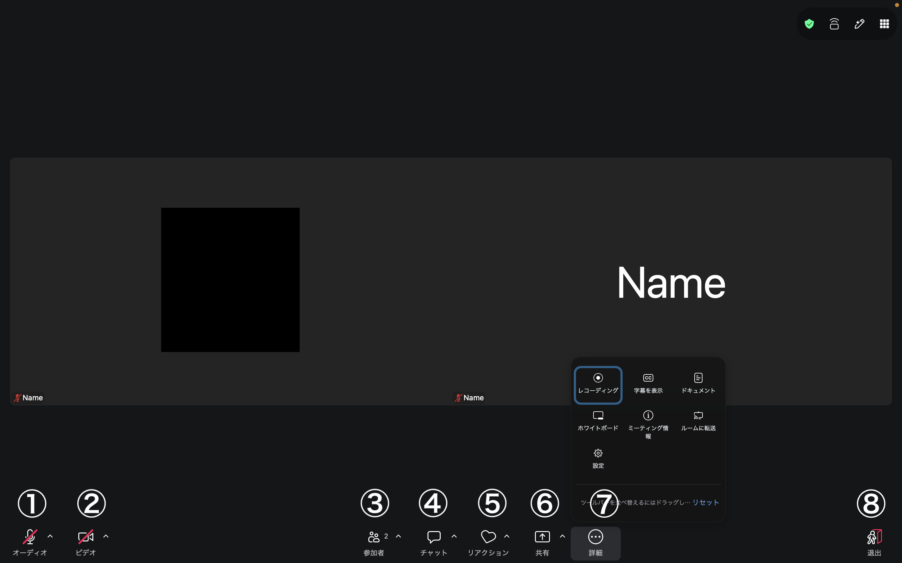
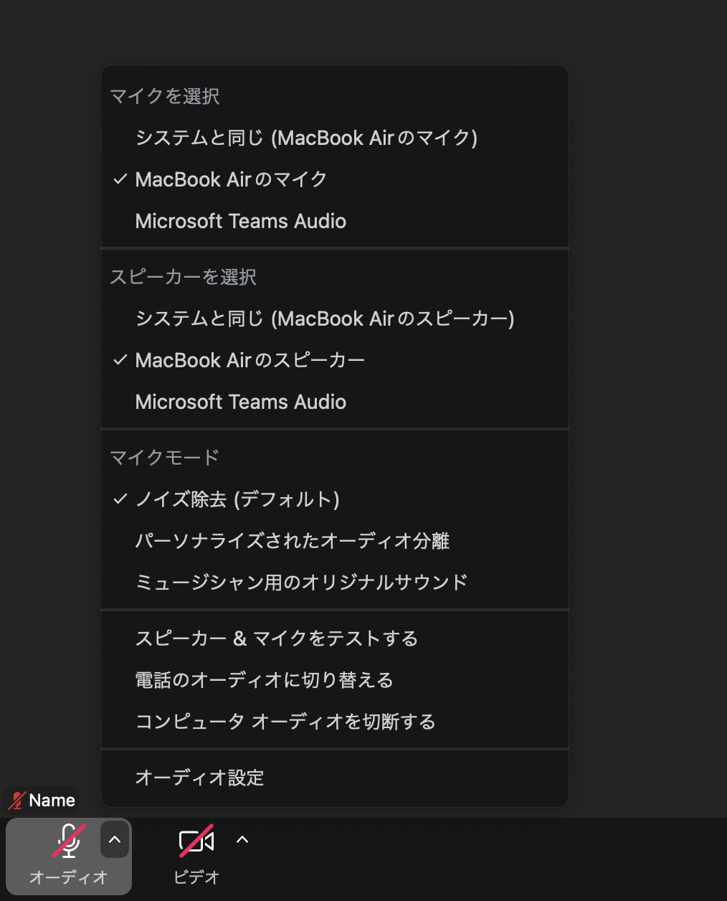
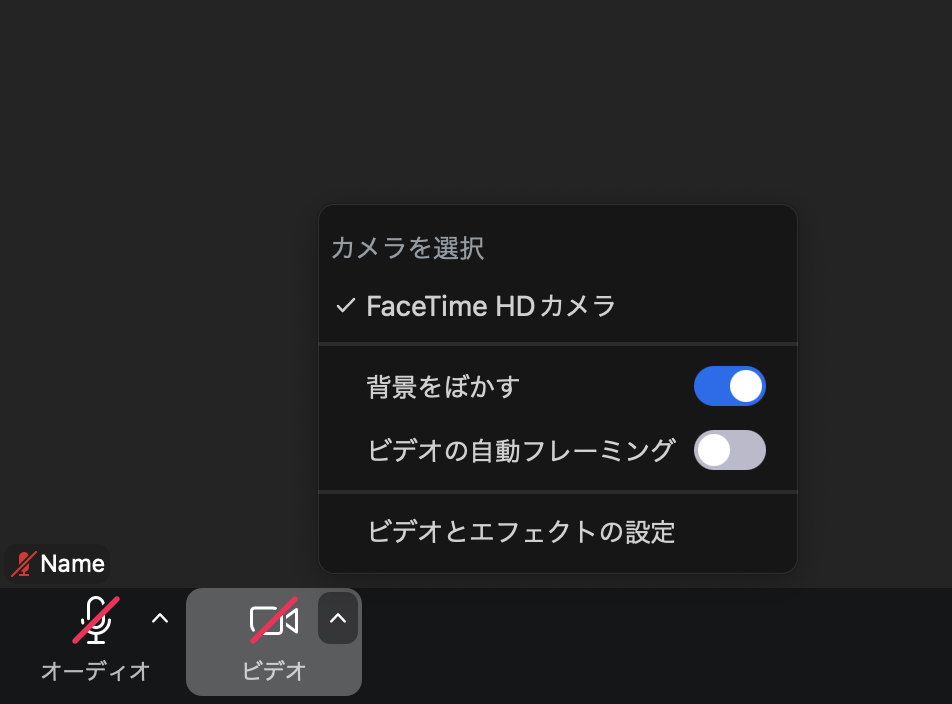
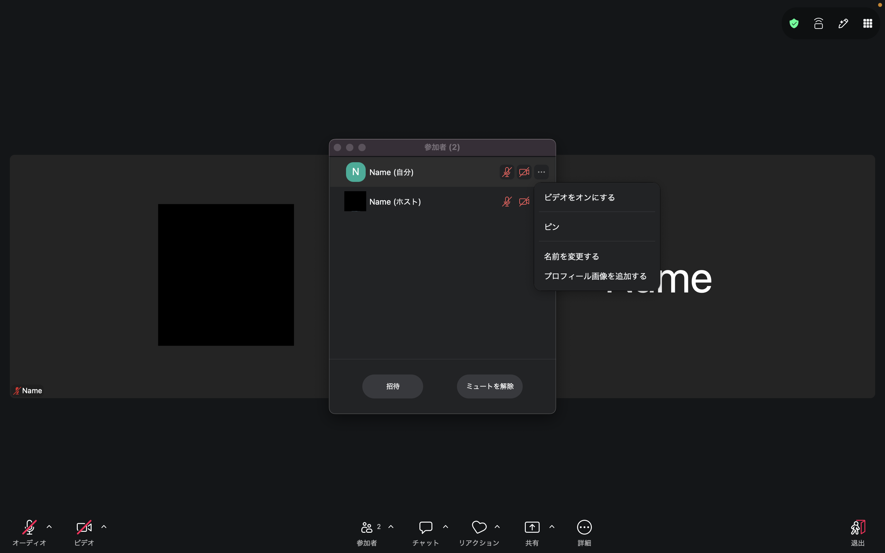
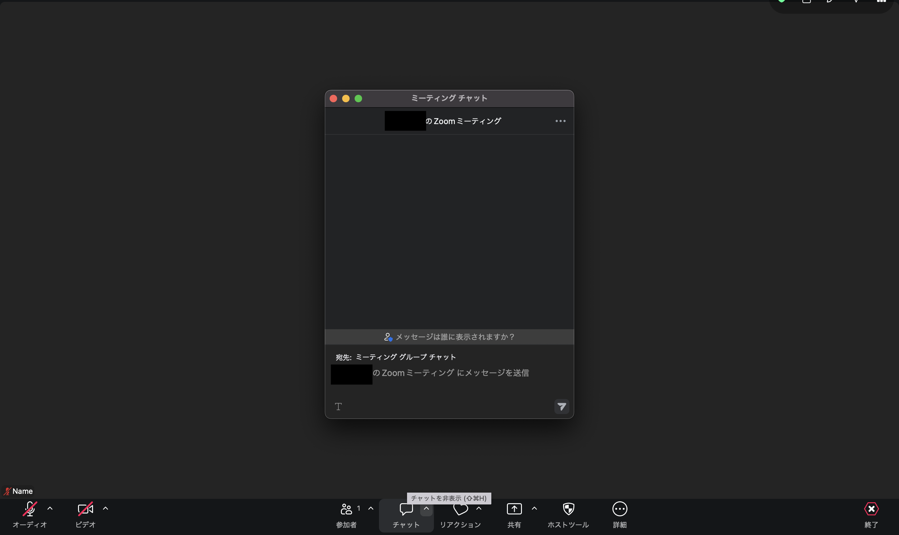
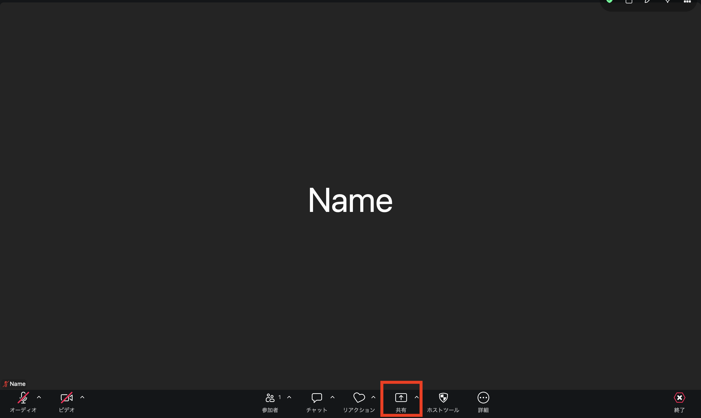
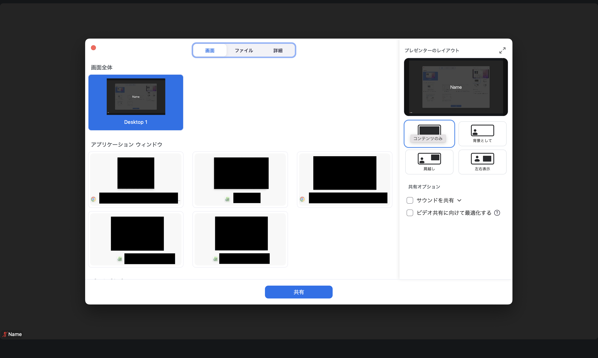
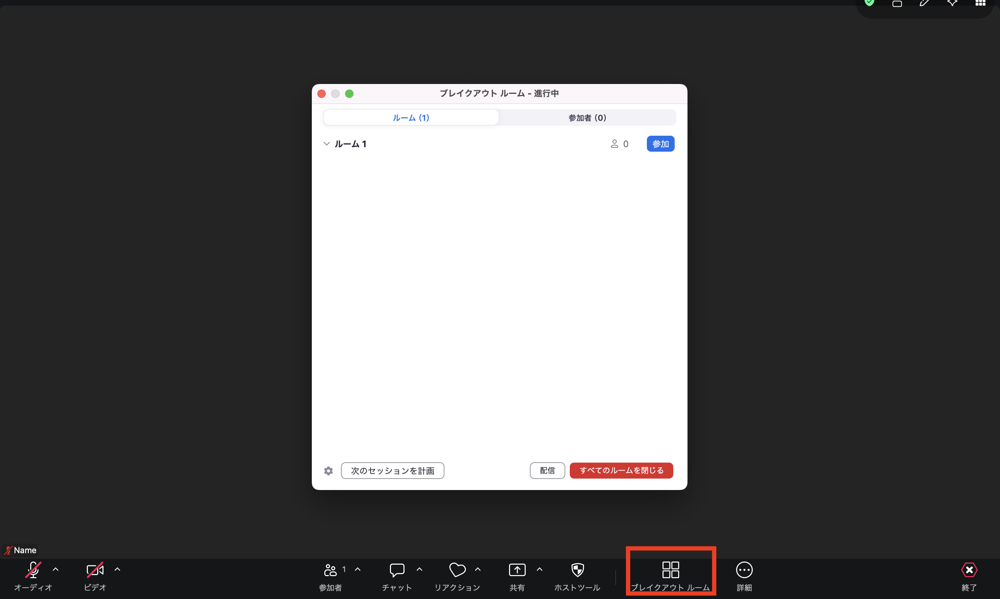

ここでは，Zoomでミーティングに参加している時の具体的な使い方を説明します．  

会議室に入ると以下のような画面になります．  
Zoomの画面にマウスカーソルを合わせると下にメニューが出てきます．  
    
メニューについて左から順にそれぞれ簡単に説明します（バージョンによってはメニュー項目の一部がない場合もあります）．
  1. **マイクマーク** : これを押すことによってミュート（消音）にしたり，ミュートを解除できたりします．横にある ^（上向きの矢印）を押すとマイクに関する設定ができるようになります．
  1. **ビデオマーク** : これを押すことによってビデオをオンやオフにできます．横にある ^（上向きの矢印）を押すとビデオに関する設定ができるようになります．
  1. **参加者** : 参加者一覧を表示します．誰が参加しているかや，挙手している人の確認ができます．横にある ^ （上向きの矢印）を押すとメールなどで招待を送れますが，参加者は基本的に会議室のURLを知っているため，招待機能を使う場面はあまり多くありません．
  1. **チャット** : テキストチャットを行います．
  1. **リアクション** : 「拍手」や「いいね」，「挙手」等のマークや，様々な絵文字を使用することで，反応を伝えられます．「挙手」は発言希望の合図としてよく使われます．
  1. **共有** : 自身のデバイスの画面やウィンドウを共有できます．ホストが許可していない場合は利用できません．
  1. **詳細** : 画面に入りきらなかったメニューがここに入ります．
      - **レコーディング** : ホストが許可をしている場合レコーディングができます．このボタンはホスト関係者以外は利用しないことが多いです．
      - **字幕を表示** : 発言内容をリアルタイムで文字にして画面下部に表示します．「字幕の設定」から表示サイズや言語を変更できます．ホストが字幕機能を有効にしていない場合は表示されないことがあります．
      - **ドキュメント** : 参加者で共同編集できるドキュメントを作成・表示します．議事録や共有メモとして使えます．
      - **ホワイトボード** : 参加者全員で書き込めるホワイトボードを開きます．図や手書きのメモを共有したいときに使います．
      - **ミーティング情報** : 会議室の URL，ミーティング ID，パスコードなどを確認できます．
      - **ルームに転送** : 進行中のデスクトップまたはモバイル会議をZoom Roomに転送します．
      - **設定** : 音声・ビデオ・背景などの各種設定を開きます．
  1. **退出** : ミーティングを退出します．押した後確認画面が出るため，ボタンを押したらいきなり退出するわけではありません．ホストの場合は「ミーティングを終了」（全員が退出）と「ミーティングを退出」（自分だけ退出）を選べます．間違えないよう注意してください．
  
  
以下，主に利用するメニュー項目について，追加で詳細を説明します．

## マイクの詳細設定
  
  
  
マイクマークの横にある ^（上向きの矢印）を押すと，追加でメニューが出てきます．
  * **マイク** : 使いたいマイクを選択できます（別途マイクを付けている場合，複数の選択肢が出てくるため，目的のものを選択してください）．「システムと同じ」を選択すると，コンピュータの設定と同じマイクが使用され，コンピュータの設定を変えるとZoomでも変更が反映されるようになります．
  * **スピーカー** : 使いたいスピーカーを選択できます（別途スピーカーを付けている場合，複数の選択肢が出てくるため，目的のものを選択してください）．「システムと同じ」はマイクと同様です．

他の項目を含む詳しい使い方，動画での説明については，「[Zoomでのオーディオとビデオの使い方](mic_cam/)」をご覧ください．
  
## ビデオの詳細設定
  
  
  
ビデオマーク横にある ^（上向きの矢印）を押すと，追加でメニューが出てきます．
  * **カメラ** : 使いたいカメラを選択できます（別途カメラを付けている場合，複数の選択肢が出てくるため，目的のものを選択してください）．
  
他の項目を含む詳しい使い方，動画での説明については，「[Zoomでのオーディオとビデオの使い方](mic_cam/)」をご覧ください．
バーチャル背景の使い方については，「[カメラに映る背景を隠すためにバーチャル背景（仮想背景）を設定する](mic_cam/virtual_background/)」をご覧ください．
  
## 参加者
  
メニュー「参加者」を押すと，参加者一覧が見られる画面が出てきます．
    
  
  * 自分の名前のところにマウスカーソルを合わせると，マイク・ビデオのオン，オフ，名前の変更，プロフィール画像の変更が行えます．
  
また，主催者はこれに加えて以下のようなことができます：
  * ある参加者をミュートにする・すべての参加者をミュートにする
  * 参加者が自分でミュート解除できないようにする
  * それ以上参加者が増えないようにミーティングをロックする

詳しくは，「[参加者一覧表示](participants/)」をご覧ください．
  
## チャット
  
メニュー「チャット」を押すと，テキストチャットができるようになります．ここで，注意が必要なのは，途中からログインすると過去のテキストチャットが確認できない点です．そのため，テキストを送信したいメンバーが全員いる状態でテキストを送信することが重要になります．
    
  
  * 「送信先」を変更することで，メッセージの送信先を「全員」や個人に変更できます．デフォルトでは全員に送信されるようになっています．
  * 「ファイル」を選択することによって，コンピュータにあるファイルや Dropbox などにあるファイルを送信できるようになります．

詳しい使い方については，「[チャットを使う](chat/)」をご覧ください．

## リアクション

メニュー「リアクション」を押すと， 「拍手」や「いいね」，「挙手」等の意思を表明できる画面が出てきます．表明したいものをクリックすると，すべての参加者にリアクションが表示されます．

詳しい使い方については，「[リアクション（挙手・絵文字等）機能](reaction/)」をご覧ください．

## 画面の共有
  
メニュー「共有」を押すと，共有する画面の選択肢が出てきます．希望のものを選択して「共有」を押すと，画面の共有が始まります．
  
  
  
  * 「画面」を選択すると，共有する人の画面そのものが全員に共有されます．
  * 現在開いているウィンドウが選択肢に表示されます．ウィンドウ単位で画面共有することもできます．ウィンドウ以外の場所を見られたくない場合は，そのウィンドウを選択して画面共有することをおすすめします．
  * 画面右下「サウンドを共有」にチェックを入れることで，共有する人のデバイス上で再生される音声も，全員に共有されます．画面共有で動画を再生する場合は，この項目にチェックを入れることをおすすめします．
  
詳しい使い方については，「[画面共有](screen_sharing/)」をご覧ください．

## ホスト特有のメニュー

ホスト特有のメニューについてそれぞれ簡単に説明します（バージョンによってはメニュー項目の一部がない場合もあります．また，上記のように別途設定が必要な項目もあります）．  

  1. **レコーディング** : ミーティングの様子を録画できます．
     * 詳しくは「[レコーディング機能の使い方](recording/)」をご覧ください．
  
  1. **文字起こし** : 発言内容を文字にして記録します．ホストが開始すると，参加者は字幕として表示したり，文字起こしの全文を一覧で確認したりできます．

  1. **ブレイクアウトルーム（設定必要）** : 参加者をサブグループに分けることができます．人数を決めて自動で割り当てることもできますし，手動で割り当てることもできます．
     * 詳しくは「[ブレイクアウトルーム機能の使い方](breakout/)」をご覧ください．
     

  1. **投票（設定必要）** : 参加者に対して投票を促すことができます．質問自体は Web ブラウザで作成する必要があり，「編集」や初めて質問を作る場合は「質問の追加」を押すことで，質問を作成することができるようになります．
     * 詳しくは「[投票機能](poll/)」をご覧ください．

  1. **ライブストリーム** : ミーティングの映像と音声を，YouTube などの外部の配信サービスへリアルタイムで配信します．利用には事前の設定が必要です．

  1. **請求可能時間を開始する** : クライアントとの打ち合わせなどの時間を，請求対象の作業時間として記録する機能です．大学での授業や会議では，通常使用しません．
  

