## はじめに

このページでは，主にZoomのオーディオ（音声機能）とビデオの使い方について説明します．ページの分量が多いため，全て読むのではなく目次から気になる部分を探してお読みください．  
全体の流れは以下のようになっています．

* オーディオの使い方  
* ビデオの使い方  
* テスト機能について  
* トラブルシューティング

まずZoomにおけるオーディオ（音声機能）とビデオの使い方に関する説明を，ミーティング中とそれ以外に分けて行います．その次に，それぞれの機能を適切に利用できているかを確認するためのテスト機能について説明します．  
最後に，何か問題が起きた際の解決方法を案内するトラブルシューティングの項目を作成しています．  
何か問題が起きた際には，テスト機能を使うことで，症状の原因を特定することができる場合がありますので，PCをお使いで問題が起きた際には，まずテスト機能をお試しください．

## オーディオの使い方

ここでは，Zoomのオーディオの使い方について，利用する状況ごとに分けて説明します．

### ミーティング参加時にオーディオを操作する

**PC**

ミーティング参加時に，音声通信をどのように行うか選択するための画面が表示されることがあります．  
以下の画面が表示された場合は，「コンピュータ オーディオで参加」ボタンを押してください．なお，画面下部の「参加時にコンピュータ オーディオに自動接続する」にチェックを入れると，今後この画面は表示されなくなります．  
そのため，この画面が表示されなかった場合に自動的にオーディオが接続されています．  

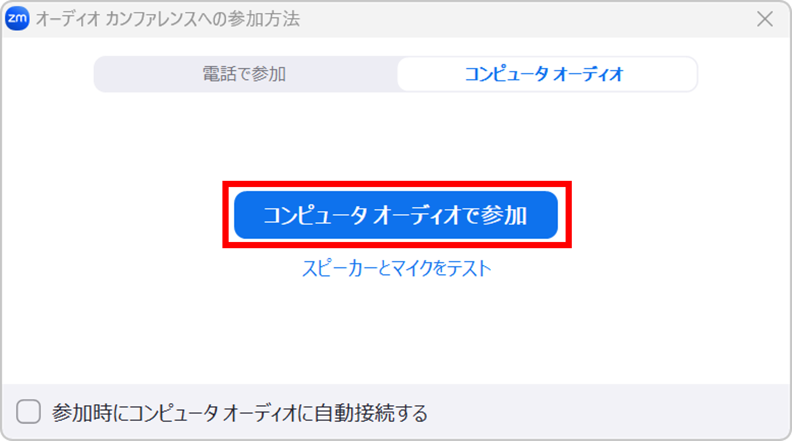
　　　　　　　　	

**スマホ**

ミーティング参加時に，音声通信をどのように行うか選択するための画面が表示されることがあります．  
以下の画面が表示された場合は，「WiFi または携帯のデータ」ボタンを押してください．  
この画面が表示されなかった場合には自動的にオーディオに接続されています．  

### ミーティング中にオーディオを操作する

#### ミュートする・ミュートを解除する
{:#mute/unmute}

ウィンドウの左下にあるマイクのアイコンを押すことによって，マイクをミュート（消音）にしたり，ミュートを解除したりすることができます．ミュートのときはマイクのアイコンに赤線のスラッシュが引かれ，かつ下に「ミュート解除」と表示されます．ミュートされていないときは，マイクのアイコンの下に「ミュート」と表示されます．

マイクのアイコンの代わりに，「オーディオに接続」の文字とともにヘッドホンのアイコンが表示されている場合，オーディオが有効化されておらず，音声機能が利用できない状態です．オーディオに接続するには，PCの場合はヘッドホンのアイコンを押して表示される画面の「コンピュータ オーディオで参加」を，スマホの場合は「WiFi または携帯のデータ」ボタンを押してください．

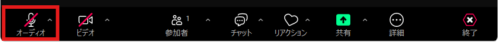

#### マイクとスピーカーを切り替える

PCのZoomアプリでは，内蔵と外付けなど複数のスピーカーやマイクが接続されている場合，利用したいものを切り替えて使うことができます．  
以下でPCでの操作方法を説明します．

**PC**

ウィンドウの左下にあるマイクのアイコンの右の上向きの矢印を押し，表示される「**マイク**」の項目の下に，接続されているマイクの一覧が表示されているので，マイクを切り替えるには利用したいマイクを選択してください．スピーカーについても同様です．

もし「システムと同じ」を選択した場合には，コンピュータの設定と同じマイクが使用されます．そのため，コンピュータの設定を変えるとZoomでも変更が反映されるようになります．  
基本的には，デフォルト設定である「システムと同じ」を選択すれば問題ありません．

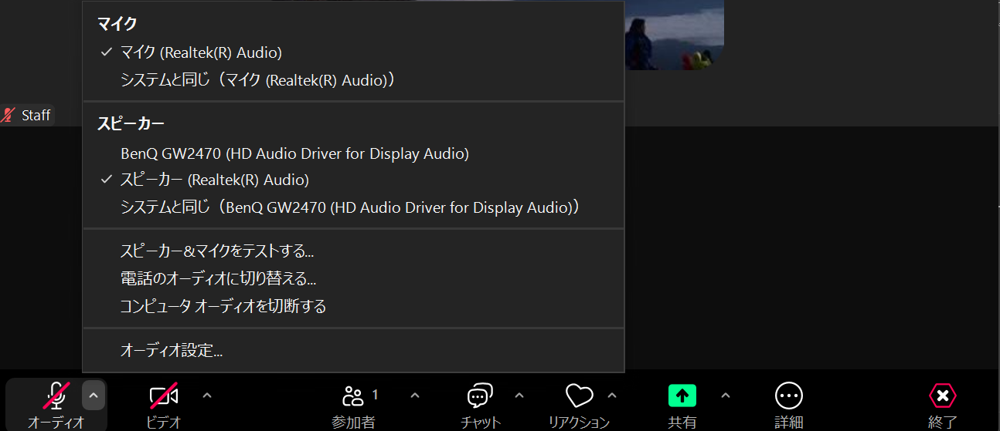

#### オーディオを切断する

もしZoomでミーティングに参加していても音声の通信が必要ない場合は，オーディオを切断し，双方向に音声機能を使えなくすることができます．例えばオーディオを切断すると，自分の音声が他の参加者に聞こえなくなるほか，他の参加者の音声も聞くことができなくなります．以下でそれぞれの機器での操作方法を説明します．

**PC**  
マイクのアイコンの右側にある上向きの矢印を押すと表示されるメニューの中の「コンピュータ オーディオから退出」を選択してください．

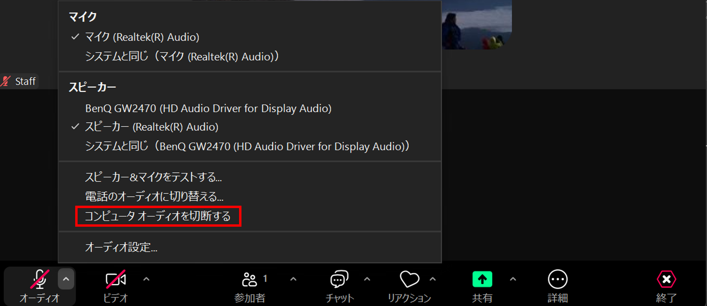

**スマホ**

「詳細」と書かれたボタンを押すと表示されるメニューの一番下にある「オーディオの切断」を押してください．

画像

再度オーディオに接続するには，左下の「オーディオに接続」を押してください．「[ミュートする・ミュートを解除する](#mute/unmute)」を参照して操作を行ってください．

#### マイクとスピーカーをテストする

この機能は，PCでのみ利用できます．詳細については「[テスト機能について](#test)」をご覧ください．

#### ホスト・共同ホストのみが可能な操作について

あなたがミーティングのホスト・共同ホストである場合には，ミーティング中に他の参加者をミュートしたり，参加者のミュートを解除したりすることができます．

* 他の参加者をミュートする：特定の参加者をミュートするには，「参加者」と書かれた人のアイコンを押し，表示される参加者一覧の中からミュートしたい参加者の名前にカーソルを合わせて「ミュート」を押してください．  
* スマホの場合は，ミュートしたい参加者の名前を押すと出てくる表示の中の「ミュート」を押してください．画像  
* 他の参加者のミュートを解除する：特定の参加者のミュートを解除するには，「参加者」タブを押し，ミュートを解除したい参加者の名前にカーソルを合わせて「ミュートの解除を求める」または「ミュート解除を要請」を押してください．参加者にミュートの解除を求めると，その参加者には，ミュートを解除するかミュートのままにするかの選択を求める画面が表示されます．  
* スマホの場合は，ミュートを解除したい参加者の名前を押すと出てくる表示の中の「ミュート解除を要請」を押してください．

### オーディオの設定をする
{:#setup-for-meeting}

ここでは，オーディオに関するさまざまな設定項目のうち有用なものについて説明します．

#### ミーティングに参加する際の設定

ミーティングに参加する際に関連する設定項目について説明します．

**PC**

アプリのホームタブの右上にある歯車のマークを押すと表示される設定画面の「オーディオ」タブで，オーディオに関する設定を行うことができます．ここでは，これらの設定項目について説明します．

* 参加時にコンピュータでオーディオに自動で接続する：この項目にチェックを入れると，ミーティング参加時に毎回オーディオに接続するかどうか確認されることがなくなります．  
  * macOSの場合は「参加時にコンピュータ オーディオに自動接続する」と表示されます．  
* 参加時にマイクをミュート：この項目にチェックを入れると，ミーティングに参加した際にマイクが初めからミュートされます．これにより，ミーティング中に誤って音声を発してしまう可能性を低くできます．  
* 背景雑音（バックグラウンドノイズ）の抑制：参加者の音声以外の音を抑制する機能です．「自動」「低」「中」「高」の4種類がありますが，基本的にはデフォルトの「自動」のままで問題ありません．「自動」で音声が聞き取りにくい場合は変更してください．

<figure class="gallery">
  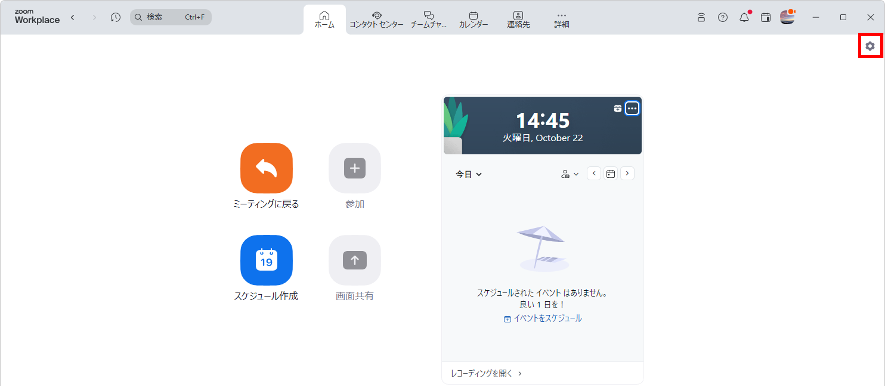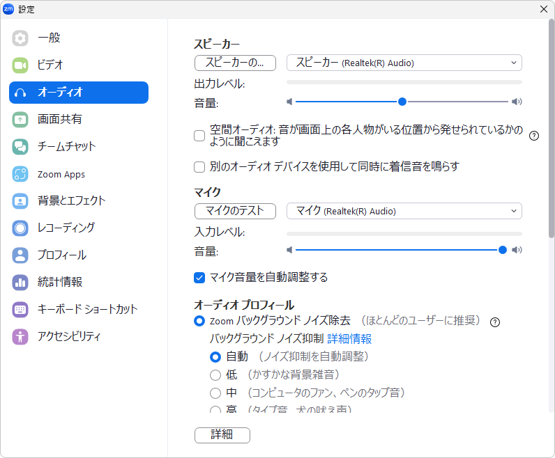
</figure>

**スマホ**　　　

* オーディオを自動で接続：この機能をオンにすることで，ミーティング参加時に毎回オーディオに接続するかどうか確認されることがなくなります．  
* マイクをミュート：この機能をオンにすることで，ミーティング参加時にマイクをミュートにした状態にすることができます．
![][image3]

#### ミーティングを作成する際の設定

次に，ミーティングの作成に関して設定できる項目の中で有用なものについて説明します．設定を行うには，[Zoomのマイページ](https://zoom.us/profile/setting)にアクセスし，「設定」の「ミーティング」タブを開いてください．

* どの参加者についてもミーティングに参加する時にミュートに設定する：これをオンにすると，すべての参加者はミーティングに参加するとき自動的にミュートされます．これにより，参加者の音声が意図せず漏れてしまうことを防ぐことができます．

## ビデオの使い方

こちらでは，Zoomのビデオの使い方について，利用する状況ごとに分けて説明します．

### ミーティング中にビデオを操作する

#### ビデオのオン・オフを切り替える

左下にあるカメラのアイコンを押すことによってビデオのオン・オフを切り替えることができます．ビデオが停止されているときは，ビデオのアイコンに赤線のスラッシュが引かれ，アイコンの下に「ビデオの開始」と表示されています．ビデオが開始されているときは，ビデオのアイコンの下に「ビデオの停止」と表示されています．

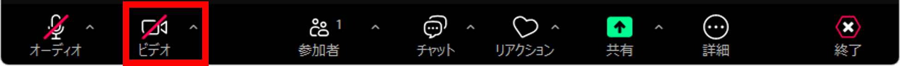

#### カメラを切り替える

Zoomでは利用したいカメラをアプリの中で選択することができます（PCのみ）．以下，PCでの設定方法を説明します．

**PC**

カメラのアイコンの右側にある上向きの矢印を押すと表示される「**カメラの選択**」の項目の下に，接続されているカメラの一覧が表示され，利用したいカメラを選択することができます．

* 「システムと同じ」を選択した場合には，コンピュータの設定と同じカメラが使用されます．  
  * コンピュータの設定を変えるとZoomでも変更が反映されるようになります．  
  * 基本的には，デフォルト設定である「システムと同じ」を選択すれば問題ありません．

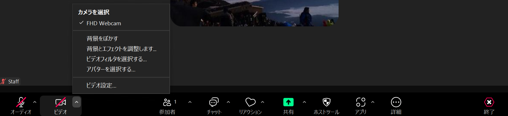
**スマホ**

スマホではアプリ上でマイクやスピーカーを切り替えることはできず，デバイス全体の設定が反映されます．

#### 背景等を設定する

Zoomでは，ビデオの動画の背景やアバターを設定することができます．それぞれの項目の詳細については「[Zoomのバーチャル背景など](/zoom/usage/mic_cam/virtual_background/)」のページをご確認ください。

#### ホスト・共同ホストのみが可能な操作について

あなたがミーティングのホスト・共同ホストである場合には，ミーティング中に他の参加者のビデオのオン・オフを切り替える等の操作が可能です．

* ビデオの開始を依頼：参加者に対して，ビデオをオンにするように求めることができます．「参加者」タブを押し，ビデオを開始してほしい参加者の名前の上にカーソルを合わせて下さい．そして表示される三点リーダーを押し，「ビデオの要請を開始」または「ビデオの開始を要請」を選択してください．その際，求められた側には以下のような画面が表示されます．「OK」を押すとビデオがオンになり，「あとで」を押すことでオフのままにすることができます．  
  * スマホの場合は，ビデオの開始を依頼したい参加者の名前を押すと出てくる表示の中の，「ビデオの開始を要請」を押してください．  
* ビデオの停止：ビデオがオンになっている参加者のビデオを停止することができます．「参加者」タブを押し，ビデオを停止したい参加者の名前の上にカーソルを合わせ「•••」ボタンを押し「ビデオの停止」を押してください．停止された参加者がホスト・共同ホストではない場合は，自分でビデオを開始することができなくなり，開始するためにはホストが上記の「ビデオの停止」の操作をする必要があります．  
  * スマホの場合は，ビデオを停止したい参加者の名前を押すと出てくる表示の中の，「ビデオの停止」を押してください．

### ビデオの設定をする

ここでは，様々な設定項目のうち特に有用なものについて機器ごとに分けて説明します．

#### ミーティングに参加する際の設定

ミーティングに参加する際に設定できる項目について説明します．

**PC**

アプリのホームタブの右上にある，歯車のマークを押すと表示される設定ウィンドウの「ビデオ」タブで，ビデオに関する設定を行うことができます．ここでは，これらの設定項目のうち特に有用なものについて説明します．なお，カメラが接続されている場合には「ビデオ」タブと「背景とエフェクト」タブでビデオのプレビューを行うことができます．

* 参加時に自分のビデオをオフにする：この項目にチェックを入れると，ミーティングに接続した際にビデオが初めからオフになります．これにより，見せたくないものを誤って他の参加者に見られてしまうことを防ぐことができます．	  
* 画面を回転させる：ビデオのプレビュー画面の右上にあるボタンを押すと，ビデオ画面を時計回りに90°ずつ回転させることができます．

<figure class="gallery">
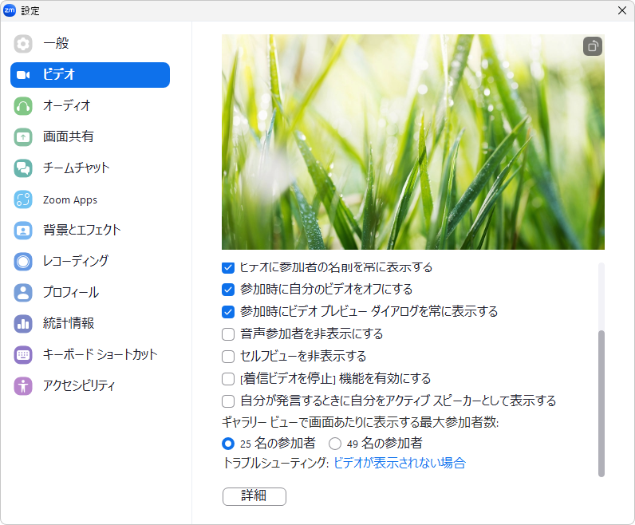</figure>

**スマホ**

右下にある「詳細」を押し，設定の下にある「ミーティング」を押すと，表示されるミーティング設定で，様々な設定を行うことができます．ここでは，これらの設定項目のうち特に有用なものについて説明します．

* マイビデオをオフにする：この機能をオンにすると，ミーティングに接続した際にビデオが初めからオフになります．これにより，見せたくないものを誤って他の参加者に見られてしまうことを防ぐことができます．	  
* 外見補正：この機能をオンにすることで，肌をぼかすことができます．

#### ミーティングを作成する際の設定

次に，ミーティングを作成する際に設定できる項目について説明します．設定を行うには，Zoomのマイページにアクセスし，「設定」の「ミーティング」タブを開いてください．

* グループHD映像設定：これをオンにすると，普段のビデオよりも高画質のビデオを使用できます．  
  * この機能は管理者によりロックされており，デフォルトでは有効にすることができません．利用したい場合は，[サポート窓口](/support/)のメールフォームにお問い合わせください．  
* イマーシブビュー：参加者のビデオを一つの画面にまとめることができる機能です．これにより複数の参加者の表情を瞬時に確認することができます．これは，ミーティングの作成前に Zoomのマイページにおける「設定」内の 「ミーティング内（詳細）」にて設定する必要があります．  
  * ただし，上限人数は25人となっています．

## テスト機能について　
{:#test} 

Zoomには，ミーティングに参加する前にミーティング中のオーディオやビデオの使い方，設定について確認することができる「テスト」機能があります．

以下のような場合に，テスト機能を利用することを推奨します．

* Zoomの操作に不慣れな場合  
* Zoomの操作に慣れているが，重要なミーティングを滞りなく進めるために確認をしておきたい場合  
* オーディオまたはビデオに不具合が起き，問題の原因を調べたい場合

なお，テスト機能を利用できる機器はPCのみであることに注意してください．

### オーディオのテスト
{:#audio-test}

テストの手順と確認方法を以下で説明します．

#### ミーティング参加前の場合

1. テスト機能の画面を開く

テストの機能の画面の開き方は以下の二通りの方法があり，どちらでも開くことができます．

* アプリのホーム画面の右上にある歯車の形をしたボタンを押して表示される設定画面の，「オーディオ」タブを開いてください．

  * また，[「参加時にコンピュータでオーディオに自動で接続する」の設定](#setup-for-meeting)がオフになっている場合，ミーティングに参加した際に表示されるウィンドウの「スピーカーとマイクをテストする」を押すと開けます． 
  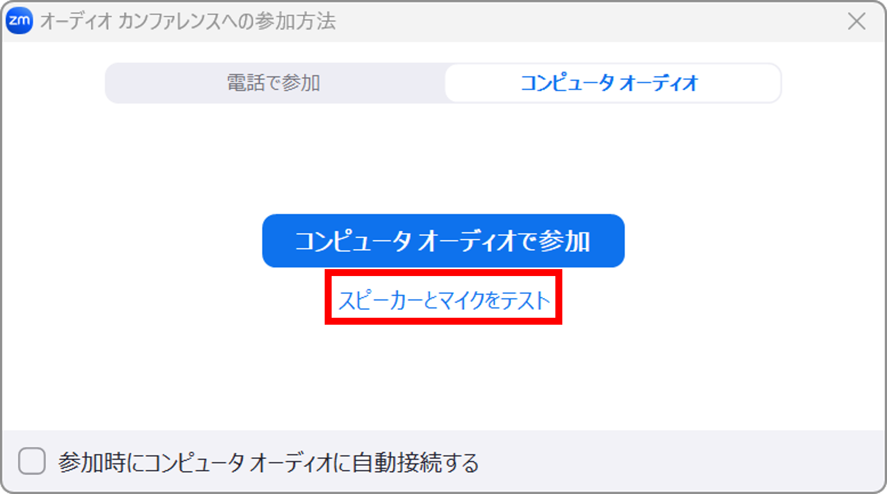
2. テストを行う

マイクとスピーカーそれぞれでの確認方法を説明します．

* スピーカーのテスト：「スピーカーのテスト」というボタンを押すと，音声が流れ，同時に音量が横のバーに表示されます．バーが右に移動するほど音が大きいことを意味しています．バーの位置によって音量が変化して聞こえることを確認してください．  
  * マイクのテスト：「マイクのテスト」というボタンを押すと「レコーディング」と表示され，音声が録音され始めます．また，録音された音の大きさに反応して，入力レベルと書かれたバーが動きます．バーが右に移動するほど大きい音であることを表します．その後「レコーディング」と書かれたボタンをもう一度押すと「再生中」と表示され，録音された音を聞くことができます．自身の音声が録音されているかどうか確認してください．

  

#### ミーティング参加中の場合

1. テスト機能の画面を開く  
   1. マイクのアイコンの右側の上向き矢印を押すと，追加のメニューが表示されます．「スピーカー & マイクをテストする」というボタンを押すことでテスト機能の画面を開けます．
     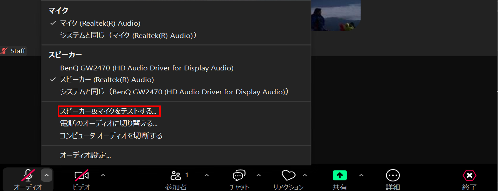
2. テストを行う  
   1. 「スピーカー & マイクをテストする」というボタンを押すと，まずスピーカーのテストが始まり，音声が流れ，かつ音量が「出力レベル」という部分に表示されます．表示される黒い四角形の個数が増えるほど音量が大きいことをあらわているため，黒い四角形の個数によって音量が変化していることを確認してください．問題がなければ「はい」を押してください．問題があれば「いいえ，別のスピーカーをためす」のボタンを押すか，別のスピーカーを選択して同様に確認してください．  
   2. 次にマイクのテストが行われます．自分で音を出したときに，「入力レベル」と書かれた部分にその音量に応じて黒い四角形の個数が増えて表示されることを確認してください．問題がなければ「はい」を押してください．問題があれば「いいえ，別のマイクをためす」のボタンを押すか，別のマイクを選択して同様に確認してください．
   

### ビデオのテスト
{:#video-test}

* テスト機能の画面を開く  
  * ミーティング参加前の場合は，アプリのホーム画面の右上にある歯車の形をしたボタンを押して表示される設定画面の「ビデオ」タブを開いてください．画像  
  * ミーティング参加中の場合は，ビデオのアイコンの右上に表示されている矢印のマークを押し，「ビデオ設定」を押してください．  
* テストを行う  
  * 上記の手順を行うと，カメラが接続されている場合はビデオが表示されます．ビデオが自分の想定通りに表示されているかどうか，接続されているカメラが利用したいものになっているかどうか確認してください．また利用したいバーチャル背景になっているかどうかも確認してください．

### トラブル発生時

上記のテストを行った際にオーディオ（マイク・スピーカー）またはビデオに異常があった場合は，以下の「[トラブルシューティング](#troubleshooting)」の項目を確認してください．

## トラブルシューティング
{:#troubleshooting}

こちらではZoomのオーディオとビデオにトラブルが起きた際の解決方法について説明します．問題が起きている機能の箇所を確認してください．

### オーディオ

まず，PCの場合は，「[オーディオのテスト](#audio-test)」の手順に従ってオーディオのテストを行い，その後以下のうち該当する項目をご覧ください．スマホの場合は，該当する症状に近いものの対策を全て確認してください．

なお，スピーカーやマイク以外にも問題が生じている場合や，以下の方法に従っても問題が解決しなかった場合は，「[オーディオとビデオのトラブルの一般的な解決方法](#general-troubleshooting)」を確認してください．

#### スピーカーのトラブル（相手の音が聞こえない）

もし相手の音が自分にのみ聞こえない場合には，スピーカーにトラブルが起きている可能性が高いです．以下の問題に該当するかどうか確認してください．

**特定のスピーカーのみ聞こえない**  
もし複数のスピーカーが接続されている場合は，別のスピーカーで音が聞こえるかどうか確認してください．利用するスピーカーを別のものに変えると音が聞こえる場合は，該当のスピーカーがうまく接続できていない，または故障している可能性があります．スピーカーを変えても音が聞こえないときには，デバイスの音量が低すぎる，またはデバイスが音が出ない設定になっている可能性があります．デバイスの音量設定を確認してください．スピーカーのテストで問題ない場合は下の「スピーカー自体は問題がないが聞こえない設定の問題」を確認してください．

**スピーカー自体は問題がないが聞こえない**  
まず以下を確認してください．

* **デバイスの音量が0に設定されている．**  
* **マイクの利用許可が Zoom に付与されていない**：マイクへのアクセス権を付与するには，以下の手順に従ってください．  
  * Windowsの場合：「スタート」→「設定」→「プライバシー」または「プライバシーとセキュリティ」→「マイク」に移動して， 「Zoom」のアクセスを許可してください．  
  * macOSの場合：「システム設定」→「プライバシーとセキュリティ」→「マイク」に移動して，「Zoom」をオンにしてください．  
  * iOSの場合：「設定」→「プライバシーとセキュリティ」→「マイク」に移動して，「Zoom」のトグルをオンにしてください．  
  * Androidの場合： 「設定」→「アプリ」→「Zoom」に移動してください．続いて，「権限」から「マイク」に移動し，「Zoom」のトグルをオンにしてください．  
* **スピーカーを使用するアプリケーションが同時に起動されているため，干渉を起こしている**：スピーカーを使用するアプリケーションが複数起動してしまっている場合，互いに干渉してしまう可能性があるため，Zoomにてスピーカーを使いたい場合はスピーカーを利用する他のアプリケーションは終了してください．  
* **音声が無効化されている**：ミーティングの画面の左下にマイクのアイコンではなくヘッドホンのアイコンが表示されている場合には，オーディオの機能は有効化されていません．「オーディオに接続」（ヘッドホンのアイコン）を押し，続いてPCの場合は「コンピュータ オーディオで参加」を，スマホの場合は「WiFi または携帯のデータ」を押してください

以上の方法でも解決しない場合は，下に書いてある「オーディオとビデオのトラブルの一般的な対処方法」を確認してください．

#### マイクのトラブル（自分の音が相手に届かない）

自分の発している音が相手に届かない場合，マイクにトラブルが起きている可能性が高いです．以下の問題に該当するかどうか確認してください．

**マイクの機器の問題**  
**特定のマイクのみ使えない**  
別のマイクに変えると音声が認識される場合，もしくは特定のマイクを選択しているのに音声が認識されない場合には使用しているマイクに不具合がある可能性があります．マイクの電源が入っているか，正しく接続できているかを確認してください．マイクのテストで問題がない場合は,下の「設定の問題」を確認してください．

**マイク自体に問題はないが音声が認識されない**  
マイクを変えても音声が認識されないときには，以下の原因が考えられます．

* **ミュートになっている**：自身の音声がミュートになっていないか確認し，ミュートになっている場合には左下のマイクのアイコンを押してミュートを解除してください．  
* **マイクの利用許可が Zoom に付与されていない**：マイクへのアクセス権を付与するには，以下の手順に従ってください．  
  * Windowsの場合：「スタート」→「設定」→「プライバシー」または「プライバシーとセキュリティ」→「マイク」に移動して， 「Zoom」のアクセスを許可してください．  
  * macOSの場合：「システム設定」→「プライバシーとセキュリティ」→「マイク」に移動して，「Zoom」をオンにしてください．  
  * iOSの場合：「設定」→「プライバシーとセキュリティ」→「マイク」に移動して，「Zoom」のトグルをオンにしてください．  
  * Androidの場合： 「設定」→「アプリ」→「Zoom」に移動してください．続いて，「権限」から「マイク」に移動し，「Zoom」のトグルをオンにしてください．  
* **マイクを使用するアプリケーションが同時に起動されているため，干渉を起こしている**：マイクを使用するアプリケーションが複数起動してしまっている場合，互いに干渉してしまう可能性があるため，Zoomにてマイクを使いたい場合はマイクを利用する他のアプリケーションは終了してください．  
* **音声が無効化されている**：ミーティングの画面の左下にマイクのアイコンではなくヘッドホンのアイコンが表示されている場合には，オーディオの機能は有効化されていません．「オーディオに接続」（ヘッドホンのアイコン）を押し，続いてPCの場合は「コンピュータ オーディオで参加」を，スマホの場合は「WiFi または携帯のデータ」を押してください

以上の方法でも解決しない場合は，下の方に記載されている「オーディオとビデオのトラブルの一般的な対処方法」を確認してください．

### ビデオ

まず，PCの場合は，「[ビデオのテスト](#video-test)」の手順に従ってビデオのテストを行い，その後以下のうち該当する項目を確認してください．スマホの場合は，該当する症状に近いものの対策を全て確認してください．

なお，ビデオ以外にも問題が生じている場合や，以下の方法に従っても問題が解決しなかった場合は，「オーディオとビデオのトラブルの一般的な対処方法」を確認してください．

#### 他の参加者のビデオが自分にだけ表示されない場合

ネットワークのトラブルなどが考えられるので一般的な対処を試してください．具体的には「オーディオとビデオのトラブルの一般的な対処方法」を確認してください．

#### 自分のビデオが他の参加者に表示されない場合

**特定のカメラのみ使えない**  
別のカメラに変えるとビデオが認識される場合は，使用しているカメラに不具合がある可能性があります．カメラが電源が入れてあり，正しく接続されているかを確認してください．ビデオのテストで問題がない場合は次の項目を確認してください．

**カメラ自体に問題はないのに映らない**  
カメラを変えても問題が解決しない場合は以下の原因が考えられます．

* **ビデオが開始されていない**：左下のビデオのマークを押して，ビデオを開始してください．  
  * ホストによってビデオが停止されている：ビデオを開始できない場合は，ホストによりビデオが停止されている可能性があります．そのため，ホストに「ビデオの開始を依頼」を押すようチャットで依頼してください．  
* **デバイスに対するアクセス権が Zoom に付与されていない**：アクセス権を付与するには，以下の手順に従ってください．  
  * Windowsの場合：「設定」「プライバシー」または「プライバシーとセキュリティ」「カメラ」に移動して， 「このデバイスのカメラへのアクセスを許可する」および「デスクトップ アプリがカメラにアクセスできるようにする」をオンにしてください．  
  * macOSの場合：「システム設定」「プライバシーとセキュリティ」「カメラ」に移動して，「Zoom」をオンにしてください．  
  * iOSの場合：「設定」「プライバシーとセキュリティ」「マイク」に移動して，「Zoom」をオンにしてください．  
  * Android（Android 13が搭載されたPixel 6a）の場合： 「設定」「アプリ」「Zoom」に移動し，「権限」から「カメラ」に移動し，カメラの権限を許可してください  
* **同じカメラを使用する別のアプリケーションが起動している**：同じカメラを使用するアプリケーションが複数起動している場合，ビデオが正常に表示されない可能性があります．同じカメラを使用するアプリケーションは終了してください．．  
* **ドライバーが最新のバージョンではない**（macOS 以外の場合）：カメラのドライバのバージョンが最新でない可能性があります．バージョンを確認する方法については「[Zoom のビデオ クラッシュのトラブルシューティング](https://support.zoom.us/hc/ja/articles/202952568-My-Video-Camera-Isn-t-Working)」を参照してください．  

以上の方法でも解決しない場合は，下に記載されている「[オーディオとビデオのトラブルの一般的な対処方法](#general-troubleshooting)」を確認してください．

### オーディオとビデオのトラブルの一般的な対処方法
{:#general-troubleshooting}
こちらでは，オーディオやビデオのトラブルにおいて，上記の方法で解決しなかった場合の解決方法や，他になにか異なる問題が起きた際の解決方法を案内しています．以下の対処法をお試しください．

* **ネットワークを変更する**  
  * ネットワークの接続状況に問題がある可能性がありますので，接続機器の確認をするか，他のネットワークを利用してください．Wi-Fiに接続している場合には，場所の移動をお試しください．  
* **Zoomアプリを再起動する．**  
  * **Zoomアプリの右上に表示されている×ボタンを押し，終了させて，その後再度起動させてください．**  
* **PC本体や外付けのスピーカー等を再起動する．**  
* **Zoomアプリを最新バージョンへアップデートする．**  
  * アップデートを行うことで古いバージョンで起きていたバグなどが解消することがあります．  
  * アップデート方法については，[Zoomの最新の変更をダウンロードする方法](https://support.zoom.com/hc/en/article?id=zm_kb&sysparm_article=KB0060729)を確認してください．  
* **Zoomアプリをアンインストールし，その後再インストールする．**  
  * アンインストール方法については，[Zoom アプリケーションのアンインストールと再インストール](https://support.zoom.us/hc/ja/articles/201362983-Zoom-%E3%82%A2%E3%83%97%E3%83%AA%E3%82%B1%E3%83%BC%E3%82%B7%E3%83%A7%E3%83%B3%E3%81%AE%E3%82%A2%E3%83%B3%E3%82%A4%E3%83%B3%E3%82%B9%E3%83%88%E3%83%BC%E3%83%AB%E3%81%A8%E5%86%8D%E3%82%A4%E3%83%B3%E3%82%B9%E3%83%88%E3%83%BC%E3%83%AB)を参照してください．  
* **OSを最新のものにアップデートする．**  
* **ドライバーを最新のものにアップデートする．**  
  * ドライバーとは特定の機器をPCで動かすためのソフトウエアのことです．これもアップデートを行うことで古いバージョンで起きていたバグなどが解消することがあります．  
  * お使いのデバイスのサポートページまたはダウンロードページにアクセスして,ドライバを最新のものにアップデートしてください．  
* ZoomのキャッシュやCookieの削除を行う．  
  * Windowsの場合  
    * エクスプローラーを開いてください  
      * C:/Users/Username/AppData/Roaming/Zoom に移動し，その中にある \[data\] フォルダを削除してください．  
  * macの場合  
    * Finder を開いてください．  
      * 画面上部にあるメニューバーで，\[Go\] をクリックし，\[フォルダへ移動\] を選択してください．  
      * 出てくるウィンドウに「/Library/Application Support/zoom.us」と入力した後，ダブルクリックして Zoom フォルダを開いてください．  
      * \[data\] フォルダを削除してください．  
  * Android（Android 13が搭載されたPixel 6a）の場合  
    1. デバイスの「設定」→「アプリ」を順に押してください．．  
    2. 下にスクロールして，アプリのリストから「Zoom」を選択し，「ストレージとキャッシュ」から「データを消去」→「キャッシュを消去」を押してください．  
  * iOSの場合  
    1. デバイスの「設定」→「一般」→「iPhone ストレージ」を順に押してください．  
    2. 下にスクロールして，アプリのリストから「Zoom」を選択し，「アプリの削除」を押してください．  
    3. App Store からアプリを再インストールしてください．

上記の対処法を試していただいても問題が解決しない場合には，[**サポート窓口**](/support)へお問い合わせください．