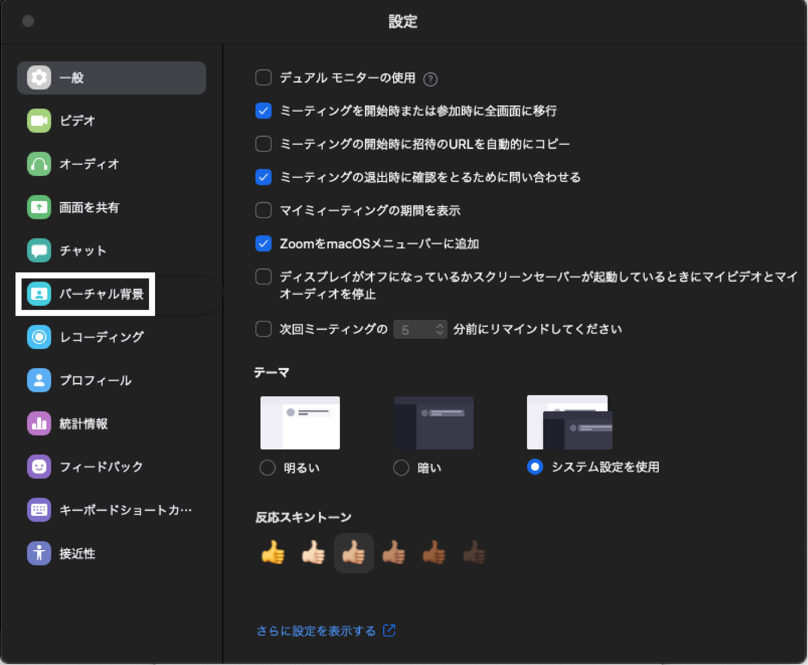
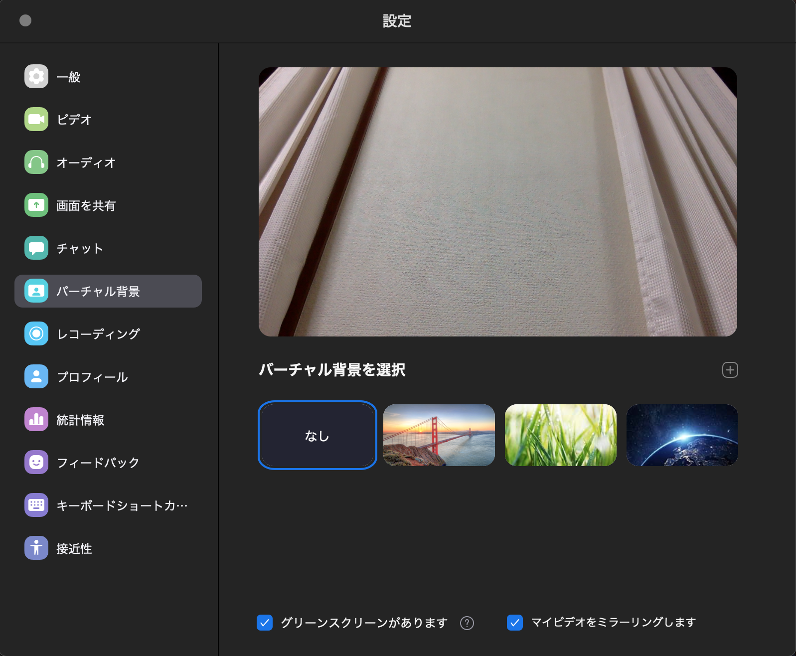
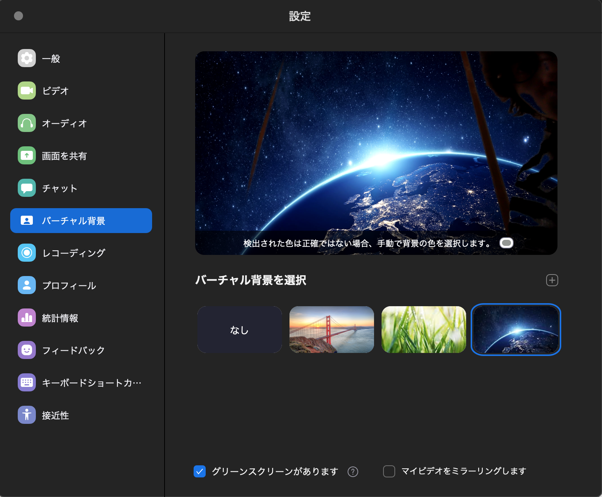
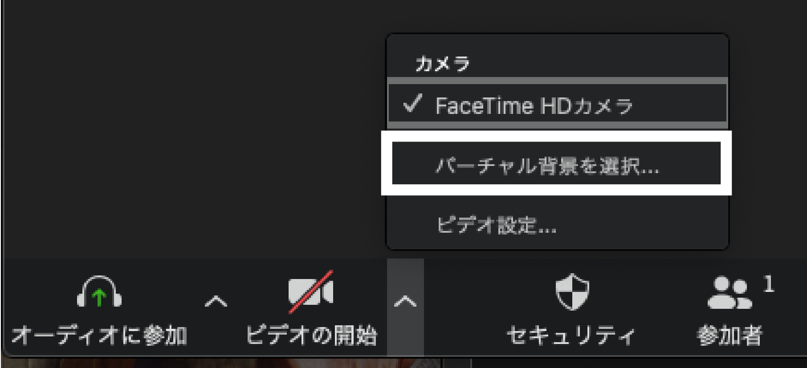

バーチャル背景（仮想背景）機能を使用すると，Zoomミーティング中に背景として画像を表示することができます．  
そうすることで，カメラに映り込んでしまう背景を消すことができるようになります．  

## 設定する時のポイント
* 実際の背景が無地であると，背景が上手く消える可能性が高いです（ご自身の服や肌の色と実際の背景色をできるだけ異なるようにすると上手く消える可能性が高まります）．
* 「ぼかし」であれば、実際の背景が無地でなくても上手くできることが多いです．

## 授業前に設定する方法

1. Zoomアプリケーションを立ち上げ，設定を開きます．  

1. バーチャル背景（仮想背景）を選びます．  

3. 画像をクリックして好きなバーチャル背景（仮想背景）を選択します．「＋」の部分をタップすると背景をオリジナルの画像に差し替えもできます．図のように出来るだけ実際の背景が無地であると，背景が上手く消える可能性が高いです．

## 授業中に設定する方法

1. ミーティング画面下部に表示されている「ビデオの開始(または停止)」ボタンの横にある上ボタンを押します．

2. その後，ポップアップしたメニューの「バーチャル背景（仮想背景）を選択」をクリックします．  
  

3. 画像をクリックして好きなバーチャル背景（仮想背景）を選択します．「＋」の部分をタップすると背景をオリジナルの画像に差し替えもできます．図のように出来るだけ実際の背景が無地であると，背景が上手く消える可能性が高いです．

