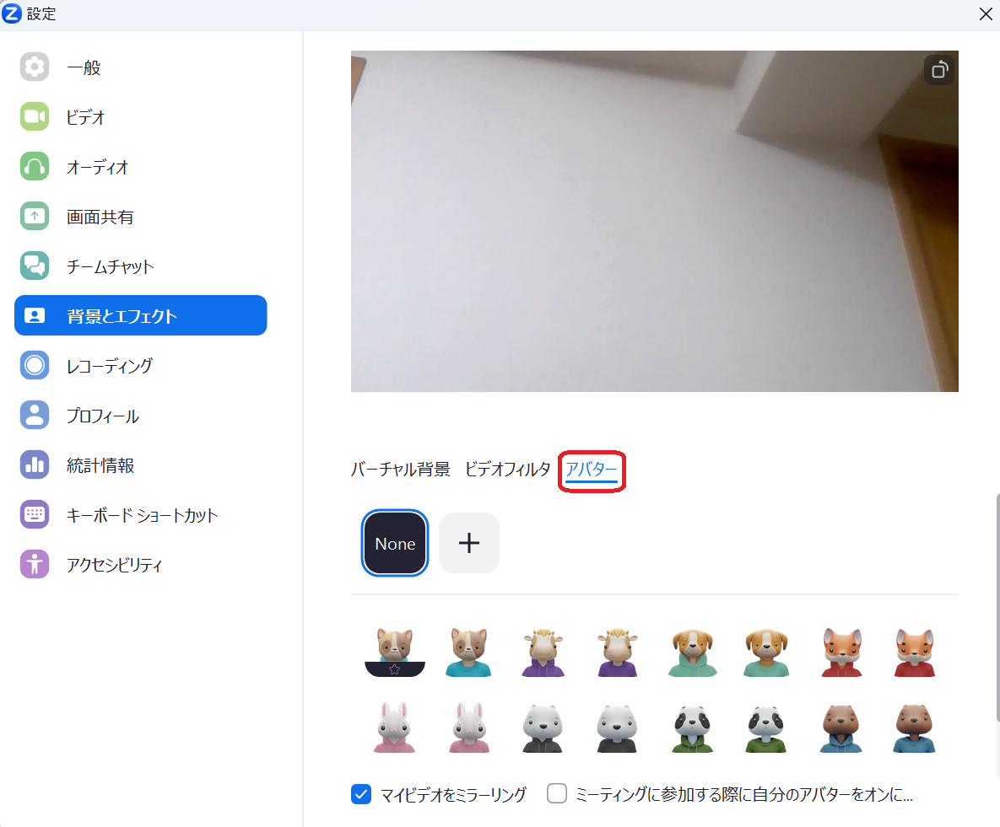

## バーチャル背景とは

バーチャル背景（仮想背景）機能は，Zoomでのミーティング中に好みの画像や動画を背景に映すことができる機能です．バーチャル背景を設定することで，カメラオンでミーティングを行う際に，自室の様子などプライバシーに関わる映像が映ることを防いだり，ミーティングにふさわしい環境を作り出したりすることができます．
ミーティング前にバーチャル背景を設定をしておくと，ミーティングの際，ビデオをオンにしたときに自動的にバーチャル背景が表示されます．ミーティング前に設定していなくても，ミーティング中に有効にすることも可能です．

※以下はすべてPC（Windows）での設定方法になります．

## バーチャル背景の設定方法

### ミーティング前に設定する

1. Zoomアプリケーションを立ち上げ，「設定」を開き，「背景とエフェクト」を選んでください．

2. 好みのバーチャル背景を選んでください．（「None」を選択するとバーチャル背景は設定されません．）

* 「＋」の部分を選択するとバーチャル背景としてオリジナルの画像をアップロードすることができます．

### ミーティング中にバーチャル背景を有効にする

1. ミーティング画面下部に表示されている「ビデオの開始（または「ビデオの停止」）」ボタンの横にある上ボタンを押してください．

2. メニューの中から「バーチャル背景を選択」を選んでください．「ぼかし」を使いたい場合は「背景をぼかす」を選択してください．

3. 好みのバーチャル背景を選んでください．（「None」を選択するとバーチャル背景は設定されません．）

* 「＋」の部分をクリックするとバーチャル背景としてオリジナルの画像をアップロードすることができます．

## 設定時のTips

* カメラに写っている自分の背後をできるだけ無地にすると上手く消えやすいです．
    * 背後と同化してしまうと，自分の顔や服が消えてしまうことがあるので，背後の色は肌の色や服の色とはっきり違うものが良いです．
* 「背景をぼかす」機能は映像の雰囲気を大きく変えることなく自然に背後の人や物を隠すことができます．
* バーチャル背景に設定する画像に文字を入れることで，ミーティング中，常に名前や肩書を分かりやすく表示することができます．
    * 設定によっては，映像の左右が反転し，背景画像が鏡文字になってしまうことがあります．必要であれば，設定の「背景とエフェクト」内にある「マイビデオをミラーリング」のチェックボックスのオンオフを切り替えてみてください．

## （参考）ビデオフィルタやアバターを利用する

Zoomでは，バーチャル背景と同じような機能として，ビデオフィルタやアバターと呼ばれる機能を利用することができます．
ビデオフィルタ機能は，Zoomでのミーティング中に自らの映像の色味を変えたり，フレームなどで映像や顔を装飾することができる機能です．また，アバター機能は，Zoomでのミーティング中，ビデオをオンにする際に自らの顔や体の代わりに，人や動物のアニメーションを表示することのできる機能です．
どちらの機能も，ゼミやサークルなどクローズドな場所で適切に利用すると，ミーティングの雰囲気を変えることができ，参加者同士での交流が生まれやすくなる可能性があります．

### ビデオフィルタを設定する

#### ミーティング前に設定する

1. Zoomアプリケーションを立ち上げ，設定を開き，「背景とエフェクト」を選んでください．

2. 「ビデオフィルタ」を選択します．

3. 好みのビデオフィルタを選んでください．（ビデオフィルタでは，バーチャル背景と異なり，オリジナルの画像などをアップロードすることはできません．）

#### ミーティング中にビデオフィルタを有効にする

1. ミーティング画面下部に表示されている「ビデオの開始（または「ビデオの停止」）」ボタンの横にある上ボタンを押してください．

2. メニューの中から「ビデオフィルタを選択」を選んでください．

3. 好みのビデオフィルタを選んでください．（ビデオフィルタではオリジナルの画像などをアップロードすることはできません．）

### アバターを設定する

#### ミーティング前に設定する

1. Zoomアプリケーションを立ち上げ，設定を開き，「背景とエフェクト」を選んでください．

2. 「アバター」を選択してください．

3. 好みのアバターを選んでください．（アバターを設定するとカメラに映る背景が表示されなくなり，アバターだけが表示されるようになります．バーチャル背景を設定している場合は設定している画像がアバターの背後に表示されます．）

※バーチャル背景設定時

  a. 「＋」の部分をクリックするとオリジナルのアバターを作成することができます．

#### ミーティング中にアバターを有効にする

1. ミーティング画面下部に表示されている「ビデオの開始（または「ビデオの停止」）」ボタンの横にある上ボタンを押してください．

2. メニューの中から「アバターを選択」を選んでください．（「アバターを表示」を選択すると事前に設定されたアバターが表示されます．）

3. 好みのアバターを選んでください．（アバターを設定するとカメラに映る背景が表示されなくなり，アバターだけが表示されるようになります．バーチャル背景を設定している場合は設定している画像がアバターの背後に表示されます．）

  a. 「＋」の部分をクリックするとオリジナルのアバターを作成することができます．

