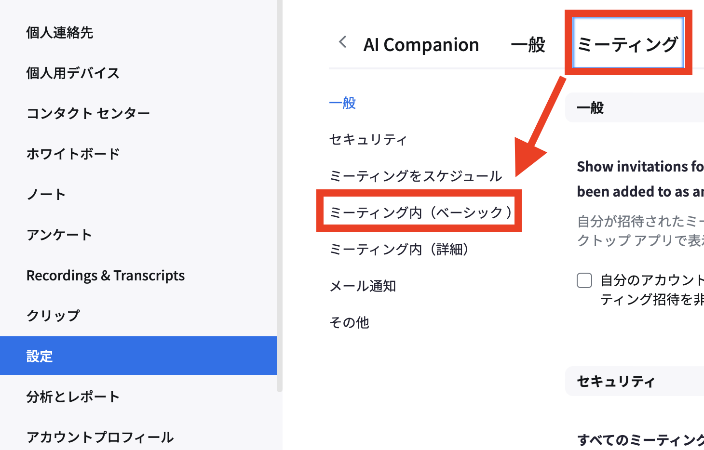

## 投票機能とは
{:#about}
Zoomの投票機能とは，ミーティングのホスト・共同ホストが，参加者の意見などを単一選択，複数選択，記述式等の形で収集できるものです．投票機能では，投票のほかにクイズというものも実施できます．クイズでは，ホスト・共同ホストは選択式の質問に正答を設定することが可能です．

なお，投票機能のように参加者とやり取りする手段としては，他に[リアクション機能（挙手・絵文字等）](../reaction/)や[チャット](../chat/)もあります．Zoomの機能以外では，[Googleフォーム](/articles/google-form/)を利用することも考えられます．目的に応じて選択し，活用してください．

## 投票を主催する（ホスト・共同ホスト向け）
{:#conduct}
### 投票機能を有効化する
{:#enable}
投票機能を用いるためには，あらかじめ投票機能を有効化しておく必要があります．
1. Webブラウザで[Zoomのウェブポータル](https://u-tokyo-ac-jp.zoom.us)にアクセスし，UTokyo Accountでサインインしてください．

2. 画面左側タブの「設定」を選択してください．
{:.small .border}

3. 「ミーティング」を選択し，ミーティング内（ベーシック）を押してください．
{:.medium .border}

4. 画面を下にスクロールし，「ミーティング投票 / クイズ」の項目をオンにしてください．
{:.medium .border}

### 投票を作成する
{:#create}
投票は，[ミーティング開始前](#before_meeting)でも[ミーティング進行中](#during_meeting)でも作成できます．それぞれの場合の手順について説明します．

#### ミーティング開始前に作成する場合
{:#before_meeting}
1. Webブラウザで[Zoomのウェブポータル](https://u-tokyo-ac-jp.zoom.us)にサインインしてください．

2. 画面左側の「アンケート」タブを開き，右上の「＋作成」を押してください．
{:.medium .border}

3. 「投票またはクイズ」を選択し，「作成」を押してください．
{:.small .border}

4. 投票のタイトルや質問文など，必要な事項を入力してください．
{:.medium .border}
    - 単一選択や複数選択の他にも，記述式や空欄補充，並べ替えなどいくつかの種類の質問が用意されています．
    - 選択式の設問に正答を設定したい場合は，画面右上の「これをクイズにする」をオンにしてください．
    - 匿名回答にしたい場合は，右上の歯車から「匿名での回答を求める」にチェックを入れてください．

5. 右上の「保存」を押し，投票を保存してください．

#### ミーティング進行中に作成する場合
{:#during_meeting}
1. Zoom画面の下部にある「詳細」を押し，「投票 / クイズ」を選択してください．
{:.medium}
    - Zoom画面の下部に「投票 / クイズ」が表示されている場合は，そちらを選択してください．
{:.medium}

2. 以下のようなウィンドウが表示されます．右上の「＋」を押してください．
{:.small .border}

3. 投票のタイトルや質問文など，必要な事項を入力してください．
{:.medium .border}
    - 単一選択や複数選択の他にも記述式や空欄補充，並べ替えなどいくつかの種類の質問が用意されています．
    - クイズにしたい場合や，匿名回答にしたい場合は，左下の「…」から設定してください．

4. 右下の「保存」を押し，投票を保存してください．

### 投票を実施する
{:#carry_out}
1. ミーティング中に，Zoom画面の下部にある「詳細」を押し，「投票 / クイズ」を選択してください．
{:.medium}
    - Zoom画面の下部に「投票 / クイズ」が表示されている場合は，そちらを選択してください．
{:.medium}

2. 実施したい投票にカーソルを合わせると，「開始」ボタンが表示されます．「開始」ボタンを押して，投票を開始してください．
{:.small .border}
    - 投票中は，経過時間や投票結果を確認できる画面が表示されます．
{:.medium .border}

3. 参加者の回答が完了したら，右下の「投票を終了」を押して，投票を終了してください．
    - 投票終了後，最終的な結果がホスト・共同ホストにのみ表示されます．
{:.medium .border}
    - 「投票を終了」した後も，「再開する」という機能を用いることができます．この機能は，同じ投票を使って新しい投票を開始する機能です．ただしこの機能を用いると，最後に開始した投票の結果以外は，確認できなくなります．
    - 投票終了後すぐに，結果を参加者に共有できます．投票の結果を参加者に共有したい場合，投票終了後の画面で右下の「結果を共有」ボタンを押してください．ただし，表示されるのは全体の集計結果または各参加者自身の回答内容のみで，他の参加者がどう回答したかの一覧は，表示されません．選択式の質問については，各選択肢の回答者の割合のみが共有されます．また，記述式の質問への回答は，各参加者自身の回答のみがそれぞれの画面に表示され，他の参加者の回答は表示されません．ミーティング中に結果を共有する方法については，「ミーティング中に投票結果を閲覧・共有する」を参照してください．

### ミーティング中に投票結果を閲覧・共有する
{:#share_during_meeting}
以下の手順により，ミーティング中にすでに行なった投票の結果を閲覧することや，結果を参加者に共有することが可能です．ただし，共有されるのは全体の集計結果のみで，各参加者がどう回答したかの一覧は共有されません．選択式の質問は各選択肢の回答者の割合のみが共有されます．また，記述式の回答は共有されず，参加者自身の回答のみがそれぞれの画面に表示されます．

1. ミーティング中に，Zoom画面の下部にある「詳細」を押し，「投票 / クイズ」を選択してください．
{:.medium}
    - Zoom画面の下部に「投票 / クイズ」が表示されている場合は，そちらを選択してください．
{:.medium}

2. 結果を閲覧・共有したい投票にカーソルを合わせると，「結果を閲覧」ボタンが表示されます．「結果を閲覧」ボタンを押してください．
{:.small .border}

3. 結果を閲覧する画面が表示されます．結果を共有したい場合，右下の「結果を共有」を押してください．
    - 結果を共有すると，参加者には2枚目の画像のような画面が表示されます．

        <figure class="gallery">{:.medium .border}{:.medium .border}</figure>

    - クイズの場合は，結果の共有中に1枚目の「全員に正解を表示する」を押すと，正解が共有されます．参加者には，2枚目の画像のような画面が表示されます．
        
        <figure class="gallery">{:.medium .border}{:.medium .border}</figure>

    - 結果を共有している間は，新たに投票を開始することはできません．

4. 結果の共有を終了する場合，右下の「共有を停止」を押してください．
{:.medium .border}
    - 共有を終了した後も，ホスト・共同ホストはミーティング終了まで，「投票 / クイズ」から結果を閲覧・共有することができます．

### ミーティング後に投票結果を確認する
{:#view_after_meeting}
ミーティングを作成した方は，ミーティング終了後でも，Webブラウザから，投票結果を確認できます．

[各投票ごとに投票結果を確認](#check_per_poll)したい場合，「アンケート」タブから確認が可能です．一方，[あるミーティングの中で実施した投票の全体の結果を確認](#check_per_meeting)したい場合は，「レポート」タブからダウンロードする「投票レポート」で確認できます．

#### 各投票ごとに結果を確認する場合
{:#check_per_polls}
1. Webブラウザで[Zoomのウェブポータル](https://u-tokyo-ac-jp.zoom.us)にサインインしてください．

2. 画面左側の「アンケート」タブを開き，結果を確認したい投票を探してください．
{:.small .border}

3. 結果を確認したい投票の，右側の矢印ボタンを押してください．
{:.medium .border}

4. 所要時間や回答率，各回答者ごとの回答を確認できる画面が表示されます．
    - この画面では右上の下矢印ボタンから，結果をcsv形式でダウンロードすることも可能です．
{:.medium .border}

#### ミーティングごとに結果を確認する場合
{:#check_per_meeting}
1. Webブラウザで[Zoomのウェブポータル](https://u-tokyo-ac-jp.zoom.us)にサインインしてください．

2. 画面左側の「レポート」タブを開き，「使用状況レポート」内の「ミーティング」を押してください．
{:.medium .border}

3. 該当するミーティングが行われた時間帯が含まれるように期間を設定し，「投票レポート」を選択して「検索」を押してください．
{:.medium .border}

4. 投票結果を確認したいミーティングの右端の「作成」を押してください．
{:.medium .border}

5. 「レポートキュー」の画面が表示されます．投票レポートの作成が完了すると，「ダウンロード」というボタンが表示されるので，押してください．投票結果がcsv形式でダウンロードされます．
{:.medium .border}

## 投票に参加する（参加者向け）
{:#join}
### 投票する
{:#vote}
1. ミーティングのホスト・共同ホストが投票を開始した場合，以下のような画面が表示されます．質問に回答してください．
{:.medium .border}
    - 画面最下部の「回答は誰に表示されますか？」を押すと，匿名回答であるか否かの説明が表示されます．ホスト・共同ホストが匿名での集計を選択しない場合，参加者は匿名での回答はできません．各回答について，その回答をした人のユーザー名やメールアドレスがホスト・共同ホストに共有されます．
    - 投票終了後，回答内容はホスト・共同ホストによって，参加者に共有される場合があります．

2. 回答が完了したら，「送信」を押してください．
    - 送信後，回答の修正はできません．

### 共有された投票結果を閲覧する
{:#view_shared_results}
投票終了後，ミーティングのホスト・共同ホストが投票結果を共有した場合，以下のような画面が表示されます．

なおこの画面上では，匿名回答であるかによらず，個々の回答は表示されません．選択式の質問は各選択肢の回答者の割合のみが表示されます．また，記述式の回答は共有されず，自分の回答のみが表示されます．
{:.medium .border}
