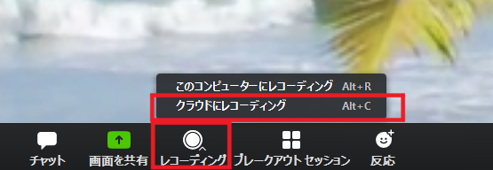
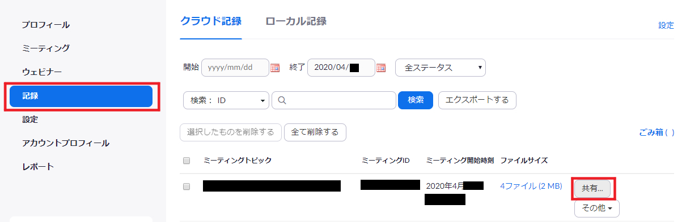
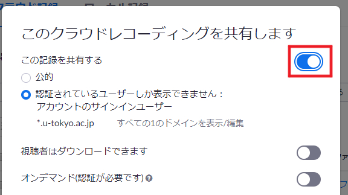
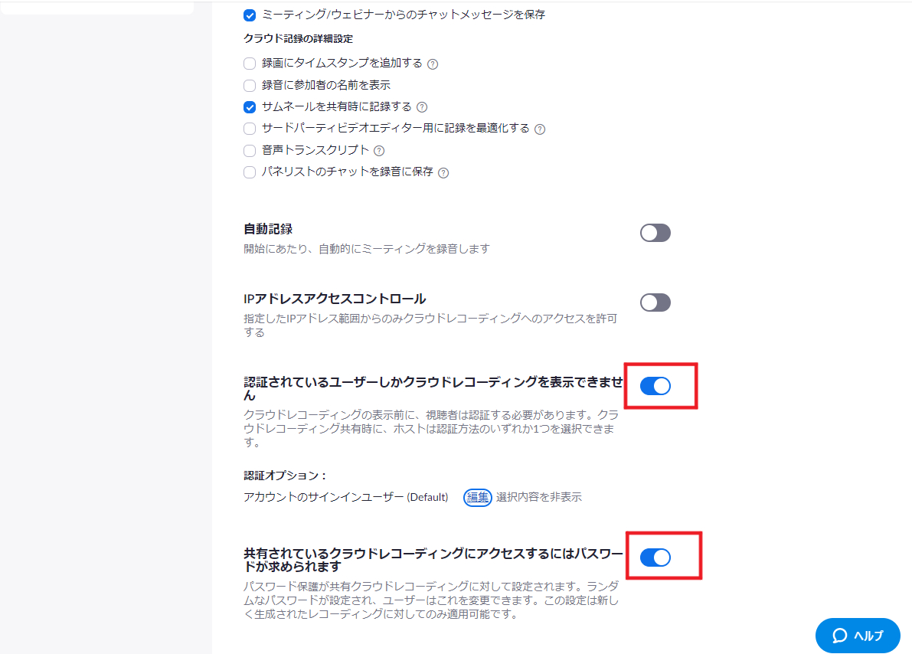

東京大学のZoomアカウント（共通ID10桁@utac.u-tokyo.ac.jp）では，クラウドレコーディング機能を使うことができます．
ここでは，Zoomにおいてクラウド上にミーティングを録画し，学内限定で共有する方法を説明します．  

1. ミーティング時に,「クラウドにレコーディング」を選択します（[「クラウドにレコーディング」が表示されないときは](#no_menu)）． 

1. レコーディングの終了後，録画ファイルが利用可能になると，Zoomからメール通知が届きます．メール内の「ホストに限って、録画詳細を見るにはここをクリックします」のリンクから，Zoomアカウントの「記録」ページ（[https://zoom.us/recording](https://zoom.us/recording)）にアクセスします．
    * Zoom側が動画をレンダリングするため，メール通知が届くまでに，時間がかかることがあります．

3. 「共有」をクリックします． 

4. 「この記録を共有する」をオンにします．学内限定にするためには，「認証されたユーザーのみ閲覧可能」にチェックをいれます．アカウントのサインインユーザーが，`*.u-tokyo.ac.jp`になっていることを確認します．

＊アップデートに伴い，画像作成時から文言が変更されています．ご注意ください

5. 「視聴者はダウンロードできます」をオフにします．学生のダウンロードを禁止しない場合は，オンにしてください．  

6. 記録リンク情報をクリップボードにコピーし，ITC-LMSやメールなどで情報を共有します．
    * 「記録リンク情報」のアドレス・パスワードは、メール通知内「視聴者と録画を共有します」のものと同じです．

参考URL：[Zoomヘルプセンター　クラウド記録](https://support.zoom.us/hc/ja/articles/203741855-%E3%82%AF%E3%83%A9%E3%82%A6%E3%83%89%E8%A8%98%E9%8C%B2)

## （教員編）録画ファイルの共有を解除する
ここでは，Zoomのクラウドに録画されているファイルの共有を解除する（共有用URLを無効化する）方法を説明します．

1. Zoom の「記録」ページ（[https://zoom.us/recording](https://zoom.us/recording)）にアクセスします（東京大学のアカウントでサインインしてください）．

2. 「記録」タブを選択し，共有を解除したい録画ファイルの「共有」メニューを開きます．

3. 「この記録を共有する」をオフにします．

4．ITC-LMSやメールなどで、リンクの期限切れを告知します．もしくはリンクを削除します．

注意：
Zoomのクラウドは保存できる容量が限られているため，共有リンクを無効化するよりも，ファイルを削除することをおすすめします．

## 「クラウドにレコーディング」がメニューにない時は，クラウドレコーディング機能を有効にする
{:#no_menu}

1. [Zoomの設定ページ](https://zoom.us/profile/setting)）にアクセスします（東京大学のアカウントでサインインしてください）．

2. 左側のメニューから「設定」を選択し，「記録」のページを開きます．

3. 「クラウド記録」をオンにします．

4. 学内限定公開にしたい場合は，その準備として「クラウド記録の視聴前にユーザーに認証を求める」がオンになっていることを確認します．

＊アップデートに伴い，画像作成時から文言が変更されています．ご注意ください

