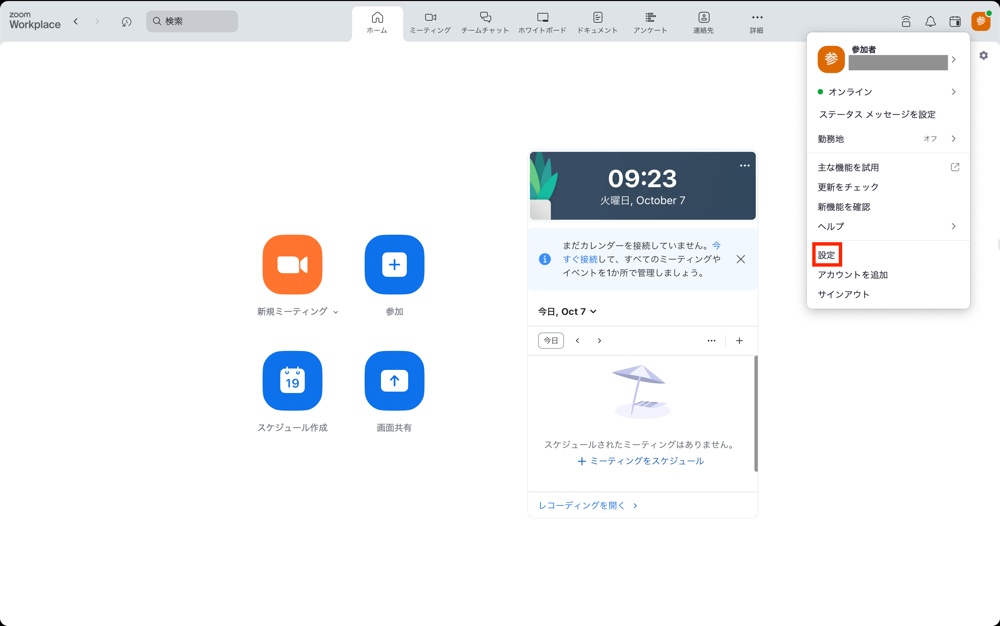
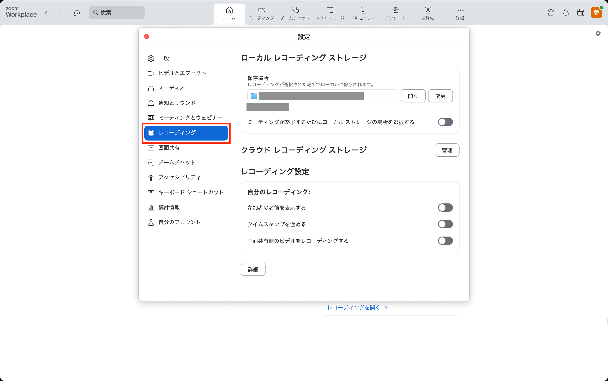
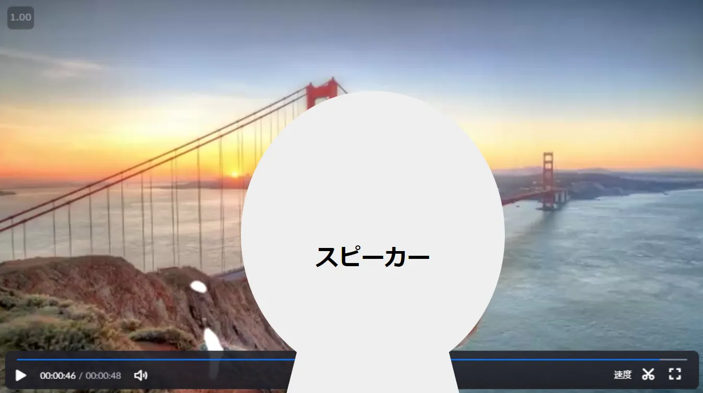

## はじめに
Zoomでは，参加者のビデオや共有画面などをどのように表示するか設定でき，これを「レイアウト」と呼びます．参加者のビデオを表示するレイアウトにはスピーカービューとギャラリビューがあります．さらには共有コンテンツのみのレイアウトや，共有コンテンツと参加者のビデオを組み合わせたレイアウトがあります．この記事ではレコーディングの際のレイアウトについて説明します．なおミーティング中のレイアウトの利用については，「[Zoomミーティング画面のレイアウト](../layout/)」をご参照ください．

レコーディングでのレイアウトは，ローカルレコーディングとクラウドレコーディングで若干異なります．ローカルレコーディングは基本的にミーティング中の参加者自身の画面での設定がレイアウトに反映されます．ただし，共有コンテンツをレコーディングする際に別途設定が必要になります．一方クラウドレコーディングでは，別途設定によって必要なレイアウトを選択します． この記事では，これら両方の場合について，主な設定項目の説明をします．なお，ローカルレコーディングとクラウドレコーディングについての詳細は「[Zoom レコーディング機能の使い方](../recording/)」をご参照ください．

## ローカルレコーディングのレイアウト
ローカルレコーディングでは，録画される参加者のビデオのレイアウトは，録画している人がミーティング中に表示しているものと同じになります．例えば，録画している人のミーティング中の参加者のビデオの表示方法がスピーカービューならスピーカービューが，ギャラリービューならギャラリービューがそれぞれレコーディングされます．ミーティング中にビデオの表示方法を切り替えた場合も，それが反映されたものが録画されます．これらのビューの設定方法については，「[Zoomミーティング画面のレイアウト](../layout/)」をご参照ください．

また，ミーティング中に参加者が画面共有を行った場合，その共有コンテンツもレコーディングされます．共有コンテンツを含む場合のレイアウトは，参加者のビデオの表示の有無や配置は，録画をしている人が事前に設定したレイアウトに従います．

### 各種レイアウトの設定
#### 画面共有なしの場合
画面共有が行われておらず，参加者のビデオのみを表示する場合には、録画をしている人のミーティング中のレイアウトがそのままレコーディングされます．

#### 画面共有ありの場合
ミーティング中に参加者が画面共有を行った場合，その共有コンテンツもレコーディングされます．
共有コンテンツを含むレコーディングのレイアウトは録画をしている人の事前の設定によって異なり，大きく分けて以下の2種類があります．
なお，録画される参加者のビデオのレイアウトは，録画をしている人のミーティング中の参加者のビデオの表示方法に従います．
##### レイアウトの種類
* 共有コンテンツのみをレコーディングする：共有コンテンツのみがレコーディングされ，参加者のビデオはレコーディングされません．
{:.border .small}
* 共有コンテンツと参加者のビデオをレコーディングする：共有コンテンツと参加者のビデオが一つの動画としてレコーディングされます．
  * 共有コンテンツとビデオを重ならないように配置する
  {:.border .small}
  * 共有コンテンツとビデオを重ねて配置する
  {:.border .small}

##### レイアウトの設定手順
共有コンテンツを含むローカルレコーディングのレイアウトは，事前に設定が必要です．設定する手順は，以下のとおりです．

###### 共有コンテンツのみをレコーディングする
1. Zoomアプリの画面右上のアイコンを押し，「設定」を選択してください．
  {:.border .small}
2. 画面左側の「レコーディング」タブを開いてください．
  {:.border .small}
3. 「画面共有時のビデオをレコーディングする」を有効にしてください．
  {:.border .small}

###### 共有コンテンツと参加者のビデオをレコーディングする
1. Zoomアプリの画面右上のアイコンを押し，「設定」を選択してください．
  {:.border .small}
2. 画面左側の「レコーディング」タブを開いてください．
  {:.border .small}
3. 「画面共有時のビデオをレコーディングする」を無効にしてください．
  {:.border .small}
4. 希望するビデオの配置方法にあわせて，以下の操作をしてください．
  * 共有コンテンツとビデオを重ならないように配置する場合：「ビデオと共有画面を左右表示する」にチェックを入れてください．
  * 共有コンテンツとビデオを重ねて配置する場合：「ビデオと共有画面を左右表示する」のチェックを外してください．

#### その他
ミーティング中のピン留めやスポットライトなどのレイアウトの設定は，レコーディングのレイアウトに反映されます．
詳細な設定方法については「[Zoomミーティング画面のレイアウト](../layout/)」をご参照ください．

## クラウドレコーディングのレイアウト
クラウドレコーディングでは，ミーティング時に各参加者のPCやスマホ等に表示されている画面とは関係なく，ミーティングをスケジュールした人が事前に設定したレイアウトに従います．ミーティング中に，以下に説明する手順でレコーディングのレイアウト設定を変更しても，そのミーティングのレコーディングのレイアウトには反映されません．

### レイアウトの種類
クラウドレコーディングのレイアウトは，大きく分けて，参加者のビデオのみ・共通コンテンツのみ・参加者と共有コンテンツの組み合わせの3種類があります．以下にレイアウトの一覧を示します．
* 参加者のビデオのみ
  * スピーカービュー（アクティブなスピーカー）
  {:.border .small}
  * ギャラリービュー
  {:.border .small}
* 共有コンテンツのみ
{:.border .small}
* 参加者のビデオと共有コンテンツの組み合わせ（共有コンテンツとアクティブなスピーカー）
{:.border .small}

### レイアウトの設定手順
クラウドレコーディングのレイアウトを事前に設定する手順は，次のとおりです．
1. 「[Zoomブラウザからサインインする方法](../../../signin/#browser)」の手順で，Zoomのウェブポータルにサインインしてください．
2. ウェブポータルの「設定」から「レコーディング」を開いてください．
{:.border .small}
3. 「クラウドレコーディング」の以下の項目の中から，レコーディングしたいレイアウトを選択してください．
   * 画面共有なしの時はスピーカービュー，ありの時は共有コンテンツとアクティブスピーカーをレコーディングする場合：「共有画面でアクティブスピーカーをレコーディングする」
   * 画面共有なしの時はギャラリービュー，ありの時は共有コンテンツとアクティブスピーカーをレコーディングする場合：「共有画面でギャラリービューをレコーディングする」
   * アクティブスピーカーのみ，ギャラリービューのみ，共有コンテンツのみをそれぞれレコーディングする：「アクティブスピーカー，ギャラリービュー，共有画面を別々にレコーディングする」
     * そのうえで，「アクティブスピーカー」，「ギャラリービュー」，「共有画面」の中からレコーディングしたい項目にチェックを入れてください．

    ※ この際，複数のレイアウトを選択すると，それぞれのレイアウトが別々の動画としてレコーディングされます．
    {:.border .small}

※選択肢の「共有画面で」の箇所は，元の英語では"with shared screen"となっています．「共有画面と」と読み替えるとわかりやすいかもしれません．
{:.border .small}
